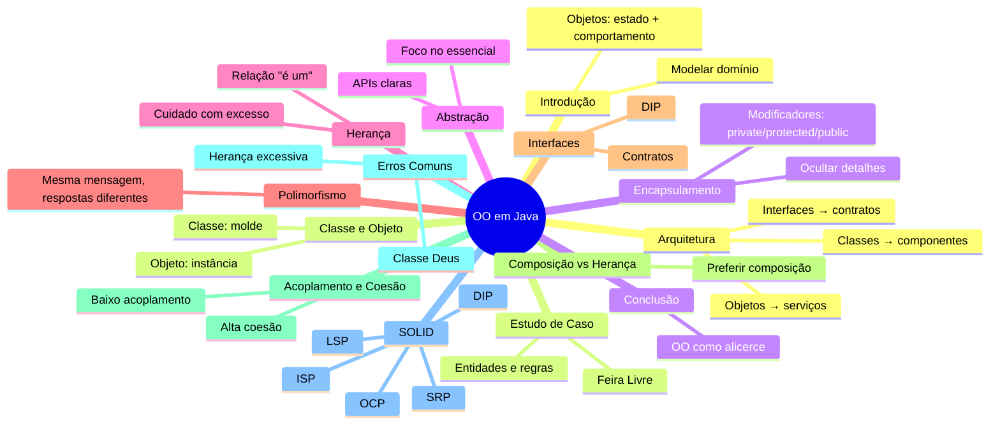

# Mapa Mental – Orientação a Objetos em Java (Resumo da Apostila)

Fonte: apostila [apostila_oo_java_projeto_arquitetura.md](apostila_oo_java_projeto_arquitetura.md)

- Introdução à OO
  - Objetos: estado + comportamento
  - Foco: modelar domínio
  - Benefícios: reutilização, manutenção, base para arquiteturas

- Classe e Objeto
  - Classe: molde (blueprint)
  - Objeto: instância concreta
  - Ex.: Feirante (classe) → João/Maria (objetos)

- Estrutura de Classe (Java)
  - Atributos, construtores, métodos
  - Encapsular regras em métodos

- Encapsulamento
  - Ocultar detalhes internos
  - Modificadores: private/protected/public
  - Benefícios: menor acoplamento, segurança, manutenção
  - Ex.: validação em setters e regras dentro da classe

- Abstração
  - Focar no essencial
  - Consumidores usam a API sem conhecer detalhes internos
  - Ex.: `Pedido.total()` abstrai cálculo

- Herança
  - Relação "é um"
  - Reuso por especialização
  - Cuidado com excesso (rigidez)

- Polimorfismo
  - Mesma mensagem, respostas diferentes
  - Comportamento decidido em runtime
  - Ex.: `ProdutoOrganico` sobrescreve `getPreco()`

- Interfaces
  - Contratos
  - Baixo acoplamento, DIP, flexibilidade
  - Ex.: `PedidoRepository` com implementações trocáveis

- Composição vs Herança
  - Herança: "é um" / Composição: "tem um"
  - Preferir composição para flexibilidade

- Acoplamento e Coesão
  - Acoplamento: grau de dependência entre módulos
    - Baixo acoplamento facilita manutenção/testes/evolução
  - Coesão: foco e relação das responsabilidades
    - Alta coesão: classes fazem apenas o que lhes compete
  - Objetivo: Baixo acoplamento + Alta coesão

- Erros Comuns
  - Classe Deus
  - Getters/setters sem comportamento
  - Herança excessiva
  - Falta de encapsulamento

- OO e SOLID
  - SOLID (Single Responsibility, Open-Closed, Liskov Substitution, Interface Segregation, Dependency Inversion)
  - SRP: uma responsabilidade por classe
  - OCP: aberto para extensão, fechado para modificação
  - LSP: substituição correta em hierarquias
  - ISP: interfaces coesas
  - DIP: depender de abstrações

- OO e Arquitetura
  - Classes → componentes; objetos → serviços; interfaces → contratos
  - Qualidade da arquitetura depende da modelagem OO

- Estudo de Caso: Feira Livre
  - Entidades: Feirante, Produto, Banca, Pedido
  - Questões: total, regras de preço, estoque
  - Resolver via boa distribuição de responsabilidades

- Quiz (revisão)
  - Conceitos de OO, acoplamento, coesão
  - Gabarito consolidado (reforço dos pontos-chave)

- Conclusão
  - OO é sobre modelar domínio, separar responsabilidades, reduzir acoplamento, facilitar evolução
  - Alicerce de Projeto e Arquitetura de Sistemas

- Bibliografia
  - Larman (UML e Padrões)
  - GoF (Design Patterns)
  - Uncle Bob (Arquitetura Limpa)
  - Fowler (UML Essencial)

- Siglas (glossário rápido)
  - OO: Orientação a Objetos
  - SOLID: cinco princípios (SRP, OCP, LSP, ISP, DIP)
  - GRASP: Padrões de Atribuição de Responsabilidade
  - UML: Linguagem de Modelagem Unificada

---

## Versão visual (Mermaid)

Observação: a renderização do Mermaid depende do suporte do preview/extension.

