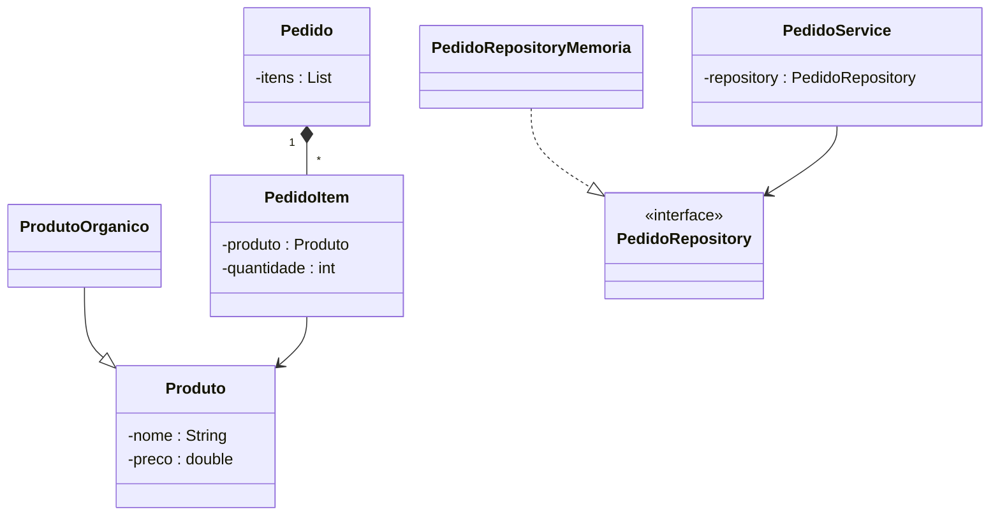

# UML Cheat Sheet (Essencial para T200)

- Objetivo: comunicar modelos de domínio e decisões arquiteturais.

## Diagramas prioritários
- Classes: estrutura estática (classes, atributos, métodos, relacionamentos).
- Sequência: fluxo temporal de mensagens entre objetos.
- Casos de Uso: visão funcional (atores e objetivos).

## Notação rápida (Classes)
- Visibilidade: `+` público, `-` privado, `#` protegido.
- Herança (generalização): seta com triângulo oco → superclasse.
- Interface «interface» e implementação (linha tracejada + triângulo).
- Associação: linha; multiplicidades `1`, `0..1`, `*`.
- Agregação/Composição: losango oco/cheio do lado do "todo".

## Mapeamento para Java
- `class`, `extends`, `interface`, `implements`.
- Visibilidade: `public`, `private`, `protected`.

## Exemplo (Feira)

## Dicas práticas
- Use UML para discutir design; não precisa ser completo para cada detalhe.
- Combine com C4 para visão de alto nível: ver `C4-guidelines.md`.
- Em checkpoints, inclua pelo menos: 1 diagrama de classes e 1 de sequência.
