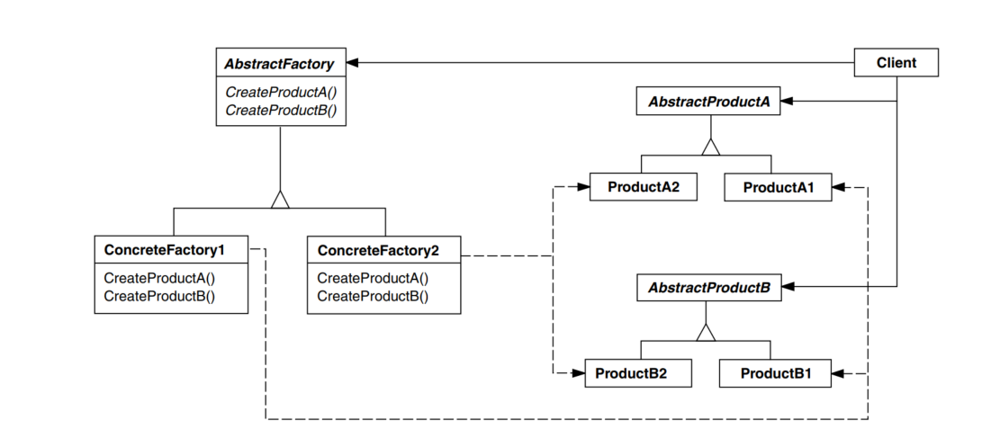
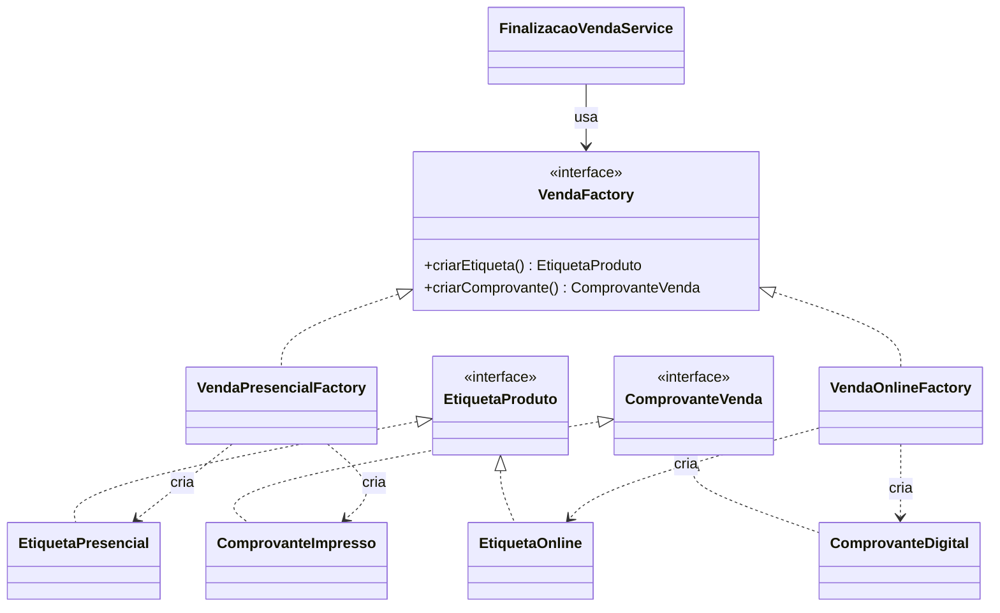

# GOF - Abstract Factory (Feira Livre)

## Definicao

Abstract Factory fornece uma interface para criar familias de objetos relacionados sem expor classes concretas.

## **Também conhecido como**

Kit

## **Aplicabilidade**

Use o padrão Abstract Factory quando:

* um sistema deve ser independente de como seus produtos são criados,compostos ou representados;
* um sistema deve ser configurado como um produto de uma família de múltiplos produtos;
* uma família de objetos-produto for projetada para ser usada em conjunto, e você necessita garantir esta restrição;
* você quer fornecer uma biblioteca de classes de produtos e quer revelar somente suas interfaces, não suas implementações.

## Estrututa



## Problema

Na feira, um mesmo fluxo de venda pode mudar conforme o canal:

- Canal presencial: etiqueta simples, comprovante impresso, notificacao local.
- Canal online: etiqueta com QR, comprovante digital, notificacao por e-mail.

Sem padrao, o codigo de aplicacao fica cheio de if por canal para criar objetos de apoio.

## Solucao

Criar uma fabrica abstrata para cada familia de objetos do canal.

## Diagrama de classes (Mermaid)



## Exemplo

```java
public interface EtiquetaProduto {
    String gerarTexto(String nomeProduto, double preco);
}

public interface ComprovanteVenda {
    String gerar(String pedidoId, double total);
}

public interface VendaFactory {
    EtiquetaProduto criarEtiqueta();
    ComprovanteVenda criarComprovante();
}

public class VendaPresencialFactory implements VendaFactory {
    @Override
    public EtiquetaProduto criarEtiqueta() {
        return (nome, preco) -> "ETQ-PRESENCIAL | " + nome + " | R$ " + preco;
    }

    @Override
    public ComprovanteVenda criarComprovante() {
        return (pedidoId, total) -> "COMPROVANTE IMPRESSO #" + pedidoId + " TOTAL=" + total;
    }
}

public class VendaOnlineFactory implements VendaFactory {
    @Override
    public EtiquetaProduto criarEtiqueta() {
        return (nome, preco) -> "ETQ-ONLINE-QR | " + nome + " | R$ " + preco;
    }

    @Override
    public ComprovanteVenda criarComprovante() {
        return (pedidoId, total) -> "COMPROVANTE DIGITAL #" + pedidoId + " TOTAL=" + total;
    }
}
```

Uso:

```java
public class FinalizacaoVendaService {
    private final VendaFactory vendaFactory;

    public FinalizacaoVendaService(VendaFactory vendaFactory) {
        this.vendaFactory = vendaFactory;
    }

    public void finalizar(String pedidoId, String nomeProduto, double preco) {
        EtiquetaProduto etiqueta = vendaFactory.criarEtiqueta();
        ComprovanteVenda comprovante = vendaFactory.criarComprovante();

        System.out.println(etiqueta.gerarTexto(nomeProduto, preco));
        System.out.println(comprovante.gerar(pedidoId, preco));
    }
}
```

## Código completo

```java
// ── interfaces dos produtos da familia ───────────────────────────────────

interface EtiquetaProduto {
    String gerarTexto(String nomeProduto, double preco);
}

interface ComprovanteVenda {
    String gerar(String pedidoId, double total);
}

// ── interface da fabrica abstrata ─────────────────────────────────────────

interface VendaFactory {
    EtiquetaProduto criarEtiqueta();
    ComprovanteVenda criarComprovante();
}

// ── familia: canal presencial ─────────────────────────────────────────────

class EtiquetaPresencial implements EtiquetaProduto {
    @Override
    public String gerarTexto(String nome, double preco) {
        return "ETQ-PRESENCIAL | " + nome + " | R$ " + String.format("%.2f", preco);
    }
}

class ComprovanteImpresso implements ComprovanteVenda {
    @Override
    public String gerar(String pedidoId, double total) {
        return "=== COMPROVANTE IMPRESSO === Pedido #" + pedidoId
             + " | Total: R$ " + String.format("%.2f", total);
    }
}

class VendaPresencialFactory implements VendaFactory {
    @Override
    public EtiquetaProduto criarEtiqueta()    { return new EtiquetaPresencial(); }
    @Override
    public ComprovanteVenda criarComprovante() { return new ComprovanteImpresso(); }
}

// ── familia: canal online ────────────────────────────────────────────────

class EtiquetaOnline implements EtiquetaProduto {
    @Override
    public String gerarTexto(String nome, double preco) {
        return "ETQ-ONLINE-QR | " + nome + " | R$ " + String.format("%.2f", preco)
             + " | qr://feira/" + nome.toLowerCase().replace(" ", "-");
    }
}

class ComprovanteDigital implements ComprovanteVenda {
    @Override
    public String gerar(String pedidoId, double total) {
        return ">>> COMPROVANTE DIGITAL <<< Pedido #" + pedidoId
             + " | Total: R$ " + String.format("%.2f", total)
             + " | email enviado";
    }
}

class VendaOnlineFactory implements VendaFactory {
    @Override
    public EtiquetaProduto criarEtiqueta()    { return new EtiquetaOnline(); }
    @Override
    public ComprovanteVenda criarComprovante() { return new ComprovanteDigital(); }
}

// ── servico de finalizacao (independente da familia) ──────────────────────

class FinalizacaoVendaService {
    private final VendaFactory factory;

    FinalizacaoVendaService(VendaFactory factory) {
        this.factory = factory;
    }

    void finalizar(String pedidoId, String nomeProduto, double preco) {
        EtiquetaProduto etiqueta    = factory.criarEtiqueta();
        ComprovanteVenda comprovante = factory.criarComprovante();

        System.out.println(etiqueta.gerarTexto(nomeProduto, preco));
        System.out.println(comprovante.gerar(pedidoId, preco));
        System.out.println();
    }
}

// ── demonstracao ──────────────────────────────────────────────────────────

public class MainAbstractFactory {
    public static void main(String[] args) {
        System.out.println("=== Canal Presencial ===");
        FinalizacaoVendaService svcPresencial =
            new FinalizacaoVendaService(new VendaPresencialFactory());
        svcPresencial.finalizar("PED-001", "Queijo Minas", 22.00);

        System.out.println("=== Canal Online ===");
        FinalizacaoVendaService svcOnline =
            new FinalizacaoVendaService(new VendaOnlineFactory());
        svcOnline.finalizar("PED-002", "Mel Silvestre", 35.00);
    }
}
```

Saída esperada:

```
=== Canal Presencial ===
ETQ-PRESENCIAL | Queijo Minas | R$ 22,00
=== COMPROVANTE IMPRESSO === Pedido #PED-001 | Total: R$ 22,00

=== Canal Online ===
ETQ-ONLINE-QR | Mel Silvestre | R$ 35,00 | qr://feira/mel-silvestre
>>> COMPROVANTE DIGITAL <<< Pedido #PED-002 | Total: R$ 35,00 | email enviado
```

## Relacao com GRASP e SOLID

GRASP:

- Creator: cada fabrica concreta cria objetos da familia correspondente ao contexto.
- Protected Variations: encapsula variacoes de canal (presencial/online) em um ponto estavel.
- Indirection: `VendaFactory` atua como intermediario entre aplicacao e classes concretas.

SOLID:

- OCP: novos canais entram com nova fabrica concreta sem mudar o cliente.
- DIP: o servico depende da abstracao `VendaFactory` e das interfaces de produto.
- SRP: o servico finaliza venda; as fabricas cuidam da criacao consistente da familia.

## Beneficios

- Garante consistencia entre objetos da mesma familia.
- Remove condicionais por variante de ambiente/canal.
- Facilita extensao para novos canais.

## Riscos e anti-exemplo

Anti-exemplo:

- Misturar objetos de familias diferentes no mesmo fluxo sem controle.

Risco:

- Criar familias complexas quando apenas um objeto varia.

## Exercicios

1. Criar uma `VendaAtacadoFactory` com comprovante proprio.
2. Adicionar `NotificadorVenda` como terceiro produto da familia.
3. Cobrir com teste para garantir que uma fabrica sempre retorna objetos da mesma familia.

## Checklist

- Existe necessidade de criar um conjunto de objetos relacionados?
- O cliente depende apenas da fabrica abstrata?
- Nova variante entra com nova fabrica, sem editar o cliente?
