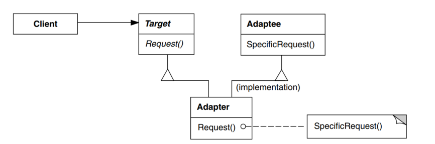
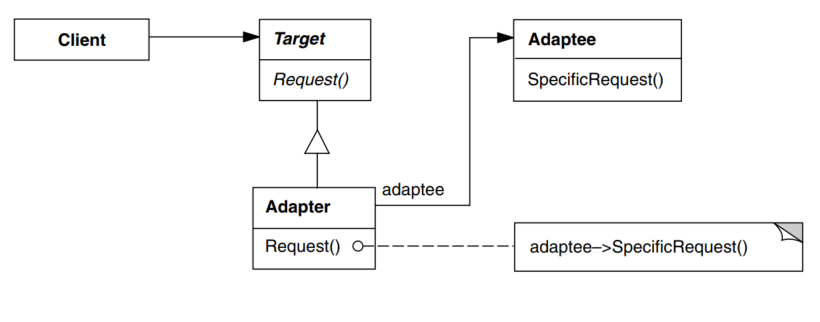
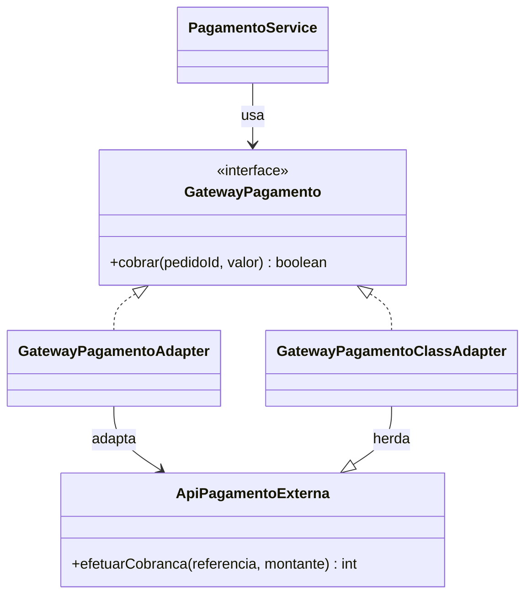

# GOF - Adapter (Feira Livre)

## Definicao

Adapter converte a interface de uma classe para outra interface esperada pelo cliente.

## Também conhecido como

Wrapper

## Aplicabilidade

Use o padrão Adapter quando:

* você quiser usar uma classe existente, mas sua interface não corresponder à interface de que necessita;
* você quiser criar uma classe reutilizável que coopere com classes não-relacionadas ou não-previstas, ou seja, classes que não necessariamente tenham interfaces compatíveis;
* *(somente para adaptadores de objetos)* você precisar usar várias subclasses existentes, porém, for impraticável adaptar essas interfaces criando subclasses para cada uma. Um adaptador de objeto pode adaptar a interface da sua classe-mãe.

## Estrutura

Um adaptador de classe usa a herança múltipla para adaptar uma interface à outra:



Um adaptador de objeto depende da composição de objetos:



## Problema

A aplicacao da feira espera um `GatewayPagamento`, mas o provedor externo oferece uma API diferente.

Sem Adapter, codigo de negocio passa a conhecer detalhes da API externa.

## Solucao

Criar um adaptador que implementa a interface interna e converte chamadas para a API externa. Neste material, mostramos as duas formas classicas:

- adaptador de objeto: usa composicao e delega para uma instancia da API externa;
- adaptador de classe: herda da API externa e implementa a interface esperada pelo dominio.

## Diagrama de classes (Mermaid)



No exemplo original da apostila, usamos o adaptador de objeto. A implementacao por classe funciona bem quando a interface alvo e uma interface e quando podemos herdar da classe adaptada.

## Exemplo

```java
public interface GatewayPagamento {
    boolean cobrar(String pedidoId, double valor);
}

// API externa (incompativel com o que o dominio espera)
public class ApiPagamentoExterna {
    public int efetuarCobranca(String referencia, double montante) {
        return 200;
    }
}

public class GatewayPagamentoAdapter implements GatewayPagamento {
    private final ApiPagamentoExterna apiExterna;

    public GatewayPagamentoAdapter(ApiPagamentoExterna apiExterna) {
        this.apiExterna = apiExterna;
    }

    @Override
    public boolean cobrar(String pedidoId, double valor) {
        int status = apiExterna.efetuarCobranca(pedidoId, valor);
        return status >= 200 && status < 300;
    }
}

public class GatewayPagamentoClassAdapter extends ApiPagamentoExterna implements GatewayPagamento {
    @Override
    public boolean cobrar(String pedidoId, double valor) {
        int status = efetuarCobranca(pedidoId, valor);
        return status >= 200 && status < 300;
    }
}
```

Uso:

```java
GatewayPagamento gatewayObjeto = new GatewayPagamentoAdapter(new ApiPagamentoExterna());
boolean sucesso1 = gatewayObjeto.cobrar("PED-2026-001", 145.90);

GatewayPagamento gatewayClasse = new GatewayPagamentoClassAdapter();
boolean sucesso2 = gatewayClasse.cobrar("PED-2026-002", 145.90);
```

## Código completo

```java
// ── interface interna do dominio ──────────────────────────────────────────

interface GatewayPagamento {
    boolean cobrar(String pedidoId, double valor);
}

// ── API externa de terceiro (nao pode ser alterada) ───────────────────────

class ApiPagamentoExterna {
    /** Retorna HTTP status code simulado: 200 = sucesso, 402 = saldo insuficiente */
    public int efetuarCobranca(String referencia, double montante) {
        System.out.println("[API-EXTERNA] cobrando referencia=" + referencia
                         + " montante=" + String.format("%.2f", montante));
        // simulacao: valores acima de 500 sao recusados
        return montante > 500.0 ? 402 : 200;
    }
}

// ── adapter: traduz GatewayPagamento para ApiPagamentoExterna ─────────────

class GatewayPagamentoAdapter implements GatewayPagamento {
    private final ApiPagamentoExterna apiExterna;

    GatewayPagamentoAdapter(ApiPagamentoExterna apiExterna) {
        this.apiExterna = apiExterna;
    }

    @Override
    public boolean cobrar(String pedidoId, double valor) {
        int status = apiExterna.efetuarCobranca(pedidoId, valor);
        boolean aprovado = status >= 200 && status < 300;
        System.out.println("[ADAPTER] status=" + status
                         + " -> " + (aprovado ? "APROVADO" : "RECUSADO"));
        return aprovado;
    }
}

// ── adapter de classe: usa heranca para adaptar a API externa ────────────

class GatewayPagamentoClassAdapter extends ApiPagamentoExterna implements GatewayPagamento {
    @Override
    public boolean cobrar(String pedidoId, double valor) {
        int status = efetuarCobranca(pedidoId, valor);
        boolean aprovado = status >= 200 && status < 300;
        System.out.println("[CLASS-ADAPTER] status=" + status
                         + " -> " + (aprovado ? "APROVADO" : "RECUSADO"));
        return aprovado;
    }
}

// ── servico de pagamento do dominio ───────────────────────────────────────

class PagamentoService {
    private final GatewayPagamento gateway;

    PagamentoService(GatewayPagamento gateway) {
        this.gateway = gateway;
    }

    void processar(String pedidoId, double valor) {
        boolean ok = gateway.cobrar(pedidoId, valor);
        System.out.println("Pagamento do pedido " + pedidoId + ": "
                         + (ok ? "CONCLUIDO" : "FALHOU"));
    }
}

// ── demonstracao ──────────────────────────────────────────────────────────

public class MainAdapter {
    public static void main(String[] args) {
        System.out.println("=== Adaptador de Objeto ===");
        GatewayPagamento gatewayObjeto = new GatewayPagamentoAdapter(new ApiPagamentoExterna());
        PagamentoService serviceObjeto = new PagamentoService(gatewayObjeto);
        serviceObjeto.processar("PED-2026-001", 145.90);
        System.out.println();
        serviceObjeto.processar("PED-2026-002", 699.00);

        System.out.println();

        System.out.println("=== Adaptador de Classe ===");
        GatewayPagamento gatewayClasse = new GatewayPagamentoClassAdapter();
        PagamentoService serviceClasse = new PagamentoService(gatewayClasse);
        serviceClasse.processar("PED-2026-003", 145.90);
        System.out.println();
        serviceClasse.processar("PED-2026-004", 699.00);
    }
}
```

Saída esperada:

```
=== Adaptador de Objeto ===
[API-EXTERNA] cobrando referencia=PED-2026-001 montante=145,90
[ADAPTER] status=200 -> APROVADO
Pagamento do pedido PED-2026-001: CONCLUIDO

[API-EXTERNA] cobrando referencia=PED-2026-002 montante=699,00
[ADAPTER] status=402 -> RECUSADO
Pagamento do pedido PED-2026-002: FALHOU

=== Adaptador de Classe ===
[API-EXTERNA] cobrando referencia=PED-2026-003 montante=145,90
[CLASS-ADAPTER] status=200 -> APROVADO
Pagamento do pedido PED-2026-003: CONCLUIDO

[API-EXTERNA] cobrando referencia=PED-2026-004 montante=699,00
[CLASS-ADAPTER] status=402 -> RECUSADO
Pagamento do pedido PED-2026-004: FALHOU
```

## Relacao com GRASP e SOLID

GRASP:

- Indirection: o adapter intermedia dominio e API externa.
- Protected Variations: mudancas no provedor externo ficam isoladas no adaptador.
- Low Coupling: o dominio nao acopla ao contrato tecnico da API de terceiros.

Observacao didatica: em Java, o adaptador de classe fica limitado porque uma classe nao pode herdar de duas classes ao mesmo tempo. Por isso, na pratica, o adaptador de objeto costuma ser a opcao mais flexivel.

SOLID:

- DIP: servicos de negocio dependem da interface `GatewayPagamento`.
- OCP: novo provedor entra com novo adapter sem alterar cliente.
- SRP: adaptacao de protocolo/formato fica numa classe dedicada.

## Beneficios

- Isola dependencia externa.
- Facilita troca de provedor.
- Mantem dominio limpo e testavel.

## Riscos e anti-exemplo

Anti-exemplo:

- Adapter acumulando regra de negocio que deveria estar no servico de dominio.

Risco:

- Mapear mal erros da API externa para contrato interno.

## Exercicios

1. Adaptar retorno com codigo e mensagem de erro.
2. Criar um segundo adapter para outro provedor.
3. Simular falha da API externa e validar tratamento.

## Checklist

- Interface do dominio esta estavel?
- Detalhes da API externa ficaram encapsulados?
- A troca de provedor exige mudanca minima no sistema?
