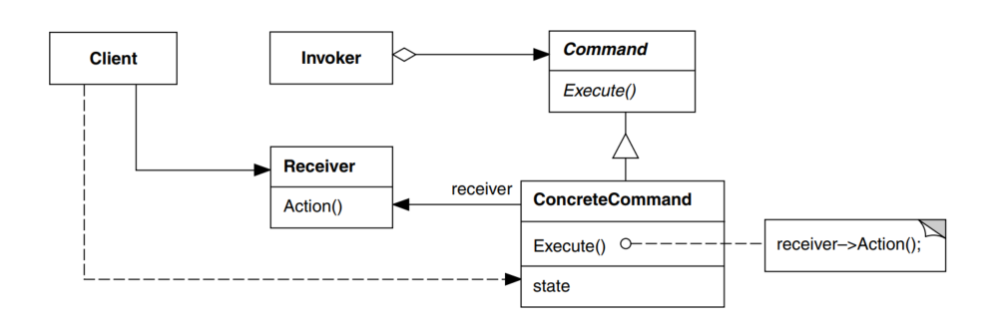
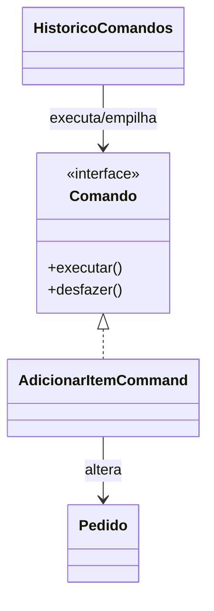

# GOF - Command (Feira Livre)

## Definicao

Command encapsula uma requisicao como objeto, permitindo parametrizar acoes, enfileirar execucoes e implementar desfazer/refazer.

## Também conhecido como

Action, Transaction

## Aplicabilidade

Use o padrão Command quando você deseja:

* parametrizar objetos por uma ação a ser executada, da forma como os objetos MenuItem fizeram acima. Você pode expressar tal parametrização numa linguagem procedural através de uma função callback, ou seja, uma função que é registrada em algum lugar para ser chamada em um momento mais adiante. Os Commands são uma substituição orientada o objetos para callbacks;
* especificar, enfileirar e executar solicitações em tempos diferentes. Um objeto Command pode ter um tempo de vida independente da solicitação orginal. Se o receptor de uma solicitação pode ser representado de uma maneira independente do espaço de endereçamento, então você pode transferir um objeto command para a solicitação para um processo diferente e lá atender a solicitação;
* suportar desfazer operações. A operação Execute, de Command, pode armazenar estados para reverter seus efeitos no próprio comando. A interface de Command deve ter acrescentada uma operação Unexecute, que reverte os efeitos de uma chamada anterior de Execute. Os comandos executados são armazenados em uma lista histórica. O nível ilimitado de desfazer e refazer operações é obtido percorrendo esta lista para trás e para frente, chamando operações Unexecute e Execute, respectivamente;
* suportar o registro (logging) de mudanças de maneira que possam ser reaplicadas no caso de uma queda de sistema. Ao aumentar a interface de Command com as operações carregar e armazenar, você pode manter um registro (log) persistente das mudanças. A recuperação de uma queda de sistema envolve a recarga dos comandos registrados a partir do disco e sua reexecução com a operação Execute.
* estruturar um sistema em torno de operações de alto nível construídas sobre operações primitivas. Tal estrutura é comum em sistemas de informação que suportam **transações**. Uma transação encapsula um conjunto de mudanças nos dados. O padrão Command fornece uma maneira de modelar transações. Os Commands têm uma interface comum, permitindo invocar todas as transações da mesma maneira. O padrão também torna mais fácil estender o sistema com novas transações.

## **Estrutura**




## Participantes

* **Command**
  * declara uma interface para a execução de uma operação.
* **ConcreteCommand (PasteCommand, OpenCommand)**
  * define uma vinculação entre um objeto Receiver e uma ação;
  * implementa Execute através da invocação da(s) correspondente(s) operação(ões) no Receiver.
* **Client**(Application)
  * cria um objeto ConcreteCommand e estabelece o seu receptor.
* **Invoker (MenuItem)**
  * solicita ao Command a execução da solicitação.
* **Receiver (Document, Application)**
  * sabe como executar as operações associadas a uma solicitação. Qualquer classe pode funcionar como um Receiver.

## Problema

No caixa da feira, operacoes como:

- adicionar item
- remover item
- aplicar desconto

podem precisar de historico para desfazer a ultima acao.

Sem Command, a logica de acao e de historico fica espalhada e acoplada na interface.

## Solucao

Representar cada acao como um comando com `executar()` e `desfazer()`.

## Diagrama de classes (Mermaid)



## Exemplo

```java
import java.util.ArrayDeque;
import java.util.Deque;

public interface Comando {
    void executar();
    void desfazer();
}

public class Pedido {
    private int quantidadeItens;

    public void adicionarItem() { quantidadeItens++; }
    public void removerItem() { if (quantidadeItens > 0) quantidadeItens--; }
    public int getQuantidadeItens() { return quantidadeItens; }
}

public class AdicionarItemCommand implements Comando {
    private final Pedido pedido;

    public AdicionarItemCommand(Pedido pedido) {
        this.pedido = pedido;
    }

    @Override
    public void executar() {
        pedido.adicionarItem();
    }

    @Override
    public void desfazer() {
        pedido.removerItem();
    }
}

public class HistoricoComandos {
    private final Deque<Comando> pilha = new ArrayDeque<>();

    public void executar(Comando comando) {
        comando.executar();
        pilha.push(comando);
    }

    public void desfazerUltimo() {
        if (!pilha.isEmpty()) {
            pilha.pop().desfazer();
        }
    }
}
```

Uso:

```java
Pedido pedido = new Pedido();
HistoricoComandos historico = new HistoricoComandos();

historico.executar(new AdicionarItemCommand(pedido));
historico.executar(new AdicionarItemCommand(pedido));

historico.desfazerUltimo();
System.out.println(pedido.getQuantidadeItens()); // 1
```

## Código completo

```java
import java.util.ArrayDeque;
import java.util.Deque;

// ── dominio: caixa do pedido ──────────────────────────────────────────────

class CaixaPedido {
    private double total = 0.0;
    private double desconto = 0.0;

    void adicionarItem(String nome, double preco) {
        total += preco;
        System.out.printf("  [CAIXA] + %-20s R$ %.2f  (total provisorio: R$ %.2f)%n",
            nome, preco, totalLiquido());
    }

    void removerItem(String nome, double preco) {
        total -= preco;
        System.out.printf("  [CAIXA] - %-20s R$ %.2f  (total provisorio: R$ %.2f)%n",
            nome, preco, totalLiquido());
    }

    void aplicarDesconto(double valor) {
        desconto += valor;
        System.out.printf("  [CAIXA] desconto R$ %.2f aplicado       (total provisorio: R$ %.2f)%n",
            valor, totalLiquido());
    }

    void estornarDesconto(double valor) {
        desconto -= valor;
        System.out.printf("  [CAIXA] desconto R$ %.2f estornado      (total provisorio: R$ %.2f)%n",
            valor, totalLiquido());
    }

    double totalLiquido() { return total - desconto; }
}

// ── interface do comando ──────────────────────────────────────────────────

interface Comando {
    void executar();
    void desfazer();
}

// ── comandos concretos ────────────────────────────────────────────────────

class AdicionarItemCommand implements Comando {
    private final CaixaPedido caixa;
    private final String nome;
    private final double preco;

    AdicionarItemCommand(CaixaPedido caixa, String nome, double preco) {
        this.caixa = caixa;
        this.nome  = nome;
        this.preco = preco;
    }

    @Override public void executar()  { caixa.adicionarItem(nome, preco); }
    @Override public void desfazer()  { caixa.removerItem(nome, preco); }
}

class RemoverItemCommand implements Comando {
    private final CaixaPedido caixa;
    private final String nome;
    private final double preco;

    RemoverItemCommand(CaixaPedido caixa, String nome, double preco) {
        this.caixa = caixa;
        this.nome  = nome;
        this.preco = preco;
    }

    @Override public void executar()  { caixa.removerItem(nome, preco); }
    @Override public void desfazer()  { caixa.adicionarItem(nome, preco); }
}

class AplicarDescontoCommand implements Comando {
    private final CaixaPedido caixa;
    private final double valor;

    AplicarDescontoCommand(CaixaPedido caixa, double valor) {
        this.caixa = caixa;
        this.valor = valor;
    }

    @Override public void executar()  { caixa.aplicarDesconto(valor); }
    @Override public void desfazer()  { caixa.estornarDesconto(valor); }
}

// ── historico de comandos (invocador) ─────────────────────────────────────

class HistoricoComandos {
    private final Deque<Comando> pilhaDesfazer = new ArrayDeque<>();
    private final Deque<Comando> pilhaRefazer  = new ArrayDeque<>();

    void executar(Comando cmd) {
        cmd.executar();
        pilhaDesfazer.push(cmd);
        pilhaRefazer.clear(); // nova acao invalida refazer anterior
    }

    void desfazer() {
        if (pilhaDesfazer.isEmpty()) {
            System.out.println("  [HISTORICO] nada para desfazer");
            return;
        }
        Comando cmd = pilhaDesfazer.pop();
        System.out.println("  [HISTORICO] desfazendo ultimo comando...");
        cmd.desfazer();
        pilhaRefazer.push(cmd);
    }

    void refazer() {
        if (pilhaRefazer.isEmpty()) {
            System.out.println("  [HISTORICO] nada para refazer");
            return;
        }
        Comando cmd = pilhaRefazer.pop();
        System.out.println("  [HISTORICO] refazendo comando...");
        cmd.executar();
        pilhaDesfazer.push(cmd);
    }
}

// ── demonstracao ──────────────────────────────────────────────────────────

public class MainCommand {
    public static void main(String[] args) {
        CaixaPedido caixa    = new CaixaPedido();
        HistoricoComandos hist = new HistoricoComandos();

        System.out.println("=== Adicionando itens ===");
        hist.executar(new AdicionarItemCommand(caixa, "Tomate",   4.50));
        hist.executar(new AdicionarItemCommand(caixa, "Batata",   3.00));
        hist.executar(new AdicionarItemCommand(caixa, "Cebola",   2.80));

        System.out.println("\n=== Aplicando desconto ===");
        hist.executar(new AplicarDescontoCommand(caixa, 2.00));

        System.out.println("\n=== Desfazendo desconto ===");
        hist.desfazer();

        System.out.println("\n=== Refazendo desconto ===");
        hist.refazer();

        System.out.println("\n=== Removendo item ===");
        hist.executar(new RemoverItemCommand(caixa, "Cebola", 2.80));

        System.out.println("\n=== Desfazendo remocao ===");
        hist.desfazer();

        System.out.printf("%nTotal final da caixa: R$ %.2f%n", caixa.totalLiquido());
    }
}
```

Saída esperada:

```
=== Adicionando itens ===
  [CAIXA] + Tomate               R$ 4,50  (total provisorio: R$ 4,50)
  [CAIXA] + Batata               R$ 3,00  (total provisorio: R$ 7,50)
  [CAIXA] + Cebola               R$ 2,80  (total provisorio: R$ 10,30)

=== Aplicando desconto ===
  [CAIXA] desconto R$ 2,00 aplicado       (total provisorio: R$ 8,30)

=== Desfazendo desconto ===
  [HISTORICO] desfazendo ultimo comando...
  [CAIXA] desconto R$ 2,00 estornado      (total provisorio: R$ 10,30)

=== Refazendo desconto ===
  [HISTORICO] refazendo comando...
  [CAIXA] desconto R$ 2,00 aplicado       (total provisorio: R$ 8,30)

=== Removendo item ===
  [CAIXA] - Cebola               R$ 2,80  (total provisorio: R$ 5,50)

=== Desfazendo remocao ===
  [HISTORICO] desfazendo ultimo comando...
  [CAIXA] + Cebola               R$ 2,80  (total provisorio: R$ 8,30)

Total final da caixa: R$ 8,30
```

## Relacao com GRASP e SOLID

GRASP:

- Controller: invocador coordena execucao de comandos sem conhecer regra interna.
- Indirection: comando separa solicitacao da acao concreta no receptor.
- High Cohesion: cada comando representa uma acao unica com sua reversao.

SOLID:

- OCP: novas acoes entram com novos comandos.
- SRP: invocador controla historico; comando executa/desfaz; receptor aplica regra.
- DIP: invocador depende da interface `Comando`.

## Beneficios

- Desacopla quem pede a acao de quem executa.
- Facilita undo/redo e filas de processamento.
- Organiza acoes como objetos testaveis.

## Riscos e anti-exemplo

Anti-exemplo:

- Criar comandos gigantes com regras demais.

Risco:

- Grande numero de classes sem padrao de organizacao.

## Exercicios

1. Criar `RemoverItemCommand` com desfazer.
2. Implementar `Refazer` com duas pilhas.
3. Persistir historico em memoria para auditoria simples.

## Checklist

- Existe necessidade de historico de acoes ou fila?
- O invocador conhece apenas a interface de comando?
- Cada comando tem responsabilidade pequena e reversao clara?
