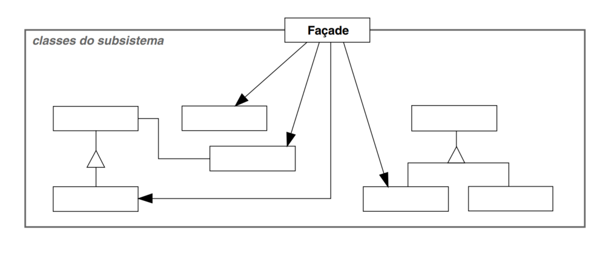
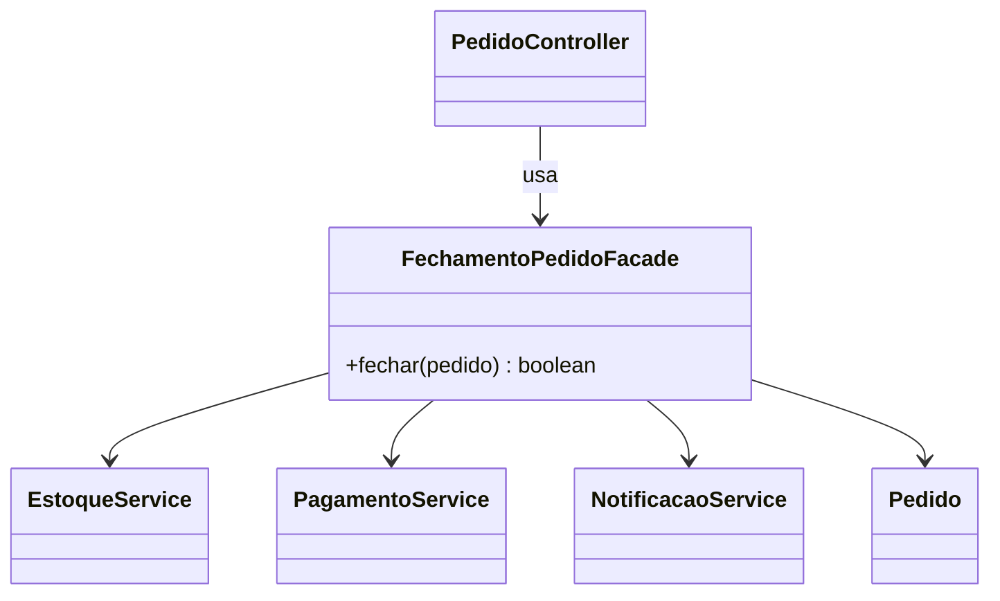

# GOF - Facade (Feira Livre)

## Definicao

Facade fornece uma interface unificada e simples para um subsistema mais complexo.

## Aplicabilidade

Use o padrão Façade quando:

* você desejar fornecer uma interface simples para um subsistema complexo. Os subsistemas se tornam mais complexos à medida que evoluem. A maioria dos padrões, quando aplicados, resulta em mais e menores classes. Isso torna o subsistema mais reutilizável e mais fácil de customizar, porém, também se torna mais difícil de usar para os clientes que não precisam customizá-lo. Uma fachada pode fornecer, por comportamento-padrão, uma visão simples do sistema, que é boa o suficiente para a maioria dos clientes. Somente os clientes que demandarem maior customização necessitarão olhar além da fachada;
* existirem muitas dependências entre clientes e classes de implementação de uma abstração. Ao introduzir uma fachada para desacoplar o subsistema dos clientes e de outros subsistemas, estar-se-á promovendo a independência e portabilidade dos subsistemas.
* você desejar estruturar seus subsistemas em camadas. Use uma fachada para definir o ponto de entrada para cada nível de subsistema. Se os subsistemas são independentes, você pode simplificar as dependências entre eles fazendo com que se comuniquem uns com os outros exclusivamente através das suas fachadas.

**Estrutura**



## Participantes

* **Façade (Compiler)**
  * conhece quais as classes do subsistema são responsáveis pelo atendimento de uma solicitação;
  * delega solicitações de clientes a objetos apropriados do subsistema.
* **Classes de subsistema (Scanner, Parser, ProgramNode, etc.)**
  * implementam a funcionalidade do subsistema;
  * encarregam-se do trabalho atribuído a elas pelo objeto Façade;
  * não têm conhecimento da façade; isto é, não mantêm referências para a mesma.

## Problema

Fechar pedido pode envolver varias etapas:

- validar estoque
- calcular total
- reservar itens
- processar pagamento
- emitir notificacao

Sem Facade, o cliente do caso de uso chama muitos servicos e conhece detalhes de orquestracao.

## Solucao

Criar uma fachada para encapsular o fluxo de fechamento.

## Diagrama de classes (Mermaid)



## Exemplo

```java
public class FechamentoPedidoFacade {
    private final EstoqueService estoqueService;
    private final PagamentoService pagamentoService;
    private final NotificacaoService notificacaoService;

    public FechamentoPedidoFacade(
            EstoqueService estoqueService,
            PagamentoService pagamentoService,
            NotificacaoService notificacaoService) {
        this.estoqueService = estoqueService;
        this.pagamentoService = pagamentoService;
        this.notificacaoService = notificacaoService;
    }

    public boolean fechar(Pedido pedido) {
        estoqueService.validarDisponibilidade(pedido);
        double total = pedido.calcularTotal();
        estoqueService.reservarItens(pedido);
        boolean pago = pagamentoService.cobrar(pedido.getId(), total);

        if (!pago) {
            estoqueService.desfazerReserva(pedido);
            return false;
        }

        notificacaoService.enviarConfirmacao(pedido);
        return true;
    }
}
```

## Código completo

```java
import java.util.ArrayList;
import java.util.List;

// ── dominio simples ───────────────────────────────────────────────────────

class ItemPedido {
    final String nome;
    final double preco;
    final int quantidade;

    ItemPedido(String nome, double preco, int quantidade) {
        this.nome       = nome;
        this.preco      = preco;
        this.quantidade = quantidade;
    }
}

class Pedido {
    private final String id;
    private final List<ItemPedido> itens = new ArrayList<>();

    Pedido(String id) { this.id = id; }

    void adicionarItem(ItemPedido item) { itens.add(item); }

    String getId() { return id; }

    double calcularTotal() {
        return itens.stream().mapToDouble(i -> i.preco * i.quantidade).sum();
    }

    List<ItemPedido> getItens() { return List.copyOf(itens); }
}

// ── subsistemas ───────────────────────────────────────────────────────────

class EstoqueService {
    void validarDisponibilidade(Pedido pedido) {
        System.out.println("[ESTOQUE] Validando disponibilidade para pedido " + pedido.getId());
    }

    void reservarItens(Pedido pedido) {
        System.out.println("[ESTOQUE] Itens reservados para pedido " + pedido.getId());
    }

    void desfazerReserva(Pedido pedido) {
        System.out.println("[ESTOQUE] Reserva desfeita para pedido " + pedido.getId());
    }
}

class PagamentoService {
    /** Simula recusa para valores acima de 1000 */
    boolean cobrar(String pedidoId, double valor) {
        boolean aprovado = valor <= 1000.0;
        System.out.println("[PAGAMENTO] Pedido " + pedidoId
            + " R$ " + String.format("%.2f", valor)
            + " -> " + (aprovado ? "APROVADO" : "RECUSADO"));
        return aprovado;
    }
}

class NotificacaoService {
    void enviarConfirmacao(Pedido pedido) {
        System.out.println("[NOTIFICACAO] Confirmacao enviada para pedido " + pedido.getId());
    }
}

// ── facade ────────────────────────────────────────────────────────────────

class FechamentoPedidoFacade {
    private final EstoqueService    estoqueService;
    private final PagamentoService  pagamentoService;
    private final NotificacaoService notificacaoService;

    FechamentoPedidoFacade(EstoqueService e, PagamentoService p, NotificacaoService n) {
        this.estoqueService     = e;
        this.pagamentoService   = p;
        this.notificacaoService = n;
    }

    boolean fechar(Pedido pedido) {
        estoqueService.validarDisponibilidade(pedido);
        double total = pedido.calcularTotal();
        System.out.println("[FACADE] Total calculado: R$ " + String.format("%.2f", total));
        estoqueService.reservarItens(pedido);

        boolean pago = pagamentoService.cobrar(pedido.getId(), total);
        if (!pago) {
            estoqueService.desfazerReserva(pedido);
            System.out.println("[FACADE] Pedido " + pedido.getId() + " NAO fechado.");
            return false;
        }

        notificacaoService.enviarConfirmacao(pedido);
        System.out.println("[FACADE] Pedido " + pedido.getId() + " fechado com sucesso.");
        return true;
    }
}

// ── demonstracao ──────────────────────────────────────────────────────────

public class MainFacade {
    public static void main(String[] args) {
        FechamentoPedidoFacade facade = new FechamentoPedidoFacade(
            new EstoqueService(),
            new PagamentoService(),
            new NotificacaoService()
        );

        System.out.println("=== Pedido normal ===");
        Pedido p1 = new Pedido("PED-001");
        p1.adicionarItem(new ItemPedido("Tomate", 4.50, 3));
        p1.adicionarItem(new ItemPedido("Batata", 3.00, 5));
        facade.fechar(p1);

        System.out.println();
        System.out.println("=== Pedido recusado (valor alto) ===");
        Pedido p2 = new Pedido("PED-002");
        p2.adicionarItem(new ItemPedido("Cesta Premium", 1200.00, 1));
        facade.fechar(p2);
    }
}
```

Saída esperada:

```
=== Pedido normal ===
[ESTOQUE] Validando disponibilidade para pedido PED-001
[FACADE] Total calculado: R$ 28,50
[ESTOQUE] Itens reservados para pedido PED-001
[PAGAMENTO] Pedido PED-001 R$ 28,50 -> APROVADO
[NOTIFICACAO] Confirmacao enviada para pedido PED-001
[FACADE] Pedido PED-001 fechado com sucesso.

=== Pedido recusado (valor alto) ===
[ESTOQUE] Validando disponibilidade para pedido PED-002
[FACADE] Total calculado: R$ 1200,00
[ESTOQUE] Itens reservados para pedido PED-002
[PAGAMENTO] Pedido PED-002 R$ 1200,00 -> RECUSADO
[ESTOQUE] Reserva desfeita para pedido PED-002
[FACADE] Pedido PED-002 NAO fechado.
```

## Relacao com GRASP e SOLID

GRASP:

- Controller: a fachada pode atuar como coordenadora de caso de uso.
- Indirection: reduz contato direto do cliente com varios subsistemas.
- Low Coupling: camada de aplicacao passa a depender de uma interface simplificada.

SOLID:

- SRP: cliente executa caso de uso; fachada orquestra; servicos mantem regras especificas.
- DIP: cliente depende da fachada/abstracao, nao de todos os servicos internos.
- ISP: oferece interface enxuta para operacoes de alto nivel.

## Beneficios

- Simplifica uso para camada de aplicacao.
- Diminui acoplamento com subsistemas.
- Centraliza fluxo de alto nivel.

## Riscos e anti-exemplo

Anti-exemplo:

- Facade virando "classe deus" com toda regra de negocio.

Risco:

- Esconder erros importantes sem retorno adequado.

## Exercicios

1. Adicionar etapa de auditoria no fluxo da fachada.
2. Retornar objeto de resultado com status e mensagens.
3. Simular falha de pagamento e validar rollback da reserva.

## Checklist

- O cliente principal chama uma API simples?
- A fachada orquestra, mas nao absorve toda regra de dominio?
- Os subsistemas continuam reutilizaveis isoladamente?
