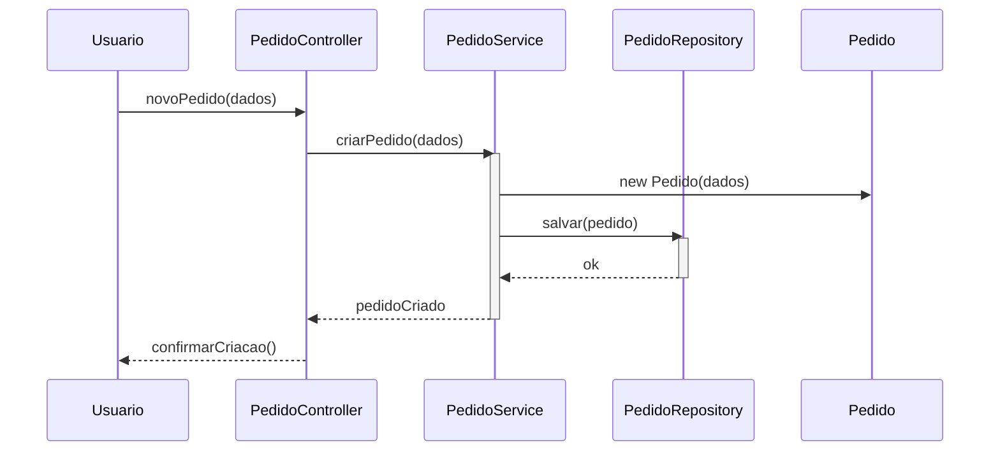

# Controller

**Definição**: um objeto que atua como intermediário entre a UI (ou camada de entrada) e o domínio, coordenando operações de uso do caso.

**Problema**: Quem deve tratar um evento de entrada do sistema gerado na interface do usuário?

**Solução**: Atribua a responsabilidade a uma classe que não seja de interface (non-UI), representando o sistema global, um dispositivo ou o cenário do caso de uso.

Tipos comuns de controller:

- `Facade Controller`: um controlador que representa um caso de uso de alto nível.
- `Session Controller`: gerencia uma sessão ou transação.

Quando usar:

- Para evitar que a camada de apresentação acesse diretamente várias classes do domínio.

Exemplo: `PedidoController` recebe entrada do usuário, cria/executa operações no `PedidoService`.

Relação com SOLID

- **SRP:** o `Controller` tem a responsabilidade única de orquestrar o caso de uso, evitando que a UI contenha lógica de negócio.
- **DIP:** controllers costumam depender de interfaces de serviços (injetadas) em vez de implementações concretas.
- **ISP:** mantenha interfaces do controlador enxutas para não forçar dependentes a implementar métodos desnecessários.

## Diagrama de sequência

O diagrama abaixo ilustra como um `PedidoController` coordena a criação e persistência de um `Pedido`. Há uma versão embutida (Mermaid) e um arquivo externo `diagrams/controller.mmd` para edição/geração de imagens.



Exemplo evolutivo
No exemplo evolutivo, introduzimos um `PedidoController` (ou similar) que atua como ponto de entrada da aplicação e delega ao `PedidoService` para lógica de negócio. Isso separa responsabilidades da camada de apresentação e facilita testes.

Fluxo ilustrativo (em `MainGrasp` → `PedidoController` → `PedidoService`):

```text
Usuario -> PedidoController -> PedidoService -> PedidoRepository
```

Referência: veja o diagrama de sequência em `diagrams/controller.mmd`.
Arquivo externo de edição: `diagrams/controller.mmd` (use `mmdc -i diagrams/controller.mmd -o diagrams/controller.png`).
