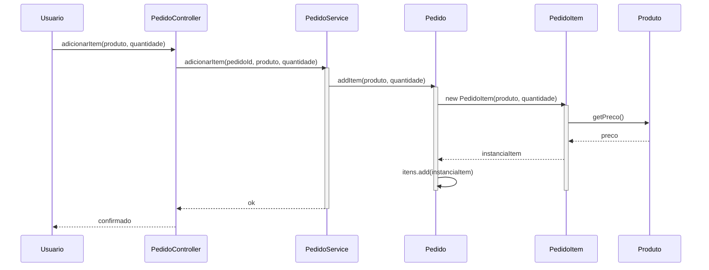

# Creator

**Definição**: uma classe A deve criar instâncias de classe B se A agrega, contém, usa ou tem informações necessárias para inicializar B.

**Problema**: Quem deve ser responsável por criar uma nova instância de uma classe A?

**Solução**: Atribua à classe B a responsabilidade de criar A se B: (1) agrega ou contém A; (2) registra instâncias de A; (3) usa muito de perto objetos de A; ou (4) possui os dados de inicialização de A.

Regras comuns que justificam a criação:

- A contém objetos do tipo B
- A usa objetos do tipo B frequentemente
- A tem dados necessários para construir B

Exemplo: `PedidoService` pode criar `Pedido` quando processa uma nova requisição, pois é responsável pelo fluxo de criação.

Dicas:

- Evite que muitas classes criem diretamente dependências complexas; considere fábricas quando necessário.

Relação com SOLID

- **SRP:** ao atribuir criação a uma classe específica (ex.: `PedidoService`), reduz-se a responsabilidade de outras classes.
- **DIP:** prefira depender de abstrações (fábricas ou interfaces) para criação quando a construção envolver dependências externas.
- **OCP:** encapsular lógica de criação facilita alterar formas de criação sem modificar consumidores.

## Exemplo evolutivo (Feira Livre)

Inicialmente `MainGrasp` pode criar `Pedido` diretamente. Ao aplicar `Creator`, movemos essa responsabilidade para `PedidoService`.
Trecho ilustrativo:

```java
// antes: Pedido p = new Pedido(); // em MainGrasp
// depois: PedidoService svc = new PedidoService();
//         Pedido p = svc.criarPedido();
```


Exemplo simples (preferível quando a criação é direta)
Se a criação do `PedidoItem` é direta e ligada ao estado interno do pedido, o `Pedido` pode criar e adicionar o `PedidoItem` — segue a forma mais simples e recomendada inicialmente:

```java
public class Pedido {
  private final List<PedidoItem> itens = new ArrayList<>();

  public void addItem(Produto produto, int quantidade) {
    PedidoItem item = new PedidoItem(produto, quantidade); // Pedido cria o item
    itens.add(item);
  }
}
```

Motivo: `Pedido` agrega `PedidoItem` e conhece os dados necessários para construí-lo (Information Expert + Creator). Use `PedidoService` apenas se a criação envolver lógica externa ou validações mais complexas.
Referência de código: `src/feira/grasp/PedidoService.java`.

### Diagrama de sequência

O diagrama abaixo mostra a interação típica quando o `PedidoService` cria um `Pedido` seguindo o princípio Creator. Há duas formas de usar: 1) blocos Mermaid embutidos neste arquivo (visíveis abaixo) e 2) arquivo externo `diagrams/creator.mmd` para edição/geração externa (recomendado para renderização com `mmdc`).



Arquivo externo de edição: `diagrams/creator.mmd` (use `mmdc -i diagrams/creator.mmd -o diagrams/creator.png`).
