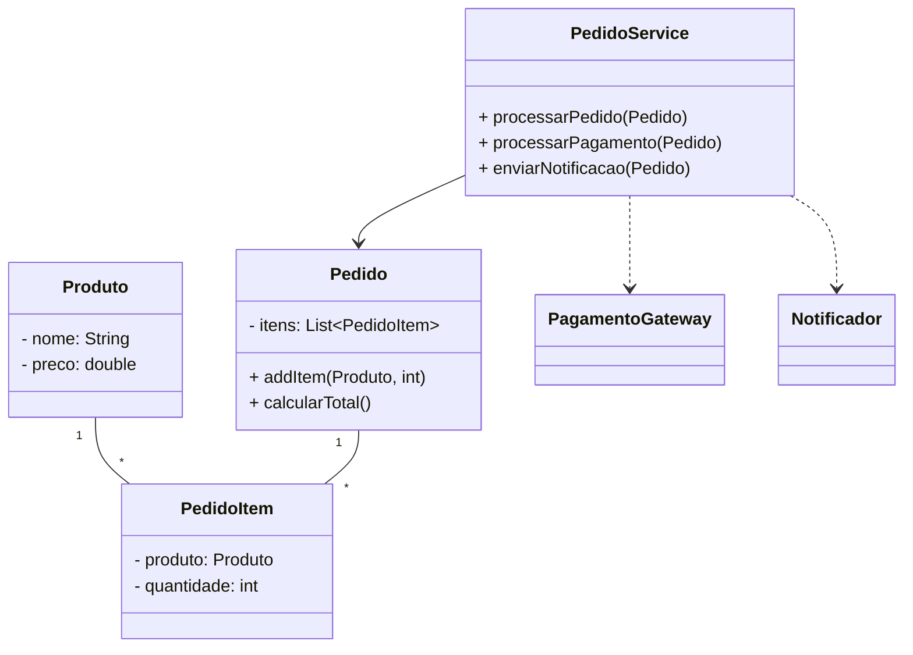
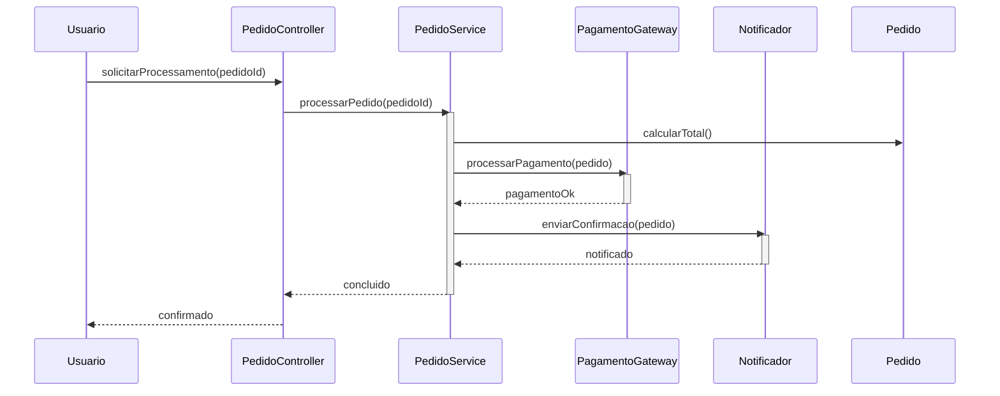

# High Cohesion (Alta Coesão)

**Definição**: manter as responsabilidades de uma classe fortemente relacionadas entre si, evitando misturar responsabilidades pouco conectadas.

**Problema**: Como manter as classes focadas e compreensíveis?

**Solução**: Atribua responsabilidades de modo que as tarefas de uma classe sejam fortemente relacionadas e focadas.

Benefícios:

- Classes coesas são mais fáceis de entender e modificar
- Reduz o acoplamento

Dicas:

- Refaça classes que acumulam responsabilidades distintas
- Combine com Low Coupling para design saudável

Relação com SOLID

- **SRP:** alta coesão é alinhada ao princípio da responsabilidade única — cada classe foca em um conjunto coeso de responsabilidades.
- **ISP:** coesão facilita criar interfaces específicas e evitar interfaces inchadas.

## Exemplo evolutivo (Feira Livre)

Ao perceber que `Pedido` tem apenas cálculo e armazenamento dos itens, extraímos lógica de processamento (processar pagamento, enviar notificação) para `PedidoService` e adaptadores separados. Isso melhora a coesão de `Pedido`.

Resumo prático: `Pedido` — coesão de domínio; `PedidoService` — coesão de operações/fluxos.

Trechos de código (exemplos simples)

1) `Pedido` — mantém os atributos e responsabilidade de cálculo/armazenamento de itens:

```java
public class Pedido {
    private final List<PedidoItem> itens = new ArrayList<>();

    public void addItem(Produto produto, int quantidade) {
        PedidoItem item = new PedidoItem(produto, quantidade);
        itens.add(item);
    }

    public double calcularTotal() {
        return itens.stream().mapToDouble(PedidoItem::subtotal).sum();
    }
}
```

2) `PedidoService` — coage operações de fluxo (processamento, pagamento, notificação):

```java
public class PedidoService {
    private final PagamentoGateway pagamento;
    private final Notificador notificador;

    public PedidoService(PagamentoGateway pagamento, Notificador notificador) {
        this.pagamento = pagamento;
        this.notificador = notificador;
    }

    public void processarPedido(Pedido pedido) {
        double total = pedido.calcularTotal();
        boolean pago = pagamento.processar(pedido, total);
        if (pago) {
            notificador.enviarConfirmacao(pedido);
        }
    }
}
```

3) Interfaces de abstração (Pure Fabrication / Indirection) — isolam variações e reduzem acoplamento:

```java
public interface PagamentoGateway {
    boolean processar(Pedido pedido, double valor);
}

public interface Notificador {
    void enviarConfirmacao(Pedido pedido);
}
```

Esses trechos mostram como separar claramente responsabilidades: `Pedido` cuida do modelo e cálculo (alta coesão), enquanto `PedidoService` orquestra o fluxo e depende de abstrações para pagamento e notificação (baixo acoplamento).

Diagramas (High Cohesion)

1) Diagrama de classes — mostra a separação de responsabilidades: `Pedido` mantém atributos/itens e `PedidoService` concentra operações de fluxo (pagamento, notificação):



Arquivo externo para edição: `diagrams/high-cohesion-class.mmd`.

2) Diagrama de sequência — fluxo típico mostrando `PedidoService` como ponto coeso que orquestra cálculo, pagamento e notificação:



Arquivo externo para edição: `diagrams/high-cohesion-sequence.mmd`.
