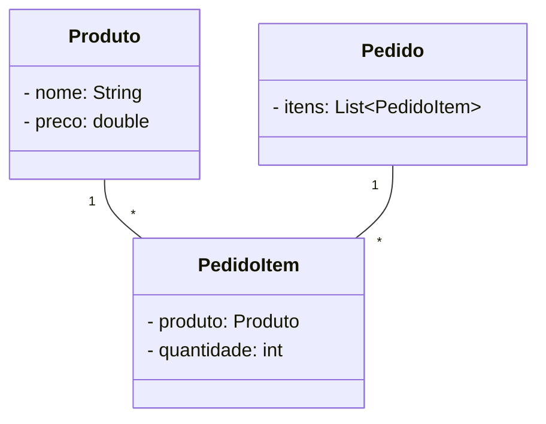
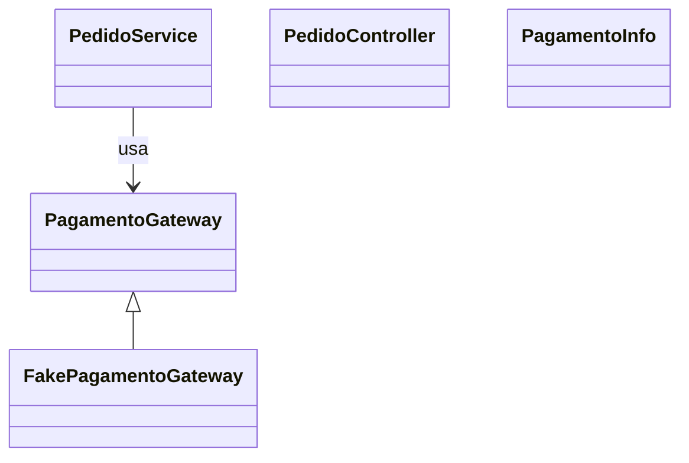

# Guia Didático dos Princípios GRASP: Atribuição de Responsabilidades em Design de Software

Este guia destina-se a docentes e estudantes de Engenharia de Software, servindo como base para a transposição didática dos conceitos de Design Orientado a Objetos (OOD). O acrônimo GRASP significa General Responsibility Assignment Software Patterns (ou Princípios). É fundamental que o educador enfatize que o GRASP não é uma tecnologia, framework ou uma notação UML, mas sim um "conjunto de ferramentas mentais" e um auxílio à aprendizagem.

Como afirma Craig Larman:

"*A ferramenta crucial de projeto para desenvolvimento de software é uma mente bem educada em princípios de projeto. Não é UML ou qualquer outra tecnologia*."

O foco, portanto, reside no raciocínio crítico para decidir qual objeto deve assumir qual tarefa no ecossistema de software.

## Contexto Histórico e Fundamentos Teóricos

O design de software não nasceu de teorias abstratas, mas da prática iterativa de desenvolvedores que identificaram soluções eficazes para problemas recorrentes. Os padrões GRASP não "inventaram" novas metodologias; eles documentaram, padronizaram e deram nomes a princípios antigos e amplamente testados pela comunidade de engenharia.

A sistematização definitiva desses princípios foi conduzida por **Craig Larman** em sua obra seminal **Applying UML and Patterns**, com edições fundamentais em 1997, 2001 e a consolidada versão de 2004/2005. No repertório do designer, o GRASP atua como o fundamento para a **atribuição de responsabilidades**, sendo perfeitamente complementar aos padrões GoF (Gang of Four) — que focam em estruturas e comportamentos específicos — e aos princípios SOLID. Enquanto o **SOLID** oferece métricas de **qualidade**, o **GRASP** fornece o **guia mental** para a distribuição inicial de lógica entre os objetos.

## O Conceito de Responsabilidade no Design Orientado a Objetos (DOO)

O Projeto Guiado por Responsabilidades (PGR) visualiza o software como uma comunidade de objetos que colaboram entre si. Segundo a UML, uma **responsabilidade** é **"um contrato ou obrigação de um classificador"**. Para fins didáticos, devemos expandir essa definição em três pilares fundamentais, conforme o material de base:

1. **Responsabilidades de Conhecer (Knowing):** O que um objeto sabe sobre seus dados encapsulados, sobre os objetos com os quais se relaciona e sobre as informações que ele pode derivar ou calcular.
2. **Responsabilidades de Fazer (Doing):** O que um objeto executa, como criar instâncias, realizar cálculos complexos ou coordenar e iniciar atividades em outros objetos.
3. **Decisões de Projeto:** As escolhas tomadas por objetos que afetam diretamente o comportamento de seus pares no sistema.

## Linha do Tempo dos Princípios de Projeto

Com base em fontes históricas e publicações-chave, é possível traçar uma linha do tempo que mostra a evolução e a consolidação dos princípios GRASP e sua relação com outros marcos do design orientado a objetos:

- **1987–1988: Origens de Princípios Individuais (SOLID)**

  - Embora o acrônimo SOLID tenha se popularizado depois, princípios individuais como o de Barbara Liskov (LSP — Liskov Substitution Principle) foram introduzidos nessa época, servindo de base para o que hoje entendemos como design robusto.
- **1994–1995: Padrões Gang-of-Four (GoF)**

  - A publicação do livro "Design Patterns: Elements of Reusable Object-Oriented Software" por Gamma, Helm, Johnson e Vlissides (o "Gang of Four") estabeleceu a referência dos patterns, focando em soluções reutilizáveis para problemas recorrentes de design.
- **1997: O Surgimento do GRASP**

  - Craig Larman publica a primeira edição de "Applying UML and Patterns", onde introduz formalmente o GRASP (General Responsibility Assignment Software Patterns). Larman apresenta os padrões como forma de documentar e padronizar práticas de atribuição de responsabilidades já testadas.
- **Início dos anos 2000: Popularização do SOLID**

  - Os princípios SOLID tornam-se amplamente reconhecidos como diretrizes de alto nível para qualidade de software, frequentemente ensinados e aplicados em conjunto com o GRASP para reduzir acoplamento e aumentar coesão.
- **2001–2005: Refinamento e Novas Edições**

  - Novas edições do livro de Craig Larman (2ª edição em 2001 e 3ª edição em 2004/2005) refinam os nove padrões GRASP, consolidando-os como um conjunto de ferramentas mentais essenciais para desenvolvedores.
- **2016–2019: Aplicações e Artigos Contemporâneos**

  - Especialistas e artigos continuam a detalhar padrões específicos e boas práticas (por exemplo, estudos e exemplos práticos sobre Controller e Creator), mostrando a relevância contínua desses conceitos na indústria.
- **2024: Ensino Acadêmico Atual**

  - O GRASP permanece como um pilar no ensino de Projeto e Arquitetura de Sistemas em universidades, servindo de base para o aprendizado de design guiado por responsabilidades.

## Exemplo prático

Cada princípio tem uma explicação, exemplos e dicas para aplicação prática.

### Diagrama de classes (visão rápida)

Mostramos aqui os diagramas de classes principais do domínio da Feira Livre. Para detalhes e evolução passo a passo, veja as seções "Exemplo evolutivo" em cada arquivo de padrão.

Versão 1 — modelo de domínio simples

Arquivos externos para edição: `diagrams/class-v1-fixed.mmd`.

Versão 2 — incluir fluxo de pagamento (indirection / protected variations)

Arquivo externo para edição: `diagrams/class-v2-payment.mmd`.

## Os 9 Princípios GRASP:

Princípios estudados nesta apostila:

1. [Information Expert](info-expert.md)
2. [Creator](creator.md)
3. 
4. [Controller](controller.md)
5. [Low Coupling](low-coupling.md)
6. [High Cohesion](high-cohesion.md)
7. [Polymorphism](polymorphism.md)
8. [Pure Fabrication](pure-fabrication.md)
9. [Indirection](indirection.md)
10. [Protected Variations](protected-variations.md)

## Agrupamento dos padrões GRASP

Aqui proponho um agrupamento prático dos princípios GRASP para facilitar o estudo e a aplicação. Os agrupamentos não são exclusivos — servem como guia mental para escolher quais padrões considerar juntos.

- **Atribuição de Responsabilidades**

  - Information Expert: colocar comportamento onde estão os dados.
  - Creator: quem deve criar instâncias quando há relação óbvia.
  - Controller: objeto que representa um caso de uso e coordena operações.
- **Organização estrutural / design para mudança**

  - Low Coupling: reduzir dependências entre classes.
  - High Cohesion: manter responsabilidades relacionadas dentro da mesma classe.
  - Protected Variations: isolar pontos que podem variar atrás de abstrações.
  - Indirection: inserir intermediários para reduzir acoplamento direto.
- **Técnicas de implementação / apoio ao design**

  - Polymorphism: usar polimorfismo para variar comportamento sem condicionais.
  - Pure Fabrication: criar classes que não pertencem ao domínio para reduzir acoplamento (ex.: repositórios, adaptadores).

Sugestões de estudo prático

- Ao analisar um caso de uso: comece pensando em `Controller` (quem orquestra), aplique `Information Expert` para localizar lógica (ex.: cálculo), e então verifique `Creator` para responsabilidades de criação.
- Ao refatorar: use `Low Coupling` e `High Cohesion` como objetivos, e recorra a `Pure Fabrication` ou `Indirection` para isolar dependências.

Referência rápida: ver `introducao.md` para o exemplo evolutivo da Feira Livre onde estes agrupamentos aparecem em prática.

Mapeamento rápido para SOLID

- **Atribuição de Responsabilidades:** ligado principalmente a `SRP` (definir responsabilidades claras) e `OCP` (organizar para extensão).
- **Organização estrutural / design para mudança:** fortemente relacionado a `DIP` e `ISP` para reduzir acoplamento e criar abstrações estáveis.
- **Técnicas de implementação / apoio:** `Polymorphism` mapeia para `OCP`/`LSP`; `Pure Fabrication` apoia `SRP` e `DIP`.

## **Tabela Comparativa: GRASP vs. SOLID**

Os princípios GRASP formam a base lógica que o SOLID refina. É imperativo que o aluno distinga essas conexões:

| Princípio GRASP     | Equivalente ou Relacionado no SOLID / OO                      |
| -------------------- | ------------------------------------------------------------- |
| Information Expert   | Single Responsibility Principle (SRP) / Encapsulamento        |
| Protected Variations | Open/Closed Principle (OCP)                                   |
| Polymorphism         | Liskov Substitution Principle (LSP) / OCP                     |
| Pure Fabrication     | Single Responsibility Principle (SRP) / DDD Service           |
| Controller           | Interface Segregation Principle (ISP) / Camada de Aplicação |
