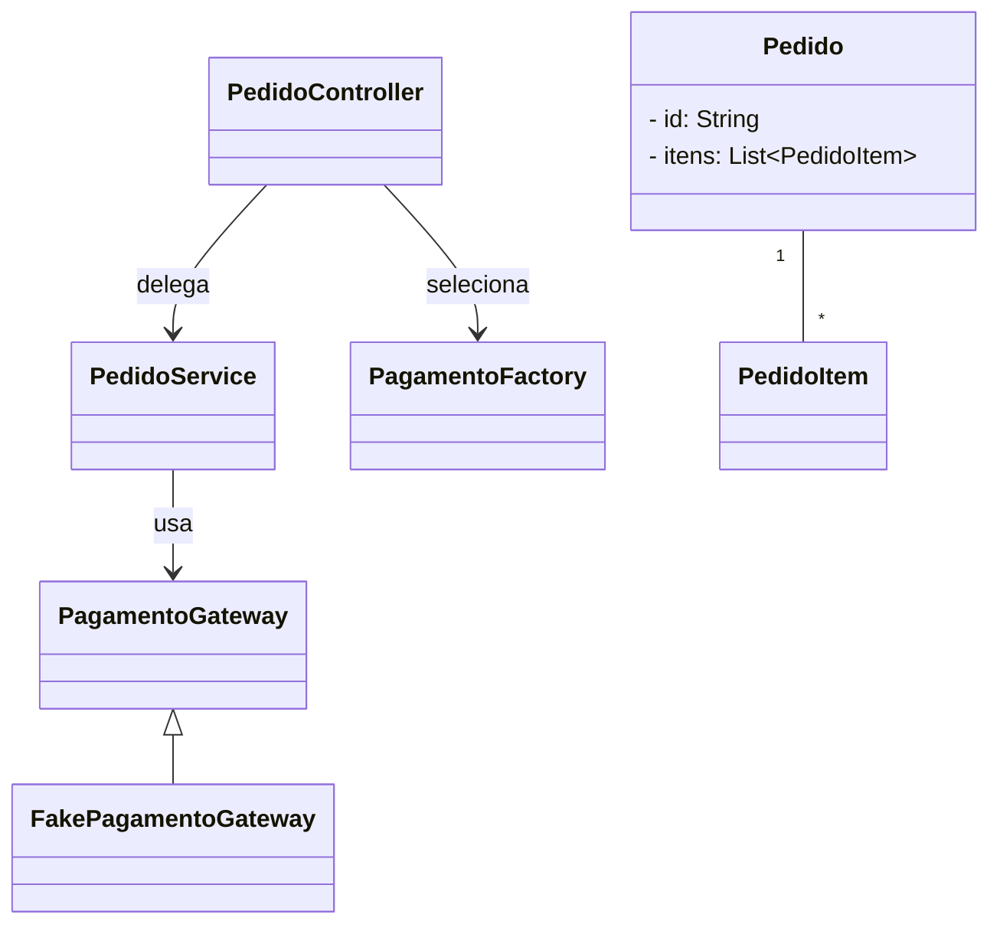
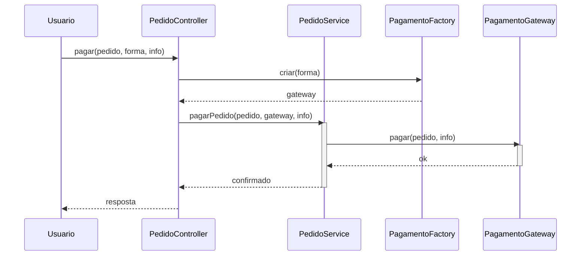

# Protected Variations

**Definição**: proteger elementos de um sistema contra variações previstas, definindo pontos de estabilidade (interfaces, abstracções).

**Problema**: Como proteger o sistema de instabilidades em elementos externos ou mutáveis?

**Solução**: Identifique pontos de variação previsíveis e envolva-os com uma interface estável, usando o Polimorfismo para as implementações.

Estratégia:

- Encapsular variações atrás de interfaces
- Usar indirection e pure fabrication para isolar mudanças

Exemplo: definir uma interface `PagamentoGateway` para isolar diferentes implementações (Pix, Cartão, Boleto).

Relação com SOLID

- **DIP:** proteger variações frequentemente é feito invertendo dependências e programando para abstrações.
- **OCP:** encapsular variações atrás de interfaces permite estender comportamentos sem modificar código cliente.

## Exemplo evolutivo (Feira Livre)

Ao aplicar `Protected Variations` no domínio da feira, definimos uma interface `PagamentoGateway` e implementações concretas para o provedor de pagamento. O `PedidoService` depende da abstração, protegendo-se de mudanças nas implementações.

Trecho ilustrativo:

```java
public interface PagamentoGateway { boolean pagar(Pedido pedido, PagamentoInfo info); }
public class FakePagamentoGateway implements PagamentoGateway { /* ... */ }
```

Referência: este padrão trabalha bem com `Indirection` e `Pure Fabrication`.

Exemplos de código

1) `PagamentoGateway` — interface estável para proteger variações:

```java
package feira.grasp.payment;

import feira.grasp.payment.PagamentoInfo;
import feira.grasp.Pedido;

public interface PagamentoGateway {
  boolean pagar(Pedido pedido, PagamentoInfo info);
}
```

1) Implementação fake (exemplo simplificado para aula):

```java
package feira.grasp.payment;

import feira.grasp.Pedido;

public class FakePagamentoGateway implements PagamentoGateway {
  @Override
  public boolean pagar(Pedido pedido, PagamentoInfo info) {
    return pedido != null
        && info != null
        && info.getTipo() != null
        && !info.getTipo().isBlank()
        && info.getReferencia() != null
        && !info.getReferencia().isBlank();
  }
}
```

1) Uso no `PedidoController` + `PagamentoFactory` — protegendo variações:

```java
// dentro de PedidoController
public boolean pagar(Pedido pedido, FormaPagamento forma, PagamentoInfo info) {
  PagamentoGateway gateway = PagamentoFactory.criar(forma);
  return service.pagarPedido(pedido, gateway, info);
}
```

Diagramas

1) Diagrama de classes — `PagamentoGateway` e implementação:



Arquivo externo para edição: `diagrams/protected-variations-class.mmd`.

1) Diagrama de sequência — fluxo de processamento via `PagamentoGateway`:



Arquivo externo para edição: `diagrams/protected-variations-sequence.mmd`.

Notas pedagógicas

- Mostre como trocar implementações de `PagamentoGateway` sem alterar `PedidoService`.
- Explique que `PagamentoGateway` é um ponto de estabilidade (protected variation) que deve permanecer estável.
- Destaque que `FormaPagamento` + `PagamentoFactory` concentram a variação fora da regra de negócio.
