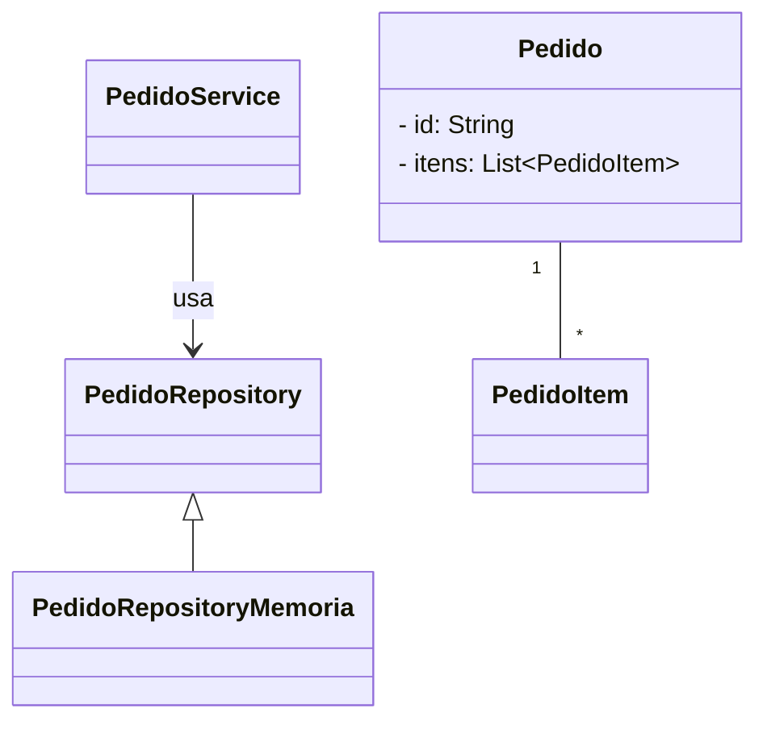
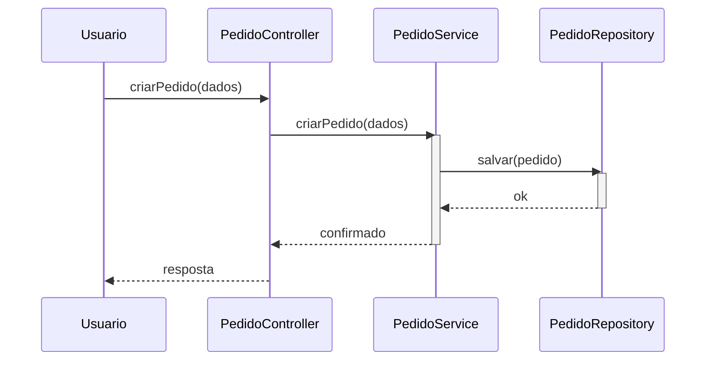

# Pure Fabrication

**Definição**: criar uma classe que não representa um conceito do domínio, mas que reduz acoplamento ou aumenta coesão (ex.: classes utilitárias, repositórios, adaptadores).

**Problema**: O que fazer quando o Especialista viola o Baixo Acoplamento ou a Alta Coesão?

**Solução**: Crie uma classe artificial, não pertencente ao domínio, para agrupar responsabilidades técnicas.

Uso:

- Quando mover responsabilidade para fora das classes de domínio reduz acoplamento ou melhora a coesão.

Exemplo: `PedidoRepository` pode ser uma Pure Fabrication para separar persistência do domínio.

Relação com SOLID

- **SRP:** Pure Fabrication separa responsabilidades (persistência, integração) fora das entidades do domínio.
- **DIP:** ao isolar a persistência em uma classe fabricada, clientes podem depender de interfaces e não de implementações concretas.

## Exemplo evolutivo (Feira Livre)

`PedidoRepository` é um exemplo de Pure Fabrication: não é um conceito do domínio

Exemplos de código

1) `PedidoRepository` — interface e implementação em memória (Pure Fabrication)

```java
package feira.grasp.repository;

import java.util.*;
import feira.grasp.Pedido;

public interface PedidoRepository {
  void salvar(Pedido pedido);
  Optional<Pedido> buscarPorId(String id);
  List<Pedido> listarTodos();
}
```

```java
package feira.grasp.repository;

import java.util.*;
import feira.grasp.Pedido;

public class PedidoRepositoryMemoria implements PedidoRepository {
  private final Map<String, Pedido> storage = new HashMap<>();

  @Override
  public void salvar(Pedido pedido) {
    storage.put(pedido.getId(), pedido);
  }

  @Override
  public Optional<Pedido> buscarPorId(String id) {
    return Optional.ofNullable(storage.get(id));
  }

  @Override
  public List<Pedido> listarTodos() {
    return new ArrayList<>(storage.values());
  }
}
```

2) Uso (trecho em `PedidoService`) — separa persistência do domínio

```java
// dentro de PedidoService
private final PedidoRepository repository;

public PedidoService(PedidoRepository repository) {
  this.repository = repository;
}

public void processar(Pedido pedido) {
  // lógica de domínio aqui
  repository.salvar(pedido);
}
```

Diagramas

1) Diagrama de classes — mostra a fábrica/padrao de Pure Fabrication e relação com `Pedido`:



Arquivo externo para edição: `diagrams/pure-fabrication-class.mmd`.

2) Diagrama de sequência — fluxo de persistência via `PedidoService` e `PedidoRepository`:



Arquivo externo para edição: `diagrams/pure-fabrication-sequence.mmd`.

Notas pedagógicas

- Explique que `PedidoRepository` não representa um conceito do domínio (não é "coisa" da feira), mas melhora o desenho ao isolar persistência.
- Mostre variações: repositório para JDBC, JPA ou adaptador para serviços externos — todas são Pure Fabrications que evitam poluir entidades de domínio.

