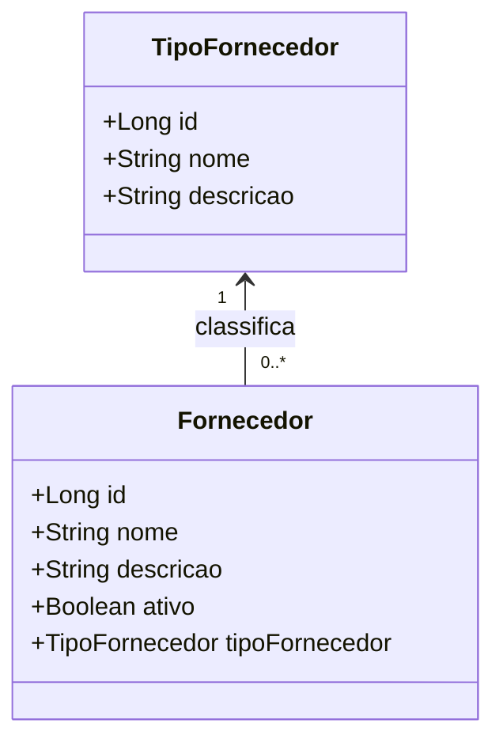

# Atividade Pratica - CRUD com GRASP (Fornecedor e TipoFornecedor)

## Objetivo

Implementar um CRUD de Fornecedor no contexto de uma feira livre, aplicando principios GRASP no desenho e no codigo.

Implementacao obrigatoria: Java em modo texto (console/terminal), sem interface grafica e sem framework web.

Persistencia obrigatoria: os dados de Fornecedor e TipoFornecedor devem ser salvos e carregados de arquivos JSON.

## Cenario

Voce esta implementando um modulo de gestao para uma feira livre.
Cada Fornecedor possui uma TipoFornecedor associada, usada para classificacao e regras operacionais.

O sistema deve permitir:

1. Cadastrar TipoFornecedor.
2. Cadastrar Fornecedor associado(a) a uma TipoFornecedor.
3. Listar Fornecedor.
4. Buscar Fornecedor por id.
5. Atualizar dados de Fornecedor.
6. Remover Fornecedor.

## Modo de execucao obrigatorio (texto)

1. A aplicacao deve iniciar por um main Java com menu textual no terminal.
2. Entrada de dados deve ser feita por teclado (ex.: Scanner).
3. Saida deve ser exibida em texto no console.
4. Nao usar GUI (Swing/JavaFX) e nao usar API REST para esta atividade.
5. O Controller deve receber as opcoes do menu e delegar para os servicos.

## Documentacao obrigatoria no codigo

1. Todas as classes criadas para a atividade devem ter comentario de documentacao (JavaDoc) explicando responsabilidade.
2. Metodos publicos devem ter JavaDoc com objetivo, parametros e retorno (quando houver).
3. Regras de negocio importantes devem estar descritas na documentacao dos metodos de dominio/servico.
4. A documentacao sera considerada na nota final.

## Regras de negocio minimas

1. Fornecedor.nome e obrigatorio e deve ter ao menos 3 caracteres.
2. Fornecedor.tipoFornecedor e obrigatorio.
3. TipoFornecedor.nome e obrigatorio e unico no cadastro.
4. Nao permitir remover uma TipoFornecedor que esteja em uso por algum(a) Fornecedor.
5. Operacoes invalidas devem retornar mensagem clara no terminal.

## Diagrama de dominio

Arquivo do diagrama: diagrama-dominio.mmd

Visualizacao rapida (Mermaid):


## Requisitos de arquitetura (GRASP)

1. Information Expert:
- Validacoes e regras de estado de Fornecedor devem estar no proprio Fornecedor.
- Regras de consistencia de TipoFornecedor devem estar no proprio TipoFornecedor.

2. Creator:
- Quem cria Fornecedor deve possuir os dados necessarios para isso (ex.: servico de aplicacao recebe DTO e instancia dominio).

3. Controller:
- Um controller recebe operacoes de entrada do menu textual (CLI) e delega para casos de uso.

4. Low Coupling + High Cohesion:
- Classes de dominio sem dependencia direta de detalhes de persistencia.
- Infraestrutura separada por repositorios/interfaces.

5. Pure Fabrication:
- Repositorios e mapeadores podem ser classes fabricadas para manter dominio limpo.

6. Indirection + Protected Variations:
- Servicos devem depender de abstracoes (FornecedorRepository, TipoFornecedorRepository).

## Persistencia obrigatoria em JSON

1. O repositorio deve persistir os dados em arquivo JSON local.
2. Ao iniciar a aplicacao, os dados devem ser carregados do JSON (se existir).
3. Apos criar, atualizar ou remover, o JSON deve ser atualizado.

Exemplo simples com Jackson (salvar lista em JSON):

```java
import com.fasterxml.jackson.databind.ObjectMapper;
import com.fasterxml.jackson.databind.SerializationFeature;
import java.nio.file.Path;
import java.util.List;

public class JsonStore {
  private final ObjectMapper mapper = new ObjectMapper().enable(SerializationFeature.INDENT_OUTPUT);
  private final Path arquivo = Path.of("fornecedores.json");

  public void salvar(List<Fornecedor> dados) {
    try {
      mapper.writeValue(arquivo.toFile(), dados);
    } catch (Exception e) {
      throw new RuntimeException("Erro ao salvar JSON", e);
    }
  }
}
```

## Casos de uso obrigatorios

1. Criar TipoFornecedor.
2. Criar Fornecedor com TipoFornecedor existente.
3. Listar Fornecedor com nome da TipoFornecedor.
4. Atualizar campos de Fornecedor.
5. Excluir Fornecedor.
6. Excluir TipoFornecedor (com validacao de vinculo).

Sugestao de menu textual:

1. Cadastrar TipoFornecedor
2. Listar TipoFornecedor
3. Cadastrar Fornecedor
4. Listar Fornecedor
5. Buscar Fornecedor por id
6. Atualizar Fornecedor
7. Excluir Fornecedor
8. Excluir TipoFornecedor
9. Sair

## Criterios de aceitacao

1. CRUD funcional para Fornecedor e cadastro basico de TipoFornecedor.
2. Validacoes de dominio implementadas e testaveis.
3. Dependencias invertidas por interface.
4. Controller sem regra de negocio.
5. Execucao completa em modo texto com menu funcional no terminal.
6. Persistencia em JSON funcionando para carga inicial e atualizacao dos dados.
7. Classes e metodos publicos documentados com JavaDoc de forma consistente.

## Rubrica rapida (0 a 10)

1. Funcionalidade do CRUD (0-3)
2. Aplicacao de GRASP no desenho (0-3)
3. Qualidade de codigo, legibilidade e documentacao (JavaDoc) (0-2)
4. Tratamento de validacoes e erros (0-2)

## Desafios opcionais

1. Implementar busca por termo no nome.
2. Criar estrategia de ordenacao sem if-else central.
3. Salvar entidade e subentidade em arquivos JSON separados (fornecedores.json e tipos-fornecedor.json).

## Entrega

1. Codigo-fonte compilando e executando.
2. README curto com instrucoes de execucao.
3. Evidencias de uso (prints ou log de execucao).
4. Explicacao breve (5 a 10 linhas) de como cada principio GRASP foi aplicado.