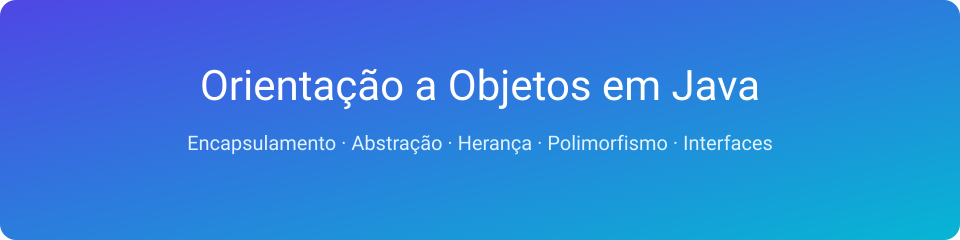
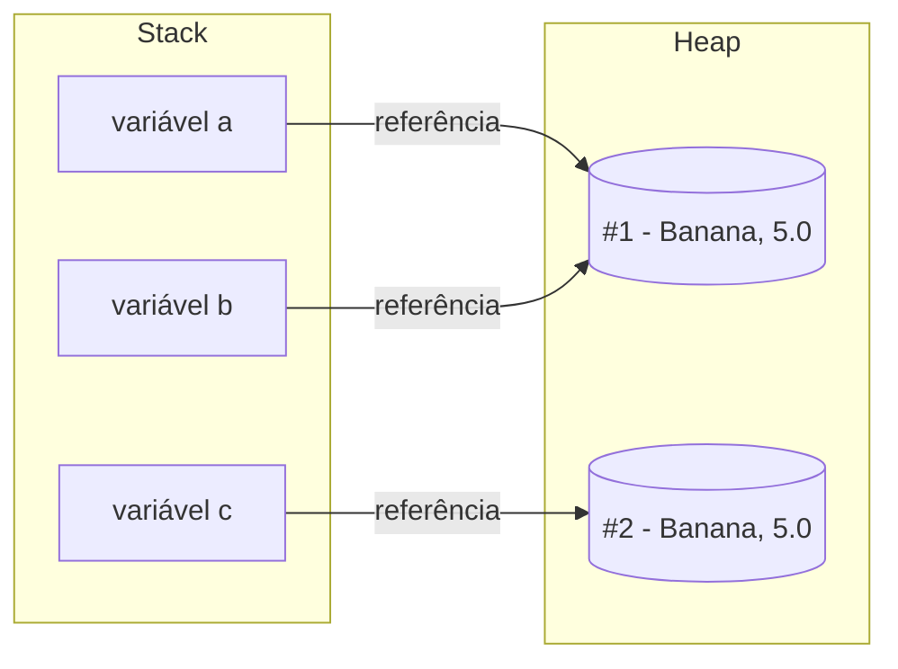
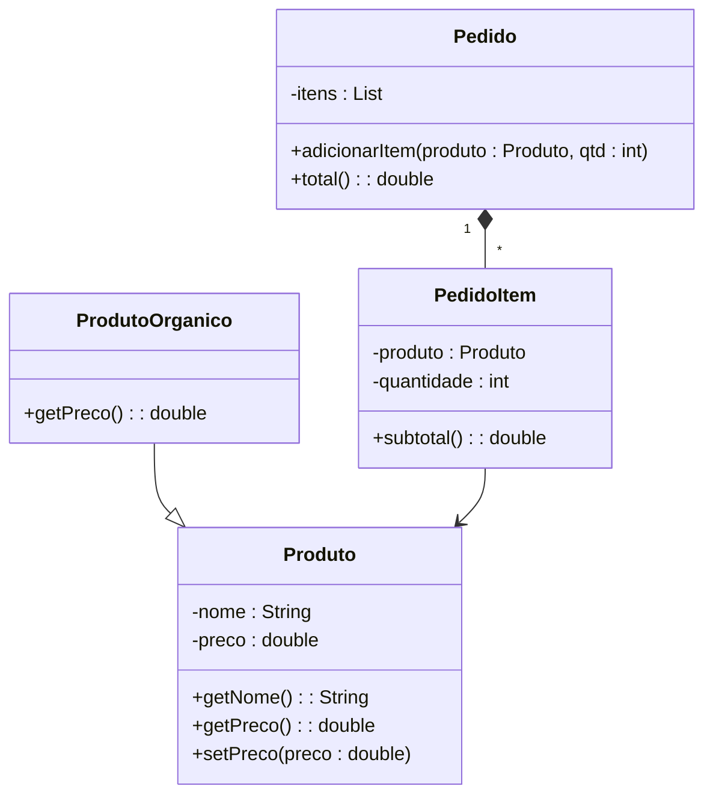
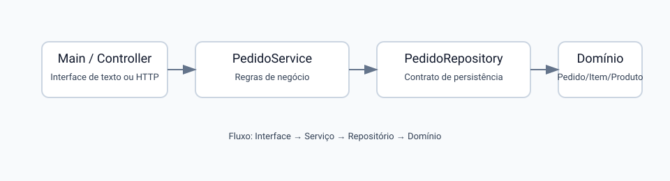
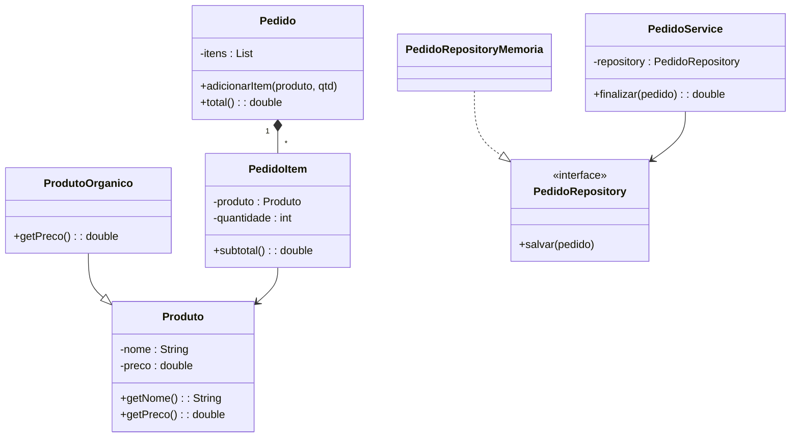
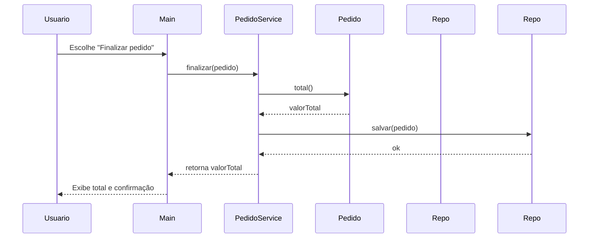

# Apostila – Orientação a Objetos em Java



**Disciplina:** Projeto e Arquitetura de Sistemas
**Objetivo:** Fornecer base conceitual sólida de Orientação a Objetos (OO) e introduzir o projeto “Feira Livre”, destacando as características de OO aplicadas ao domínio (encapsulamento, abstração, composição, herança e polimorfismo), além de acoplamento e coesão como fundamentos da arquitetura de software.

---

## 1. Introdução à Orientação a Objetos

A Orientação a Objetos (OO) é um paradigma de programação baseado na ideia de representar sistemas por meio de **objetos**, que são entidades que possuem **estado** (dados) e **comportamento** (operações).

Diferente da programação procedural, onde o foco está em funções e processos, na OO o foco está em **modelar o domínio do problema** por meio de classes e objetos.

### Por que usar OO?

- Facilita a modelagem de problemas complexos
- Estimula reutilização de código
- Favorece manutenção e evolução
- Base para arquiteturas modernas

---

## 2. Classe, Objeto e Referência

- **Classe:** é um molde (blueprint) que define as características de um tipo de objeto.
- **Objeto:** é uma instância concreta de uma classe.
- **Referência:** o “endereço”/ponteiro lógico que aponta para um objeto.

Exemplo conceitual (domínio da feira):

- Classe: `Feirante`
- Objetos: João, Maria, Ana
- Referência: joao, maria,  ana

Em Java:

```java
public class Feirante {
    private String nome;
}
```

Exemplo de criação de objetos (instanciação):

```java
public class Feirante {
    private String nome;

    public Feirante(String nome) {
        this.nome = nome;
    }

    public String getNome() {
        return nome;
    }
}

// Criando objetos (instâncias) da classe Feirante
Feirante joao = new Feirante("João");
Feirante maria = new Feirante("Maria");
Feirante ana = new Feirante("Ana");

System.out.println(joao.getNome()); // "João"
```

### Referência em Java (JDK 21)

- **Objeto:** entidade alocada no heap com estado e comportamento.
- **Referência:** o “endereço”/ponteiro lógico que aponta para um objeto.
  - Variáveis em Java guardam **referências**, não os objetos em si.
  - Atribuição copia a referência (duas variáveis podem apontar para o mesmo objeto).
- **`null`:** ausência de referência; acessar membros com `null` causa `NullPointerException`.
- **Comparações:**
  - `==` compara se duas referências apontam para o **mesmo** objeto.
  - `equals()` compara **conteúdo/igualdade lógica** (se a classe sobrescrever adequadamente).
- **Parâmetros em métodos:** Java é sempre “pass-by-value”; o **valor passado é a referência**. Assim, o método pode alterar o estado do objeto referenciado, mas **reapontar** a referência local não muda a referência do chamador.

Exemplo ilustrativo:

```java

Produto a = new Produto("Banana", 5.0);
Produto b = a;              // b recebe a MESMA referência de a

System.out.println(a == b); // true (mesmo objeto)

// Alterar via b reflete em a, pois é o mesmo objeto
// (supondo um setPreco válido)
// b.setPreco(6.0);
// System.out.println(a.getPreco()); // 6.0

// equals() pode ser diferente de == caso a classe compare conteúdo
Produto c = new Produto("Banana", 5.0);
System.out.println(a == c);      // false (referências diferentes)
System.out.println(a.equals(c)); // true/false depende da implementação de equals()

// Parâmetro: valor passado é a referência
ajustarPreco(a);

void ajustarPreco(Produto p) {
        // p referencia o MESMO objeto que a
        // p.setPreco(5.5); // afeta o objeto compartilhado

        // p = new Produto("Uva", 8.0); // reatribuir p NÃO muda a referência do chamador
}
```

#### Diagrama: Stack vs Heap e Referências



Este diagrama mostra que variáveis (`a`, `b`, `c`) guardam **referências** na pilha (Stack), enquanto os **objetos** vivem no Heap. Quando duas variáveis apontam para o mesmo nó no Heap, operações via qualquer uma delas afetam o mesmo objeto.

Veja também a demonstração interativa: [animacao-java-referencias/index.html](animacao-java-referencias/index.html).

---

## 3. Estrutura de uma Classe em Java

Uma classe em Java normalmente contém:

- Atributos (campos)
- Construtores
- Métodos

Exemplo:

```java
public class Produto {
    private String nome;
    private double preco;

    public Produto(String nome, double preco) {
        this.nome = nome;
        this.preco = preco;
    }

    public double getPreco() {
        return preco;
    }
}
```

---

## 4. Encapsulamento

Encapsulamento é o princípio de **ocultar os detalhes internos** de uma classe e expor apenas o que é necessário.

Em Java, isso é feito por meio dos modificadores de acesso:

- `private`
- `protected`
- `public`

Benefícios:

- Reduz acoplamento
- Aumenta segurança
- Facilita manutenção

Exemplo em Java (encapsulamento com validação):

```java
public class Produto {
    private String nome;
    private double preco;

    public Produto(String nome, double preco) {
        this.nome = nome;
        setPreco(preco);
    }

    public String getNome() {
        return nome;
    }

    public double getPreco() {
        return preco;
    }

    public void setPreco(double preco) {
        if (preco < 0) {
            throw new IllegalArgumentException("Preço não pode ser negativo");
        }
        this.preco = preco;
    }

    public double aplicarDesconto(double percentual) {
        // Regra encapsulada: desconto máximo de 50%
        if (percentual < 0 || percentual > 0.5) {
            throw new IllegalArgumentException("Percentual inválido");
        }
        return this.preco * (1 - percentual);
    }
}
```

---

## 5. Abstração

Abstração consiste em **focar no essencial** e ignorar detalhes irrelevantes para o contexto.

Exemplo:

- Um `Produto` tem nome e preço
- Não importa como o preço é calculado internamente

A abstração permite trabalhar com **modelos conceituais**, não com detalhes de implementação.

---

## 6. Herança

Herança é um mecanismo que permite que uma classe herde características de outra.

Exemplo:

```java
public class ProdutoOrganico extends Produto {
}
```

A herança representa a relação **"é um"**.

⚠️ Cuidado: herança em excesso gera sistemas rígidos e difíceis de manter.

---

## 7. Polimorfismo

Polimorfismo permite que objetos diferentes respondam à mesma mensagem de formas distintas.

```java
public class ProdutoOrganico extends Produto {
    public ProdutoOrganico(String nome, double preco) {
        super(nome, preco);
    }

    @Override
    public double getPreco() {
        // Exemplo: produtos orgânicos têm 10% de desconto padrão
        return super.getPreco() * 0.9;
    }
}

// Polimorfismo em ação
Produto p = new ProdutoOrganico("Tomate", 10.0);
System.out.println(p.getPreco()); // Usa o getPreco() da subclasse
```

O comportamento real depende do tipo concreto do objeto em tempo de execução.

---

## 8. Interfaces

Interfaces definem **contratos** que classes devem cumprir.

```java
public interface Calculavel {
    double calcular();
}
```

Elas são fundamentais para:

- Baixo acoplamento
- Inversão de dependência
- Arquiteturas flexíveis

Exemplo de redução de acoplamento com interfaces:

```java
public interface PedidoRepository {
    void salvar(Pedido pedido);
}

public class PedidoRepositoryMySQL implements PedidoRepository {
    @Override
    public void salvar(Pedido pedido) {
        // Implementação concreta
    }
}

public class PedidoService {
    private final PedidoRepository repository;

    public PedidoService(PedidoRepository repository) {
        this.repository = repository; // Depende de uma abstração
    }

    public void finalizar(Pedido pedido) {
        // Regras de negócio
        repository.salvar(pedido);
    }
}
```

---

## 9. Composição vs Herança

- **Herança:** relação "é um"
- **Composição:** relação "tem um"

Boa prática:

> Preferir composição à herança.

A composição gera sistemas mais flexíveis e evolutivos.

---

## 10. Acoplamento e Coesão

### Acoplamento

Acoplamento representa o **nível de dependência entre classes ou módulos** de um sistema.

- **Alto acoplamento:** muitas dependências diretas, mudanças se propagam facilmente.
- **Baixo acoplamento:** poucas dependências, módulos mais independentes.

Exemplo (feira):

- Um `PedidoService` que depende diretamente de `MySQLConnection` → alto acoplamento.
- Um `PedidoService` que depende de uma interface `PedidoRepository` → baixo acoplamento.

Benefícios do baixo acoplamento:

- Facilita manutenção
- Facilita testes
- Permite evolução da arquitetura

---

### Coesão

Coesão representa o **grau de relacionamento entre as responsabilidades de uma classe**.

- **Alta coesão:** classe tem responsabilidades bem definidas e relacionadas.
- **Baixa coesão:** classe faz muitas coisas diferentes e sem relação clara.

Exemplo (feira):

- Classe `Pedido` apenas com regras de pedido → alta coesão.
- Classe `SistemaFeira` com login, pedido, relatório e pagamento → baixa coesão.

Benefícios da alta coesão:

- Código mais legível
- Menor complexidade
- Melhor reutilização

---

### Relação entre Acoplamento e Coesão

Boa arquitetura busca sempre:

> **Baixo acoplamento + Alta coesão**

Esses dois conceitos são a **base estrutural de uma boa Arquitetura de Software**.

---

## 11. Erros Comuns em OO

- Classes Deus (muitas responsabilidades)
- Muitos getters/setters sem comportamento
- Herança excessiva
- Falta de encapsulamento

Esses erros impactam diretamente a arquitetura do sistema.

---

## 12. OO aplicada ao Projeto Feira Livre

#### Diagrama de Classes – Entidades (Feira Livre)

Representação das principais entidades de domínio: `Produto`, `ProdutoOrganico`, `PedidoItem` e `Pedido`.



Nesta seção, destacamos como as características de OO aparecem no projeto console “Feira Livre”.

### Encapsulamento

- `Produto` concentra dados e validações (ex.: preço não negativo).
- Regras específicas (ex.: desconto) ficam dentro da classe responsável.
- Referência: [feira-livre-java/src/feira/Produto.java](feira-livre-java/src/feira/Produto.java)

### Abstração

- Classes expõem operações essenciais ao domínio, como `subtotal()` e `total()`.
- O cálculo interno é ocultado, fornecendo uma interface simples de uso.
- Referências: [feira-livre-java/src/feira/PedidoItem.java](feira-livre-java/src/feira/PedidoItem.java), [feira-livre-java/src/feira/Pedido.java](feira-livre-java/src/feira/Pedido.java)

### Composição

- `Pedido` agrega vários `PedidoItem`; relação “tem um”.
- Cada `PedidoItem` associa um `Produto` e uma quantidade.
- Referências: [feira-livre-java/src/feira/Pedido.java](feira-livre-java/src/feira/Pedido.java), [feira-livre-java/src/feira/PedidoItem.java](feira-livre-java/src/feira/PedidoItem.java)

### Herança e Polimorfismo

- Subtipos podem especializar comportamento, como `ProdutoOrganico` alterando `getPreco()`.
- O código usa o tipo base (`Produto`) e o comportamento concreto é escolhido em tempo de execução.
- Referência: [feira-livre-java/src/feira/ProdutoOrganico.java](feira-livre-java/src/feira/ProdutoOrganico.java)

### Coesão e Acoplamento

- Alta coesão: `Pedido` calcula seu próprio `total()`; `PedidoItem` seu `subtotal()`.
- Baixo acoplamento: `PedidoService` depende de um contrato (`PedidoRepository`) para persistir.
- Referências: [feira-livre-java/src/feira/PedidoService.java](feira-livre-java/src/feira/PedidoService.java), [feira-livre-java/src/feira/PedidoRepository.java](feira-livre-java/src/feira/PedidoRepository.java), [feira-livre-java/src/feira/PedidoRepositoryMemoria.java](feira-livre-java/src/feira/PedidoRepositoryMemoria.java)

### Fluxo de Finalização

- `Main` aciona `PedidoService.finalizar(pedido)`.
- O serviço calcula `total()` no `Pedido` e persiste via `Repository`.
- O total retorna para exibição ao usuário.

## 13. OO e Arquitetura de Software

A OO é a base estrutural da arquitetura:

- Classes → componentes
- Objetos → serviços
- Interfaces → contratos arquiteturais

A qualidade da arquitetura depende da qualidade da modelagem OO.

---



## 14. UML Essencial – Notação e Dicas


A UML (Unified Modeling Language – Linguagem de Modelagem Unificada) é um conjunto de notações para representar sistemas de forma padronizada. Ela complementa OO e arquitetura, ajudando a comunicar modelos e decisões.

### Diagramas mais úteis na disciplina

- Diagrama de Classes: estrutura estática (classes, atributos, métodos, relacionamentos).
- Diagrama de Sequência: interação temporal entre objetos (mensagens e ordem).
- Casos de Uso: visão funcional (atores e objetivos do sistema).

### Notações essenciais (Diagrama de Classes)

- Classe: retângulo com nome; membros por visibilidade (`+` público, `-` privado, `#` protegido).
- Herança (generalização): seta com triângulo oco apontando para a superclasse.
- Interface: estereótipo «interface»; implementação com linha tracejada e triângulo.
- Associação: linha simples; multiplicidades `1`, `0..1`, `*` (muitos).
- Agregação/Composição: losango oco/cheio no lado do "todo".

### Mapeamento UML → Código (Java)

- Classe → `class`; atributos → campos; operações → métodos.
- Herança → `extends`; Interface → `interface`; Implementação → `implements`.
- Visibilidade: `+` → `public`, `-` → `private`, `#` → `protected`.

### Exemplo simples (Feira)

Relacionamentos principais:

- `Pedido` compõe `PedidoItem` (composição), associa-se a `Produto`.
- `ProdutoOrganico` herda de `Produto` (generalização).
- `PedidoService` depende de `PedidoRepository` (contrato/interface).

Exemplo visual (Mermaid – requer suporte de preview):



### Diagrama de Sequência – exemplo (Fluxo de Finalização de Pedido)

Representa a interação temporal entre objetos da aplicação console:



Observação: em uma aplicação web (Spring), `Main` seria substituída por um `Controller`, mas a dinâmica entre `Service` e `Repository` permanece.

### Quando usar UML

- Para comunicar modelo de domínio, regras e decisões arquiteturais entre equipes.
- Em checkpoints: incluir pelo menos um diagrama de classes e um de sequência.

Para uma visão de arquitetura de alto nível, consulte também o guia de C4: ver arquivo `C4-guidelines.md`.

## 15. Estudo de Caso Conceitual – Feira Livre

Exemplo de entidades:

- Feirante
- Produto
- Banca
- Pedido

Questões arquiteturais:

- Quem calcula o total do pedido?
- Onde ficam as regras de preço?
- Quem valida estoque?

Essas perguntas são resolvidas com boa OO.

---

## 16. Quiz de Revisão – Orientação a Objetos, Acoplamento e Coesão

### Instruções

Responda às questões a seguir sem consultar o material. O objetivo é verificar a compreensão conceitual.

---

### Questão 1

O que é Orientação a Objetos?

A) Um paradigma baseado apenas em funções.

B) Um paradigma baseado em objetos que possuem estado e comportamento.

C) Um framework de desenvolvimento.

D) Uma linguagem de programação específica.

---

### Questão 2

Qual a diferença entre classe e objeto?

A) Classe é um objeto abstrato.

B) Objeto é um molde.

C) Classe é um molde e objeto é uma instância.

D) Não existe diferença.

---

### Questão 3

O que é encapsulamento?

A) Herança de atributos.

B) Ocultar detalhes internos e expor apenas o necessário.

C) Criar muitas classes.

D) Usar apenas métodos públicos.

---

### Questão 4

Qual alternativa representa corretamente o conceito de herança?

A) Relação "tem um".

B) Relação "usa um".

C) Relação "é um".

D) Relação "depende de".

---

### Questão 5

O que é polimorfismo?

A) Capacidade de uma classe ter muitos atributos.

B) Capacidade de diferentes objetos responderem à mesma mensagem.

C) Capacidade de esconder dados.

D) Capacidade de herdar múltiplas classes.

---

### Questão 6

O que caracteriza **baixo acoplamento**?

A) Muitas dependências entre classes.

B) Classes altamente dependentes.

C) Poucas dependências e maior independência.

D) Uso excessivo de herança.

---

### Questão 7

O que caracteriza **alta coesão**?

A) Classe com muitas responsabilidades.

B) Classe com responsabilidades bem definidas e relacionadas.

C) Classe que depende de muitas outras.

D) Classe com muitos métodos públicos.

---

### Questão 8

Qual é a combinação desejável em sistemas bem projetados?

A) Alto acoplamento e alta coesão.

B) Baixo acoplamento e baixa coesão.

C) Alto acoplamento e baixa coesão.

D) Baixo acoplamento e alta coesão.

---

### Questão 9

Qual prática ajuda a reduzir acoplamento?

A) Depender de classes concretas.

B) Usar variáveis globais.

C) Programar contra interfaces.

D) Concentrar lógica em uma única classe.

---

### Questão 10

Por que acoplamento e coesão são importantes para arquitetura?

A) Porque melhoram a performance.

B) Porque reduzem o número de linhas de código.

C) Porque facilitam manutenção, testes e evolução do sistema.

D) Porque eliminam a necessidade de documentação.

---

## 17. Gabarito do Quiz

1. B
2. C
3. B
4. C
5. B
6. C
7. B
8. D
9. C
10. C

---

## 18. Conclusão

Orientação a Objetos não é sobre sintaxe, mas sobre:

- Modelar corretamente o domínio
- Separar responsabilidades
- Reduzir acoplamento
- Facilitar evolução

Ela é o **alicerce de toda a disciplina de Projeto e Arquitetura de Sistemas**.

---

## 19. Bibliografia Recomendada

- LARMAN, Craig. *Utilizando UML e Padrões*.
  - UML — Unified Modeling Language (Linguagem de Modelagem Unificada)
- GAMMA et al. *Design Patterns*.
- MARTIN, Robert C. *Arquitetura Limpa*.
- FOWLER, Martin. *UML Essencial*.

---
