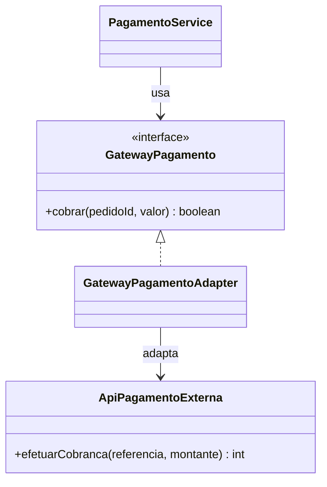

# GOF - Adapter (Feira Livre)

## Definicao

Adapter converte a interface de uma classe para outra interface esperada pelo cliente.

## Problema

A aplicacao da feira espera um `GatewayPagamento`, mas o provedor externo oferece uma API diferente.

Sem Adapter, codigo de negocio passa a conhecer detalhes da API externa.

## Solucao

Criar um adaptador que implementa a interface interna e delega para API externa.

## Diagrama de classes (Mermaid)



## Exemplo

```java
public interface GatewayPagamento {
    boolean cobrar(String pedidoId, double valor);
}

// API externa (incompativel com o que o dominio espera)
public class ApiPagamentoExterna {
    public int efetuarCobranca(String referencia, double montante) {
        return 200;
    }
}

public class GatewayPagamentoAdapter implements GatewayPagamento {
    private final ApiPagamentoExterna apiExterna;

    public GatewayPagamentoAdapter(ApiPagamentoExterna apiExterna) {
        this.apiExterna = apiExterna;
    }

    @Override
    public boolean cobrar(String pedidoId, double valor) {
        int status = apiExterna.efetuarCobranca(pedidoId, valor);
        return status >= 200 && status < 300;
    }
}
```

Uso:

```java
GatewayPagamento gateway = new GatewayPagamentoAdapter(new ApiPagamentoExterna());
boolean sucesso = gateway.cobrar("PED-2026-001", 145.90);
```

## Código completo

```java
// ── interface interna do dominio ──────────────────────────────────────────

interface GatewayPagamento {
    boolean cobrar(String pedidoId, double valor);
}

// ── API externa de terceiro (nao pode ser alterada) ───────────────────────

class ApiPagamentoExterna {
    /** Retorna HTTP status code simulado: 200 = sucesso, 402 = saldo insuficiente */
    public int efetuarCobranca(String referencia, double montante) {
        System.out.println("[API-EXTERNA] cobrando referencia=" + referencia
                         + " montante=" + String.format("%.2f", montante));
        // simulacao: valores acima de 500 sao recusados
        return montante > 500.0 ? 402 : 200;
    }
}

// ── adapter: traduz GatewayPagamento para ApiPagamentoExterna ─────────────

class GatewayPagamentoAdapter implements GatewayPagamento {
    private final ApiPagamentoExterna apiExterna;

    GatewayPagamentoAdapter(ApiPagamentoExterna apiExterna) {
        this.apiExterna = apiExterna;
    }

    @Override
    public boolean cobrar(String pedidoId, double valor) {
        int status = apiExterna.efetuarCobranca(pedidoId, valor);
        boolean aprovado = status >= 200 && status < 300;
        System.out.println("[ADAPTER] status=" + status
                         + " -> " + (aprovado ? "APROVADO" : "RECUSADO"));
        return aprovado;
    }
}

// ── servico de pagamento do dominio ───────────────────────────────────────

class PagamentoService {
    private final GatewayPagamento gateway;

    PagamentoService(GatewayPagamento gateway) {
        this.gateway = gateway;
    }

    void processar(String pedidoId, double valor) {
        boolean ok = gateway.cobrar(pedidoId, valor);
        System.out.println("Pagamento do pedido " + pedidoId + ": "
                         + (ok ? "CONCLUIDO" : "FALHOU"));
    }
}

// ── demonstracao ──────────────────────────────────────────────────────────

public class MainAdapter {
    public static void main(String[] args) {
        GatewayPagamento gateway = new GatewayPagamentoAdapter(new ApiPagamentoExterna());
        PagamentoService service = new PagamentoService(gateway);

        service.processar("PED-2026-001", 145.90);
        System.out.println();
        service.processar("PED-2026-002", 699.00);
    }
}
```

Saída esperada:
```
[API-EXTERNA] cobrando referencia=PED-2026-001 montante=145,90
[ADAPTER] status=200 -> APROVADO
Pagamento do pedido PED-2026-001: CONCLUIDO

[API-EXTERNA] cobrando referencia=PED-2026-002 montante=699,00
[ADAPTER] status=402 -> RECUSADO
Pagamento do pedido PED-2026-002: FALHOU
```

## Relacao com GRASP e SOLID

GRASP:
- Indirection: o adapter intermedia dominio e API externa.
- Protected Variations: mudancas no provedor externo ficam isoladas no adaptador.
- Low Coupling: o dominio nao acopla ao contrato tecnico da API de terceiros.

SOLID:
- DIP: servicos de negocio dependem da interface `GatewayPagamento`.
- OCP: novo provedor entra com novo adapter sem alterar cliente.
- SRP: adaptacao de protocolo/formato fica numa classe dedicada.

## Beneficios

- Isola dependencia externa.
- Facilita troca de provedor.
- Mantem dominio limpo e testavel.

## Riscos e anti-exemplo

Anti-exemplo:
- Adapter acumulando regra de negocio que deveria estar no servico de dominio.

Risco:
- Mapear mal erros da API externa para contrato interno.

## Exercicios

1. Adaptar retorno com codigo e mensagem de erro.
2. Criar um segundo adapter para outro provedor.
3. Simular falha da API externa e validar tratamento.

## Checklist

- Interface do dominio esta estavel?
- Detalhes da API externa ficaram encapsulados?
- A troca de provedor exige mudanca minima no sistema?
