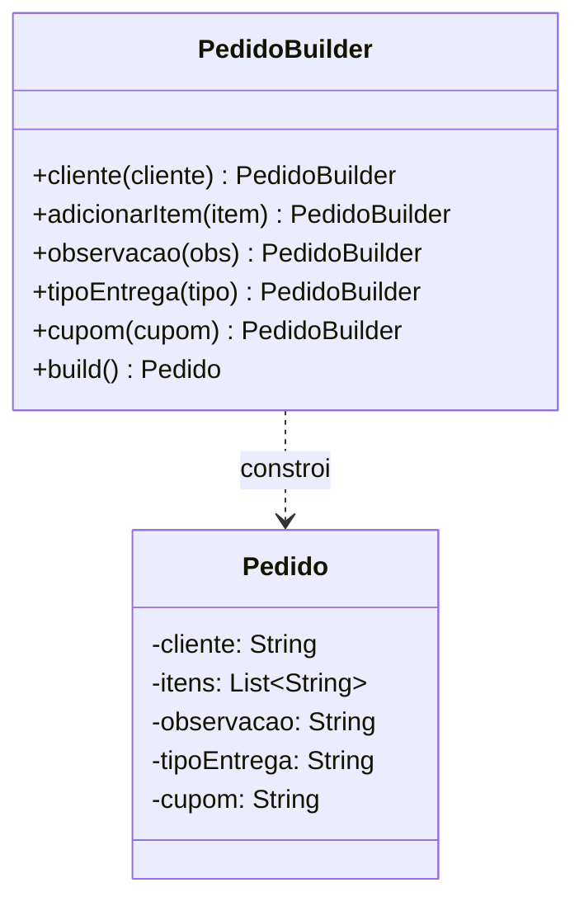

# GOF - Builder (Feira Livre)

## Definicao

Builder separa a construcao de um objeto complexo de sua representacao final, permitindo montar o objeto passo a passo.

## Problema

Um pedido da feira pode ter muitos campos opcionais:
- cliente
- itens
- observacao
- tipo de entrega
- cupom

Sem Builder, o sistema acaba com construtores longos ou muitos overloads confusos.

## Solucao

Criar um builder para montar `Pedido` de forma legivel e segura.

## Diagrama de classes (Mermaid)



## Exemplo

```java
import java.util.ArrayList;
import java.util.List;

public class Pedido {
    private final String cliente;
    private final List<String> itens;
    private final String observacao;
    private final String tipoEntrega;
    private final String cupom;

    private Pedido(Builder builder) {
        this.cliente = builder.cliente;
        this.itens = List.copyOf(builder.itens);
        this.observacao = builder.observacao;
        this.tipoEntrega = builder.tipoEntrega;
        this.cupom = builder.cupom;
    }

    public static class Builder {
        private String cliente;
        private List<String> itens = new ArrayList<>();
        private String observacao = "";
        private String tipoEntrega = "RETIRADA";
        private String cupom = "";

        public Builder cliente(String cliente) {
            this.cliente = cliente;
            return this;
        }

        public Builder adicionarItem(String item) {
            this.itens.add(item);
            return this;
        }

        public Builder observacao(String observacao) {
            this.observacao = observacao;
            return this;
        }

        public Builder tipoEntrega(String tipoEntrega) {
            this.tipoEntrega = tipoEntrega;
            return this;
        }

        public Builder cupom(String cupom) {
            this.cupom = cupom;
            return this;
        }

        public Pedido build() {
            if (cliente == null || cliente.isBlank()) {
                throw new IllegalStateException("Cliente obrigatorio");
            }
            if (itens.isEmpty()) {
                throw new IllegalStateException("Pedido precisa de pelo menos um item");
            }
            return new Pedido(this);
        }
    }
}
```

Uso:

```java
Pedido pedido = new Pedido.Builder()
    .cliente("Maria")
    .adicionarItem("Tomate")
    .adicionarItem("Batata")
    .tipoEntrega("ENTREGA")
    .observacao("Sem sacola plastica")
    .build();
```

## Código completo

```java
import java.util.ArrayList;
import java.util.List;

// ── produto simples de dominio ────────────────────────────────────────────

class ItemPedido {
    private final String nome;
    private final double preco;

    public ItemPedido(String nome, double preco) {
        this.nome  = nome;
        this.preco = preco;
    }

    @Override
    public String toString() {
        return nome + " (R$ " + String.format("%.2f", preco) + ")";
    }
}

// ── objeto que sera construido ────────────────────────────────────────────

class Pedido {
    private final String cliente;
    private final List<ItemPedido> itens;
    private final String observacao;
    private final String tipoEntrega;
    private final String cupom;

    private Pedido(Builder b) {
        this.cliente     = b.cliente;
        this.itens       = List.copyOf(b.itens);
        this.observacao  = b.observacao;
        this.tipoEntrega = b.tipoEntrega;
        this.cupom       = b.cupom;
    }

    @Override
    public String toString() {
        return "Pedido{cliente='" + cliente + "', itens=" + itens
             + ", entrega=" + tipoEntrega
             + ", cupom='" + cupom + "'"
             + ", obs='" + observacao + "'}";
    }

    // ── builder interno ───────────────────────────────────────────────────

    static class Builder {
        private String cliente;
        private final List<ItemPedido> itens = new ArrayList<>();
        private String observacao  = "";
        private String tipoEntrega = "RETIRADA";
        private String cupom       = "";

        Builder cliente(String cliente)          { this.cliente = cliente; return this; }
        Builder adicionarItem(ItemPedido item)   { this.itens.add(item);   return this; }
        Builder observacao(String obs)           { this.observacao = obs;  return this; }
        Builder tipoEntrega(String tipo)         { this.tipoEntrega = tipo; return this; }
        Builder cupom(String cupom)              { this.cupom = cupom;     return this; }

        Pedido build() {
            if (cliente == null || cliente.isBlank())
                throw new IllegalStateException("Cliente obrigatorio");
            if (itens.isEmpty())
                throw new IllegalStateException("Pedido precisa de pelo menos um item");
            return new Pedido(this);
        }
    }
}

// ── demonstracao ──────────────────────────────────────────────────────────

public class MainBuilder {
    public static void main(String[] args) {
        Pedido pedido = new Pedido.Builder()
            .cliente("Maria")
            .adicionarItem(new ItemPedido("Tomate", 4.50))
            .adicionarItem(new ItemPedido("Batata", 3.00))
            .adicionarItem(new ItemPedido("Cebola", 2.80))
            .tipoEntrega("ENTREGA")
            .cupom("FEIRA10")
            .observacao("Sem sacola plastica")
            .build();

        System.out.println(pedido);

        // pedido minimo sem campos opcionais
        Pedido pedidoSimples = new Pedido.Builder()
            .cliente("Joao")
            .adicionarItem(new ItemPedido("Alface", 2.00))
            .build();

        System.out.println(pedidoSimples);

        // tentativa invalida (sem cliente) - captura excecao esperada
        try {
            new Pedido.Builder()
                .adicionarItem(new ItemPedido("Queijo", 15.00))
                .build();
        } catch (IllegalStateException e) {
            System.out.println("Erro esperado: " + e.getMessage());
        }
    }
}
```

Saída esperada:
```
Pedido{cliente='Maria', itens=[Tomate (R$ 4,50), Batata (R$ 3,00), Cebola (R$ 2,80)], entrega=ENTREGA, cupom='FEIRA10', obs='Sem sacola plastica'}
Pedido{cliente='Joao', itens=[Alface (R$ 2,00)], entrega=RETIRADA, cupom='', obs=''}
Erro esperado: Cliente obrigatorio
```

## Relacao com GRASP e SOLID

GRASP:
- Creator: o `Builder` assume responsabilidade de montar `Pedido` com consistencia.
- High Cohesion: validacoes de construcao ficam concentradas em `build()`.
- Low Coupling: cliente nao depende de construtores complexos nem detalhes internos de `Pedido`.

SOLID:
- SRP: `Pedido` representa estado; `Builder` concentra processo de construcao/validacao.
- OCP: novos campos opcionais podem ser adicionados por novos metodos fluentes.
- ISP: cliente usa apenas operacoes de montagem necessarias para o caso de uso.

## Beneficios

- Construcao legivel e com validacoes centralizadas.
- Evita construtores gigantes.
- Facilita objetos imutaveis.

## Riscos e anti-exemplo

Anti-exemplo:
- Usar Builder para objetos triviais com 2 campos.

Risco:
- Duplicar regra de validacao no Builder e em outros pontos.

## Exercicios

1. Incluir validacao de cupom no `build()`.
2. Criar `PedidoDiretor` para montar um pedido padrao de cesta semanal.
3. Escrever teste para validar erro quando nao houver itens.

## Checklist

- O objeto final tem muitos campos opcionais?
- A construcao ficou mais legivel do que com construtor tradicional?
- Validacoes essenciais estao no `build()`?
