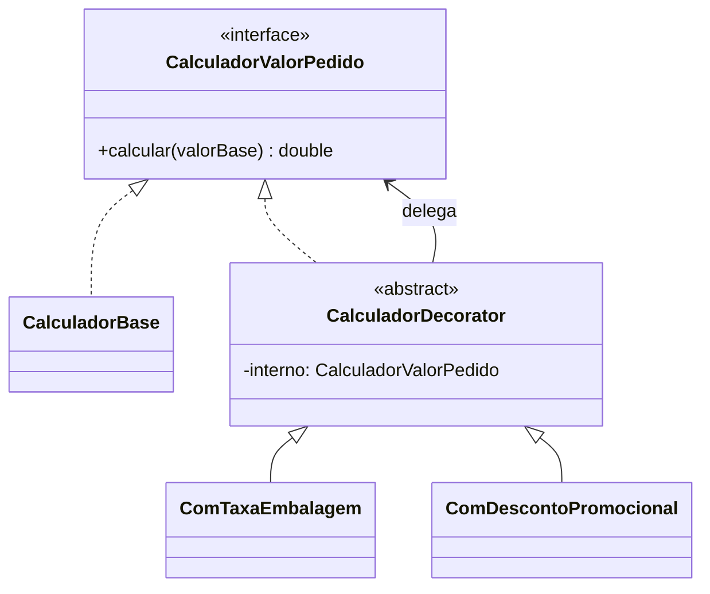

# GOF - Decorator (Feira Livre)

## Definicao

Decorator adiciona responsabilidades a objetos dinamicamente, sem alterar a classe original e sem depender de heranca extensa.

## Problema

No fechamento do pedido, podem existir composicoes de acrescimos e descontos:
- taxa de embalagem
- desconto promocional
- taxa de entrega especial

Sem Decorator, tende a surgir explosao de subclasses.

## Solucao

Encadear decoradores sobre um componente comum de calculo.

## Diagrama de classes (Mermaid)



## Exemplo

```java
public interface CalculadorValorPedido {
    double calcular(double valorBase);
}

public class CalculadorBase implements CalculadorValorPedido {
    @Override
    public double calcular(double valorBase) {
        return valorBase;
    }
}

public abstract class CalculadorDecorator implements CalculadorValorPedido {
    protected final CalculadorValorPedido interno;

    protected CalculadorDecorator(CalculadorValorPedido interno) {
        this.interno = interno;
    }
}

public class ComTaxaEmbalagem extends CalculadorDecorator {
    public ComTaxaEmbalagem(CalculadorValorPedido interno) {
        super(interno);
    }

    @Override
    public double calcular(double valorBase) {
        return interno.calcular(valorBase) + 2.50;
    }
}

public class ComDescontoPromocional extends CalculadorDecorator {
    public ComDescontoPromocional(CalculadorValorPedido interno) {
        super(interno);
    }

    @Override
    public double calcular(double valorBase) {
        return interno.calcular(valorBase) * 0.90;
    }
}
```

Uso:

```java
CalculadorValorPedido calculador =
    new ComDescontoPromocional(
        new ComTaxaEmbalagem(
            new CalculadorBase()));

double total = calculador.calcular(100.0);
```

## Código completo

```java
// ── componente base ───────────────────────────────────────────────────────

interface CalculadorValorPedido {
    double calcular(double valorBase);
    String descricao();
}

class CalculadorBase implements CalculadorValorPedido {
    @Override
    public double calcular(double valorBase) { return valorBase; }
    @Override
    public String descricao() { return "Valor base"; }
}

// ── decorator abstrato ────────────────────────────────────────────────────

abstract class CalculadorDecorator implements CalculadorValorPedido {
    protected final CalculadorValorPedido interno;

    protected CalculadorDecorator(CalculadorValorPedido interno) {
        this.interno = interno;
    }
}

// ── decoradores concretos ─────────────────────────────────────────────────

class ComTaxaEmbalagem extends CalculadorDecorator {
    private static final double TAXA = 2.50;

    ComTaxaEmbalagem(CalculadorValorPedido interno) { super(interno); }

    @Override
    public double calcular(double valorBase) {
        return interno.calcular(valorBase) + TAXA;
    }

    @Override
    public String descricao() {
        return interno.descricao() + " + taxa embalagem (R$ 2,50)";
    }
}

class ComDescontoPromocional extends CalculadorDecorator {
    private final double percentual;

    ComDescontoPromocional(CalculadorValorPedido interno, double percentual) {
        super(interno);
        this.percentual = percentual;
    }

    @Override
    public double calcular(double valorBase) {
        return interno.calcular(valorBase) * (1.0 - percentual / 100.0);
    }

    @Override
    public String descricao() {
        return interno.descricao() + " - desconto " + (int) percentual + "%";
    }
}

class ComTaxaEntrega extends CalculadorDecorator {
    private final double taxaEntrega;

    ComTaxaEntrega(CalculadorValorPedido interno, double taxaEntrega) {
        super(interno);
        this.taxaEntrega = taxaEntrega;
    }

    @Override
    public double calcular(double valorBase) {
        return interno.calcular(valorBase) + taxaEntrega;
    }

    @Override
    public String descricao() {
        return interno.descricao() + " + frete (R$ " + String.format("%.2f", taxaEntrega) + ")";
    }
}

// ── demonstracao ──────────────────────────────────────────────────────────

public class MainDecorator {

    static void exibir(String titulo, CalculadorValorPedido calc, double base) {
        double total = calc.calcular(base);
        System.out.println("--- " + titulo);
        System.out.println("    Composicao : " + calc.descricao());
        System.out.println("    Base       : R$ " + String.format("%.2f", base));
        System.out.println("    Total      : R$ " + String.format("%.2f", total));
        System.out.println();
    }

    public static void main(String[] args) {
        double base = 100.00;

        // apenas valor base
        exibir("Sem adicional", new CalculadorBase(), base);

        // com embalagem
        exibir("Com embalagem",
            new ComTaxaEmbalagem(new CalculadorBase()), base);

        // com embalagem + desconto 10%
        exibir("Com embalagem + desconto 10%",
            new ComDescontoPromocional(
                new ComTaxaEmbalagem(new CalculadorBase()), 10), base);

        // com embalagem + desconto 10% + frete
        exibir("Com embalagem + desconto 10% + frete R$8",
            new ComTaxaEntrega(
                new ComDescontoPromocional(
                    new ComTaxaEmbalagem(new CalculadorBase()), 10), 8.00), base);
    }
}
```

Saída esperada:
```
--- Sem adicional
    Composicao : Valor base
    Base       : R$ 100,00
    Total      : R$ 100,00

--- Com embalagem
    Composicao : Valor base + taxa embalagem (R$ 2,50)
    Base       : R$ 100,00
    Total      : R$ 102,50

--- Com embalagem + desconto 10%
    Composicao : Valor base + taxa embalagem (R$ 2,50) - desconto 10%
    Base       : R$ 100,00
    Total      : R$ 92,25

--- Com embalagem + desconto 10% + frete R$8
    Composicao : Valor base + taxa embalagem (R$ 2,50) - desconto 10% + frete (R$ 8,00)
    Base       : R$ 100,00
    Total      : R$ 100,25
```

## Relacao com GRASP e SOLID

GRASP:
- Polymorphism: cada decorador altera comportamento via mesma interface.
- Low Coupling: cliente depende de `CalculadorValorPedido`, nao de combinacoes concretas.
- High Cohesion: cada decorador adiciona uma unica regra (taxa, desconto, etc.).

SOLID:
- OCP: novas regras entram por novos decoradores, sem editar os existentes.
- SRP: cada decorador possui responsabilidade unica e focal.
- DIP: composicao baseada em abstracao (`CalculadorValorPedido`).

## Beneficios

- Composicao flexivel de comportamentos.
- Evita subclasses combinatorias.
- Mantem classe base simples.

## Riscos e anti-exemplo

Anti-exemplo:
- Decoradores com estado global oculto.

Risco:
- Cadeias longas demais dificultando rastreabilidade.

## Exercicios

1. Criar decorador de taxa de entrega por distancia.
2. Aplicar dois descontos em ordem diferente e comparar resultado.
3. Escrever teste validando composicao dos decoradores.

## Checklist

- Ha necessidade de combinacao dinamica de funcionalidades?
- O componente base continua simples?
- Cada decorador tem responsabilidade pequena e clara?
