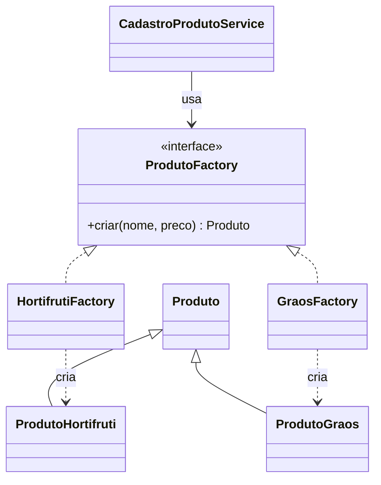

# GOF - Factory Method (Feira Livre)

## Definicao

Factory Method define uma interface para criacao de objetos, permitindo que subclasses ou classes especializadas decidam qual tipo concreto instanciar.

## Problema

No cadastro da feira, produtos de tipos diferentes exigem validacoes diferentes.
Sem padrao, o codigo costuma ficar com varios `if/else` para decidir qual classe criar.

## Solucao

Criar uma fabrica para encapsular a decisao de criacao do objeto correto.

## Diagrama de classes (Mermaid)



## Exemplo

```java
public interface ProdutoFactory {
    Produto criar(String nome, double preco);
}

public class HortifrutiFactory implements ProdutoFactory {
    @Override
    public Produto criar(String nome, double preco) {
        if (preco <= 0) throw new IllegalArgumentException("Preco invalido");
        return new ProdutoHortifruti(nome, preco);
    }
}

public class GraosFactory implements ProdutoFactory {
    @Override
    public Produto criar(String nome, double preco) {
        if (nome == null || nome.isBlank()) throw new IllegalArgumentException("Nome obrigatorio");
        return new ProdutoGraos(nome, preco);
    }
}
```

Uso no servico:

```java
public class CadastroProdutoService {
    private final ProdutoFactory factory;

    public CadastroProdutoService(ProdutoFactory factory) {
        this.factory = factory;
    }

    public Produto cadastrar(String nome, double preco) {
        return factory.criar(nome, preco);
    }
}
```

## Código completo

```java
// ── interfaces e classes de dominio ───────────────────────────────────────

public class Produto {
    private final String nome;
    private final double preco;
    private final String tipo;

    public Produto(String nome, double preco, String tipo) {
        this.nome  = nome;
        this.preco = preco;
        this.tipo  = tipo;
    }

    @Override
    public String toString() {
        return "[" + tipo + "] " + nome + " - R$ " + String.format("%.2f", preco);
    }
}

// ── interface da fabrica ──────────────────────────────────────────────────

public interface ProdutoFactory {
    Produto criar(String nome, double preco);
}

// ── fabricas concretas ───────────────────────────────────────────────────

public class HortifrutiFactory implements ProdutoFactory {
    @Override
    public Produto criar(String nome, double preco) {
        if (preco <= 0) throw new IllegalArgumentException("Preco invalido para hortifruti");
        return new Produto(nome, preco, "HORTIFRUTI");
    }
}

public class GraosFactory implements ProdutoFactory {
    @Override
    public Produto criar(String nome, double preco) {
        if (nome == null || nome.isBlank()) throw new IllegalArgumentException("Nome obrigatorio para graos");
        return new Produto(nome, preco, "GRAOS");
    }
}

public class LaticinioFactory implements ProdutoFactory {
    @Override
    public Produto criar(String nome, double preco) {
        if (preco <= 0) throw new IllegalArgumentException("Preco invalido para laticinios");
        return new Produto(nome, preco, "LATICIONIO");
    }
}

// ── servico que usa a fabrica ─────────────────────────────────────────────

public class CadastroProdutoService {
    private final ProdutoFactory factory;

    public CadastroProdutoService(ProdutoFactory factory) {
        this.factory = factory;
    }

    public Produto cadastrar(String nome, double preco) {
        Produto p = factory.criar(nome, preco);
        System.out.println("Cadastrado: " + p);
        return p;
    }
}

// ── demonstracao ──────────────────────────────────────────────────────────

public class MainFactoryMethod {
    public static void main(String[] args) {
        CadastroProdutoService svcHortifruti = new CadastroProdutoService(new HortifrutiFactory());
        svcHortifruti.cadastrar("Tomate", 4.50);
        svcHortifruti.cadastrar("Alface", 2.00);

        CadastroProdutoService svcGraos = new CadastroProdutoService(new GraosFactory());
        svcGraos.cadastrar("Feijao Carioca", 8.90);

        CadastroProdutoService svcLaticinio = new CadastroProdutoService(new LaticinioFactory());
        svcLaticinio.cadastrar("Queijo Minas", 22.00);
    }
}
```

Saída esperada:

```
Cadastrado: [HORTIFRUTI] Tomate - R$ 4,50
Cadastrado: [HORTIFRUTI] Alface - R$ 2,00
Cadastrado: [GRAOS] Feijao Carioca - R$ 8,90
Cadastrado: [LATICIONIO] Queijo Minas - R$ 22,00
```

## Relacao com GRASP e SOLID

GRASP:

- Creator: ajuda a decidir quem deve criar objetos concretos de produto.
- Protected Variations: isola variacoes de criacao atras da interface `ProdutoFactory`.
- Polymorphism: cada fabrica concreta decide a criacao sem condicional centralizada.

SOLID:

- OCP: novos tipos de produto entram com nova fabrica concreta, sem alterar cliente principal.
- DIP: `CadastroProdutoService` depende da abstracao `ProdutoFactory`, nao de classes concretas.
- SRP: responsabilidade de criacao fica concentrada na fabrica, nao espalhada pelo servico.

## Beneficios

- Remove condicionais de criacao espalhadas.
- Centraliza regras de instanciacao.
- Facilita extensao para novos tipos de produto.

## Riscos e anti-exemplo

Anti-exemplo:

- Criar uma fabrica gigante com `switch` de dezenas de tipos sem separacao por contexto.

Risco:

- Criar muitas classes de fabrica sem necessidade real de variacao.

## Exercicios

1. Criar `LaticinioFactory` com validacao especifica.
2. Refatorar um trecho com `if (tipo.equals(...))` para Factory Method.
3. Escrever um teste para garantir que cada fabrica cria o tipo correto.

## Checklist

- A criacao varia por tipo de produto?
- A regra de criacao esta encapsulada?
- E possivel adicionar novo tipo sem alterar cliente principal?
