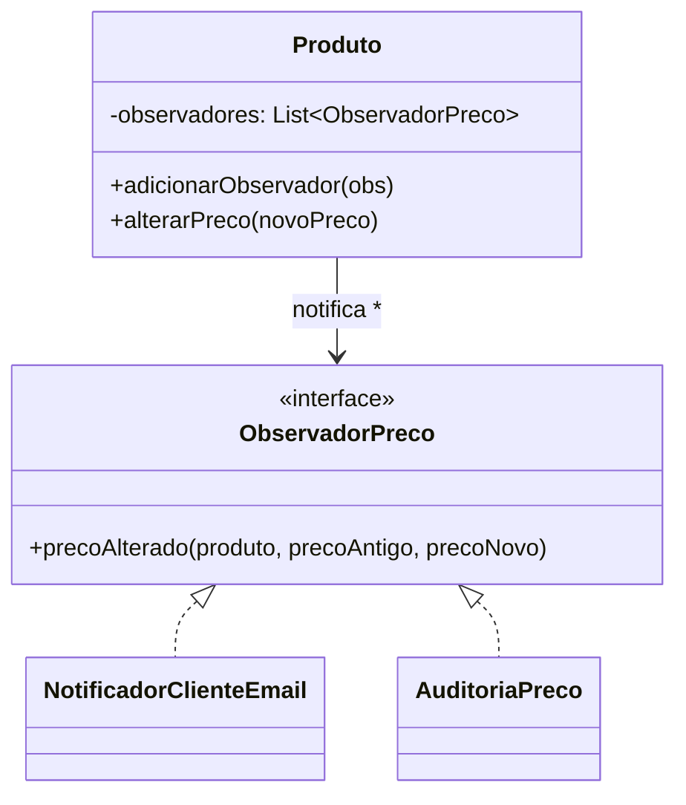

# GOF - Observer (Feira Livre)

## Definicao

Observer define uma dependencia um-para-muitos entre objetos. Quando o objeto observado muda de estado, todos os observadores cadastrados sao notificados.

## Problema

Quando o preco de um produto muda, a feira pode precisar:
- atualizar painel interno
- avisar cliente assinante
- registrar log de auditoria

Sem Observer, o produto passa a depender diretamente de cada destino.

## Solucao

O produto observado dispara eventos para observadores inscritos.

## Diagrama de classes (Mermaid)



## Exemplo

```java
public interface ObservadorPreco {
    void precoAlterado(Produto produto, double precoAntigo, double precoNovo);
}

public class Produto {
    private String nome;
    private double preco;
    private List<ObservadorPreco> observadores = new ArrayList<>();

    public Produto(String nome, double preco) {
        this.nome = nome;
        this.preco = preco;
    }

    public void adicionarObservador(ObservadorPreco observador) {
        observadores.add(observador);
    }

    public void alterarPreco(double novoPreco) {
        double antigo = this.preco;
        this.preco = novoPreco;
        for (ObservadorPreco obs : observadores) {
            obs.precoAlterado(this, antigo, novoPreco);
        }
    }

    public String getNome() { return nome; }
    public double getPreco() { return preco; }
}
```

Observadores concretos:

```java
public class NotificadorClienteEmail implements ObservadorPreco {
    @Override
    public void precoAlterado(Produto produto, double precoAntigo, double precoNovo) {
        System.out.println("Email: preco do produto " + produto.getNome() + " mudou para " + precoNovo);
    }
}

public class AuditoriaPreco implements ObservadorPreco {
    @Override
    public void precoAlterado(Produto produto, double precoAntigo, double precoNovo) {
        System.out.println("Auditoria: " + precoAntigo + " -> " + precoNovo);
    }
}
```

## Código completo

```java
import java.util.ArrayList;
import java.util.List;

// ── interface do observador ───────────────────────────────────────────────

interface ObservadorPreco {
    void precoAlterado(Produto produto, double precoAntigo, double precoNovo);
}

// ── sujeito observado ─────────────────────────────────────────────────────

class Produto {
    private final String nome;
    private double preco;
    private final List<ObservadorPreco> observadores = new ArrayList<>();

    Produto(String nome, double preco) {
        this.nome  = nome;
        this.preco = preco;
    }

    void adicionarObservador(ObservadorPreco obs) { observadores.add(obs); }
    void removerObservador(ObservadorPreco obs)    { observadores.remove(obs); }

    void alterarPreco(double novoPreco) {
        if (novoPreco == this.preco) return; // sem mudanca real, nao notifica
        double antigo = this.preco;
        this.preco    = novoPreco;
        for (ObservadorPreco obs : observadores) {
            obs.precoAlterado(this, antigo, novoPreco);
        }
    }

    String getNome()  { return nome; }
    double getPreco() { return preco; }
}

// ── observadores concretos ────────────────────────────────────────────────

class NotificadorClienteEmail implements ObservadorPreco {
    private final String email;

    NotificadorClienteEmail(String email) { this.email = email; }

    @Override
    public void precoAlterado(Produto p, double antigo, double novo) {
        System.out.printf("[EMAIL -> %s] %s: R$ %.2f -> R$ %.2f%n",
            email, p.getNome(), antigo, novo);
    }
}

class PainelFeira implements ObservadorPreco {
    @Override
    public void precoAlterado(Produto p, double antigo, double novo) {
        String tendencia = novo > antigo ? "↑ SUBIU" : "↓ BAIXOU";
        System.out.printf("[PAINEL] %s %s (era R$ %.2f, agora R$ %.2f)%n",
            p.getNome(), tendencia, antigo, novo);
    }
}

class AuditoriaPreco implements ObservadorPreco {
    @Override
    public void precoAlterado(Produto p, double antigo, double novo) {
        System.out.printf("[AUDITORIA] produto=%s anterior=%.2f novo=%.2f variacao=%.1f%%%n",
            p.getNome(), antigo, novo, ((novo - antigo) / antigo) * 100);
    }
}

// ── demonstracao ──────────────────────────────────────────────────────────

public class MainObserver {
    public static void main(String[] args) {
        Produto tomate = new Produto("Tomate", 4.50);

        ObservadorPreco emailMaria  = new NotificadorClienteEmail("maria@email.com");
        ObservadorPreco painel      = new PainelFeira();
        ObservadorPreco auditoria   = new AuditoriaPreco();

        tomate.adicionarObservador(emailMaria);
        tomate.adicionarObservador(painel);
        tomate.adicionarObservador(auditoria);

        System.out.println("=== Aumento de preco ===");
        tomate.alterarPreco(5.80);

        System.out.println();
        System.out.println("=== Reducao de preco ===");
        tomate.alterarPreco(3.90);

        System.out.println();
        System.out.println("=== Sem mudanca real ===");
        tomate.alterarPreco(3.90); // nao dispara notificacao

        System.out.println();
        System.out.println("=== Sem email (observador removido) ===");
        tomate.removerObservador(emailMaria);
        tomate.alterarPreco(4.20);
    }
}
```

Saída esperada:
```
=== Aumento de preco ===
[EMAIL -> maria@email.com] Tomate: R$ 4,50 -> R$ 5,80
[PAINEL] Tomate ↑ SUBIU (era R$ 4,50, agora R$ 5,80)
[AUDITORIA] produto=Tomate anterior=4,50 novo=5,80 variacao=28,9%

=== Reducao de preco ===
[EMAIL -> maria@email.com] Tomate: R$ 5,80 -> R$ 3,90
[PAINEL] Tomate ↓ BAIXOU (era R$ 5,80, agora R$ 3,90)
[AUDITORIA] produto=Tomate anterior=5,80 novo=3,90 variacao=-32,8%

=== Sem mudanca real ===

=== Sem email (observador removido) ===
[PAINEL] Tomate ↑ SUBIU (era R$ 3,90, agora R$ 4,20)
[AUDITORIA] produto=Tomate anterior=3,90 novo=4,20 variacao=7,7%
```

## Relacao com GRASP e SOLID

GRASP:
- Low Coupling: observado nao depende de implementacoes concretas de notificacao.
- Indirection: interface de observador intermedia origem do evento e consumidores.
- Protected Variations: novos destinos de notificacao entram sem alterar o observado.

SOLID:
- OCP: adicionar novo observador nao exige mudar `Produto`.
- DIP: `Produto` depende da abstracao `ObservadorPreco`.
- SRP: `Produto` gerencia estado e evento; cada observador trata uma acao especifica.

## Beneficios

- Desacopla origem do evento e destinos.
- Facilita adicionar novos consumidores de evento.
- Apoia arquitetura orientada a eventos.

## Riscos e anti-exemplo

Anti-exemplo:
- Observer com efeito colateral oculto em excesso.

Risco:
- Ciclos de notificacao e ordem de execucao nao controlada.

## Exercicios

1. Criar observador de SMS.
2. Implementar remocao de observador.
3. Evitar notificacao quando preco nao muda.

## Checklist

- Ha dependencia um-para-muitos?
- O observado conhece apenas a interface dos observadores?
- O sistema funciona ao adicionar/remover observadores?
