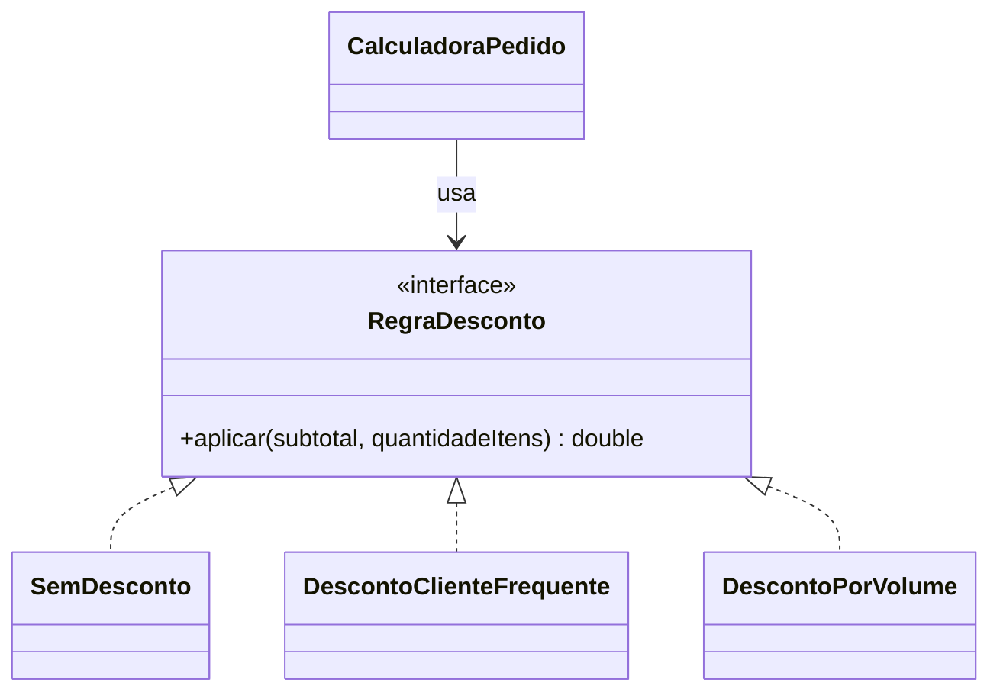

# GOF - Strategy (Feira Livre)

## Definicao

Strategy encapsula algoritmos em classes separadas e permite trocar o comportamento em tempo de execucao.

## Problema

A feira pode ter regras diferentes de desconto:
- desconto por cliente frequente
- desconto por volume de itens
- sem desconto

Sem Strategy, o calculo vira um bloco com muitos `if/else`.

## Anti-exemplo: `if` / `switch`

Exemplo sem `Strategy` (bloco de condicionais):

```java
public double totalComDescontoSemStrategy(double subtotal, int qtd, String tipoDesconto) {
    if ("FREQUENTE".equals(tipoDesconto)) {
        return subtotal * 0.95;
    } else if ("VOLUME".equals(tipoDesconto) && qtd >= 10) {
        return subtotal * 0.90;
    } else if ("FIM_SEMANA".equals(tipoDesconto)) {
        return subtotal * 0.85;
    } else {
        return subtotal;
    }
}
```

Problemas: cresce com novas regras, difícil de testar e manter; viola o princípio Open/Closed (OCP).

## Solucao

Definir uma interface de estrategia e implementacoes para cada regra.

## Diagrama de classes (Mermaid)



## Exemplo

```java
public interface RegraDesconto {
    double aplicar(double subtotal, int quantidadeItens);
}

public class SemDesconto implements RegraDesconto {
    @Override
    public double aplicar(double subtotal, int quantidadeItens) {
        return subtotal;
    }
}

public class DescontoClienteFrequente implements RegraDesconto {
    @Override
    public double aplicar(double subtotal, int quantidadeItens) {
        return subtotal * 0.95;
    }
}

public class DescontoPorVolume implements RegraDesconto {
    @Override
    public double aplicar(double subtotal, int quantidadeItens) {
        return quantidadeItens >= 10 ? subtotal * 0.90 : subtotal;
    }
}
```

Contexto:

```java
public class CalculadoraPedido {
    private RegraDesconto regraDesconto;

    public CalculadoraPedido(RegraDesconto regraDesconto) {
        this.regraDesconto = regraDesconto;
    }

    public void trocarRegra(RegraDesconto novaRegra) {
        this.regraDesconto = novaRegra;
    }

    public double totalComDesconto(double subtotal, int qtdItens) {
        return regraDesconto.aplicar(subtotal, qtdItens);
    }
}
```

## Código completo

```java
// ── interface de estrategia ───────────────────────────────────────────────

interface RegraDesconto {
    double aplicar(double subtotal, int quantidadeItens);
    String descricao();
}

// ── estrategias concretas ─────────────────────────────────────────────────

class SemDesconto implements RegraDesconto {
    @Override
    public double aplicar(double subtotal, int qtd) { return subtotal; }
    @Override
    public String descricao() { return "Sem desconto"; }
}

class DescontoClienteFrequente implements RegraDesconto {
    @Override
    public double aplicar(double subtotal, int qtd) { return subtotal * 0.95; }
    @Override
    public String descricao() { return "Cliente frequente (5%)"; }
}

class DescontoPorVolume implements RegraDesconto {
    @Override
    public double aplicar(double subtotal, int qtd) {
        return qtd >= 10 ? subtotal * 0.90 : subtotal;
    }
    @Override
    public String descricao() {
        return "Volume (10% a partir de 10 itens)";
    }
}

class DescontoFeiraFimDeSemana implements RegraDesconto {
    @Override
    public double aplicar(double subtotal, int qtd) { return subtotal * 0.85; }
    @Override
    public String descricao() { return "Feira fim de semana (15%)"; }
}

// ── contexto ──────────────────────────────────────────────────────────────

class CalculadoraPedido {
    private RegraDesconto regraDesconto;

    CalculadoraPedido(RegraDesconto regraDesconto) {
        this.regraDesconto = regraDesconto;
    }

    void trocarRegra(RegraDesconto novaRegra) {
        this.regraDesconto = novaRegra;
    }

    double totalComDesconto(double subtotal, int qtdItens) {
        return regraDesconto.aplicar(subtotal, qtdItens);
    }

    String descricaoRegra() { return regraDesconto.descricao(); }
}

// ── demonstracao ──────────────────────────────────────────────────────────

public class MainStrategy {

    static void calcular(CalculadoraPedido calc, double subtotal, int qtd) {
        double total = calc.totalComDesconto(subtotal, qtd);
        System.out.printf("Regra: %-35s | Itens: %2d | Subtotal: R$ %7.2f | Total: R$ %7.2f%n",
            calc.descricaoRegra(), qtd, subtotal, total);
    }

    public static void main(String[] args) {
        double subtotal = 120.00;

        CalculadoraPedido calc = new CalculadoraPedido(new SemDesconto());
        calcular(calc, subtotal, 5);

        calc.trocarRegra(new DescontoClienteFrequente());
        calcular(calc, subtotal, 5);

        calc.trocarRegra(new DescontoPorVolume());
        calcular(calc, subtotal, 5);   // abaixo do minimo
        calcular(calc, subtotal, 12);  // acima do minimo

        calc.trocarRegra(new DescontoFeiraFimDeSemana());
        calcular(calc, subtotal, 3);
    }
}
```

Saída esperada:
```
Regra: Sem desconto                      | Itens:  5 | Subtotal: R$  120,00 | Total: R$  120,00
Regra: Cliente frequente (5%)            | Itens:  5 | Subtotal: R$  120,00 | Total: R$  114,00
Regra: Volume (10% a partir de 10 itens) | Itens:  5 | Subtotal: R$  120,00 | Total: R$  120,00
Regra: Volume (10% a partir de 10 itens) | Itens: 12 | Subtotal: R$  120,00 | Total: R$  108,00
Regra: Feira fim de semana (15%)         | Itens:  3 | Subtotal: R$  120,00 | Total: R$  102,00
```

## Relacao com GRASP e SOLID

GRASP:
- Polymorphism: variacoes de regra sao tratadas por classes concretas da mesma interface.
- Protected Variations: mudancas em algoritmos de desconto ficam isoladas nas estrategias.
- High Cohesion: cada classe de estrategia implementa uma regra de negocio especifica.

SOLID:
- OCP: novas regras entram como novas estrategias.
- DIP: contexto depende de `RegraDesconto`, nao de implementacoes concretas.
- SRP: contexto calcula fluxo; estrategia calcula regra.

## Beneficios

- Remove condicionais complexas.
- Facilita testes por estrategia.
- Permite evoluir regras de negocio sem alterar o contexto.

## Riscos e anti-exemplo

Anti-exemplo:
- Contexto que conhece detalhes internos de todas as estrategias.

Risco:
- Criar estrategia para regra que nunca muda.

## Exercicios

1. Implementar `DescontoFeiraFimDeSemana`.
2. Carregar estrategia com base em configuracao.
3. Criar testes para cada estrategia isoladamente.

## Checklist

- Existem variacoes reais de algoritmo?
- O contexto depende apenas da interface?
- Novas regras entram sem editar as classes antigas?
