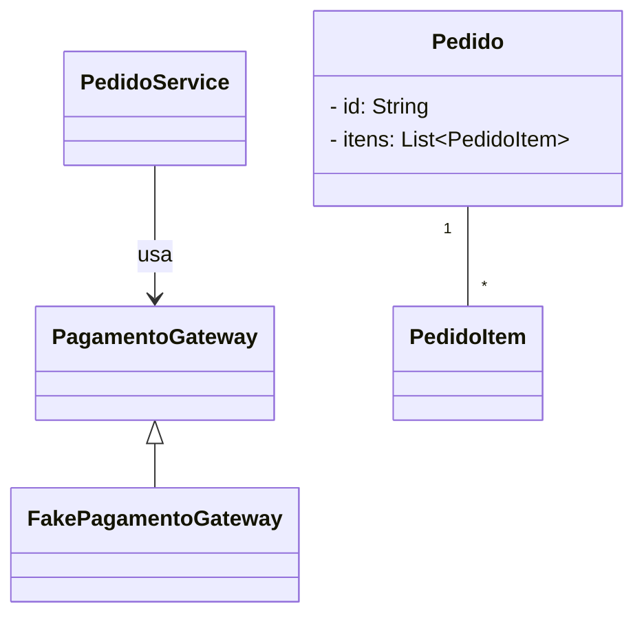
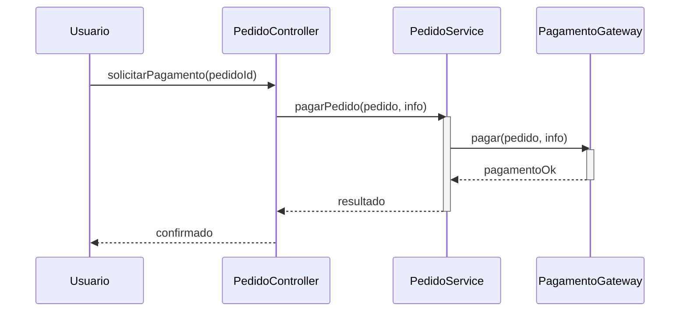

# Indirection

**Definição**: colocar um objeto intermediário para mediar entre duas entidades, reduzindo acoplamento e responsabilidades diretas.

**Problema**: Como evitar o acoplamento direto entre dois ou mais elementos?

**Solução**: Atribua a responsabilidade de mediação a um objeto intermediário.

Quando usar:

- Para interpor dependências entre módulos que não devem conhecer detalhes um do outro
- Para reduzir dependências cíclicas

Exemplo: um `Gateway` entre serviço de pagamentos e domínio para isolar API externa.

Relação com SOLID

- **DIP:** indirection ajuda a depender de abstrações e isolar mudanças em implementações específicas.
- **OCP:** ao interpor intermediários, você protege partes do sistema contra mudanças externas.

## Exemplo evolutivo (Feira Livre)


Se decidirmos integrar múltiplos serviços de pagamento, inserimos um `PagamentoGateway` que faz indirection entre `PedidoService` e provedores externos. Assim, `PedidoService` não conhece detalhes das APIs externas.

Trecho ilustrativo (interface):

```java
public interface PagamentoGateway { boolean pagar(Pedido p, PagamentoInfo info); }
```

Referência: padrão Indirection protege o domínio das variações de provedores.

Exemplos de código

1) `PagamentoGateway` — interface que isola provedores externos

```java
package feira.grasp.payment;

import feira.grasp.Pedido;

public interface PagamentoGateway {
	boolean pagar(Pedido pedido, PagamentoInfo info);
}
```

2) `PagamentoInfo` — pequeno DTO com dados de pagamento

```java
package feira.grasp.payment;

public class PagamentoInfo {
	private final String metodo;
	private final String referencia;

	public PagamentoInfo(String metodo, String referencia) {
		this.metodo = metodo;
		this.referencia = referencia;
	}

	public String getMetodo() { return metodo; }
	public String getReferencia() { return referencia; }
}
```

3) Adapter de um provedor (exemplo simplificado)

```java
package feira.grasp.payment;

import feira.grasp.Pedido;

public class FakePagamentoGateway implements PagamentoGateway {
	@Override
	public boolean pagar(Pedido pedido, PagamentoInfo info) {
		// implementação de teste: sempre aprova
		System.out.println("[FakePagamento] processando pagamento: " + info.getMetodo());
		return true;
	}
}
```

4) Uso em `PedidoService` — indirection: `PedidoService` depende da abstração `PagamentoGateway`

```java
// dentro de PedidoService
private final PagamentoGateway pagamentoGateway;

public PedidoService(PagamentoGateway pagamentoGateway) {
	this.pagamentoGateway = pagamentoGateway;
}

public boolean pagarPedido(Pedido pedido, PagamentoInfo info) {
	return pagamentoGateway.pagar(pedido, info);
}
```

Diagramas

1) Diagrama de classes — interface `PagamentoGateway` e adaptadores:



Arquivo externo para edição: `diagrams/indirection-class.mmd`.

2) Diagrama de sequência — fluxo de pagamento via indirection:



Arquivo externo para edição: `diagrams/indirection-sequence.mmd`.

Notas pedagógicas

- Explique que a interface `PagamentoGateway` é a abstração que permite inserir/adaptar múltiplos provedores sem alterar `PedidoService`.
- Mostre variações: adaptadores para Stripe, PayPal, ou mocks de teste — todos implementam a mesma interface.
