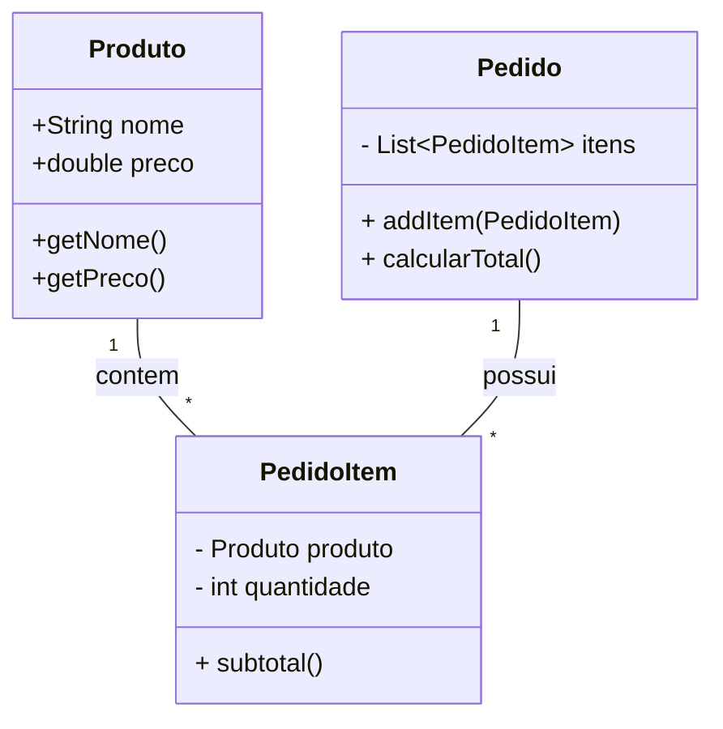
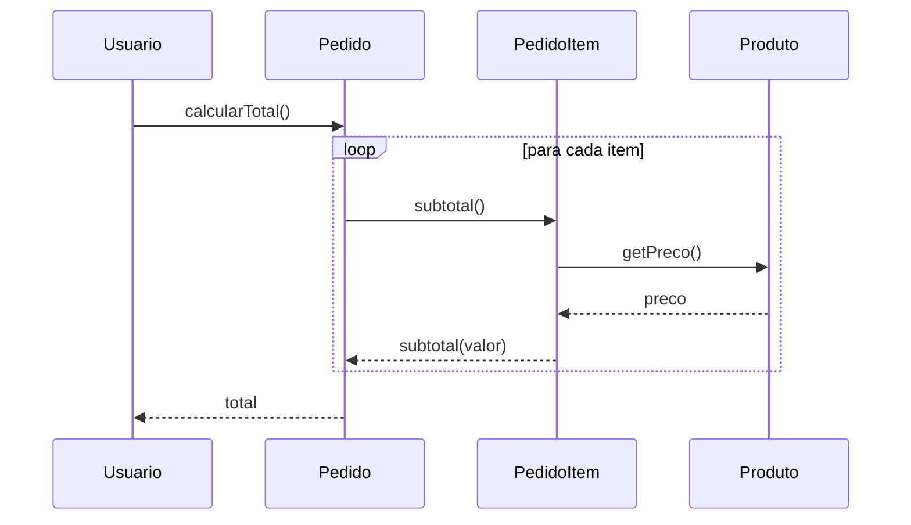

# Information Expert

Definição: atribuir responsabilidade à classe que possui a informação necessária para cumpri-la.

* **Problema:** Qual é o princípio básico para atribuir responsabilidades aos objetos?
* **Solução:** Atribua a responsabilidade à classe que possui a informação necessária para cumpri-la.

Quando aplicar:

- A classe já contém (ou pode acessar facilmente) os dados necessários.
- Evitar mover dados entre classes apenas para cumprir uma responsabilidade.

Exemplo: em um pedido, o cálculo do total é responsabilidade do `Pedido`, porque ele conhece seus itens.

Dicas:

- Prefira colocar comportamento onde estão os dados.
- Use com moderação quando violações de encapsulamento surgirem.

Relação com SOLID

- **SRP (Single Responsibility):** colocar comportamento no `Information Expert` ajuda a manter responsabilidades únicas em classes.
- **OCP (Open/Closed):** ao manter lógica relacionada aos dados na mesma classe, você facilita estender comportamento sem alterar outras classes.

## Exemplo evolutivo (Feira Livre)

No nosso exemplo, o método `calcularTotal()` permanece em `Pedido` — um caso clássico de `Information Expert`. À medida que adicionamos lógica (ex.: desconto por item), comece mantendo o cálculo no `Pedido` e extraia políticas (por exemplo, estratégias de desconto) quando crescer a complexidade.

Referência de código: `src/feira/grasp/Pedido.java` contém a responsabilidade de calcular o total.

Diagramas (Information Expert)

1) Diagrama de classes — mostra onde a responsabilidade de cálculo está localizada:

Arquivo externo para edição: `diagrams/info-expert-class.mmd`.

2) Diagrama de sequência — fluxo do cálculo do total:

Arquivo externo para edição: `diagrams/info-expert-sequence.mmd`.

