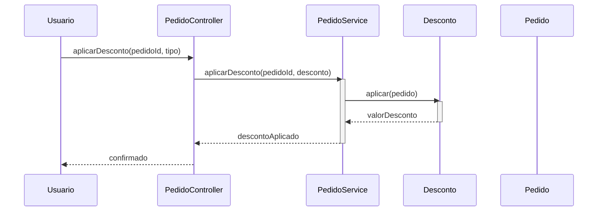

# Polymorphism

**Definição**: usar polimorfismo em vez de condicionais para variar comportamento com base no tipo de objeto.

**Problema**: Como tratar comportamentos que variam conforme o tipo sem usar ramificações explícitas (if/switch)?

**Solução**: Atribua o comportamento variável ao tipo para o qual a variação ocorre, utilizando operações polimórficas

Quando aplicar:

- Quando o comportamento varia por tipo e você quer evitar `if/else` espalhados.

Exemplo: diferentes estratégias de desconto implementando uma interface `Desconto`.

Relação com SOLID

- **OCP:** polimorfismo permite estender comportamentos (novas estratégias) sem modificar o código cliente.
- **LSP:** ao usar hierarquias de tipos, garanta que substituições não quebrem contratos esperados.

## Exemplo evolutivo (Feira Livre)

Quando o cálculo de preço começa a variar (descontos por fidelidade, promoções), extraimos uma interface `Desconto` e criamos implementações:

```java
public interface Desconto { double aplicar(Pedido p); }
public class DescontoClienteFiel implements Desconto { /* ... */ }
```

`Pedido` pode aceitar uma política de desconto externa, aplicando polimorfismo em vez de `if/else`.

Trechos de código (exemplos simples)

1) `Desconto` — interface e implementações:

```java
public interface Desconto {
    double aplicar(Pedido pedido);
}

public class DescontoClienteFiel implements Desconto {
    @Override
    public double aplicar(Pedido pedido) {
        // exemplo simples: 10% de desconto
        return pedido.calcularTotal() * 0.10;
    }
}

public class DescontoPromocional implements Desconto {
    private final double taxa;
    public DescontoPromocional(double taxa) { this.taxa = taxa; }
    @Override
    public double aplicar(Pedido pedido) { return pedido.calcularTotal() * taxa; }
}
```

2) `Pedido` aceita uma política de desconto externa:

```java
public class Pedido {
    private final List<PedidoItem> itens = new ArrayList<>();
    private Desconto desconto;

    public void setDesconto(Desconto desconto) { this.desconto = desconto; }

    public double calcularTotalComDesconto() {
        double total = calcularTotal();
        if (desconto != null) {
            return total - desconto.aplicar(this);
        }
        return total;
    }
}
```

Diagramas (Polymorphism)

1) Diagrama de classes — mostra a interface `Desconto` e suas implementações, além da associação com `Pedido`:

```mermaid
classDiagram
  class Desconto {
    <<interface>>
    +aplicar(Pedido pedido) double
  }

  class DescontoClienteFiel {
    +aplicar(Pedido pedido) double
  }

  class DescontoPromocional {
    +aplicar(Pedido pedido) double
  }

  class Pedido {
    -List~PedidoItem~ itens
    -Desconto desconto
    +setDesconto(Desconto d)
    +calcularTotal() double
  }

    class PedidoItem {
        -String produto
        -double preco
    }

  Desconto <|.. DescontoClienteFiel
  Desconto <|.. DescontoPromocional
  Pedido o-- Desconto : composição/estratégia
    Pedido "1" *-- "1..*" PedidoItem : contém
```



Arquivo externo para edição: `diagrams/polymorphism-class-clean.mmd`.

2) Diagrama de sequência — fluxo de aplicação de desconto via estratégia:



Arquivo externo para edição: `diagrams/polymorphism-sequence.mmd`.

