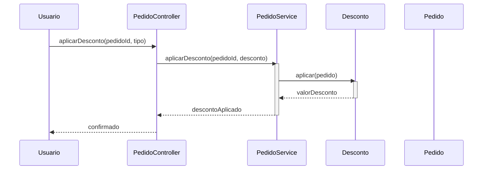

# Polymorphism

**Definição**: usar polimorfismo em vez de condicionais para variar comportamento com base no tipo de objeto.

**Problema**: Como tratar comportamentos que variam conforme o tipo sem usar ramificações explícitas (if/switch)?

**Solução**: Atribua o comportamento variável ao tipo para o qual a variação ocorre, utilizando operações polimórficas

Quando aplicar:

- Quando o comportamento varia por tipo e você quer evitar `if/else` espalhados.

Exemplo: diferentes estratégias de desconto implementando uma interface `Desconto`.

Relação com SOLID

- **OCP:** polimorfismo permite estender comportamentos (novas estratégias) sem modificar o código cliente.
- **LSP:** ao usar hierarquias de tipos, garanta que substituições não quebrem contratos esperados.

## Exemplo evolutivo (Feira Livre)

Quando o cálculo de preço começa a variar (descontos por fidelidade, promoções), extraimos uma interface `Desconto` e criamos implementações:

```java
public interface Desconto { double aplicar(Pedido p); }
public class DescontoClienteFiel implements Desconto { /* ... */ }
```

`Pedido` pode aceitar uma política de desconto externa, aplicando polimorfismo em vez de `if/else`.

Trechos de código (exemplos simples)

1) `Desconto` — interface e implementações:

```java
public interface Desconto {
		double aplicar(Pedido pedido);
}

public class DescontoClienteFiel implements Desconto {
		@Override
		public double aplicar(Pedido pedido) {
				// exemplo simples: 10% de desconto
				return pedido.calcularTotal() * 0.10;
		}
}

public class DescontoPromocional implements Desconto {
		private final double taxa;
		public DescontoPromocional(double taxa) { this.taxa = taxa; }
		@Override
		public double aplicar(Pedido pedido) { return pedido.calcularTotal() * taxa; }
}
```

2) `Pedido` aceita uma política de desconto externa:

```java
public class Pedido {
		private final List<PedidoItem> itens = new ArrayList<>();
		private Desconto desconto;

		public void setDesconto(Desconto desconto) { this.desconto = desconto; }

		public double calcularTotalComDesconto() {
				double total = calcularTotal();
				if (desconto != null) {
						return total - desconto.aplicar(this);
				}
				return total;
		}
}
```

Diagramas (Polymorphism)

1) Diagrama de classes — mostra a interface `Desconto` e suas implementações, além da associação com `Pedido`:


Arquivo externo para edição: `diagrams/polymorphism-class-clean.mmd`.

2) Diagrama de sequência — fluxo de aplicação de desconto via estratégia:



Arquivo externo para edição: `diagrams/polymorphism-sequence.mmd`.
