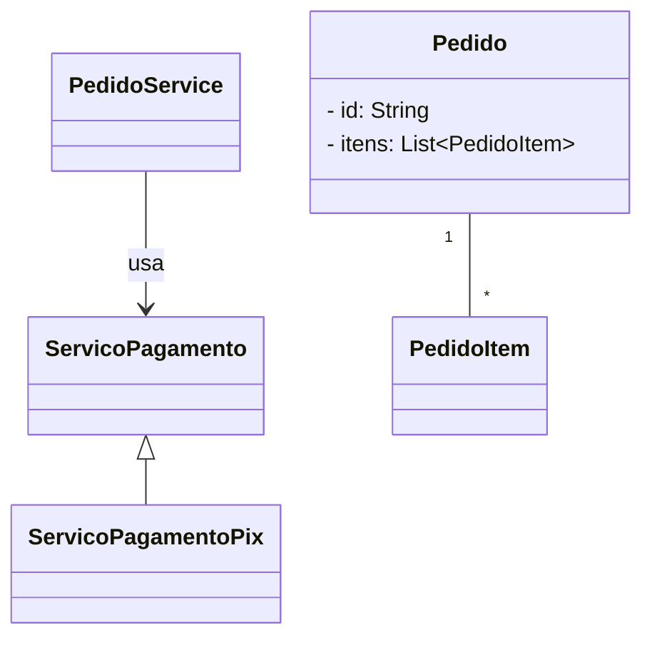
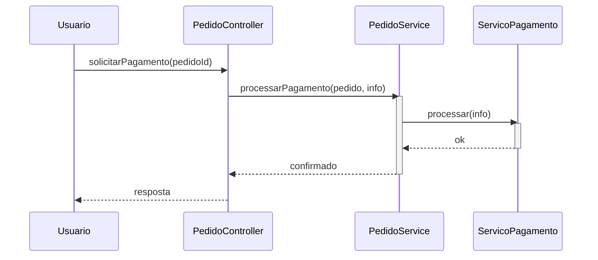

# Protected Variations

**Definição**: proteger elementos de um sistema contra variações previstas, definindo pontos de estabilidade (interfaces, abstracções).

**Problema**: Como proteger o sistema de instabilidades em elementos externos ou mutáveis?

**Solução**: Identifique pontos de variação previsíveis e envolva-os com uma interface estável, usando o Polimorfismo para as implementações.

Estratégia:

- Encapsular variações atrás de interfaces
- Usar indirection e pure fabrication para isolar mudanças

Exemplo: definir uma interface `ServicoPagamento` para isolar diferentes implementações (Pix, Cartão, Boleto).

Relação com SOLID

- **DIP:** proteger variações frequentemente é feito invertendo dependências e programando para abstrações.
- **OCP:** encapsular variações atrás de interfaces permite estender comportamentos sem modificar código cliente.

## Exemplo evolutivo (Feira Livre)

Ao aplicar `Protected Variations` no domínio da feira, definimos uma interface `ServicoPagamento` e implementações concretas para cada método de pagamento. O `PedidoService` depende da abstração, protegendo-se de mudanças nas implementações.

Trecho ilustrativo:

```java
public interface ServicoPagamento { boolean processar(PagamentoInfo info); }
public class ServicoPagamentoPix implements ServicoPagamento { /* ... */ }
```

Referência: este padrão trabalha bem com `Indirection` e `Pure Fabrication`.

Exemplos de código

1) `ServicoPagamento` — interface estável para proteger variações:

```java
package feira.grasp.payment;

import feira.grasp.payment.PagamentoInfo;

public interface ServicoPagamento {
		boolean processar(PagamentoInfo info);
}
```

2) Implementação para Pix (exemplo simplificado):

```java
package feira.grasp.payment;

public class ServicoPagamentoPix implements ServicoPagamento {
		@Override
		public boolean processar(PagamentoInfo info) {
				// implementação simplificada: simula chamada ao provedor Pix
				System.out.println("[Pix] processando pagamento: " + info.getReferencia());
				return true;
		}
}
```

3) Uso no `PedidoService` — protegendo variações:

```java
// dentro de PedidoService
private final ServicoPagamento servicoPagamento;

public PedidoService(ServicoPagamento servicoPagamento) {
		this.servicoPagamento = servicoPagamento;
}

public boolean processarPagamento(Pedido pedido, PagamentoInfo info) {
		return servicoPagamento.processar(info);
}
```

Diagramas

1) Diagrama de classes — `ServicoPagamento` e implementações:



Arquivo externo para edição: `diagrams/protected-variations-class.mmd`.

2) Diagrama de sequência — fluxo de processamento via `ServicoPagamento`:



Arquivo externo para edição: `diagrams/protected-variations-sequence.mmd`.

Notas pedagógicas

- Mostre como trocar implementações (Pix, Cartão, Boleto) sem alterar `PedidoService`.
- Explique que `ServicoPagamento` é um ponto de estabilidade (protected variation) que deve permanecer estável.
