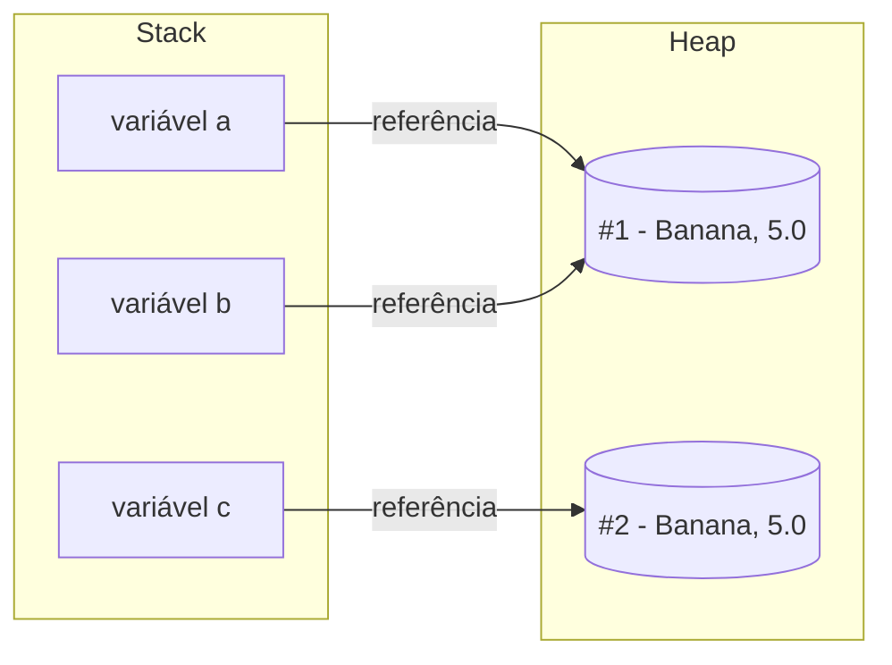
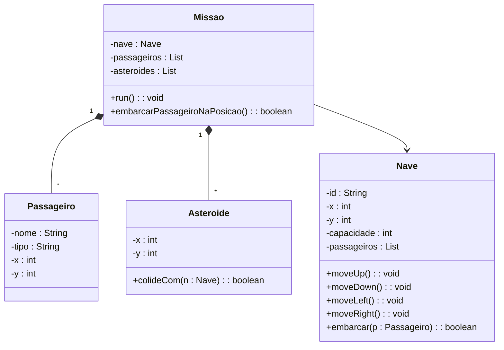
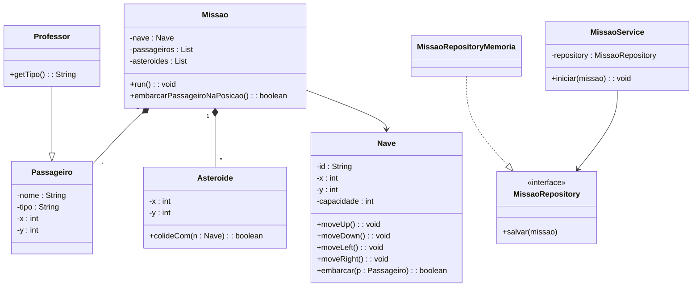
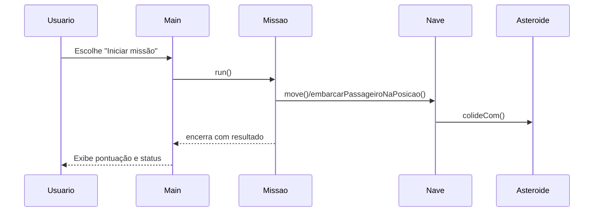

# Apostila – Orientação a Objetos em Java


**Disciplina:** Projeto e Arquitetura de Sistemas
**Objetivo:** Fornecer base conceitual sólida de Orientação a Objetos (OO) e introduzir o projeto “Missão Marte Unifor”, destacando as características de OO aplicadas ao domínio (encapsulamento, abstração, composição, herança e polimorfismo), além de acoplamento e coesão como fundamentos da arquitetura de software.

---

## 1. Introdução à Orientação a Objetos

A Orientação a Objetos (OO) é um paradigma de programação baseado na ideia de representar sistemas por meio de **objetos**, que são entidades que possuem **estado** (dados) e **comportamento** (operações).

Diferente da programação procedural, onde o foco está em funções e processos, na OO o foco está em **modelar o domínio do problema** por meio de classes e objetos.

### Por que usar OO?

- Facilita a modelagem de problemas complexos
- Estimula reutilização de código
- Favorece manutenção e evolução
- Base para arquiteturas modernas

---

## 2. Classe, Objeto e Referência

- **Classe:** é um molde (blueprint) que define as características de um tipo de objeto.
- **Objeto:** é uma instância concreta de uma classe.
- **Referência:** o “endereço”/ponteiro lógico que aponta para um objeto.

Exemplo conceitual (domínio do jogo Missão Marte):

- Classe: `Nave`
- Objetos: A-1, B-2, C-3
- Referência: naveA, naveB, naveC

Em Java:

```java
public class Nave {
    private String id;
    private int x;
    private int y;
}
```

Exemplo de criação de objetos (instanciação):

```java
public class Nave {
    private String id;
    private int x;
    private int y;

    public Nave(String id) {
        this.id = id;
        this.x = 0;
        this.y = 0;
    }

    public String getId() {
        return id;
    }

    public int getX() {
        return x;
    }

    public int getY() {
        return y;
    }
}

// Criando objetos (instâncias) da classe Nave
Nave naveA = new Nave("A-1");
Nave naveB = naveA;
Nave naveC = new Nave("B-2");

System.out.println(naveA == naveB); // true (mesmo objeto)
```

### Referência em Java (JDK 21)

- **Objeto:** entidade alocada no heap com estado e comportamento.
- **Referência:** o “endereço”/ponteiro lógico que aponta para um objeto.
  - Variáveis em Java guardam **referências**, não os objetos em si.
  - Atribuição copia a referência (duas variáveis podem apontar para o mesmo objeto).
- **`null`:** ausência de referência; acessar membros com `null` causa `NullPointerException`.
- **Comparações:**
  - `==` compara se duas referências apontam para o **mesmo** objeto.
  - `equals()` compara **conteúdo/igualdade lógica** (se a classe sobrescrever adequadamente).
- **Parâmetros em métodos:** Java é sempre “pass-by-value”; o **valor passado é a referência**. Assim, o método pode alterar o estado do objeto referenciado, mas **reapontar** a referência local não muda a referência do chamador.

Exemplo ilustrativo:

```java

Nave a = new Nave("A-1");
Nave b = a;              // b recebe a MESMA referência de a

System.out.println(a == b); // true (mesmo objeto)

// Alterar via b reflete em a, pois é o mesmo objeto
// (supondo um moveRight válido)
// b.moveRight();
// System.out.println(a.getX()); // 1

// equals() pode ser diferente de == caso a classe compare conteúdo
Nave c = new Nave("B-2");
System.out.println(a == c);      // false (referências diferentes)
System.out.println(a.equals(c)); // true/false depende da implementação de equals()

// Parâmetro: valor passado é a referência
ajustarCoordenada(a);

void ajustarCoordenada(Nave n) {
        // n referencia o MESMO objeto que a
        // n.moveRight(); // afeta o objeto compartilhado

        // n = new Nave("C-3"); // reatribuir n NÃO muda a referência do chamador
}
```

#### Diagrama: Stack vs Heap e Referências



Este diagrama mostra que variáveis (`a`, `b`, `c`) guardam **referências** na pilha (Stack), enquanto os **objetos** vivem no Heap. Quando duas variáveis apontam para o mesmo nó no Heap, operações via qualquer uma delas afetam o mesmo objeto.

Veja também a demonstração interativa: [animacao-java-referencias/index.html](animacao-java-referencias/index.html).

---

## 3. Estrutura de uma Classe em Java

Uma classe em Java normalmente contém:

- Atributos (campos)
- Construtores
- Métodos

Exemplo:

```java
public class Nave {
    private String id;
    private int x;
    private int y;

    public Nave(String id) {
        this.id = id;
        this.x = 0;
        this.y = 0;
    }

    public String getId() {
        return id;
    }

    public int getX() {
        return x;
    }

    public int getY() {
        return y;
    }
}
```

---

## 4. Encapsulamento

Encapsulamento é o princípio de **ocultar os detalhes internos** de uma classe e expor apenas o que é necessário.

Em Java, isso é feito por meio dos modificadores de acesso:

- `private`
- `protected`
- `public`

Benefícios:

- Reduz acoplamento
- Aumenta segurança
- Facilita manutenção

Exemplo em Java (encapsulamento com validação):

```java
public class Nave {
    private String id;
    private int capacidade;

    public Nave(String id, int capacidade) {
        this.id = id;
        setCapacidade(capacidade);
    }

    public String getId() {
        return id;
    }

    public int getCapacidade() {
        return capacidade;
    }

    public void setCapacidade(int capacidade) {
        if (capacidade < 0) {
            throw new IllegalArgumentException("Capacidade não pode ser negativa");
        }
        this.capacidade = capacidade;
    }

    public boolean podeEmbarcar(int passageirosAtuais) {
        return passageirosAtuais < capacidade;
    }
}
```

---

## 5. Abstração

Abstração consiste em **focar no essencial** e ignorar detalhes irrelevantes para o contexto.

Exemplo:

- Uma `Nave` tem id e posição
- Não importa como a movimentação é calculada internamente

A abstração permite trabalhar com **modelos conceituais**, não com detalhes de implementação.

---

## 6. Herança

Herança é um mecanismo que permite que uma classe herde características de outra.

Exemplo:

```java
public class Professor extends Passageiro {
    public Professor(String nome, int x, int y) {
        super(nome, "Professor", x, y);
    }
}
```

A herança representa a relação **"é um"**.

⚠️ Cuidado: herança em excesso gera sistemas rígidos e difíceis de manter.

---

## 7. Polimorfismo

Polimorfismo permite que objetos diferentes respondam à mesma mensagem de formas distintas.

```java
public class Professor extends Passageiro {
    public Professor(String nome, int x, int y) {
        super(nome, "Professor", x, y);
    }

    @Override
    public String getTipo() {
        return "Professor";
    }
}

// Polimorfismo em ação
Passageiro p = new Professor("Dr. Silva", 0, 0);
System.out.println(p.getTipo()); // Usa o getTipo() da subclasse
```

O comportamento real depende do tipo concreto do objeto em tempo de execução.

---

## 8. Interfaces

Interfaces definem **contratos** que classes devem cumprir.

```java
public interface Calculavel {
    double calcular();
}
```

Elas são fundamentais para:

- Baixo acoplamento
- Inversão de dependência
- Arquiteturas flexíveis

Exemplo de redução de acoplamento com interfaces:

```java
public interface MissaoRepository {
    void salvar(Missao missao);
}

public class MissaoRepositoryMemoria implements MissaoRepository {
    @Override
    public void salvar(Missao missao) {
        // Implementação concreta em memória
    }
}

public class MissaoService {
    private final MissaoRepository repository;

    public MissaoService(MissaoRepository repository) {
        this.repository = repository; // Depende de uma abstração
    }

    public void iniciar(Missao missao) {
        // Regras de negócio
        repository.salvar(missao);
    }
}
```

---

## 9. Composição vs Herança

- **Herança:** relação "é um"
- **Composição:** relação "tem um"

Boa prática:

> Preferir composição à herança.

A composição gera sistemas mais flexíveis e evolutivos.

---

## 10. Acoplamento e Coesão

### Acoplamento

Acoplamento representa o **nível de dependência entre classes ou módulos** de um sistema.

- **Alto acoplamento:** muitas dependências diretas, mudanças se propagam facilmente.
- **Baixo acoplamento:** poucas dependências, módulos mais independentes.

Exemplo (jogo):

- Um `MissaoService` que depende diretamente de `MissaoRepositoryMemoria` → alto acoplamento.
- Um `MissaoService` que depende de uma interface `MissaoRepository` → baixo acoplamento.

Benefícios do baixo acoplamento:

- Facilita manutenção
- Facilita testes
- Permite evolução da arquitetura

---

### Coesão

Coesão representa o **grau de relacionamento entre as responsabilidades de uma classe**.

- **Alta coesão:** classe tem responsabilidades bem definidas e relacionadas.
- **Baixa coesão:** classe faz muitas coisas diferentes e sem relação clara.

Exemplo (jogo):

- Classe `Missao` apenas com regras de missão → alta coesão.
- Classe `SistemaMissao` com login, controle de nave, relatório e pontuação → baixa coesão.

Benefícios da alta coesão:

- Código mais legível
- Menor complexidade
- Melhor reutilização

---

### Relação entre Acoplamento e Coesão

Boa arquitetura busca sempre:

> **Baixo acoplamento + Alta coesão**

Esses dois conceitos são a **base estrutural de uma boa Arquitetura de Software**.

---

## 11. Erros Comuns em OO

- Classes Deus (muitas responsabilidades)
- Muitos getters/setters sem comportamento
- Herança excessiva
- Falta de encapsulamento

Esses erros impactam diretamente a arquitetura do sistema.

---

## 12. OO aplicada ao Projeto Missão Marte

#### Diagrama de Classes – Entidades (Missão Marte)

Representação das principais entidades de domínio: `Nave`, `Passageiro`, `Asteroide` e `Missao`.



Nesta seção, destacamos como as características de OO aparecem no projeto console “Missão Marte”.

### Encapsulamento

- `Nave` concentra dados e validações (ex.: capacidade não negativa).
- Regras específicas (ex.: embarque de passageiros) ficam dentro da classe responsável.
- Referência: [missaoMarteUnifor/oo-console/src/missao/Nave.java](missaoMarteUnifor/oo-console/src/missao/Nave.java)

### Abstração

- Classes expõem operações essenciais ao domínio, como `moveUp()` e `embarcarPassageiroNaPosicao()`.
- O cálculo interno é ocultado, fornecendo uma interface simples de uso.
- Referência: [missaoMarteUnifor/oo-console/src/missao/Missao.java](missaoMarteUnifor/oo-console/src/missao/Missao.java)

### Composição

- `Missao` agrega `Nave`, `Passageiro` e `Asteroide`.
- Cada `Missao` coordena várias entidades para cumprir o objetivo.
- Referência: [missaoMarteUnifor/oo-console/src/missao/Missao.java](missaoMarteUnifor/oo-console/src/missao/Missao.java)

### Herança e Polimorfismo

- Subtipos podem especializar comportamento, como `Professor` estendendo `Passageiro`.
- O código usa o tipo base (`Passageiro`) e o comportamento concreto é escolhido em tempo de execução.
- Referência: [missaoMarteUnifor/oo-console/src/missao/Professor.java](missaoMarteUnifor/oo-console/src/missao/Professor.java)

### Coesão e Acoplamento

- Alta coesão: `Missao` gerencia passageiros e asteroides; `Nave` gerencia movimentação.
- Baixo acoplamento: `MissaoService` depende de um contrato (`MissaoRepository`) para persistência.
- Referência: [missaoMarteUnifor/oo-console/src/missao/Main.java](missaoMarteUnifor/oo-console/src/missao/Main.java)

### Fluxo de Finalização

- `Main` aciona `Missao` para iniciar o jogo.
- `Missao` monitora a `Nave`, verifica colisões e permite embarque.
- O resultado é exibido ao usuário.

## 13. OO e Arquitetura de Software

A OO é a base estrutural da arquitetura:

- Classes → componentes
- Objetos → serviços
- Interfaces → contratos arquiteturais

A qualidade da arquitetura depende da qualidade da modelagem OO.

---


## 14. UML Essencial – Notação e Dicas


A UML (Unified Modeling Language – Linguagem de Modelagem Unificada) é um conjunto de notações para representar sistemas de forma padronizada. Ela complementa OO e arquitetura, ajudando a comunicar modelos e decisões.

### Diagramas mais úteis na disciplina

- Diagrama de Classes: estrutura estática (classes, atributos, métodos, relacionamentos).
- Diagrama de Sequência: interação temporal entre objetos (mensagens e ordem).
- Casos de Uso: visão funcional (atores e objetivos do sistema).

### Notações essenciais (Diagrama de Classes)

- Classe: retângulo com nome; membros por visibilidade (`+` público, `-` privado, `#` protegido).
- Herança (generalização): seta com triângulo oco apontando para a superclasse.
- Interface: estereótipo «interface»; implementação com linha tracejada e triângulo.
- Associação: linha simples; multiplicidades `1`, `0..1`, `*` (muitos).
- Agregação/Composição: losango oco/cheio no lado do "todo".

### Mapeamento UML → Código (Java)

- Classe → `class`; atributos → campos; operações → métodos.
- Herança → `extends`; Interface → `interface`; Implementação → `implements`.
- Visibilidade: `+` → `public`, `-` → `private`, `#` → `protected`.

### Exemplo simples (Missão Marte)

Relacionamentos principais:

- `Missao` compõe `Nave`, `Passageiro` e `Asteroide`.
- `Professor` herda de `Passageiro` (generalização).
- `MissaoService` depende de `MissaoRepository` (contrato/interface).

Exemplo visual (Mermaid – requer suporte de preview):



### Diagrama de Sequência – exemplo (Fluxo de Início de Missão)

Representa a interação temporal entre objetos da aplicação console:



Observação: em uma aplicação web (Spring), `Main` seria substituída por um `Controller`, mas a dinâmica entre `Service` e `Repository` permanece.

### Quando usar UML

- Para comunicar modelo de domínio, regras e decisões arquiteturais entre equipes.
- Em checkpoints: incluir pelo menos um diagrama de classes e um de sequência.

Para uma visão de arquitetura de alto nível, consulte também o guia de C4: ver arquivo `C4-guidelines.md`.

## 15. Estudo de Caso Conceitual – Missão Marte

Exemplo de entidades:

- Piloto
- Nave
- Passageiro
- Asteroide

Questões arquiteturais:

- Quem calcula se a nave colidiu com um asteroide?
- Onde ficam as regras de embarque e capacidade?
- Quem valida a conclusão da missão?

Essas perguntas são resolvidas com boa OO.

---

## 16. Quiz de Revisão – Orientação a Objetos, Acoplamento e Coesão

### Instruções

Responda às questões a seguir sem consultar o material. O objetivo é verificar a compreensão conceitual.

---

### Questão 1

O que é Orientação a Objetos?

A) Um paradigma baseado apenas em funções.

**B) Um paradigma baseado em objetos que possuem estado e comportamento.**

C) Um framework de desenvolvimento.

D) Uma linguagem de programação específica.

---

### Questão 2

Qual a diferença entre classe e objeto?

A) Classe é um objeto abstrato.

B) Objeto é um molde.

**C) Classe é um molde e objeto é uma instância.**

D) Não existe diferença.

---

### Questão 3

O que é encapsulamento?

A) Herança de atributos.

**B) Ocultar detalhes internos e expor apenas o necessário.**

C) Criar muitas classes.

D) Usar apenas métodos públicos.

---

### Questão 4

Qual alternativa representa corretamente o conceito de herança?

A) Relação "tem um".

B) Relação "usa um".

**C) Relação "é um".**

D) Relação "depende de".

---

### Questão 5

O que é polimorfismo?

A) Capacidade de uma classe ter muitos atributos.

**B) Capacidade de diferentes objetos responderem à mesma mensagem.**

C) Capacidade de esconder dados.

D) Capacidade de herdar múltiplas classes.

---

### Questão 6

O que caracteriza **baixo acoplamento**?

A) Muitas dependências entre classes.

B) Classes altamente dependentes.

**C) Poucas dependências e maior independência.**

D) Uso excessivo de herança.

---

### Questão 7

O que caracteriza **alta coesão**?

A) Classe com muitas responsabilidades.

**B) Classe com responsabilidades bem definidas e relacionadas.**

C) Classe que depende de muitas outras.

D) Classe com muitos métodos públicos.

---

### Questão 8

Qual é a combinação desejável em sistemas bem projetados?

A) Alto acoplamento e alta coesão.

B) Baixo acoplamento e baixa coesão.

C) Alto acoplamento e baixa coesão.

**D) Baixo acoplamento e alta coesão.**

---

### Questão 9

Qual prática ajuda a reduzir acoplamento?

A) Depender de classes concretas.

B) Usar variáveis globais.

**C) Programar contra interfaces.**

D) Concentrar lógica em uma única classe.

---

### Questão 10

Por que acoplamento e coesão são importantes para arquitetura?

A) Porque melhoram a performance.

B) Porque reduzem o número de linhas de código.

**C) Porque facilitam manutenção, testes e evolução do sistema.**

D) Porque eliminam a necessidade de documentação.

---

## 17. Gabarito do Quiz

1. B
2. C
3. B
4. C
5. B
6. C
7. B
8. D
9. C
10. C

---

## 18. Conclusão

Orientação a Objetos não é sobre sintaxe, mas sobre:

- Modelar corretamente o domínio
- Separar responsabilidades
- Reduzir acoplamento
- Facilitar evolução

Ela é o **alicerce de toda a disciplina de Projeto e Arquitetura de Sistemas**.

---

## 19. Bibliografia Recomendada

- LARMAN, Craig. *Utilizando UML e Padrões*.
  - UML — Unified Modeling Language (Linguagem de Modelagem Unificada)
- GAMMA et al. *Design Patterns*.
- MARTIN, Robert C. *Arquitetura Limpa*.
- FOWLER, Martin. *UML Essencial*.

---

## 20. Exemplo prático: Missão Marte — código fonte (console)

Para facilitar a aplicação dos conceitos de OO apresentados nesta apostila, incluímos um exemplo prático minimalista em Java que implementa as entidades básicas do projeto Missão Marte (`Nave`, `Piloto`, `Professor`, `Engenheiro`, `Asteroide`, `Missao`) e um jogo em console com movimentação, embarque de passageiros e pontuação.

Path do exemplo: `missaoMarteUnifor/oo-console`

Instruções rápidas para compilar e executar (a partir da raiz do repositório):

```bash
javac -d out missaoMarteUnifor/oo-console/src/missao/*.java
java -cp out missao.Main
```

O código é propositalmente simples para servir como ponto de partida para refatoração com SOLID, aplicação de GRASP e inclusão de padrões de projeto nas próximas semanas. Recomenda-se que as equipes:

- Forkem/clone o exemplo como skeleton
- Implementem testes unitários simples
- Refatorarem usando interfaces para dependências
- Adicionem logging (POA) e persistência mínima quando trabalharem em Spring Boot

