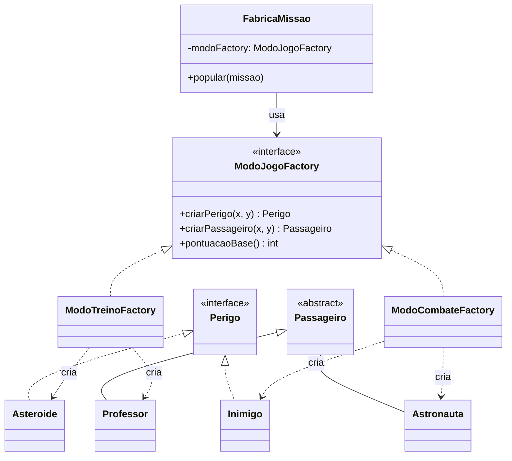

# GOF - Abstract Factory (Missão Marte)

## Definição

Abstract Factory fornece uma interface para criar **famílias** de objetos relacionados sem expor as classes concretas.

## Também conhecido como

Kit

## Aplicabilidade

Use o padrão Abstract Factory quando:

* um sistema deve ser independente de como seus produtos são criados, compostos ou representados;
* um sistema deve ser configurado como um produto de uma família de múltiplos produtos;
* uma família de objetos-produto for projetada para ser usada em conjunto, e você necessita garantir esta restrição;
* você quer fornecer uma biblioteca de classes de produtos e quer revelar somente suas interfaces, não suas implementações.

## Estrutura

```
AbstractFactory
  ├── criarProdutoA() → AbstractProductA
  └── criarProdutoB() → AbstractProductB

ConcreteFactory1 implements AbstractFactory
  ├── criarProdutoA() → ProductA1
  └── criarProdutoB() → ProductB1
```

## Participantes

* **AbstractFactory** — declara a interface para criação de cada família de produtos.
* **ConcreteFactory** — implementa as operações de criação de uma família específica.
* **AbstractProduct** — declara a interface para um tipo de produto.
* **ConcreteProduct** — define o produto criado pela fábrica concreta.
* **Client** — usa apenas as interfaces declaradas por AbstractFactory e AbstractProduct.

## Problema

A missão pode ter diferentes **modos de jogo** que exigem famílias completas de objetos consistentes entre si:

- **Modo TREINO**: apenas asteroides (sem inimigos), passageiros fáceis (Professores), pontuação menor.
- **Modo COMBATE**: asteroides + inimigos perseguidores, passageiros raros (Astronautas), pontuação máxima.

Sem Abstract Factory, o código de criação fica cheio de `if` por modo, espalhado em vários pontos:

```java
// ❌ ANTES — if/else espalhado por modo de jogo
if (modo == TREINO) {
    perigos.add(new Asteroide(x, y));
    passageiros.add(new Professor(px, py));
} else if (modo == COMBATE) {
    perigos.add(new Inimigo(x, y));
    passageiros.add(new Astronauta(px, py));
}
```

## Solução

Criar uma `ModoJogoFactory` para cada modo. O `FabricaMissao` recebe a fábrica e cria a missão sem saber o modo concreto.

## Diagrama de classes (Mermaid)



## Exemplo

```java
public interface ModoJogoFactory {
    Perigo criarPerigo(int x, int y);
    Passageiro criarPassageiro(int x, int y);
    int pontuacaoBase();
}

public class ModoTreinoFactory implements ModoJogoFactory {
    @Override
    public Perigo criarPerigo(int x, int y) {
        return new Asteroide(x, y);          // só asteroides no treino
    }

    @Override
    public Passageiro criarPassageiro(int x, int y) {
        return new Professor(x, y);          // professores são mais fáceis de resgatar
    }

    @Override
    public int pontuacaoBase() { return 500; }
}

public class ModoCombateFactory implements ModoJogoFactory {
    @Override
    public Perigo criarPerigo(int x, int y) {
        return new Inimigo(x, y);            // inimigos móveis no combate
    }

    @Override
    public Passageiro criarPassageiro(int x, int y) {
        return new Astronauta(x, y);         // astronautas valem mais pontos
    }

    @Override
    public int pontuacaoBase() { return 1500; }
}
```

Uso no criador de missão:

```java
public class FabricaMissao {
    private final ModoJogoFactory modoFactory;

    public FabricaMissao(ModoJogoFactory modoFactory) {
        this.modoFactory = modoFactory;
    }

    public void popular(Missao missao) {
        // cria perigos com a fábrica — não sabe qual tipo concreto
        for (int i = 0; i < 3; i++) {
            Perigo p = modoFactory.criarPerigo(posX(), posY());
            missao.adicionarPerigo(p);
        }
        // cria passageiros com a mesma fábrica
        for (int i = 0; i < 2; i++) {
            Passageiro pass = modoFactory.criarPassageiro(posX(), posY());
            missao.adicionarPassageiro(pass);
        }
    }
}
```

## Código completo

```java
import java.util.ArrayList;
import java.util.List;

// ── interfaces de produto ─────────────────────────────────────────────────

interface Perigo {
    int getX(); int getY();
    char getSimbolo();
}

abstract class Passageiro {
    protected final int x;
    protected final int y;
    Passageiro(int x, int y) { this.x = x; this.y = y; }
    abstract char getSimbolo();
    @Override public String toString() {
        return getClass().getSimpleName() + "(" + x + "," + y + ")";
    }
}

// ── produtos concretos ────────────────────────────────────────────────────

class Asteroide implements Perigo {
    private final int x, y;
    Asteroide(int x, int y) { this.x = x; this.y = y; }
    @Override public int getX() { return x; }
    @Override public int getY() { return y; }
    @Override public char getSimbolo() { return '#'; }
    @Override public String toString() { return "Asteroide(" + x + "," + y + ")"; }
}

class Inimigo implements Perigo {
    private final int x, y;
    Inimigo(int x, int y) { this.x = x; this.y = y; }
    @Override public int getX() { return x; }
    @Override public int getY() { return y; }
    @Override public char getSimbolo() { return 'X'; }
    @Override public String toString() { return "Inimigo(" + x + "," + y + ")"; }
}

class Professor extends Passageiro {
    Professor(int x, int y) { super(x, y); }
    @Override public char getSimbolo() { return 'P'; }
}

class Astronauta extends Passageiro {
    Astronauta(int x, int y) { super(x, y); }
    @Override public char getSimbolo() { return 'T'; }
}

// ── interface da fábrica abstrata ─────────────────────────────────────────

interface ModoJogoFactory {
    Perigo    criarPerigo(int x, int y);
    Passageiro criarPassageiro(int x, int y);
    int       pontuacaoBase();
    String    nomeDoModo();
}

// ── família: modo treino ──────────────────────────────────────────────────

class ModoTreinoFactory implements ModoJogoFactory {
    @Override public Perigo     criarPerigo(int x, int y)     { return new Asteroide(x, y); }
    @Override public Passageiro criarPassageiro(int x, int y) { return new Professor(x, y); }
    @Override public int        pontuacaoBase()                { return 500; }
    @Override public String     nomeDoModo()                   { return "TREINO"; }
}

// ── família: modo combate ─────────────────────────────────────────────────

class ModoCombateFactory implements ModoJogoFactory {
    @Override public Perigo     criarPerigo(int x, int y)     { return new Inimigo(x, y); }
    @Override public Passageiro criarPassageiro(int x, int y) { return new Astronauta(x, y); }
    @Override public int        pontuacaoBase()                { return 1500; }
    @Override public String     nomeDoModo()                   { return "COMBATE"; }
}

// ── serviço que usa a fábrica (independente do modo) ─────────────────────

class ConfiguradorMissao {
    private final ModoJogoFactory factory;

    ConfiguradorMissao(ModoJogoFactory factory) {
        this.factory = factory;
    }

    void configurar(int numPerigos, int numPassageiros) {
        System.out.println("=== Modo " + factory.nomeDoModo()
            + " | Pontuação base: " + factory.pontuacaoBase() + " ===");

        List<Perigo> perigos = new ArrayList<>();
        for (int i = 0; i < numPerigos; i++) {
            Perigo p = factory.criarPerigo(i * 2 + 1, i + 1);
            perigos.add(p);
            System.out.println("  Perigo: " + p + "  símbolo=" + p.getSimbolo());
        }

        List<Passageiro> passageiros = new ArrayList<>();
        for (int i = 0; i < numPassageiros; i++) {
            Passageiro p = factory.criarPassageiro(i * 3, i * 2);
            passageiros.add(p);
            System.out.println("  Passageiro: " + p + "  símbolo=" + p.getSimbolo());
        }
    }
}

// ── demonstração ──────────────────────────────────────────────────────────

public class MainAbstractFactory {
    public static void main(String[] args) {
        ConfiguradorMissao treino = new ConfiguradorMissao(new ModoTreinoFactory());
        treino.configurar(2, 2);

        System.out.println();

        ConfiguradorMissao combate = new ConfiguradorMissao(new ModoCombateFactory());
        combate.configurar(3, 1);
    }
}
```

## Diferença em relação ao Factory Method

| | Factory Method | Abstract Factory |
|---|---|---|
| **Cria** | Um tipo de produto | Uma família de produtos relacionados |
| **Variação** | Subclasse muda qual produto concreto | Troca de fábrica muda a família inteira |
| **Exemplo** | `PassageiroFactory` cria `Passageiro` | `ModoJogoFactory` cria `Perigo` + `Passageiro` juntos, garantindo consistência |

## Exercícios

1. Crie `ModoCientificoFactory` onde os perigos são `Asteroide` mas os passageiros são `Engenheiro`. Qual arquivo você precisou criar? O que **não** precisou mudar em `ConfiguradorMissao`?

2. Adicione ao contrato `ModoJogoFactory` um terceiro método `criarBonusItem(int x, int y)`. Quantas classes precisam ser alteradas?

3. Por que é importante que `ConfiguradorMissao` use apenas `ModoJogoFactory` (e não `ModoTreinoFactory` ou `ModoCombateFactory` diretamente)?
