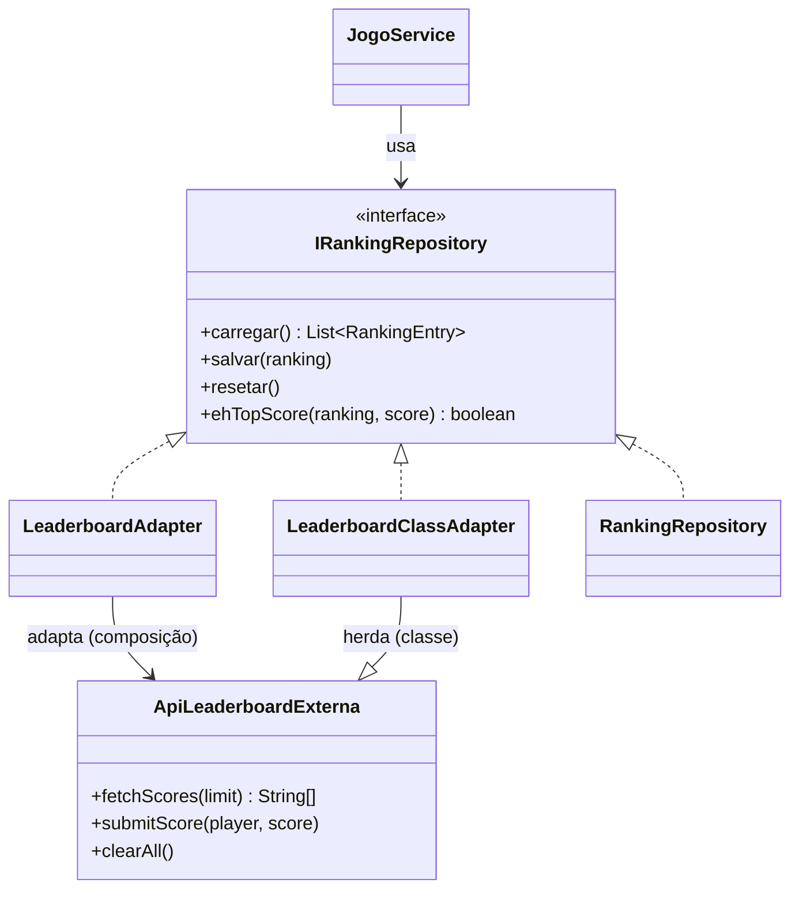

# GOF - Adapter (Missão Marte)

## Definição

Adapter converte a interface de uma classe para outra interface esperada pelo cliente.

## Também conhecido como

Wrapper

## Aplicabilidade

Use o padrão Adapter quando:

* você quiser usar uma classe existente, mas sua interface não corresponder à interface de que necessita;
* você quiser criar uma classe reutilizável que coopere com classes não-relacionadas ou não-previstas, ou seja, classes que não necessariamente tenham interfaces compatíveis;
* *(somente para adaptadores de objetos)* você precisar usar várias subclasses existentes, porém for impraticável adaptá-las criando subclasses para cada uma.

## Estrutura

**Adaptador de objeto** (composição — preferido):
```
Client → Target (interface)
              ↑ implements
         Adapter → Adaptee (composição)
```

**Adaptador de classe** (herança):
```
Client → Target (interface)
              ↑ implements  ↑ extends
         ClassAdapter → Adaptee
```

## Participantes

* **Target** — define a interface usada pelo cliente.
* **Client** — colabora com objetos que satisfazem a interface Target.
* **Adaptee** — define uma interface existente que precisa ser adaptada.
* **Adapter** — adapta a interface do Adaptee para a interface Target.

## Problema

O jogo salva e carrega o ranking em JSON local via `RankingRepository`, que implementa `IRankingRepository`. Se quisermos integrar com uma **API externa de leaderboard** (que tem método `submitScore(player, score)` e `fetchScores(limit)` diferentes da nossa interface), o `JogoService` não pode depender diretamente da API externa:

```java
// ❌ SEM ADAPTER — JogoService passa a conhecer a API externa
ApiLeaderboardExterna api = new ApiLeaderboardExterna();
String[] scores = api.fetchScores(10);         // formato diferente
api.submitScore(nome, pontos);                 // nome de método diferente
// agora o domínio está acoplado a um detalhe técnico externo
```

## Solução

Criar um `LeaderboardAdapter` que implementa `IRankingRepository` (interface do domínio) e adapta as chamadas para `ApiLeaderboardExterna`.

Mostramos as duas formas clássicas:
- **Adaptador de objeto**: usa composição — delega para uma instância da API externa.
- **Adaptador de classe**: herda da API externa e implementa a interface do domínio.

## Diagrama de classes (Mermaid)



## Exemplo

```java
// Interface esperada pelo domínio (já existe no projeto GRASP)
public interface IRankingRepository {
    List<RankingEntry> carregar();
    void salvar(List<RankingEntry> ranking);
    void resetar();
    boolean ehTopScore(List<RankingEntry> ranking, int score);
}

// API externa de leaderboard (não pode ser alterada)
public class ApiLeaderboardExterna {
    public String[] fetchScores(int limit) {
        return new String[]{"Alice:1800", "Bob:1200", "Carol:950"};
    }
    public void submitScore(String player, int score) {
        System.out.println("[LEADERBOARD-API] POST score player=" + player + " score=" + score);
    }
    public void clearAll() {
        System.out.println("[LEADERBOARD-API] DELETE all scores");
    }
}

// Adaptador de objeto (composição)
public class LeaderboardAdapter implements IRankingRepository {
    private final ApiLeaderboardExterna api;

    public LeaderboardAdapter(ApiLeaderboardExterna api) {
        this.api = api;
    }

    @Override
    public List<RankingEntry> carregar() {
        String[] raw = api.fetchScores(10);
        List<RankingEntry> result = new ArrayList<>();
        for (String linha : raw) {
            String[] partes = linha.split(":");
            result.add(new RankingEntry(partes[0], Integer.parseInt(partes[1])));
        }
        return result;
    }

    @Override
    public void salvar(List<RankingEntry> ranking) {
        for (RankingEntry e : ranking) {
            api.submitScore(e.getNome(), e.getPontuacao());
        }
    }

    @Override
    public void resetar() { api.clearAll(); }

    @Override
    public boolean ehTopScore(List<RankingEntry> ranking, int score) {
        return ranking.size() < 10
            || ranking.stream().anyMatch(e -> score > e.getPontuacao());
    }
}
```

## Código completo

```java
import java.util.ArrayList;
import java.util.Comparator;
import java.util.List;

// ── entidade de ranking ───────────────────────────────────────────────────

class RankingEntry {
    private final String nome;
    private final int pontuacao;

    RankingEntry(String nome, int pontuacao) {
        this.nome = nome;
        this.pontuacao = pontuacao;
    }

    String getNome()    { return nome; }
    int getPontuacao()  { return pontuacao; }

    @Override
    public String toString() {
        return nome + " → " + pontuacao + " pts";
    }
}

// ── interface do domínio (Target) ─────────────────────────────────────────

interface IRankingRepository {
    List<RankingEntry> carregar();
    void salvar(List<RankingEntry> ranking);
    void resetar();
    boolean ehTopScore(List<RankingEntry> ranking, int score);
}

// ── API externa (Adaptee — não pode ser alterada) ─────────────────────────

class ApiLeaderboardExterna {
    /** Retorna strings no formato "nome:pontuacao" */
    public String[] fetchScores(int limit) {
        System.out.println("[LEADERBOARD-API] GET /scores?limit=" + limit);
        return new String[]{"Alice:1800", "Bob:1200", "Carol:950"};
    }

    public void submitScore(String player, int score) {
        System.out.println("[LEADERBOARD-API] POST /scores  player=" + player + "  score=" + score);
    }

    public void clearAll() {
        System.out.println("[LEADERBOARD-API] DELETE /scores");
    }
}

// ── adaptador de objeto (composição) ─────────────────────────────────────

class LeaderboardAdapter implements IRankingRepository {
    private final ApiLeaderboardExterna api;

    LeaderboardAdapter(ApiLeaderboardExterna api) {
        this.api = api;
    }

    @Override
    public List<RankingEntry> carregar() {
        String[] raw = api.fetchScores(10);
        List<RankingEntry> lista = new ArrayList<>();
        for (String linha : raw) {
            String[] partes = linha.split(":");
            lista.add(new RankingEntry(partes[0], Integer.parseInt(partes[1])));
        }
        return lista;
    }

    @Override
    public void salvar(List<RankingEntry> ranking) {
        for (RankingEntry e : ranking) {
            api.submitScore(e.getNome(), e.getPontuacao());
        }
    }

    @Override
    public void resetar() { api.clearAll(); }

    @Override
    public boolean ehTopScore(List<RankingEntry> ranking, int score) {
        if (ranking.size() < 10) return true;
        return ranking.stream().mapToInt(RankingEntry::getPontuacao).min().orElse(0) < score;
    }
}

// ── adaptador de classe (herança) ─────────────────────────────────────────

class LeaderboardClassAdapter extends ApiLeaderboardExterna implements IRankingRepository {
    @Override
    public List<RankingEntry> carregar() {
        String[] raw = fetchScores(10);
        List<RankingEntry> lista = new ArrayList<>();
        for (String linha : raw) {
            String[] partes = linha.split(":");
            lista.add(new RankingEntry(partes[0], Integer.parseInt(partes[1])));
        }
        return lista;
    }

    @Override
    public void salvar(List<RankingEntry> ranking) {
        for (RankingEntry e : ranking) {
            submitScore(e.getNome(), e.getPontuacao());
        }
    }

    @Override
    public void resetar() { clearAll(); }

    @Override
    public boolean ehTopScore(List<RankingEntry> ranking, int score) {
        return ranking.size() < 10
            || ranking.stream().mapToInt(RankingEntry::getPontuacao).min().orElse(0) < score;
    }
}

// ── serviço que usa apenas a interface do domínio ─────────────────────────

class JogoService {
    private final IRankingRepository rankingRepository;

    JogoService(IRankingRepository rankingRepository) {
        this.rankingRepository = rankingRepository;
    }

    void registrarPontuacao(String nome, int pontos) {
        List<RankingEntry> ranking = rankingRepository.carregar();
        if (rankingRepository.ehTopScore(ranking, pontos)) {
            ranking.add(new RankingEntry(nome, pontos));
            ranking.sort(Comparator.comparingInt(RankingEntry::getPontuacao).reversed());
            rankingRepository.salvar(ranking);
            System.out.println("Pontuação registrada: " + nome + " → " + pontos);
        } else {
            System.out.println("Pontuação insuficiente para o ranking.");
        }
    }
}

// ── demonstração ──────────────────────────────────────────────────────────

public class MainAdapter {
    public static void main(String[] args) {
        System.out.println("=== Adaptador de Objeto ===");
        IRankingRepository adapterObjeto = new LeaderboardAdapter(new ApiLeaderboardExterna());
        JogoService jogo1 = new JogoService(adapterObjeto);
        jogo1.registrarPontuacao("Diego", 2000);

        System.out.println();

        System.out.println("=== Adaptador de Classe ===");
        IRankingRepository adapterClasse = new LeaderboardClassAdapter();
        JogoService jogo2 = new JogoService(adapterClasse);
        jogo2.registrarPontuacao("Mia", 500);
    }
}
```

## Exercícios

1. A `ApiLeaderboardExterna` foi substituída por uma nova versão que usa `getHighScores(n)` em vez de `fetchScores(n)`. Quais classes precisam ser alteradas? O `JogoService` precisa mudar?

2. Quando preferiria o **adaptador de classe** (herança) em vez do **adaptador de objeto** (composição)? Cite um exemplo onde herança seria problemática.

3. Relacione: o Adapter é uma forma de aplicar qual princípio SOLID? Qual padrão GRASP o complementa?

## Checklist antes de usar

- [ ] Existe uma API externa com interface diferente da esperada pelo domínio?
- [ ] O código de negócio está acoplado a detalhes técnicos de uma biblioteca ou serviço externo?
- [ ] Precisa trocar a implementação externa sem alterar o domínio?

Se sim → Adapter é candidato.
