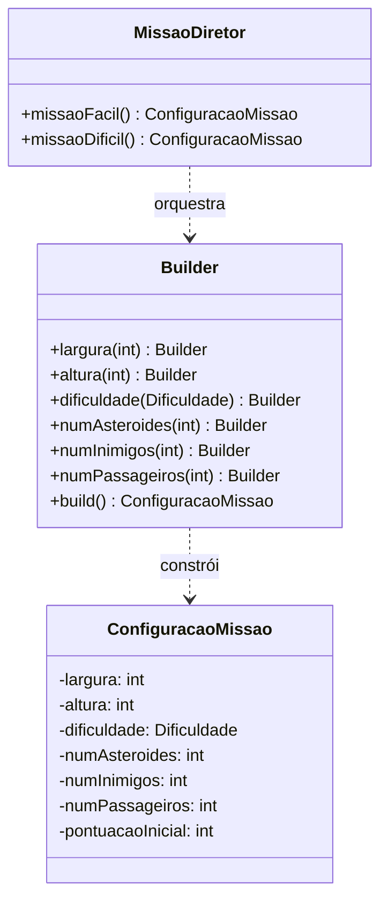

# GOF - Builder (Missão Marte)

## Definição

Builder separa a construção de um objeto complexo de sua representação final, permitindo montar o objeto passo a passo.

## Aplicabilidade

Use o padrão Builder quando:

* o algoritmo para criação de um objeto complexo deve ser independente das partes que compõem o objeto e de como elas são montadas;
* o processo de construção deve permitir diferentes representações para o objeto que é construído.

## Estrutura

```
Director
  └── constrói usando Builder

Builder (interface)
  ├── setPartA()
  ├── setPartB()
  └── build() → Product

ConcreteBuilder implements Builder
Product
```

## Participantes

* **Builder** — especifica uma interface abstrata para criação das partes do produto.
* **ConcreteBuilder** — constrói e monta partes do produto; fornece interface para recuperação do produto.
* **Director** — constrói um objeto usando a interface de Builder.
* **Product** — representa o objeto complexo em construção.

## Problema

Configurar uma `Missao` no estado original exigia passar muitos parâmetros diretamente ao construtor ou ao método de criação. Com o crescimento do jogo, surgem configurações opcionais:

- largura e altura do mapa
- dificuldade
- número de asteroides
- número de inimigos
- número de passageiros de cada tipo
- pontuação inicial personalizada

Sem Builder, o sistema acaba com construtores longos ou muitos overloads:

```java
// ❌ ANTES — construtor com parâmetros demais
new ConfiguracaoMissao("FACIL", 20, 10, 3, 0, 4, 1500);
// impossível saber o que cada número significa
```

## Solução

Criar um `ConfiguracaoMissao.Builder` para montar a configuração passo a passo, com valores padrão para campos opcionais.

## Diagrama de classes (Mermaid)



## Exemplo

```java
public class ConfiguracaoMissao {
    private final int largura;
    private final int altura;
    private final Dificuldade dificuldade;
    private final int numAsteroides;
    private final int numInimigos;
    private final int numPassageiros;
    private final int pontuacaoInicial;

    private ConfiguracaoMissao(Builder b) {
        this.largura         = b.largura;
        this.altura          = b.altura;
        this.dificuldade     = b.dificuldade;
        this.numAsteroides   = b.numAsteroides;
        this.numInimigos     = b.numInimigos;
        this.numPassageiros  = b.numPassageiros;
        this.pontuacaoInicial = b.pontuacaoInicial;
    }

    public static class Builder {
        private int largura          = 20;
        private int altura           = 10;
        private Dificuldade dificuldade = Dificuldade.MEDIO;
        private int numAsteroides    = 5;
        private int numInimigos      = 0;
        private int numPassageiros   = 3;
        private int pontuacaoInicial = 1000;

        public Builder largura(int l)                { this.largura = l;          return this; }
        public Builder altura(int a)                 { this.altura = a;           return this; }
        public Builder dificuldade(Dificuldade d)    { this.dificuldade = d;      return this; }
        public Builder numAsteroides(int n)          { this.numAsteroides = n;    return this; }
        public Builder numInimigos(int n)            { this.numInimigos = n;      return this; }
        public Builder numPassageiros(int n)         { this.numPassageiros = n;   return this; }
        public Builder pontuacaoInicial(int p)       { this.pontuacaoInicial = p; return this; }

        public ConfiguracaoMissao build() {
            if (largura < 5 || altura < 5)
                throw new IllegalStateException("Mapa muito pequeno (mínimo 5x5)");
            if (numPassageiros < 1)
                throw new IllegalStateException("Missão precisa de ao menos 1 passageiro");
            return new ConfiguracaoMissao(this);
        }
    }
}
```

Uso direto:

```java
ConfiguracaoMissao config = new ConfiguracaoMissao.Builder()
    .largura(30)
    .altura(15)
    .dificuldade(Dificuldade.DIFICIL)
    .numAsteroides(8)
    .numInimigos(3)
    .numPassageiros(5)
    .build();
```

## Código completo

```java
// ── enum de dificuldade ───────────────────────────────────────────────────

enum Dificuldade {
    FACIL(1500), MEDIO(1000), DIFICIL(500);

    private final int pontuacaoInicial;
    Dificuldade(int p) { this.pontuacaoInicial = p; }
    public int getPontuacaoInicial() { return pontuacaoInicial; }
}

// ── produto: configuração imutável da missão ──────────────────────────────

class ConfiguracaoMissao {
    private final int largura;
    private final int altura;
    private final Dificuldade dificuldade;
    private final int numAsteroides;
    private final int numInimigos;
    private final int numPassageiros;
    private final int pontuacaoInicial;

    private ConfiguracaoMissao(Builder b) {
        this.largura          = b.largura;
        this.altura           = b.altura;
        this.dificuldade      = b.dificuldade;
        this.numAsteroides    = b.numAsteroides;
        this.numInimigos      = b.numInimigos;
        this.numPassageiros   = b.numPassageiros;
        this.pontuacaoInicial = b.pontuacaoInicial;
    }

    @Override
    public String toString() {
        return "ConfiguracaoMissao{"
            + "mapa=" + largura + "x" + altura
            + ", dificuldade=" + dificuldade
            + ", asteroides=" + numAsteroides
            + ", inimigos=" + numInimigos
            + ", passageiros=" + numPassageiros
            + ", pontuacaoInicial=" + pontuacaoInicial
            + "}";
    }

    // ── getters ───────────────────────────────────────────────────────────

    public int getLargura()          { return largura; }
    public int getAltura()           { return altura; }
    public Dificuldade getDificuldade() { return dificuldade; }
    public int getNumAsteroides()    { return numAsteroides; }
    public int getNumInimigos()      { return numInimigos; }
    public int getNumPassageiros()   { return numPassageiros; }
    public int getPontuacaoInicial() { return pontuacaoInicial; }

    // ── builder interno ───────────────────────────────────────────────────

    static class Builder {
        private int largura          = 20;
        private int altura           = 10;
        private Dificuldade dificuldade = Dificuldade.MEDIO;
        private int numAsteroides    = 5;
        private int numInimigos      = 0;
        private int numPassageiros   = 3;
        private int pontuacaoInicial = -1; // -1 = usar valor da Dificuldade

        Builder largura(int l)             { this.largura = l;          return this; }
        Builder altura(int a)              { this.altura = a;           return this; }
        Builder dificuldade(Dificuldade d) { this.dificuldade = d;      return this; }
        Builder numAsteroides(int n)       { this.numAsteroides = n;    return this; }
        Builder numInimigos(int n)         { this.numInimigos = n;      return this; }
        Builder numPassageiros(int n)      { this.numPassageiros = n;   return this; }
        Builder pontuacaoInicial(int p)    { this.pontuacaoInicial = p; return this; }

        ConfiguracaoMissao build() {
            if (largura < 5 || altura < 5)
                throw new IllegalStateException("Mapa muito pequeno (mínimo 5x5)");
            if (numPassageiros < 1)
                throw new IllegalStateException("Missão precisa de ao menos 1 passageiro");
            if (pontuacaoInicial < 0)
                pontuacaoInicial = dificuldade.getPontuacaoInicial();
            return new ConfiguracaoMissao(this);
        }
    }
}

// ── diretor: encapsula receitas de configuração reutilizáveis ─────────────

class MissaoDiretor {
    static ConfiguracaoMissao missaoTutorial() {
        return new ConfiguracaoMissao.Builder()
            .largura(10).altura(6)
            .dificuldade(Dificuldade.FACIL)
            .numAsteroides(2).numInimigos(0).numPassageiros(1)
            .build();
    }

    static ConfiguracaoMissao missaoPadrao() {
        return new ConfiguracaoMissao.Builder()
            .largura(20).altura(10)
            .dificuldade(Dificuldade.MEDIO)
            .numAsteroides(5).numInimigos(0).numPassageiros(3)
            .build();
    }

    static ConfiguracaoMissao missaoElite() {
        return new ConfiguracaoMissao.Builder()
            .largura(30).altura(15)
            .dificuldade(Dificuldade.DIFICIL)
            .numAsteroides(8).numInimigos(4).numPassageiros(5)
            .build();
    }
}

// ── demonstração ──────────────────────────────────────────────────────────

public class MainBuilder {
    public static void main(String[] args) {
        System.out.println("=== Missão customizada ===");
        ConfiguracaoMissao custom = new ConfiguracaoMissao.Builder()
            .largura(25).altura(12)
            .dificuldade(Dificuldade.DIFICIL)
            .numAsteroides(6).numInimigos(2).numPassageiros(4)
            .build();
        System.out.println(custom);

        System.out.println();
        System.out.println("=== Receitas do Diretor ===");
        System.out.println(MissaoDiretor.missaoTutorial());
        System.out.println(MissaoDiretor.missaoPadrao());
        System.out.println(MissaoDiretor.missaoElite());

        System.out.println();
        System.out.println("=== Validação (mapa muito pequeno) ===");
        try {
            new ConfiguracaoMissao.Builder().largura(3).altura(3).build();
        } catch (IllegalStateException e) {
            System.out.println("Erro esperado: " + e.getMessage());
        }
    }
}
```

## Exercícios

1. Adicione o campo `boolean temEscudo` à `ConfiguracaoMissao`. Defina o valor padrão como `false`. O que na assinatura dos construtores existentes **não** precisa mudar?

2. Crie `MissaoDiretor.missaoChefe()` para uma missão especial (sem asteroides, apenas 1 inimigo muito poderoso, 10 passageiros). Qual é a vantagem de ter o Diretor?

3. Por que o construtor de `ConfiguracaoMissao` é `private`? O que aconteceria se fosse `public`?

## Checklist antes de usar

- [ ] O objeto tem muitos campos opcionais com valores padrão?
- [ ] Existem múltiplos construtores ou métodos estáticos de criação?
- [ ] A ordem de inicialização dos campos importa (ex.: pontuacaoInicial depende de dificuldade)?
- [ ] Seria útil ter "receitas" reutilizáveis de configuração (papel do Director)?

Se sim → Builder é candidato.
