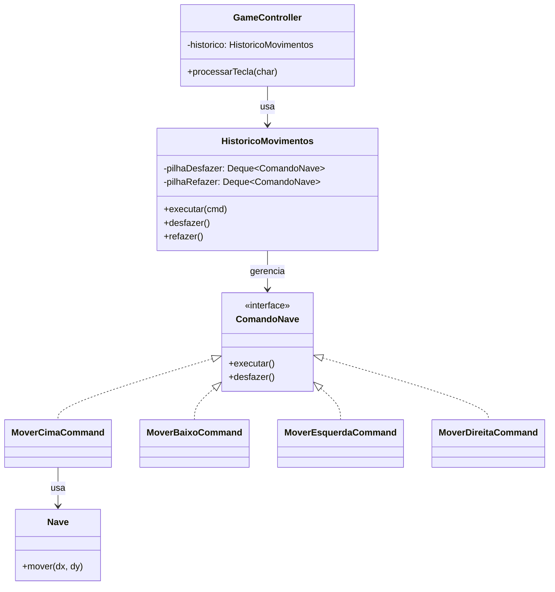

# GOF - Command (Missão Marte)

## Definição

Command encapsula uma requisição como um objeto, permitindo parametrizar clientes com diferentes requisições, suportar desfazer/refazer e enfileirar operações.

## Também conhecido como

Action, Transaction

## Aplicabilidade

Use o padrão Command quando você quiser:

* parametrizar objetos com uma ação a ser executada;
* especificar, enfileirar e executar solicitações em instantes diferentes — um objeto Command tem tempo de vida independente da solicitação original;
* suportar desfazer operações (`undo`) — a operação `executar` armazena estado para reverter os efeitos;
* suportar gravação e replay de ações (log de comandos).

## Estrutura

```
Client → Command (interface)
               ├── ConcreteCommandA
               └── ConcreteCommandB
Invoker → execute(Command)
Receiver ← comando.executar() chama receiver
```

## Participantes

* **Command** — declara uma interface para executar uma operação e, opcionalmente, desfazê-la.
* **ConcreteCommand** — implementa a interface; mantém referência ao Receiver.
* **Client** — cria o ConcreteCommand e define o Receiver.
* **Invoker** — pede ao Command que execute a requisição; pode empilhar comandos para `undo/redo`.
* **Receiver** — sabe como executar as operações associadas à requisição.

## Problema

Os movimentos da nave (WASD) são processados diretamente no `GameController`:

```java
// ❌ ANTES — lógica de movimento inline, sem desfazer
switch (tecla) {
    case 'w': nave.mover(0, -1); break;
    case 's': nave.mover(0,  1); break;
    case 'a': nave.mover(-1, 0); break;
    case 'd': nave.mover( 1, 0); break;
}
// sem suporte a desfazer, replay ou filas de autopilot
```

Com essa abordagem é impossível suportar:
- **Desfazer** o último movimento (voltar para posição anterior)
- **Replay** de uma sequência de movimentos (modo tutorial)
- **Autopilot** — enfileirar comandos para execução automática

## Solução

Encapsular cada movimento como um `ComandoNave`. O `HistoricoMovimentos` (Invoker) empilha os comandos executados e permite `desfazer` e `refazer`.

## Diagrama de classes (Mermaid)



## Exemplo

```java
public interface ComandoNave {
    void executar();
    void desfazer();
}

public class MoverEsquerdaCommand implements ComandoNave {
    private final Nave nave;

    public MoverEsquerdaCommand(Nave nave) { this.nave = nave; }

    @Override public void executar() { nave.mover(-1, 0); }
    @Override public void desfazer() { nave.mover( 1, 0); }
}

public class MoverDireitaCommand implements ComandoNave {
    private final Nave nave;
    public MoverDireitaCommand(Nave nave) { this.nave = nave; }
    @Override public void executar() { nave.mover( 1, 0); }
    @Override public void desfazer() { nave.mover(-1, 0); }
}
```

Invoker com undo/redo:

```java
public class HistoricoMovimentos {
    private final Deque<ComandoNave> pilhaDesfazer = new ArrayDeque<>();
    private final Deque<ComandoNave> pilhaRefazer  = new ArrayDeque<>();

    public void executar(ComandoNave cmd) {
        cmd.executar();
        pilhaDesfazer.push(cmd);
        pilhaRefazer.clear();   // novo comando cancela o histórico de refazer
    }

    public void desfazer() {
        if (!pilhaDesfazer.isEmpty()) {
            ComandoNave cmd = pilhaDesfazer.pop();
            cmd.desfazer();
            pilhaRefazer.push(cmd);
        }
    }

    public void refazer() {
        if (!pilhaRefazer.isEmpty()) {
            ComandoNave cmd = pilhaRefazer.pop();
            cmd.executar();
            pilhaDesfazer.push(cmd);
        }
    }
}
```

## Código completo

```java
import java.util.ArrayDeque;
import java.util.ArrayList;
import java.util.Deque;
import java.util.List;

// ── receptor: a nave ──────────────────────────────────────────────────────

class Nave {
    private int x, y;

    Nave(int x, int y) { this.x = x; this.y = y; }

    void mover(int dx, int dy) { x += dx; y += dy; }

    int getX() { return x; }
    int getY() { return y; }

    @Override public String toString() {
        return "Nave(" + x + "," + y + ")";
    }
}

// ── interface do comando ──────────────────────────────────────────────────

interface ComandoNave {
    void executar();
    void desfazer();
    String descricao();
}

// ── comandos concretos ────────────────────────────────────────────────────

class MoverCimaCommand implements ComandoNave {
    private final Nave nave;
    MoverCimaCommand(Nave n)    { this.nave = n; }
    @Override public void executar()  { nave.mover(0, -1); }
    @Override public void desfazer()  { nave.mover(0,  1); }
    @Override public String descricao() { return "CIMA"; }
}

class MoverBaixoCommand implements ComandoNave {
    private final Nave nave;
    MoverBaixoCommand(Nave n)   { this.nave = n; }
    @Override public void executar()  { nave.mover(0,  1); }
    @Override public void desfazer()  { nave.mover(0, -1); }
    @Override public String descricao() { return "BAIXO"; }
}

class MoverEsquerdaCommand implements ComandoNave {
    private final Nave nave;
    MoverEsquerdaCommand(Nave n) { this.nave = n; }
    @Override public void executar()  { nave.mover(-1, 0); }
    @Override public void desfazer()  { nave.mover( 1, 0); }
    @Override public String descricao() { return "ESQUERDA"; }
}

class MoverDireitaCommand implements ComandoNave {
    private final Nave nave;
    MoverDireitaCommand(Nave n) { this.nave = n; }
    @Override public void executar()  { nave.mover( 1, 0); }
    @Override public void desfazer()  { nave.mover(-1, 0); }
    @Override public String descricao() { return "DIREITA"; }
}

// ── replay: sequência de comandos gravada ─────────────────────────────────

class ReplayMovimentos implements ComandoNave {
    private final List<ComandoNave> gravados;
    private final List<ComandoNave> executadosNoReplay = new ArrayList<>();

    ReplayMovimentos(List<ComandoNave> gravados) {
        this.gravados = List.copyOf(gravados);
    }

    @Override
    public void executar() {
        executadosNoReplay.clear();
        for (ComandoNave cmd : gravados) {
            cmd.executar();
            executadosNoReplay.add(cmd);
        }
    }

    @Override
    public void desfazer() {
        // desfaz na ordem inversa
        List<ComandoNave> reverso = new ArrayList<>(executadosNoReplay);
        for (int i = reverso.size() - 1; i >= 0; i--) {
            reverso.get(i).desfazer();
        }
    }

    @Override public String descricao() { return "REPLAY(" + gravados.size() + " cmds)"; }
}

// ── invoker: histórico com undo/redo ──────────────────────────────────────

class HistoricoMovimentos {
    private final Deque<ComandoNave> pilhaDesfazer = new ArrayDeque<>();
    private final Deque<ComandoNave> pilhaRefazer  = new ArrayDeque<>();

    void executar(ComandoNave cmd) {
        cmd.executar();
        pilhaDesfazer.push(cmd);
        pilhaRefazer.clear();
        System.out.println("  Executado: " + cmd.descricao());
    }

    void desfazer() {
        if (pilhaDesfazer.isEmpty()) { System.out.println("  (nada a desfazer)"); return; }
        ComandoNave cmd = pilhaDesfazer.pop();
        cmd.desfazer();
        pilhaRefazer.push(cmd);
        System.out.println("  Desfeito: " + cmd.descricao());
    }

    void refazer() {
        if (pilhaRefazer.isEmpty()) { System.out.println("  (nada a refazer)"); return; }
        ComandoNave cmd = pilhaRefazer.pop();
        cmd.executar();
        pilhaDesfazer.push(cmd);
        System.out.println("  Refeito: " + cmd.descricao());
    }

    boolean podeDesfazer() { return !pilhaDesfazer.isEmpty(); }
    boolean podeRefazer()  { return !pilhaRefazer.isEmpty(); }
    int totalExecutados()  { return pilhaDesfazer.size(); }
}

// ── demonstração ──────────────────────────────────────────────────────────

public class MainCommand {

    static void mostrarNave(Nave nave) {
        System.out.println("    → " + nave);
    }

    public static void main(String[] args) {
        Nave nave = new Nave(5, 5);
        HistoricoMovimentos historico = new HistoricoMovimentos();

        System.out.println("Posição inicial: " + nave);
        System.out.println();

        System.out.println("=== Movimentos ===");
        historico.executar(new MoverDireitaCommand(nave)); mostrarNave(nave);
        historico.executar(new MoverDireitaCommand(nave)); mostrarNave(nave);
        historico.executar(new MoverCimaCommand(nave));    mostrarNave(nave);

        System.out.println();
        System.out.println("=== Desfazer 2x ===");
        historico.desfazer(); mostrarNave(nave);
        historico.desfazer(); mostrarNave(nave);

        System.out.println();
        System.out.println("=== Refazer 1x ===");
        historico.refazer(); mostrarNave(nave);

        System.out.println();
        System.out.println("=== Replay de uma sequência pré-gravada ===");
        Nave nave2 = new Nave(0, 0);
        List<ComandoNave> roteiro = List.of(
            new MoverDireitaCommand(nave2),
            new MoverBaixoCommand(nave2),
            new MoverDireitaCommand(nave2)
        );
        System.out.println("Nave2 antes: " + nave2);
        HistoricoMovimentos h2 = new HistoricoMovimentos();
        h2.executar(new ReplayMovimentos(roteiro));
        System.out.println("Nave2 após replay: " + nave2);

        System.out.println();
        System.out.println("=== Desfazer o replay ===");
        h2.desfazer();
        System.out.println("Nave2 após desfazer: " + nave2);
    }
}
```

## Exercícios

1. Crie `RotacionarCommand` que gira o ícone da nave em 90° horário ao executar e 90° anti-horário ao desfazer. A `Nave` precisará de um campo `direcao`. Quantas outras classes foram alteradas?

2. O `GameController` recebe a tecla `'z'` para desfazer. Mostre como ele chama `historico.desfazer()` sem conhecer qual foi o último comando executado.

3. Como você usaria Command para implementar um sistema de replay de partida inteira? Onde os comandos seriam gravados? Como seriam reproduzidos ao final?

## Checklist antes de usar

- [ ] Você precisa parametrizar objetos com a ação a executar (sem saber qual é)?
- [ ] Precisa suportar desfazer/refazer de operações?
- [ ] Quer enfileirar, agendar ou gravar operações para replay?
- [ ] As operações precisam ser tratadas como objetos de primeira classe?

Se sim → Command é candidato.
