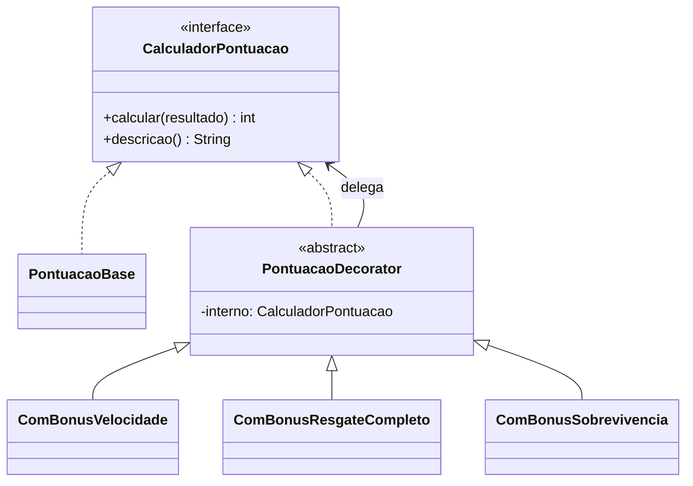

# GOF - Decorator (Missão Marte)

## Definição

Decorator adiciona responsabilidades a objetos dinamicamente, sem alterar a classe original e sem depender de herança extensa.

## Também Conhecido Como

Wrapper

## Aplicabilidade

Use Decorator:

* para acrescentar responsabilidades a objetos individuais de forma dinâmica e transparente, sem afetar outros objetos;
* para responsabilidades que podem ser removidas;
* quando a extensão através do uso de subclasses não é prática — um grande número de extensões independentes produziria uma explosão de subclasses para suportar cada combinação.

## Estrutura

```
Component (interface)
  ├── ConcreteComponent
  └── Decorator (abstract) → Component (composição)
        ├── ConcreteDecoratorA
        └── ConcreteDecoratorB
```

## Participantes

* **Component** — define a interface para objetos que podem ter responsabilidades acrescentadas dinamicamente.
* **ConcreteComponent** — define um objeto para o qual responsabilidades adicionais podem ser atribuídas.
* **Decorator** — mantém referência para um Component e define interface que segue a interface de Component.
* **ConcreteDecorator** — acrescenta responsabilidades ao componente.

## Problema

A pontuação final de uma missão pode ter vários bônus **empilháveis** e **opcionais**:

- Pontos base coletados durante o jogo
- + Bônus de velocidade (terminou em menos de 60 segundos)
- + Bônus de resgate completo (todos os passageiros resgatados)
- + Bônus de sobrevivência sem dano (não colidiu com nenhum perigo)

Sem Decorator, cada combinação exigiria uma subclasse:

```java
// ❌ SEM DECORATOR — explosão de subclasses
class PontuacaoComVelocidadeEResgate extends PontuacaoBase { ... }
class PontuacaoComVelocidadeESobrevivencia extends PontuacaoBase { ... }
class PontuacaoComTodosBonuos extends PontuacaoBase { ... }
// impossível manter com N bônus
```

## Solução

Encadear decoradores sobre um `CalculadorPontuacao` base.

## Diagrama de classes (Mermaid)



## Exemplo

```java
public interface CalculadorPontuacao {
    int calcular(ResultadoMissao resultado);
    String descricao();
}

public class PontuacaoBase implements CalculadorPontuacao {
    @Override
    public int calcular(ResultadoMissao r) {
        return r.getPontosColetados();
    }

    @Override
    public String descricao() { return "Pontos base"; }
}

public abstract class PontuacaoDecorator implements CalculadorPontuacao {
    protected final CalculadorPontuacao interno;

    protected PontuacaoDecorator(CalculadorPontuacao interno) {
        this.interno = interno;
    }
}

public class ComBonusVelocidade extends PontuacaoDecorator {
    private static final int BONUS = 500;
    private static final int LIMITE_SEGUNDOS = 60;

    public ComBonusVelocidade(CalculadorPontuacao interno) { super(interno); }

    @Override
    public int calcular(ResultadoMissao r) {
        int base = interno.calcular(r);
        return r.getTempoSegundos() < LIMITE_SEGUNDOS ? base + BONUS : base;
    }

    @Override
    public String descricao() {
        return interno.descricao() + " + bônus velocidade (<60s: +500)";
    }
}

public class ComBonusResgateCompleto extends PontuacaoDecorator {
    private static final int BONUS = 1000;

    public ComBonusResgateCompleto(CalculadorPontuacao interno) { super(interno); }

    @Override
    public int calcular(ResultadoMissao r) {
        int base = interno.calcular(r);
        return r.todosResgatados() ? base + BONUS : base;
    }

    @Override
    public String descricao() {
        return interno.descricao() + " + bônus resgate completo (+1000)";
    }
}
```

Uso:

```java
CalculadorPontuacao calculador =
    new ComBonusSobrevivencia(
        new ComBonusResgateCompleto(
            new ComBonusVelocidade(
                new PontuacaoBase())));

int total = calculador.calcular(resultado);
```

## Código completo

```java
// ── resultado de uma missão ───────────────────────────────────────────────

class ResultadoMissao {
    private final int pontosColetados;
    private final int tempoSegundos;
    private final boolean todosResgatados;
    private final boolean semColisao;

    ResultadoMissao(int pontosColetados, int tempoSegundos,
                    boolean todosResgatados, boolean semColisao) {
        this.pontosColetados = pontosColetados;
        this.tempoSegundos   = tempoSegundos;
        this.todosResgatados = todosResgatados;
        this.semColisao      = semColisao;
    }

    int getPontosColetados()  { return pontosColetados; }
    int getTempoSegundos()    { return tempoSegundos; }
    boolean todosResgatados() { return todosResgatados; }
    boolean isSemColisao()    { return semColisao; }
}

// ── interface do componente ───────────────────────────────────────────────

interface CalculadorPontuacao {
    int calcular(ResultadoMissao resultado);
    String descricao();
}

// ── componente base ───────────────────────────────────────────────────────

class PontuacaoBase implements CalculadorPontuacao {
    @Override
    public int calcular(ResultadoMissao r) { return r.getPontosColetados(); }
    @Override
    public String descricao() { return "Pontos base"; }
}

// ── decorator abstrato ────────────────────────────────────────────────────

abstract class PontuacaoDecorator implements CalculadorPontuacao {
    protected final CalculadorPontuacao interno;
    protected PontuacaoDecorator(CalculadorPontuacao interno) { this.interno = interno; }
}

// ── decoradores concretos ─────────────────────────────────────────────────

class ComBonusVelocidade extends PontuacaoDecorator {
    private final int limiteSeg;
    private final int bonus;

    ComBonusVelocidade(CalculadorPontuacao interno, int limiteSeg, int bonus) {
        super(interno);
        this.limiteSeg = limiteSeg;
        this.bonus     = bonus;
    }

    @Override
    public int calcular(ResultadoMissao r) {
        int base = interno.calcular(r);
        return r.getTempoSegundos() < limiteSeg ? base + bonus : base;
    }

    @Override
    public String descricao() {
        return interno.descricao()
            + " + bônus velocidade (<" + limiteSeg + "s: +" + bonus + ")";
    }
}

class ComBonusResgateCompleto extends PontuacaoDecorator {
    private static final int BONUS = 1000;

    ComBonusResgateCompleto(CalculadorPontuacao interno) { super(interno); }

    @Override
    public int calcular(ResultadoMissao r) {
        int base = interno.calcular(r);
        return r.todosResgatados() ? base + BONUS : base;
    }

    @Override
    public String descricao() {
        return interno.descricao() + " + bônus resgate completo (+" + BONUS + ")";
    }
}

class ComBonusSobrevivencia extends PontuacaoDecorator {
    private static final int BONUS = 750;

    ComBonusSobrevivencia(CalculadorPontuacao interno) { super(interno); }

    @Override
    public int calcular(ResultadoMissao r) {
        int base = interno.calcular(r);
        return r.isSemColisao() ? base + BONUS : base;
    }

    @Override
    public String descricao() {
        return interno.descricao() + " + bônus sobrevivência (+" + BONUS + ")";
    }
}

// ── demonstração ──────────────────────────────────────────────────────────

public class MainDecorator {

    static void exibir(String titulo, CalculadorPontuacao calc, ResultadoMissao r) {
        int total = calc.calcular(r);
        System.out.println("--- " + titulo);
        System.out.println("    Composição : " + calc.descricao());
        System.out.println("    Pontos base: " + r.getPontosColetados());
        System.out.println("    Total      : " + total);
        System.out.println();
    }

    public static void main(String[] args) {
        // missão perfeita: rápida, resgatou todos, sem colisão
        ResultadoMissao perfeita = new ResultadoMissao(800, 45, true, true);
        // missão normal: demorou, resgatou todos, colidiu
        ResultadoMissao normal   = new ResultadoMissao(600, 90, true, false);
        // missão parcial: rápida, não resgatou todos, sem colisão
        ResultadoMissao parcial  = new ResultadoMissao(400, 30, false, true);

        exibir("Só pontos base",
            new PontuacaoBase(), perfeita);

        exibir("Base + velocidade",
            new ComBonusVelocidade(new PontuacaoBase(), 60, 500), perfeita);

        exibir("Base + velocidade + resgate completo",
            new ComBonusResgateCompleto(
                new ComBonusVelocidade(new PontuacaoBase(), 60, 500)), perfeita);

        exibir("Todos os bônus (missão perfeita)",
            new ComBonusSobrevivencia(
                new ComBonusResgateCompleto(
                    new ComBonusVelocidade(new PontuacaoBase(), 60, 500))),
            perfeita);

        exibir("Todos os bônus (missão normal)",
            new ComBonusSobrevivencia(
                new ComBonusResgateCompleto(
                    new ComBonusVelocidade(new PontuacaoBase(), 60, 500))),
            normal);

        exibir("Todos os bônus (missão parcial)",
            new ComBonusSobrevivencia(
                new ComBonusResgateCompleto(
                    new ComBonusVelocidade(new PontuacaoBase(), 60, 500))),
            parcial);
    }
}
```

## Exercícios

1. Crie `ComBonusDificuldade` que multiplica o total por 1.5 se a missão foi no nível DIFICIL. Como você passa a `Dificuldade` para o decorador? O que **não** precisa mudar nas outras classes?

2. Monte uma combinação que aplique apenas `ComBonusVelocidade` e `ComBonusSobrevivencia`, sem o bônus de resgate. Quantas classes precisaram ser criadas ou alteradas?

3. Compare Decorator com herança: se você tivesse 4 bônus independentes, quantas subclasses seriam necessárias para cobrir todas as combinações com herança? E com Decorator?

## Checklist antes de usar

- [ ] Existem comportamentos opcionais que podem se combinar livremente?
- [ ] Uma explosão de subclasses seria necessária para cobrir todas as combinações?
- [ ] Os comportamentos extras seguem a mesma interface do componente original?
- [ ] Os comportamentos extras precisam ser adicionados ou removidos em tempo de execução?

Se sim → Decorator é candidato.
