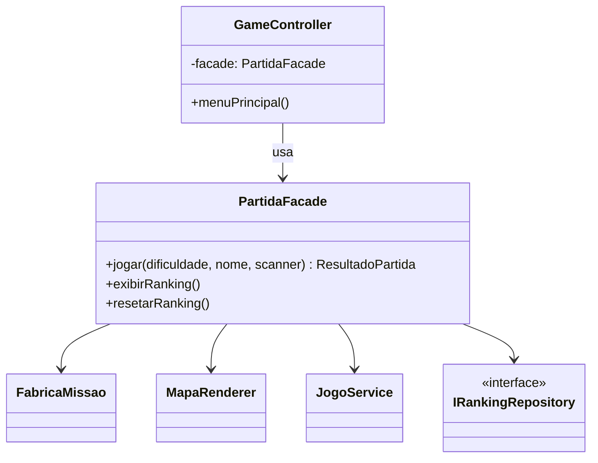

# GOF - Facade (Missão Marte)

## Definição

Facade fornece uma interface unificada e simples para um subsistema mais complexo.

## Aplicabilidade

Use o padrão Façade quando:

* você desejar fornecer uma interface simples para um subsistema complexo. Os subsistemas se tornam mais complexos à medida que evoluem. Uma façade pode fornecer, por padrão, uma visão simples do sistema que é boa o suficiente para a maioria dos clientes;
* existirem muitas dependências entre clientes e classes de implementação. Introduzir uma façade para desacoplar o subsistema dos clientes promove a independência e portabilidade dos subsistemas;
* você desejar estruturar seus subsistemas em camadas — use uma façade para definir o ponto de entrada de cada nível.

## Estrutura

```
Client → Facade
              ├── SubsistemaA
              ├── SubsistemaB
              └── SubsistemaC
```

## Participantes

* **Façade** — conhece quais classes do subsistema são responsáveis por atender uma solicitação; delega solicitações dos clientes aos objetos apropriados do subsistema.
* **Classes de subsistema** — implementam a funcionalidade do subsistema; não têm conhecimento da façade.

## Problema

Iniciar uma partida na Missão Marte envolve várias etapas que o `GameController` precisa coordenar:

1. Ler o nome do jogador
2. Carregar o ranking existente do repositório
3. Criar a missão com a dificuldade escolhida (via `FabricaMissao`)
4. Posicionar a nave no ponto de partida
5. Renderizar o mapa inicial
6. Executar o loop da partida (via `JogoService`)
7. Verificar e salvar pontuação no ranking

Sem Facade, o `GameController` (ou `Main`) passa a depender diretamente de todos os subsistemas:

```java
// ❌ SEM FACADE — GameController com 5+ dependências diretas
public class GameController {
    private final FabricaMissao fabricaMissao;
    private final MapaRenderer mapaRenderer;
    private final JogoService jogoService;
    private final IRankingRepository rankingRepository;
    private final Scanner scanner;

    public void iniciarPartida(Dificuldade dificuldade) {
        Missao missao = fabricaMissao.criar(dificuldade);
        Nave nave = new Nave(0, 0);
        mapaRenderer.desenhar(missao, nave);
        int pontos = jogoService.executarPartida(missao, nave, scanner);
        List<RankingEntry> ranking = rankingRepository.carregar();
        if (rankingRepository.ehTopScore(ranking, pontos)) { ... }
        rankingRepository.salvar(ranking);
    }
}
```

## Solução

Criar `PartidaFacade` que encapsula todo o fluxo de iniciar e encerrar uma partida. O `GameController` chama apenas `partida.jogar(dificuldade, nome)`.

## Diagrama de classes (Mermaid)



## Exemplo

```java
public class PartidaFacade {
    private final FabricaMissao fabricaMissao;
    private final MapaRenderer mapaRenderer;
    private final JogoService jogoService;
    private final IRankingRepository rankingRepository;

    public PartidaFacade(FabricaMissao fabricaMissao,
                         MapaRenderer mapaRenderer,
                         JogoService jogoService,
                         IRankingRepository rankingRepository) {
        this.fabricaMissao    = fabricaMissao;
        this.mapaRenderer     = mapaRenderer;
        this.jogoService      = jogoService;
        this.rankingRepository = rankingRepository;
    }

    public int jogar(Dificuldade dificuldade, String nomeJogador, Scanner scanner) {
        Missao missao = fabricaMissao.criar(dificuldade);
        Nave nave = new Nave(missao.getLargura() / 2, missao.getAltura() / 2);

        mapaRenderer.desenhar(missao, nave);

        int pontos = jogoService.executarPartida(missao, nave, scanner);

        List<RankingEntry> ranking = rankingRepository.carregar();
        if (rankingRepository.ehTopScore(ranking, pontos)) {
            ranking.add(new RankingEntry(nomeJogador, pontos));
            rankingRepository.salvar(ranking);
            System.out.println("Nova pontuação salva no ranking!");
        }

        return pontos;
    }

    public void exibirRanking() {
        List<RankingEntry> ranking = rankingRepository.carregar();
        System.out.println("=== RANKING ===");
        ranking.forEach(e -> System.out.println("  " + e.getNome() + " → " + e.getPontuacao()));
    }

    public void resetarRanking() {
        rankingRepository.resetar();
        System.out.println("Ranking resetado.");
    }
}
```

Uso no `GameController` (agora com apenas 1 dependência real):

```java
public class GameController {
    private final PartidaFacade facade;
    private final Scanner scanner;

    public void menuPrincipal() {
        // ... ler opção ...
        facade.jogar(dificuldadeSelecionada, nomeJogador, scanner);
        // ← 1 chamada; não sabe nada sobre FabricaMissao, JogoService etc.
    }
}
```

## Código completo

```java
import java.util.*;

// ── entidades de domínio simplificadas ───────────────────────────────────

enum Dificuldade { FACIL(1500), MEDIO(1000), DIFICIL(500);
    private final int pts; Dificuldade(int p) { pts = p; }
    public int getPontuacaoInicial() { return pts; } }

class RankingEntry {
    private final String nome;
    private final int pontuacao;
    RankingEntry(String nome, int pontuacao) { this.nome = nome; this.pontuacao = pontuacao; }
    String getNome()   { return nome; }
    int getPontuacao() { return pontuacao; }
    @Override public String toString() { return nome + " → " + pontuacao + " pts"; }
}

// ── subsistemas ───────────────────────────────────────────────────────────

class FabricaMissao {
    Missao criar(Dificuldade d) {
        System.out.println("[FABRICA] Criando missão " + d);
        return new Missao(20, 10, d);
    }
}

class Missao {
    private final int largura;
    private final int altura;
    private final Dificuldade dificuldade;
    Missao(int l, int a, Dificuldade d) { largura = l; altura = a; dificuldade = d; }
    int getLargura() { return largura; }
    int getAltura()  { return altura; }
    Dificuldade getDificuldade() { return dificuldade; }
}

class Nave {
    private int x, y;
    Nave(int x, int y) { this.x = x; this.y = y; }
    int getX() { return x; } int getY() { return y; }
}

class MapaRenderer {
    void desenhar(Missao missao, Nave nave) {
        System.out.println("[MAPA] Renderizando " + missao.getLargura()
            + "x" + missao.getAltura() + " nave em (" + nave.getX() + "," + nave.getY() + ")");
    }
}

class JogoService {
    int executarPartida(Missao missao, Nave nave, Scanner scanner) {
        System.out.println("[JOGO] Partida iniciada — dificuldade " + missao.getDificuldade());
        // simulação: retorna pontuação baseada na dificuldade
        return missao.getDificuldade().getPontuacaoInicial() + 300;
    }
}

interface IRankingRepository {
    List<RankingEntry> carregar();
    void salvar(List<RankingEntry> ranking);
    void resetar();
    boolean ehTopScore(List<RankingEntry> ranking, int score);
}

class RankingEmMemoria implements IRankingRepository {
    private final List<RankingEntry> dados = new ArrayList<>();

    @Override public List<RankingEntry> carregar() { return new ArrayList<>(dados); }
    @Override public void salvar(List<RankingEntry> r) { dados.clear(); dados.addAll(r); }
    @Override public void resetar() { dados.clear(); System.out.println("[RANKING] Resetado."); }
    @Override public boolean ehTopScore(List<RankingEntry> r, int score) {
        return r.size() < 10 || r.stream().mapToInt(RankingEntry::getPontuacao).min().orElse(0) < score;
    }
}

// ── façade ─────────────────────────────────────────────────────────────────

class PartidaFacade {
    private final FabricaMissao       fabricaMissao;
    private final MapaRenderer        mapaRenderer;
    private final JogoService         jogoService;
    private final IRankingRepository  rankingRepository;

    PartidaFacade(FabricaMissao f, MapaRenderer m, JogoService j, IRankingRepository r) {
        this.fabricaMissao    = f;
        this.mapaRenderer     = m;
        this.jogoService      = j;
        this.rankingRepository = r;
    }

    int jogar(Dificuldade dificuldade, String nomeJogador, Scanner scanner) {
        Missao missao = fabricaMissao.criar(dificuldade);
        Nave nave = new Nave(missao.getLargura() / 2, missao.getAltura() / 2);
        mapaRenderer.desenhar(missao, nave);
        int pontos = jogoService.executarPartida(missao, nave, scanner);

        List<RankingEntry> ranking = rankingRepository.carregar();
        if (rankingRepository.ehTopScore(ranking, pontos)) {
            ranking.add(new RankingEntry(nomeJogador, pontos));
            ranking.sort(Comparator.comparingInt(RankingEntry::getPontuacao).reversed());
            rankingRepository.salvar(ranking);
            System.out.println("[FACADE] Nova pontuação salva: " + nomeJogador + " → " + pontos);
        }
        return pontos;
    }

    void exibirRanking() {
        List<RankingEntry> r = rankingRepository.carregar();
        System.out.println("[FACADE] === RANKING ===");
        if (r.isEmpty()) { System.out.println("  (vazio)"); return; }
        r.forEach(e -> System.out.println("  " + e));
    }

    void resetarRanking() { rankingRepository.resetar(); }
}

// ── cliente simples ───────────────────────────────────────────────────────

public class MainFacade {
    public static void main(String[] args) {
        PartidaFacade facade = new PartidaFacade(
            new FabricaMissao(),
            new MapaRenderer(),
            new JogoService(),
            new RankingEmMemoria()
        );

        Scanner sc = new Scanner(System.in);

        System.out.println("=== Partida 1: FACIL ===");
        facade.jogar(Dificuldade.FACIL, "Alice", sc);
        System.out.println();

        System.out.println("=== Partida 2: DIFICIL ===");
        facade.jogar(Dificuldade.DIFICIL, "Bob", sc);
        System.out.println();

        facade.exibirRanking();
    }
}
```

## Exercícios

1. Adicione ao fluxo da facade um `LogService.registrarInicioPartida(nomeJogador)` antes de criar a missão. Quantas classes precisaram ser alteradas fora da facade?

2. O `GameController` precisa de um botão "Exibir ranking sem jogar". Mostre como ele chama apenas `facade.exibirRanking()` sem precisar conhecer `IRankingRepository`.

3. Qual é a diferença entre Facade e Adapter? Ambos "encapsulam" algo — o que os distingue em intenção?

## Checklist antes de usar

- [ ] O cliente precisa coordenar vários subsistemas para realizar uma operação?
- [ ] A complexidade do subsistema está "vazando" para o código cliente?
- [ ] Existe um caso de uso de alto nível que poderia ser encapsulado como um único método?

Se sim → Facade é candidato.
