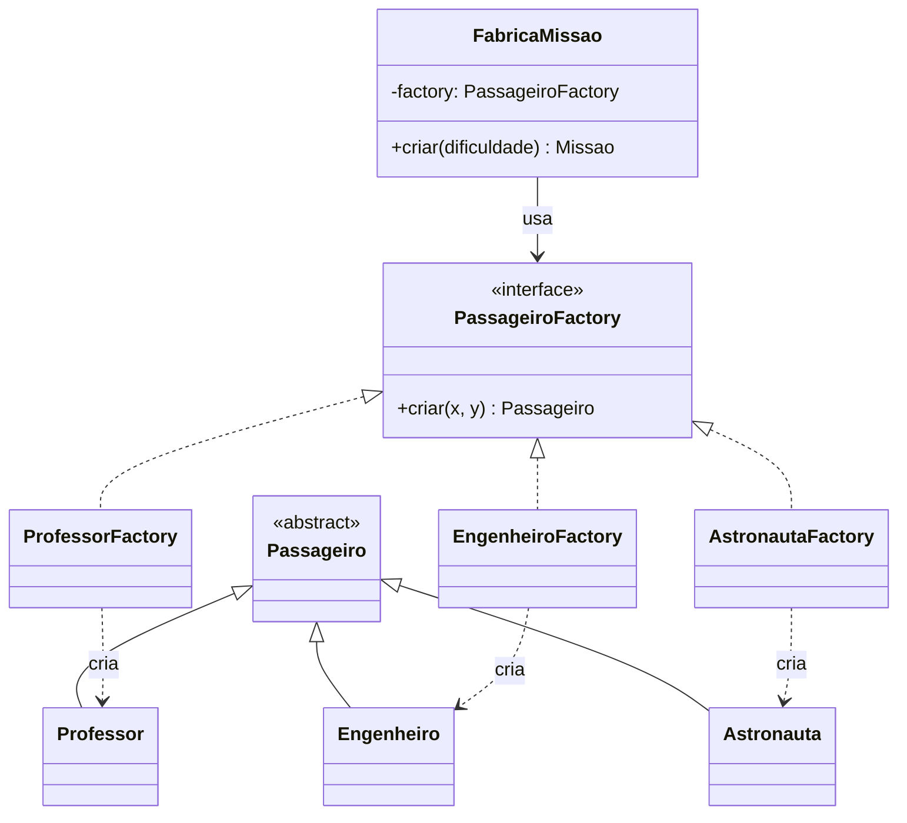

# GOF - Factory Method (Missão Marte)

## Intenção

Factory Method define uma interface para criação de objetos, permitindo que subclasses ou classes especializadas decidam qual tipo concreto instanciar.

## Também conhecido como

Virtual Constructor

## Aplicabilidade

Use o padrão Factory Method quando:

* uma classe não pode antecipar a classe de objetos que deve criar;
* uma classe quer que suas subclasses especifiquem os objetos que criam;
* classes delegam responsabilidade para uma dentre várias subclasses auxiliares, e você quer localizar o conhecimento de qual subclasse auxiliar que é a delegada.

## Estrutura

```
Creator
  └── factoryMethod() → Product
ConcreteCreator
  └── factoryMethod() → ConcreteProduct
```

## Participantes

* **Product** — define a interface dos objetos que o método fábrica cria.
* **ConcreteProduct** — implementa a interface de Product.
* **Creator** — declara o método fábrica, que retorna um objeto do tipo Product.
* **ConcreteCreator** — redefine o método fábrica para retornar uma instância de ConcreteProduct.

## Problema

Em `exercicio10/Main.java`, o método `criarPassageiroPolimorfico()` usava `Math.random()` com if/else para decidir qual tipo de passageiro criar:

```java
// ❌ ANTES — Main.java linha ~160
private Passageiro criarPassageiroPolimorfico(Missao missao, Dificuldade dificuldade) {
    double rand = Math.random();
    int x, y;
    do {
        x = (int) (Math.random() * missao.getLargura());
        y = (int) (Math.random() * missao.getAltura());
    } while (missao.posicaoOcupada(x, y));

    if (rand < 0.33) {
        return new Professor(x, y);
    } else if (rand < 0.66) {
        return new Engenheiro(x, y);
    } else {
        return new Astronauta(x, y);
    }
}
```

Problema: a lógica de *criação* está misturada com a lógica de *posicionamento*. Adicionar um novo tipo de passageiro exige editar esse if/else — viola OCP.

## Solução

Criar uma interface `PassageiroFactory` e uma implementação para cada tipo. Quem usa a fábrica não precisa saber qual tipo concreto cria.

## Diagrama de classes (Mermaid)



## Exemplo

```java
public interface PassageiroFactory {
    Passageiro criar(int x, int y);
}

public class ProfessorFactory implements PassageiroFactory {
    @Override
    public Passageiro criar(int x, int y) {
        return new Professor(x, y);
    }
}

public class EngenheiroFactory implements PassageiroFactory {
    @Override
    public Passageiro criar(int x, int y) {
        return new Engenheiro(x, y);
    }
}

public class AstronautaFactory implements PassageiroFactory {
    @Override
    public Passageiro criar(int x, int y) {
        return new Astronauta(x, y);
    }
}
```

Uso no criador de missão:

```java
public class FabricaMissao {
    private final PassageiroFactory[] factories = {
        new ProfessorFactory(),
        new EngenheiroFactory(),
        new AstronautaFactory()
    };

    public Passageiro criarPassageiroAleatorio(int x, int y) {
        PassageiroFactory factory = factories[(int)(Math.random() * factories.length)];
        return factory.criar(x, y);
    }
}
```

## Código completo

```java
// ── interfaces e classes de domínio ──────────────────────────────────────

abstract class Passageiro {
    protected final int x;
    protected final int y;

    Passageiro(int x, int y) {
        this.x = x;
        this.y = y;
    }

    abstract char getSimbolo();

    @Override
    public String toString() {
        return getClass().getSimpleName() + "(" + x + "," + y + ")";
    }
}

class Professor extends Passageiro {
    Professor(int x, int y) { super(x, y); }
    @Override public char getSimbolo() { return 'P'; }
}

class Engenheiro extends Passageiro {
    Engenheiro(int x, int y) { super(x, y); }
    @Override public char getSimbolo() { return 'E'; }
}

class Astronauta extends Passageiro {
    Astronauta(int x, int y) { super(x, y); }
    @Override public char getSimbolo() { return 'T'; }
}

// ── interface da fábrica ──────────────────────────────────────────────────

interface PassageiroFactory {
    Passageiro criar(int x, int y);
}

// ── fábricas concretas ────────────────────────────────────────────────────

class ProfessorFactory implements PassageiroFactory {
    @Override
    public Passageiro criar(int x, int y) { return new Professor(x, y); }
}

class EngenheiroFactory implements PassageiroFactory {
    @Override
    public Passageiro criar(int x, int y) { return new Engenheiro(x, y); }
}

class AstronautaFactory implements PassageiroFactory {
    @Override
    public Passageiro criar(int x, int y) { return new Astronauta(x, y); }
}

// ── criador de missão que usa a fábrica ──────────────────────────────────

class FabricaMissao {
    private static final PassageiroFactory[] FACTORIES = {
        new ProfessorFactory(),
        new EngenheiroFactory(),
        new AstronautaFactory()
    };

    public Passageiro criarPassageiroAleatorio(int maxX, int maxY) {
        int x = (int)(Math.random() * maxX);
        int y = (int)(Math.random() * maxY);
        PassageiroFactory factory = FACTORIES[(int)(Math.random() * FACTORIES.length)];
        Passageiro p = factory.criar(x, y);
        System.out.println("Criado: " + p + "  símbolo=" + p.getSimbolo());
        return p;
    }
}

// ── demonstração ──────────────────────────────────────────────────────────

public class MainFactoryMethod {
    public static void main(String[] args) {
        FabricaMissao fabrica = new FabricaMissao();

        System.out.println("=== Criando 6 passageiros aleatórios ===");
        for (int i = 0; i < 6; i++) {
            fabrica.criarPassageiroAleatorio(20, 10);
        }

        System.out.println();
        System.out.println("=== Usando fábrica específica ===");
        PassageiroFactory soAstronautas = new AstronautaFactory();
        Passageiro a = soAstronautas.criar(5, 3);
        System.out.println("Criado: " + a + "  símbolo=" + a.getSimbolo());
    }
}
```

## Exercícios

1. Crie uma `MedicoFactory` que produza um novo tipo de passageiro `Medico` com símbolo `'M'`. Qual arquivo você precisa criar? O que **não** precisa mudar?

2. Refatore `FabricaMissao` para receber uma `List<PassageiroFactory>` no construtor em vez de `FACTORIES` fixo. Como isso melhora a testabilidade?

3. Relacione: qual princípio SOLID este padrão ajuda a satisfazer ao eliminar o `if/else` de instanciação? Qual padrão GRASP o complementa?

## Checklist antes de usar

- [ ] Existe lógica `if/else` ou `switch` para escolher qual tipo concreto criar?
- [ ] Adicionar um novo tipo exigiria editar código existente (viola OCP)?
- [ ] O criador de objetos está acoplado às classes concretas que cria?
- [ ] Seria útil trocar a fábrica por testes (ex.: substituir por uma fábrica falsa)?

Se sim para qualquer item → Factory Method é candidato.
