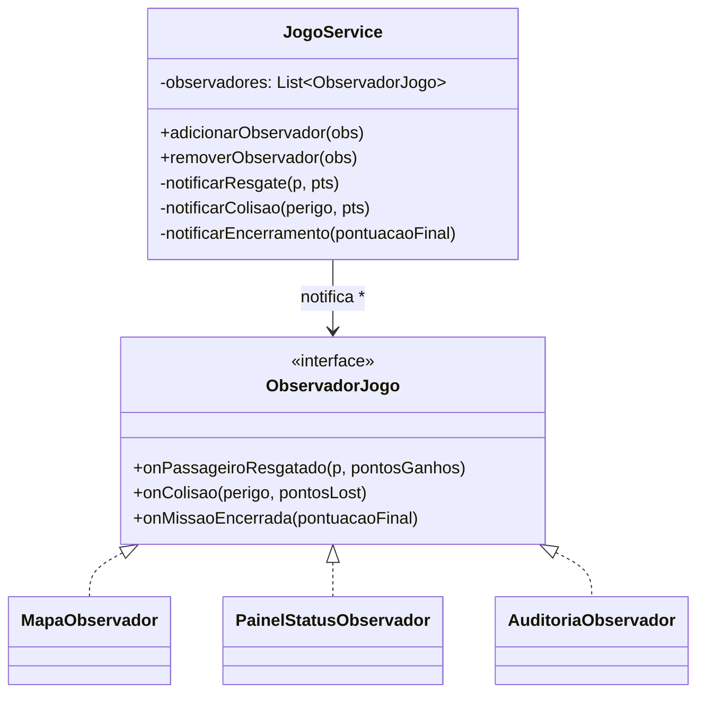

# GOF - Observer (Missão Marte)

## Definição

Observer define uma dependência um-para-muitos entre objetos. Quando o objeto observado muda de estado, todos os observadores cadastrados são notificados.

## Também conhecido como

Dependents, Publish-Subscribe

## Aplicabilidade

Use o padrão Observer em qualquer uma das seguintes situações:

* quando uma abstração tem dois aspectos, um dependente do outro — encapsulando esses aspectos em objetos separados, permite-se variá-los e reutilizá-los independentemente;
* quando uma mudança em um objeto exige mudanças em outros, e você não sabe quantos objetos necessitam ser mudados;
* quando um objeto deveria ser capaz de notificar outros objetos sem fazer hipóteses sobre quem são esses objetos — você não quer acoplamento forte.

## Estrutura

```
Subject
  ├── attach(Observer)
  ├── detach(Observer)
  └── notificar()  →  Observer.atualizar()
                         ├── ConcreteObserverA
                         └── ConcreteObserverB
```

## Participantes

* **Subject** — conhece seus observadores; fornece interface para associar e desassociar Observer.
* **Observer** — define uma interface de atualização para objetos que devem ser notificados de mudanças.
* **ConcreteSubject** — armazena estados de interesse; envia notificação quando seu estado muda.
* **ConcreteObserver** — implementa a interface de atualização para manter consistência com o Subject.

## Problema

Durante uma partida na Missão Marte, vários eventos ocorrem:

- Nave **resgatou um passageiro** → pontuação sobe
- Nave **colidiu com um perigo** → pontuação cai ou missão encerra
- Missão **encerrou** → exibir resultado e salvar ranking

Sem Observer, o `JogoService` precisa chamar diretamente cada componente interessado:

```java
// ❌ SEM OBSERVER — JogoService acoplado a todos os consumidores
void processarResgate(Passageiro p) {
    int pts = calcularPontos(p);
    pontuacao += pts;
    mapaRenderer.redesenhar(missao, nave);        // dependência direta
    painelStatus.atualizarPontuacao(pontuacao);   // dependência direta
    logAuditoria.registrar("resgate", p);         // dependência direta
    // adicionar novo componente = editar JogoService
}
```

## Solução

O `JogoService` (subject) notifica todos os `ObservadorJogo` inscritos. Cada observador decide o que fazer com o evento.

## Diagrama de classes (Mermaid)



## Exemplo

```java
public interface ObservadorJogo {
    void onPassageiroResgatado(Passageiro p, int pontosGanhos);
    void onColisao(Perigo perigo, int pontosLost);
    void onMissaoEncerrada(int pontuacaoFinal);
}

public class JogoService {
    private final List<ObservadorJogo> observadores = new ArrayList<>();
    private int pontuacao;

    public void adicionarObservador(ObservadorJogo obs) { observadores.add(obs); }
    public void removerObservador(ObservadorJogo obs)   { observadores.remove(obs); }

    private void notificarResgate(Passageiro p, int pts) {
        for (ObservadorJogo obs : observadores) {
            obs.onPassageiroResgatado(p, pts);
        }
    }

    public void processarResgate(Passageiro p) {
        int pts = calcularPontos(p);
        pontuacao += pts;
        notificarResgate(p, pts);     // ← todos os inscritos são notificados
    }
}

public class PainelStatusObservador implements ObservadorJogo {
    private int pontuacaoExibida = 0;

    @Override
    public void onPassageiroResgatado(Passageiro p, int pts) {
        pontuacaoExibida += pts;
        System.out.println("[PAINEL] Pontuação: " + pontuacaoExibida
            + "  (+" + pts + " por " + p.getClass().getSimpleName() + ")");
    }

    @Override
    public void onColisao(Perigo perigo, int pts) {
        pontuacaoExibida -= pts;
        System.out.println("[PAINEL] Colisão! Pontuação: " + pontuacaoExibida);
    }

    @Override
    public void onMissaoEncerrada(int pontuacaoFinal) {
        System.out.println("[PAINEL] MISSÃO ENCERRADA — Final: " + pontuacaoFinal);
    }
}
```

## Código completo

```java
import java.util.ArrayList;
import java.util.List;

// ── entidades de domínio ──────────────────────────────────────────────────

abstract class Passageiro {
    private final String tipo;
    private final int pontosValor;
    Passageiro(String tipo, int pontosValor) { this.tipo = tipo; this.pontosValor = pontosValor; }
    String getTipo()     { return tipo; }
    int getPontosValor() { return pontosValor; }
}

class Professor  extends Passageiro { Professor()  { super("Professor",  100); } }
class Engenheiro extends Passageiro { Engenheiro() { super("Engenheiro", 200); } }
class Astronauta extends Passageiro { Astronauta() { super("Astronauta", 300); } }

interface Perigo { String getTipo(); int getPenalidadePontos(); }

class Asteroide implements Perigo {
    @Override public String getTipo() { return "Asteroide"; }
    @Override public int getPenalidadePontos() { return 150; }
}

class Inimigo implements Perigo {
    @Override public String getTipo() { return "Inimigo"; }
    @Override public int getPenalidadePontos() { return 300; }
}

// ── interface do observador ───────────────────────────────────────────────

interface ObservadorJogo {
    void onPassageiroResgatado(Passageiro p, int pontosGanhos);
    void onColisao(Perigo perigo, int pontosLost);
    void onMissaoEncerrada(int pontuacaoFinal);
}

// ── sujeito observado: serviço de jogo ───────────────────────────────────

class JogoService {
    private final List<ObservadorJogo> observadores = new ArrayList<>();
    private int pontuacao = 1000; // pontuação inicial

    void adicionarObservador(ObservadorJogo obs) { observadores.add(obs); }
    void removerObservador(ObservadorJogo obs)   { observadores.remove(obs); }

    private void notificarResgate(Passageiro p, int pts) {
        List.copyOf(observadores).forEach(o -> o.onPassageiroResgatado(p, pts));
    }
    private void notificarColisao(Perigo perigo, int pts) {
        List.copyOf(observadores).forEach(o -> o.onColisao(perigo, pts));
    }
    private void notificarEncerramento() {
        List.copyOf(observadores).forEach(o -> o.onMissaoEncerrada(pontuacao));
    }

    void resgatar(Passageiro p) {
        int pts = p.getPontosValor();
        pontuacao += pts;
        notificarResgate(p, pts);
    }

    void colidir(Perigo perigo) {
        int pen = perigo.getPenalidadePontos();
        pontuacao = Math.max(0, pontuacao - pen);
        notificarColisao(perigo, pen);
    }

    void encerrarMissao() {
        notificarEncerramento();
    }

    int getPontuacao() { return pontuacao; }
}

// ── observadores concretos ────────────────────────────────────────────────

class PainelStatusObservador implements ObservadorJogo {
    @Override public void onPassageiroResgatado(Passageiro p, int pts) {
        System.out.printf("[PAINEL] ✓ Resgatado: %-10s (%+d pts)%n", p.getTipo(), pts);
    }
    @Override public void onColisao(Perigo p, int pts) {
        System.out.printf("[PAINEL] ✗ Colisão com %-10s (-%d pts)%n", p.getTipo(), pts);
    }
    @Override public void onMissaoEncerrada(int total) {
        System.out.println("[PAINEL] ═══ MISSÃO ENCERRADA — Pontuação final: " + total + " ═══");
    }
}

class AuditoriaObservador implements ObservadorJogo {
    private int resgates = 0;
    private int colisoes = 0;

    @Override public void onPassageiroResgatado(Passageiro p, int pts) { resgates++; }
    @Override public void onColisao(Perigo p, int pts)                 { colisoes++; }
    @Override public void onMissaoEncerrada(int total) {
        System.out.printf("[AUDITORIA] Resgates=%d  Colisões=%d  Pontuação=%d%n",
            resgates, colisoes, total);
    }
}

class SalvadorRankingObservador implements ObservadorJogo {
    private final String nomeJogador;
    SalvadorRankingObservador(String nome) { this.nomeJogador = nome; }

    @Override public void onPassageiroResgatado(Passageiro p, int pts) { }
    @Override public void onColisao(Perigo p, int pts) { }
    @Override public void onMissaoEncerrada(int total) {
        System.out.println("[RANKING] Salvando: " + nomeJogador + " → " + total + " pts");
    }
}

// ── demonstração ──────────────────────────────────────────────────────────

public class MainObserver {
    public static void main(String[] args) {
        JogoService jogo = new JogoService();

        jogo.adicionarObservador(new PainelStatusObservador());
        jogo.adicionarObservador(new AuditoriaObservador());
        jogo.adicionarObservador(new SalvadorRankingObservador("Comandante Alice"));

        System.out.println("=== Turno 1 ===");
        jogo.resgatar(new Professor());

        System.out.println();
        System.out.println("=== Turno 2 ===");
        jogo.resgatar(new Astronauta());

        System.out.println();
        System.out.println("=== Turno 3 — colisão ===");
        jogo.colidir(new Asteroide());

        System.out.println();
        System.out.println("=== Fim da missão ===");
        jogo.encerrarMissao();
    }
}
```

## Exercícios

1. Adicione `ContagemRegressivaObservador` que conta quantos passageiros faltam resgatar e exibe a contagem a cada resgate. Qual arquivo existente precisou ser alterado?

2. Por que `JogoService` usa `List.copyOf(observadores)` ao iterar para notificar? O que poderia acontecer sem essa cópia?

3. Relacione Observer com o padrão GRASP. Qual padrão GRASP `JogoService` segue ao notificar em vez de chamar diretamente? Qual princípio SOLID isso preserva?

## Checklist antes de usar

- [ ] Uma mudança de estado em um objeto precisa disparar ações em múltiplos outros objetos?
- [ ] O número de objetos interessados pode variar (pode crescer sem alterar o subject)?
- [ ] O subject não deveria conhecer os detalhes dos consumidores do evento?

Se sim → Observer é candidato.
