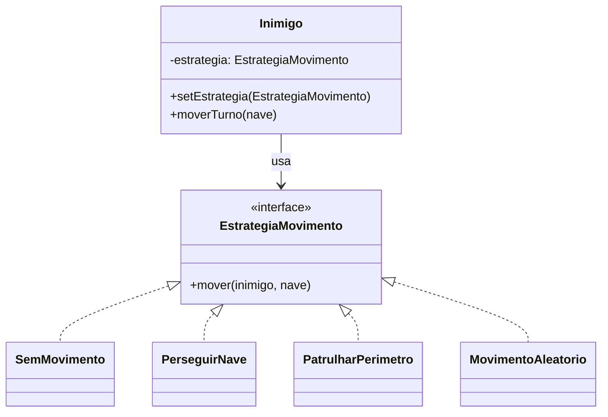

# GOF - Strategy (Missão Marte)

## Definição

Strategy encapsula algoritmos em classes separadas e permite trocar o comportamento em tempo de execução.

## Também conhecido como

Policy

## Aplicabilidade

Use o padrão Strategy quando:

* muitas classes relacionadas diferem somente no seu comportamento — as estratégias fornecem uma maneira de configurar uma classe com um dentre muitos comportamentos;
* você necessita de variantes de um algoritmo;
* um algoritmo usa dados dos quais os clientes não deveriam ter conhecimento;
* uma classe define muitos comportamentos, e estes aparecem em suas operações como múltiplos comandos condicionais. Em vez de muitos `if/switch`, mova os ramos para sua própria classe Strategy.

## Estrutura

```
Context → Strategy (interface)
              ├── ConcreteStrategyA
              ├── ConcreteStrategyB
              └── ConcreteStrategyC
```

## Participantes

* **Strategy** — define uma interface comum para todos os algoritmos suportados.
* **ConcreteStrategy** — implementa o algoritmo usando a interface de Strategy.
* **Context** — é configurado com um objeto ConcreteStrategy; mantém referência para Strategy.

## Problema

Na Missão Marte, inimigos e asteroides podem ter comportamentos de movimentação diferentes:

- **Asteroide**: estacionário (não se move).
- **InimigoPerseguidor**: persegue a nave — calcula a direção de menor distância.
- **InimigoPatrulheiro**: percorre um caminho fixo em loop.
- **InimigoAleatório**: move-se em direção aleatória a cada turno.

Sem Strategy, a lógica de movimentação vira um `switch` dentro de `JogoService` que viola OCP:

```java
// ❌ ANTES — switch por tipo de perigo
for (Perigo perigo : missao.getPerigos()) {
    if (perigo instanceof Inimigo) {
        Inimigo inimigo = (Inimigo) perigo;
        switch (inimigo.getTipo()) {
            case PERSEGUIDOR:
                // calcular direção para nave...
                break;
            case PATRULHEIRO:
                // avançar no caminho fixo...
                break;
        }
    }
    // Asteroide: não move — mas precisa de else aqui
}
// adicionar novo tipo = editar este bloco
```

## Solução

Definir uma interface `EstrategiaMovimento` e encapsular cada algoritmo numa classe. O `Inimigo` recebe a estratégia por injeção e delega o movimento.

## Diagrama de classes (Mermaid)



## Anti-exemplo: if/switch

```java
// ❌ sem Strategy — condicional crescente
void moverInimigos(List<Inimigo> inimigos, Nave nave) {
    for (Inimigo inimigo : inimigos) {
        if ("PERSEGUIDOR".equals(inimigo.getTipo())) {
            int dx = Integer.signum(nave.getX() - inimigo.getX());
            int dy = Integer.signum(nave.getY() - inimigo.getY());
            inimigo.moverPara(inimigo.getX() + dx, inimigo.getY() + dy);
        } else if ("PATRULHEIRO".equals(inimigo.getTipo())) {
            // lógica de patrulha...
        } else if ("ALEATORIO".equals(inimigo.getTipo())) {
            // lógica aleatória...
        }
        // adicionar novo tipo = editar este método
    }
}
```

## Exemplo

```java
public interface EstrategiaMovimento {
    void mover(Inimigo inimigo, Nave nave);
}

public class SemMovimento implements EstrategiaMovimento {
    @Override
    public void mover(Inimigo inimigo, Nave nave) {
        // estacionário — não faz nada
    }
}

public class PerseguirNave implements EstrategiaMovimento {
    @Override
    public void mover(Inimigo inimigo, Nave nave) {
        int dx = Integer.signum(nave.getX() - inimigo.getX());
        int dy = Integer.signum(nave.getY() - inimigo.getY());
        inimigo.moverPara(inimigo.getX() + dx, inimigo.getY() + dy);
    }
}

public class PatrulharPerimetro implements EstrategiaMovimento {
    private static final int[][] DIRECOES = {{1,0},{0,1},{-1,0},{0,-1}};
    private int passo = 0;

    @Override
    public void mover(Inimigo inimigo, Nave nave) {
        int[] dir = DIRECOES[passo % 4];
        inimigo.moverPara(inimigo.getX() + dir[0], inimigo.getY() + dir[1]);
        passo++;
    }
}
```

Uso no `Inimigo`:

```java
public class Inimigo {
    private int x, y;
    private EstrategiaMovimento estrategia;

    public Inimigo(int x, int y, EstrategiaMovimento estrategia) {
        this.x = x; this.y = y;
        this.estrategia = estrategia;
    }

    public void setEstrategia(EstrategiaMovimento e) { this.estrategia = e; }

    public void moverTurno(Nave nave) { estrategia.mover(this, nave); }

    public void moverPara(int nx, int ny) { this.x = nx; this.y = ny; }
}
```

## Código completo

```java
import java.util.Random;

// ── entidades de domínio ──────────────────────────────────────────────────

class Nave {
    private int x, y;
    Nave(int x, int y) { this.x = x; this.y = y; }
    int getX() { return x; } int getY() { return y; }
    void mover(int dx, int dy) { x += dx; y += dy; }
    @Override public String toString() { return "Nave(" + x + "," + y + ")"; }
}

// ── interface de estratégia ───────────────────────────────────────────────

interface EstrategiaMovimento {
    void mover(Inimigo inimigo, Nave nave);
    String nome();
}

// ── estratégias concretas ─────────────────────────────────────────────────

class SemMovimento implements EstrategiaMovimento {
    @Override public void mover(Inimigo i, Nave n) { /* estacionário */ }
    @Override public String nome() { return "ESTACIONÁRIO"; }
}

class PerseguirNave implements EstrategiaMovimento {
    @Override
    public void mover(Inimigo i, Nave n) {
        int dx = Integer.signum(n.getX() - i.getX());
        int dy = Integer.signum(n.getY() - i.getY());
        i.moverPara(i.getX() + dx, i.getY() + dy);
    }
    @Override public String nome() { return "PERSEGUIDOR"; }
}

class PatrulharPerimetro implements EstrategiaMovimento {
    private static final int[][] DIRECOES = {{1,0},{0,1},{-1,0},{0,-1}};
    private int passo = 0;

    @Override
    public void mover(Inimigo i, Nave n) {
        int[] dir = DIRECOES[passo % 4];
        i.moverPara(i.getX() + dir[0], i.getY() + dir[1]);
        passo++;
    }
    @Override public String nome() { return "PATRULHEIRO"; }
}

class MovimentoAleatorio implements EstrategiaMovimento {
    private static final int[][] DIRS = {{1,0},{-1,0},{0,1},{0,-1}};
    private final Random rng = new Random();

    @Override
    public void mover(Inimigo i, Nave n) {
        int[] dir = DIRS[rng.nextInt(DIRS.length)];
        i.moverPara(i.getX() + dir[0], i.getY() + dir[1]);
    }
    @Override public String nome() { return "ALEATÓRIO"; }
}

// ── contexto: inimigo com estratégia injetável ────────────────────────────

class Inimigo {
    private int x, y;
    private EstrategiaMovimento estrategia;

    Inimigo(int x, int y, EstrategiaMovimento estrategia) {
        this.x = x; this.y = y;
        this.estrategia = estrategia;
    }

    void setEstrategia(EstrategiaMovimento e) { this.estrategia = e; }

    void moverTurno(Nave nave) {
        int xAntes = x, yAntes = y;
        estrategia.mover(this, nave);
        System.out.printf("  [%s] (%d,%d) → (%d,%d)%n",
            estrategia.nome(), xAntes, yAntes, x, y);
    }

    void moverPara(int nx, int ny) { this.x = nx; this.y = ny; }

    int getX() { return x; }
    int getY() { return y; }
}

// ── demonstração ──────────────────────────────────────────────────────────

public class MainStrategy {
    public static void main(String[] args) {
        Nave nave = new Nave(10, 5);
        System.out.println("Nave: " + nave);
        System.out.println();

        Inimigo perseguidor = new Inimigo(0, 0, new PerseguirNave());
        Inimigo patrulheiro = new Inimigo(5, 5, new PatrulharPerimetro());
        Inimigo aleatorio   = new Inimigo(15, 8, new MovimentoAleatorio());

        System.out.println("=== Turno 1 ===");
        perseguidor.moverTurno(nave);
        patrulheiro.moverTurno(nave);
        aleatorio.moverTurno(nave);

        System.out.println();
        System.out.println("=== Turno 2 ===");
        perseguidor.moverTurno(nave);
        patrulheiro.moverTurno(nave);
        aleatorio.moverTurno(nave);

        System.out.println();
        System.out.println("=== Trocar estratégia em tempo de execução ===");
        System.out.println("Perseguidor vira Patrulheiro:");
        perseguidor.setEstrategia(new PatrulharPerimetro());
        perseguidor.moverTurno(nave);
    }
}
```

## Exercícios

1. Crie `FugirDaNave` — uma estratégia que move o inimigo na direção **oposta** à nave. Quantos arquivos existentes precisaram ser alterados?

2. Relacione Strategy com o princípio OCP. Por que adicionar `FugirDaNave` não exige editar `Inimigo` nem `JogoService`?

3. Como você usaria Strategy para implementar diferentes regras de cálculo de pontuação por dificuldade? Esboce as classes.

## Checklist antes de usar

- [ ] Existem variantes de um algoritmo representadas como `if/else` ou `switch`?
- [ ] Adicionar uma nova variante exigiria editar código existente?
- [ ] O comportamento precisa ser trocado em tempo de execução?
- [ ] Os algoritmos alternativos compartilham a mesma assinatura de entrada/saída?

Se sim → Strategy é candidato.
