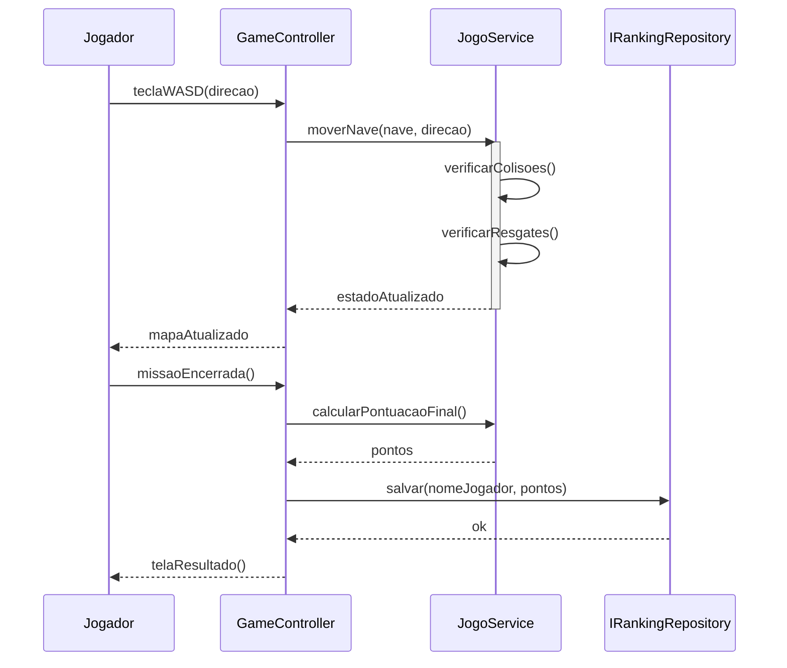

# Controller

**Definição**: um objeto que atua como intermediário entre a UI (ou camada de entrada) e o domínio, coordenando operações de uso do caso.

**Problema**: Quem deve tratar um evento de entrada do sistema gerado na interface do usuário?

**Solução**: Atribua a responsabilidade a uma classe que não seja de interface (non-UI), representando o sistema global, um dispositivo ou o cenário do caso de uso.

Tipos comuns de controller:

- `Facade Controller`: um controlador que representa um caso de uso de alto nível.
- `Session Controller`: gerencia uma sessão ou transação.

Quando usar:

- Para evitar que a camada de apresentação acesse diretamente várias classes do domínio.

Exemplo: `GameController` recebe entrada do teclado (WASD), traduz para operações e delega para `JogoService`.

Relação com SOLID

- **SRP:** o `Controller` tem a responsabilidade única de orquestrar o caso de uso, evitando que a UI contenha lógica de negócio.
- **DIP:** controllers costumam depender de interfaces de serviços (injetadas) em vez de implementações concretas.
- **ISP:** mantenha interfaces do controlador enxutas para não forçar dependentes a implementar métodos desnecessários.

## Diagrama de sequência

O diagrama abaixo ilustra como `GameController` coordena o fluxo da partida delegando para `JogoService` e `IRankingRepository`.



Exemplo evolutivo

No exemplo evolutivo, `GameController` atua como ponto de entrada da aplicação e delega ao `JogoService` para lógica de jogo. Isso separa responsabilidades da camada de apresentação e facilita testes.

Fluxo ilustrativo:

```text
Jogador -> GameController -> JogoService -> IRankingRepository
```

Trecho de código:

```java
public class GameController {
    private final JogoService jogoService;
    private final FabricaMissao fabricaMissao;
    private final IRankingRepository rankingRepository;
    private final Scanner scanner;

    public void iniciarPartida(Dificuldade dificuldade, String nomeJogador) {
        Missao missao = fabricaMissao.criar(dificuldade);
        Nave nave = new Nave(missao.getLargura() / 2, missao.getAltura() / 2);
        int pontos = jogoService.executarPartida(missao, nave, scanner);
        rankingRepository.salvar(new RankingEntry(nomeJogador, pontos));
    }
}
```

