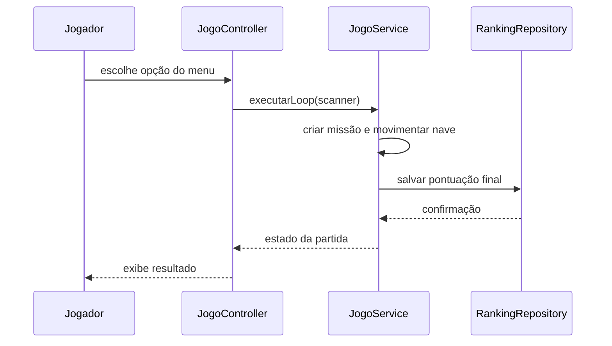

# Controller

**Definição**: um controlador é um objeto que coordena a interação entre a entrada do usuário e o domínio do sistema.

**Problema**: quem deve receber o comando do jogador e encaminhar a operação para as classes certas?

**Solução**: criar uma classe responsável por orquestrar o caso de uso, sem misturar essa responsabilidade com a lógica de negócios nem com a renderização.

## No contexto da Missão Marte

Em vez de colocar toda a lógica no `Main`, o sistema pode ter um componente de controle que:

- lê a opção do menu,
- inicia uma missão,
- delega o jogo para `JogoService`,
- chama a persistência do ranking quando necessário.

Isso deixa o código organizado e mais fácil de evoluir.

## Quando o Controller faz sentido?

Use um controller quando:

- a entrada do usuário precisa ser tratada,
- existe uma sequência de ações para um caso de uso,
- a camada de apresentação deve ficar simples,
- o domínio precisa receber comandos sem depender de console diretamente.

## Exemplo prático

Imagine uma classe `JogoController` que coordena o fluxo da partida:

```java
public class JogoController {
    private final JogoService jogoService;
    private final Scanner scanner;

    public JogoController(JogoService jogoService, Scanner scanner) {
        this.jogoService = jogoService;
        this.scanner = scanner;
    }

    public void iniciarAplicacao() {
        boolean executando = true;
        while (executando) {
            System.out.println("1. Iniciar missão");
            System.out.println("2. Ver ranking");
            System.out.println("3. Sair");

            String opcao = scanner.nextLine();
            switch (opcao) {
                case "1":
                    jogoService.executarLoop(scanner);
                    break;
                case "2":
                    jogoService.listarRanking();
                    break;
                case "3":
                    executando = false;
                    break;
            }
        }
    }
}
```

## Relação com GRASP

- **Controller**: a classe `JogoController` usa o padrão para orquestrar fluxos.
- **Information Expert**: a classe que conhece melhor o jogo é `JogoService`.
- **Low Coupling**: o controller não precisa conhecer detalhes de persistência; ele delega.
- **High Cohesion**: cada componente gerencia uma parte do fluxo sem misturar preocupações.

## Diagrama de sequência



## Observação importante

O controlador não substitui o `JogoService`.

O papel dele é coordenar o caso de uso; o papel do serviço é executar a lógica do jogo. Essa separação é um exemplo clássico de GRASP em ação.

## Conclusão

Na Missão Marte, o `Controller` ajuda a manter a entrada do usuário, a lógica do jogo e a persistência separadas. Isso reduz confusão, facilita manutenção e deixa o fluxo mais previsível.


