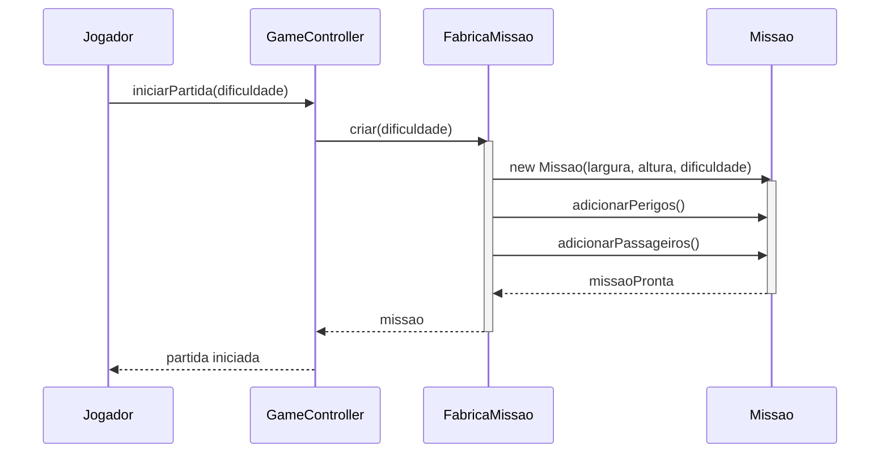

# Creator

**Definição**: uma classe A deve criar instâncias de classe B se A agrega, contém, usa ou tem informações necessárias para inicializar B.

**Problema**: Quem deve ser responsável por criar uma nova instância de uma classe?

**Solução**: Atribua à classe B a responsabilidade de criar A se B: (1) agrega ou contém A; (2) registra instâncias de A; (3) usa muito de perto objetos de A; ou (4) possui os dados de inicialização de A.

Regras comuns que justificam a criação:

- A contém objetos do tipo B
- A usa objetos do tipo B frequentemente
- A tem dados necessários para construir B

Exemplo: `FabricaMissao` cria `Missao` porque possui todas as informações necessárias (dificuldade, dimensões, número de perigos e passageiros).

Dicas:

- Evite que muitas classes criem diretamente dependências complexas; considere fábricas quando necessário.

Relação com SOLID

- **SRP:** ao atribuir criação a uma classe específica (ex.: `FabricaMissao`), reduz-se a responsabilidade de outras classes.
- **DIP:** prefira depender de abstrações (fábricas ou interfaces) para criação quando a construção envolver dependências externas.
- **OCP:** encapsular lógica de criação facilita alterar formas de criação sem modificar consumidores.

## Exemplo evolutivo (Missão Marte)

Inicialmente `Main` criava `Missao` diretamente com vários parâmetros espalhados. Ao aplicar `Creator`, movemos essa responsabilidade para `FabricaMissao`.

Trecho ilustrativo:

```java
// antes: Missao m = new Missao(20, 10, Dificuldade.MEDIO, ...); // em Main
// depois: FabricaMissao fabrica = new FabricaMissao();
//         Missao m = fabrica.criar(Dificuldade.MEDIO);
```

Exemplo simples (preferível quando a criação é direta)

Se a criação do `RankingEntry` é direta e ligada ao estado interno do ranking, `JogoService` pode criar e retornar a entrada — segue a forma mais simples e recomendada inicialmente:

```java
public class JogoService {
    private final List<RankingEntry> ranking = new ArrayList<>();

    public void registrarPontuacao(String nomeJogador, int pontos) {
        RankingEntry entry = new RankingEntry(nomeJogador, pontos); // JogoService cria o entry
        ranking.add(entry);
    }
}
```

Motivo: `JogoService` agrega `RankingEntry` e conhece os dados necessários para construí-lo (Information Expert + Creator). Use `FabricaMissao` para criações mais complexas que envolvam lógica externa.

### Diagrama de sequência

O diagrama abaixo mostra a interação típica quando `FabricaMissao` cria uma `Missao` seguindo o princípio Creator.



