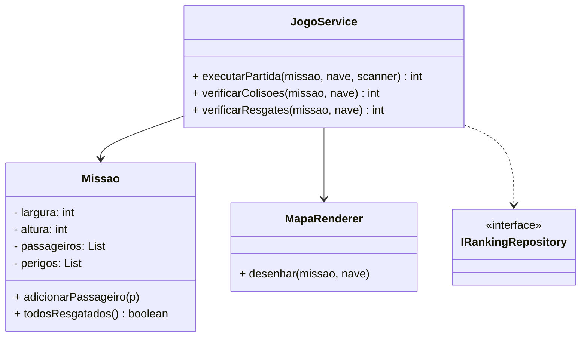
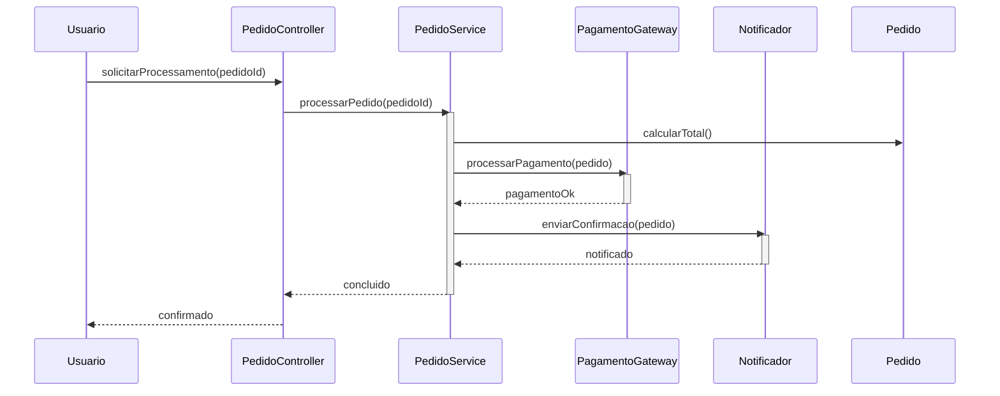

# High Cohesion (Alta Coesão)

**Definição**: manter as responsabilidades de uma classe fortemente relacionadas entre si, evitando misturar responsabilidades pouco conectadas.

**Problema**: Como manter as classes focadas e compreensíveis?

**Solução**: Atribua responsabilidades de modo que as tarefas de uma classe sejam fortemente relacionadas e focadas.

Benefícios:

- Classes coesas são mais fáceis de entender e modificar
- Reduz o acoplamento

Dicas:

- Refaça classes que acumulam responsabilidades distintas
- Combine com Low Coupling para design saudável

Relação com SOLID

- **SRP:** alta coesão é alinhada ao princípio da responsabilidade única — cada classe foca em um conjunto coeso de responsabilidades.
- **ISP:** coesão facilita criar interfaces específicas e evitar interfaces inchadas.

## Exemplo evolutivo (Missão Marte)

Ao perceber que `Missao` tinha cálculo de pontos, renderização do mapa E lógica de loop de jogo, extraímos cada responsabilidade para sua classe dedicada. Isso melhora a coesão de `Missao`.

Resumo prático: `Missao` — coesão de domínio (dados do mapa); `JogoService` — coesão de operações/fluxos; `MapaRenderer` — coesão de renderização.

Trechos de código (exemplos simples)

1) `Missao` — mantém apenas estado e dados do mapa:

```java
public class Missao {
    private final int largura;
    private final int altura;
    private final List<Passageiro> passageiros = new ArrayList<>();
    private final List<Perigo> perigos = new ArrayList<>();

    public void adicionarPassageiro(Passageiro p) { passageiros.add(p); }
    public void adicionarPerigo(Perigo p)         { perigos.add(p); }

    public List<Passageiro> getPassageiros() { return Collections.unmodifiableList(passageiros); }
    public List<Perigo> getPerigos()         { return Collections.unmodifiableList(perigos); }
}
```

2) `JogoService` — coege operações de fluxo (movimentação, colisões, resgates):

```java
public class JogoService {
    private final IRankingRepository rankingRepository;
    private final MapaRenderer mapaRenderer;

    public int executarPartida(Missao missao, Nave nave, Scanner scanner) {
        int pontos = 0;
        while (!missao.todosResgatados()) {
            mapaRenderer.desenhar(missao, nave);
            char tecla = scanner.next().charAt(0);
            moverNave(nave, tecla);
            pontos += verificarResgates(missao, nave);
            pontos -= verificarColisoes(missao, nave);
        }
        return pontos;
    }
}
```

3) `MapaRenderer` — coege renderização (Pure Fabrication / High Cohesion):

```java
public class MapaRenderer {
    public void desenhar(Missao missao, Nave nave) {
        // responsável apenas por renderizar a grade no console
        for (int y = 0; y < missao.getAltura(); y++) {
            for (int x = 0; x < missao.getLargura(); x++) {
                System.out.print(simboloEm(missao, nave, x, y));
            }
            System.out.println();
        }
    }
}
```

Diagramas (High Cohesion)

1) Diagrama de classes — mostra a separação de responsabilidades:



```

Arquivo externo para edição: `diagrams/high-cohesion-class.mmd`.

2) Diagrama de sequência — fluxo típico mostrando `PedidoService` como ponto coeso que orquestra cálculo, pagamento e notificação:



Arquivo externo para edição: `diagrams/high-cohesion-sequence.mmd`.
