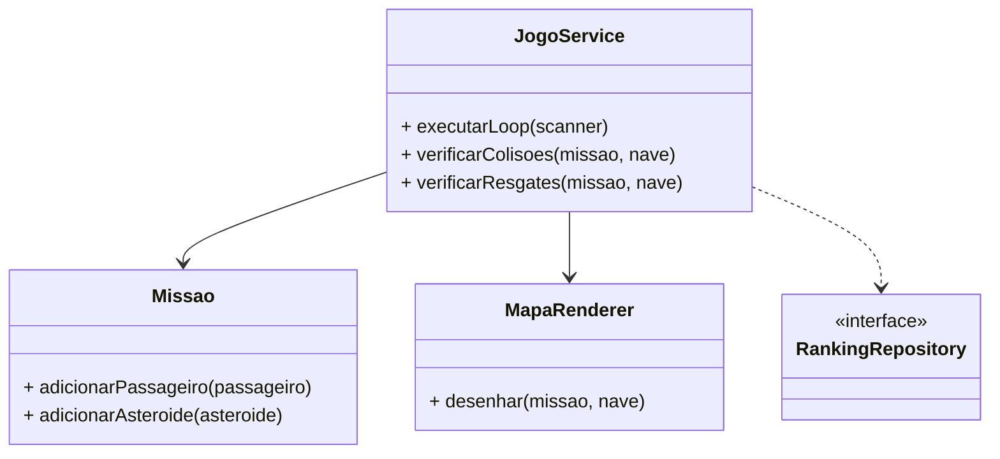

# High Cohesion (Alta Coesão)

**Definição**: uma classe deve conter responsabilidades que estão fortemente relacionadas entre si.

**Problema**: como evitar que uma classe vire um “saco de funções”?

**Solução**: organizar as responsabilidades de modo que cada classe tenha um foco claro e um conjunto de tarefas coerentes.

## Por que isso importa na Missão Marte?

Se a classe `Missao` fosse responsável por:

- desenhar o mapa,
- controlar o loop do jogo,
- salvar o ranking,
- validar colisões,
- decidir a pontuação,

ela teria baixa coesão e ficaria difícil de manter.

Em vez disso, a arquitetura separa bem as coisas:

- `Missao`: dados do domínio e estado da missão.
- `JogoService`: regras e fluxo principal da partida.
- `MapaRenderer`: representações visuais no console.
- `RankingRepository`: persistência da pontuação.

## Exemplo prático

### 1) `Missao` com coesão de domínio

```java
public class Missao {
    private final int largura;
    private final int altura;
    private final List<Passageiro> passageiros = new ArrayList<>();
    private final List<Asteroide> asteroides = new ArrayList<>();

    public void adicionarPassageiro(Passageiro passageiro) {
        passageiros.add(passageiro);
    }

    public void adicionarAsteroide(Asteroide asteroide) {
        asteroides.add(asteroide);
    }

    public List<Passageiro> getPassageiros() {
        return Collections.unmodifiableList(passageiros);
    }
}
```

Aqui a classe mantém informações do mundo do jogo e nada que não pertença ao domínio da missão.

### 2) `JogoService` com coesão de fluxo

```java
public class JogoService {
    private final RankingRepository rankingRepository;
    private final MapaRenderer mapaRenderer;

    public void executarLoop(Scanner scanner) {
        Missao missao = criarNovaMissao();
        Nave nave = missao.getNave();

        while (partidaAtiva) {
            mapaRenderer.desenhar(missao, nave);
            char comando = scanner.next().charAt(0);
            moverNave(nave, comando);
            verificarColisoes(missao, nave);
            verificarResgates(missao, nave);
        }
    }
}
```

Aqui a classe concentra a lógica de execução da partida, o que é uma responsabilidade coesa e bem definida.

### 3) `MapaRenderer` com coesão de apresentação

```java
public class MapaRenderer {
    public void desenhar(Missao missao, Nave nave) {
        for (int y = 0; y < missao.getAltura(); y++) {
            for (int x = 0; x < missao.getLargura(); x++) {
                System.out.print(simboloEm(missao, nave, x, y));
            }
            System.out.println();
        }
    }
}
```

Essa classe foca em uma responsabilidade específica: renderizar o estado do mapa.

## Benefícios da alta coesão

- a classe fica mais fácil de entender;
- a manutenção se torna mais segura;
- o código tem menos mistura de regras e apresentação;
- a reutilização fica mais simples.

## Relação com GRASP

- **SRP**: coesão ajuda a garantir que a classe tenha uma responsabilidade principal.
- **Information Expert**: a classe com os dados certos deve decidir o que fazer.
- **Low Coupling**: uma classe coesa tende a depender menos de outras classes para coisas que não pertencem a ela.

## Diagrama de classes



## Conclusão

Na Missão Marte, alta coesão significa que cada classe mantém um foco claro. Isso ajuda a deixar o software mais compreensível e mais fácil de evoluir.
