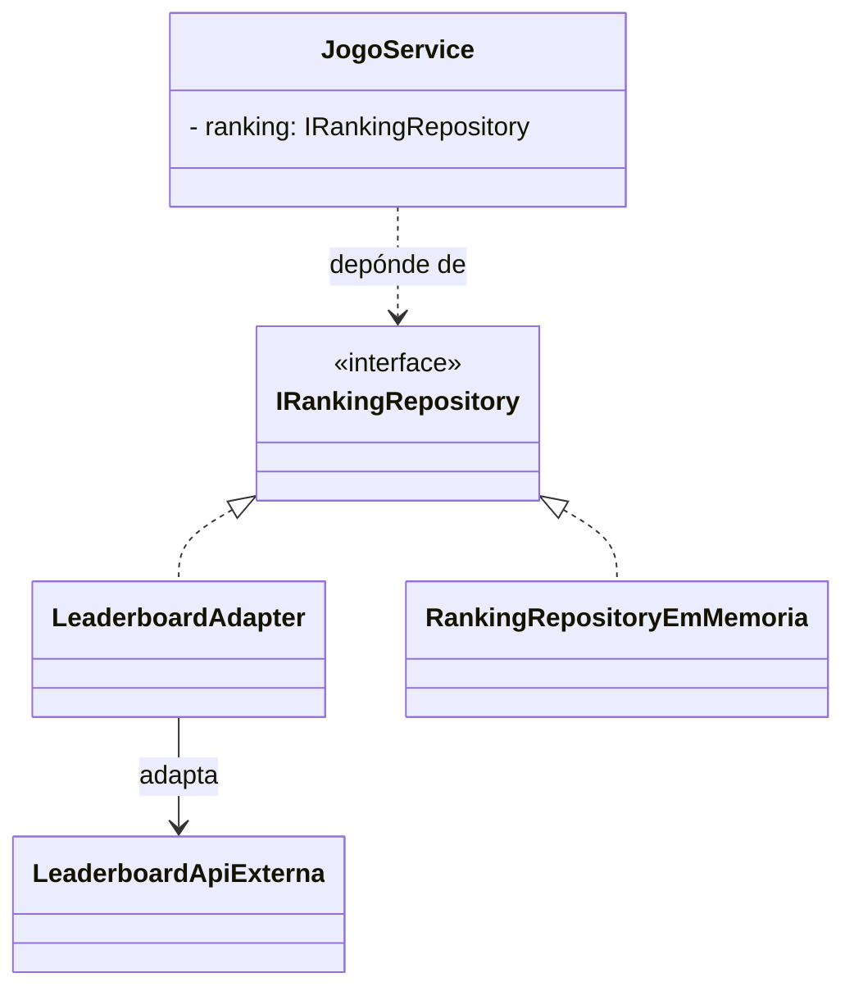
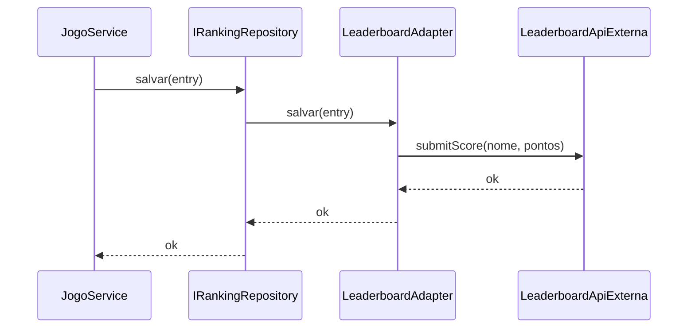
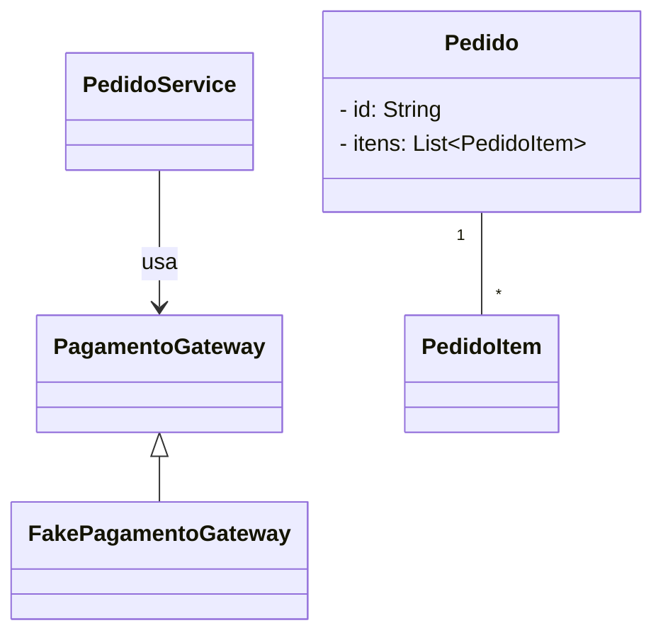
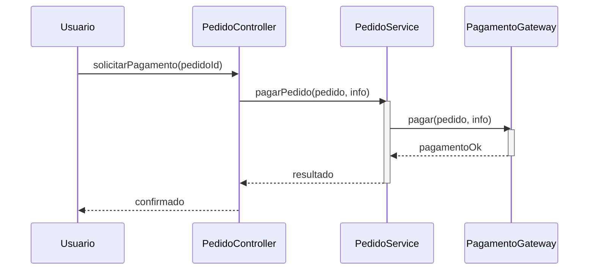

# Indirection

**Definição**: colocar um objeto intermediário para mediar entre duas entidades, reduzindo acoplamento e responsabilidades diretas.

**Problema**: Como evitar o acoplamento direto entre dois ou mais elementos?

**Solução**: Atribua a responsabilidade de mediação a um objeto intermediário.

Quando usar:

- Para interpor dependências entre módulos que não devem conhecer detalhes um do outro
- Para reduzir dependências cíclicas

Exemplo: `IRankingRepository` entre `JogoService` e o sistema de persistência (arquivo, banco), para isolar a camada de domínio de detalhes de infraestrutura.

Relação com SOLID

- **DIP:** indirection ajuda a depender de abstrações e isolar mudanças em implementações específicas.
- **OCP:** ao interpor intermediários, você protege partes do sistema contra mudanças externas.

## Exemplo evolutivo (Missão Marte)

Se decidirmos integrar um leaderboard externo (API web), inserimos um `LeaderboardAdapter` que faz indirection entre `JogoService` e a API externa. Assim, `JogoService` não conhece detalhes da API.

Trecho ilustrativo (interface):

```java
public interface IRankingRepository {
    void salvar(RankingEntry entry);
    List<RankingEntry> carregar();
}
```

O padrão Indirection protege o domínio das variações de infraestrutura.

Exemplos de código

1) `IRankingRepository` — interface que isola infraestrutura de persistência:

```java
public interface IRankingRepository {
    void salvar(RankingEntry entry);
    List<RankingEntry> carregar();
    void resetar();
}
```

2) `LeaderboardApiExterna` — API externa com métodos incompatíveis:

```java
public class LeaderboardApiExterna {
    public List<Score> fetchScores(int limit) { /* chama API REST */ return List.of(); }
    public void submitScore(String player, int score) { /* envia para API */ }
}
```

3) `LeaderboardAdapter` — Indirection entre `JogoService` e API externa:

```java
public class LeaderboardAdapter implements IRankingRepository {
    private final LeaderboardApiExterna api;

    public LeaderboardAdapter(LeaderboardApiExterna api) { this.api = api; }

    @Override
    public void salvar(RankingEntry entry) {
        api.submitScore(entry.getNome(), entry.getPontuacao());
    }

    @Override
    public List<RankingEntry> carregar() {
        return api.fetchScores(10).stream()
            .map(s -> new RankingEntry(s.getPlayer(), s.getScore()))
            .collect(Collectors.toList());
    }

    @Override public void resetar() { /* não suportado pela API */ }
}
```

4) Uso em `JogoService` — Indirection: não sabe qual implementação está atrás da interface:

```java
public class JogoService {
    private final IRankingRepository rankingRepository;

    public JogoService(IRankingRepository ranking) {
        this.rankingRepository = ranking;
    }

    public void registrarPontuacao(String nome, int pontos) {
        rankingRepository.salvar(new RankingEntry(nome, pontos));
    }
}
```

Diagramas

1) Diagrama de classes — Indirection com `LeaderboardAdapter`:



2) Diagrama de sequência — Indirection em ação:




1) Diagrama de classes — interface `PagamentoGateway` e adaptadores:



Arquivo externo para edição: `diagrams/indirection-class.mmd`.

2) Diagrama de sequência — fluxo de pagamento via indirection:



Arquivo externo para edição: `diagrams/indirection-sequence.mmd`.

Notas pedagógicas

- Explique que a interface `PagamentoGateway` é a abstração que permite inserir/adaptar múltiplos provedores sem alterar `PedidoService`.
- Mostre variações: adaptadores para Stripe, PayPal, ou mocks de teste — todos implementam a mesma interface.

