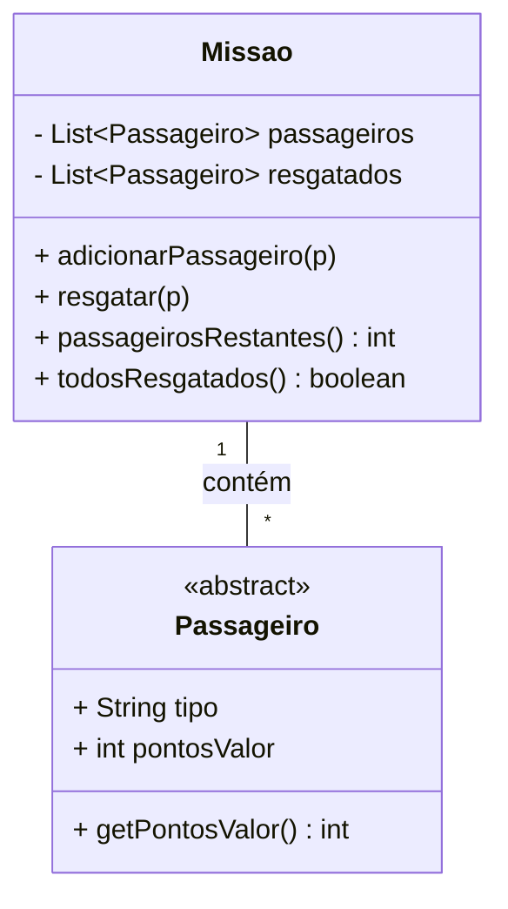
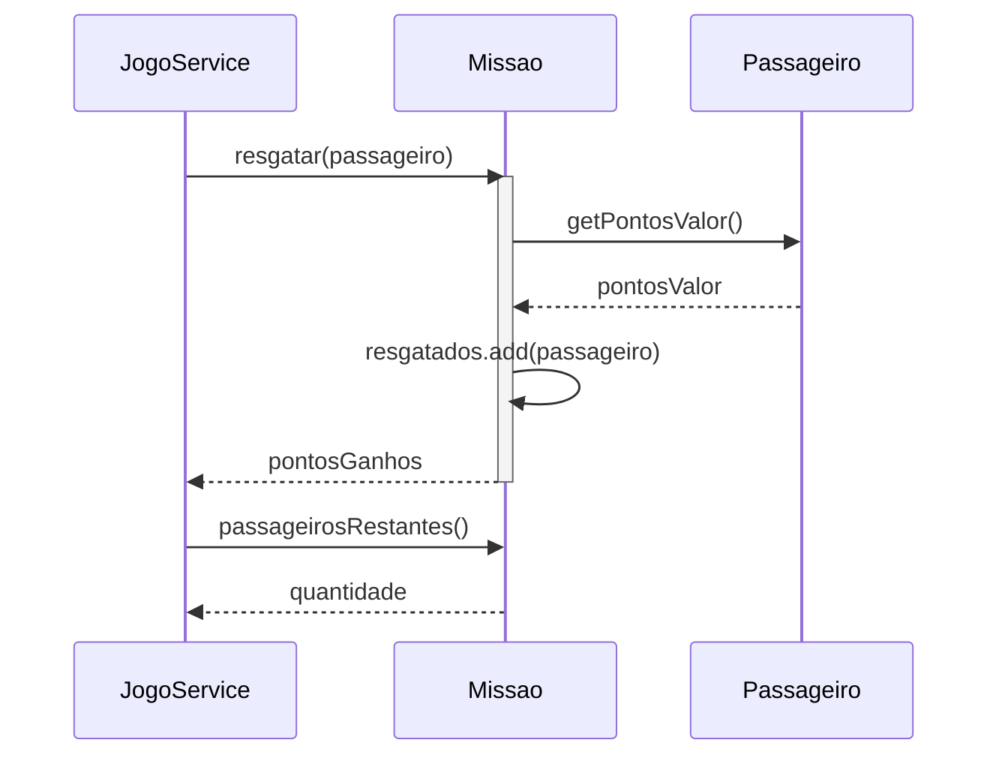

# Information Expert

Definição: atribuir responsabilidade à classe que possui a informação necessária para cumpri-la.

* **Problema:** Qual é o princípio básico para atribuir responsabilidades aos objetos?
* **Solução:** Atribua a responsabilidade à classe que possui a informação necessária para cumpri-la.

Quando aplicar:

- A classe já contém (ou pode acessar facilmente) os dados necessários.
- Evitar mover dados entre classes apenas para cumprir uma responsabilidade.

Exemplo: em uma missão, o cálculo de quantos passageiros faltam resgatar é responsabilidade de `Missao`, porque ela conhece a lista de passageiros.

Dicas:

- Prefira colocar comportamento onde estão os dados.
- Use com moderação quando violações de encapsulamento surgirem.

Relação com SOLID

- **SRP (Single Responsibility):** colocar comportamento no `Information Expert` ajuda a manter responsabilidades únicas em classes.
- **OCP (Open/Closed):** ao manter lógica relacionada aos dados na mesma classe, você facilita estender comportamento sem alterar outras classes.

## Exemplo evolutivo (Missão Marte)

No nosso exemplo, o método `passageirosRestantes()` permanece em `Missao` — um caso clássico de `Information Expert`. `Missao` sabe quais passageiros estão presentes e quais foram resgatados.

Referência de código: `Missao.java` contém a responsabilidade de calcular passageiros restantes.

Diagramas (Information Expert)

1) Diagrama de classes — mostra onde a responsabilidade está localizada:

2) Diagrama de sequência — fluxo do resgate e cálculo de restantes:

