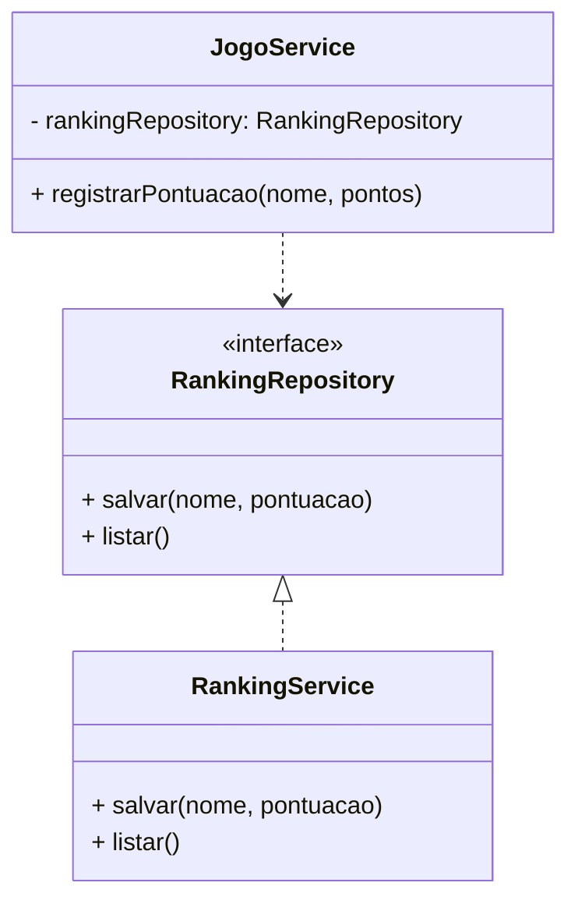
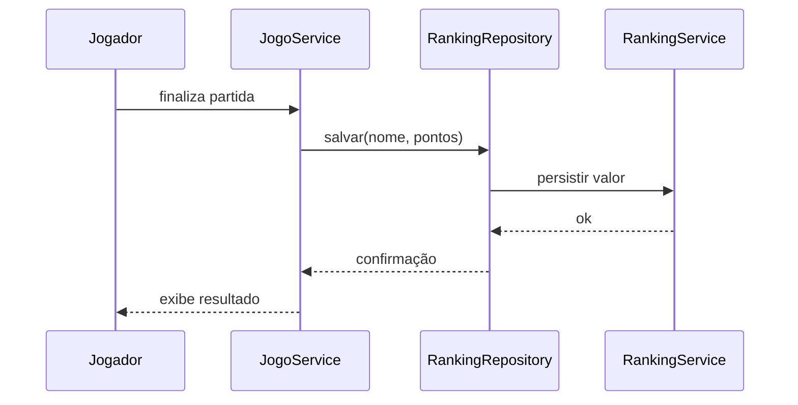

# Low Coupling (Baixo Acoplamento)

**Definição**: o design de um sistema deve minimizar as dependências entre classes para reduzir o impacto de mudanças.

**Problema**: o que acontece quando uma classe conhece detalhes de implementação de muitas outras?

**Solução**: atribuir responsabilidades de forma que cada componente dependa menos de outro e mais de abstrações ou interfaces.

## No contexto da Missão Marte

Uma boa arquitetura não faz `JogoService` depender diretamente da implementação concreta de armazenamento do ranking. Em vez disso, o serviço depende de uma abstração.

```java
public interface RankingRepository {
    void salvar(String nome, int pontuacao);
    List<RankingEntry> listar();
}

public class RankingService implements RankingRepository {
    // implementação concreta de arquivo/JSON
}
```

Agora o `JogoService` pode funcionar sem saber como o ranking é persistido.

## Exemplo prático

```java
public class JogoService {
    private final RankingRepository rankingRepository;

    public JogoService(RankingRepository rankingRepository) {
        this.rankingRepository = rankingRepository;
    }

    public void registrarPontuacao(String nome, int pontos) {
        rankingRepository.salvar(nome, pontos);
    }
}
```

Esse exemplo mostra baixo acoplamento porque:

- `JogoService` depende de uma abstração,
- a implementação concreta pode mudar,
- o serviço continua funcionando.

## Benefícios

- facilidade de manutenção;
- menos efeitos colaterais em mudanças;
- maior testabilidade;
- capacidade de trocar implementações sem quebrar o restante do sistema.

## Relação com GRASP

- **Low Coupling**: reduz dependências entre classes.
- **Indirection**: introduz uma camada de abstração para mediar a comunicação.
- **Protected Variations**: isola partes do sistema que podem mudar, como o mecanismo de persistência.

## Diagrama de classes



## Diagrama de sequência



## Conclusão

`Low Coupling` é importante porque a Missão Marte pode evoluir com novas formas de armazenamento, novos tipos de missão ou uma interface gráfica diferente. O sistema continua estável se as classes dependerem menos de detalhes concretos e mais de contratos bem definidos.

