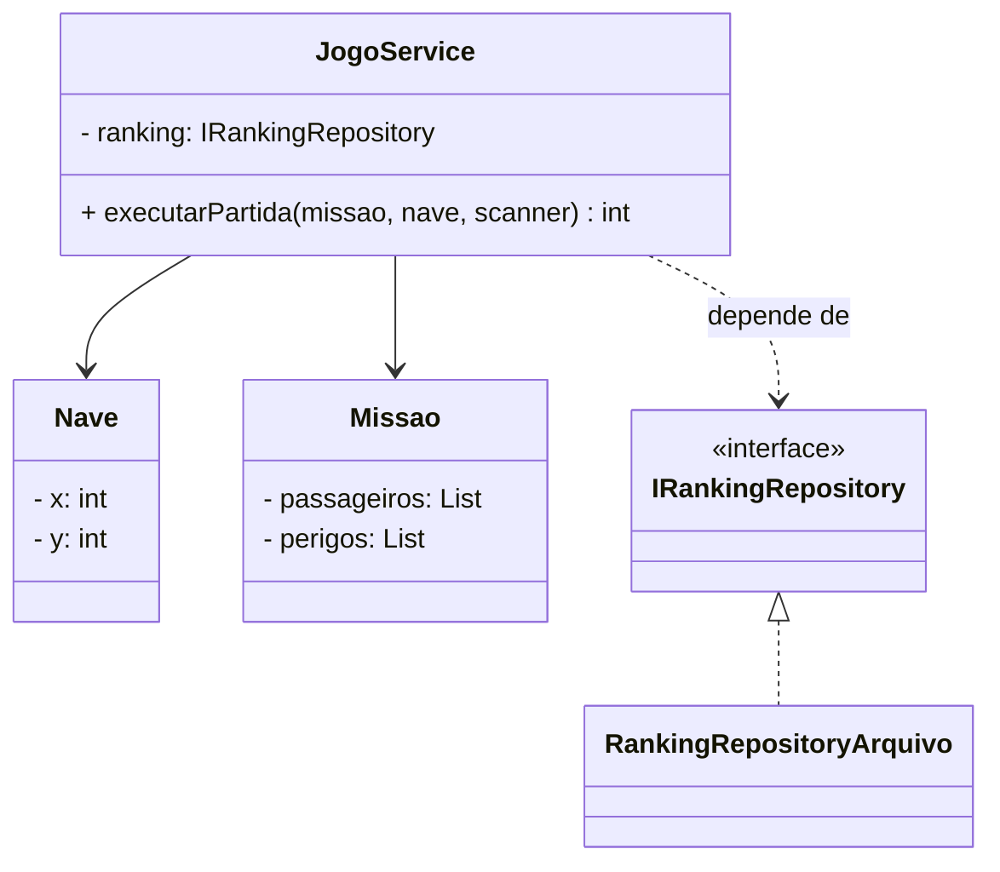
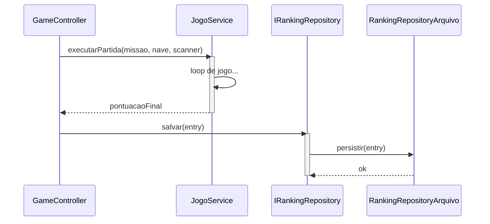
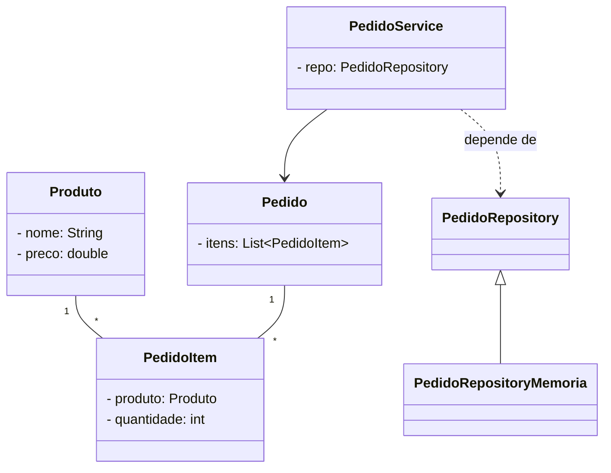
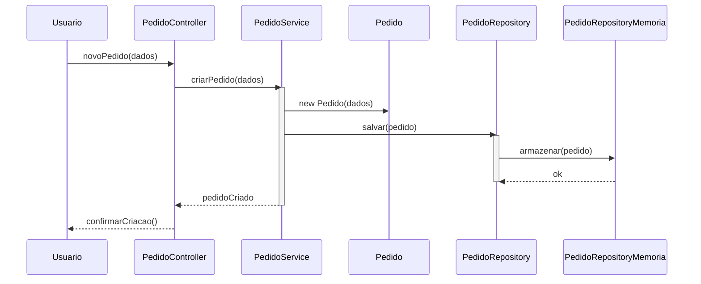

# Low Coupling (Baixo Acoplamento)

**Definição**: projetar classes de modo a minimizar dependências entre elas, reduzindo impacto de mudanças.

**Problema**: Como minimizar o impacto de mudanças e promover a reutilização?

**Solução**: Atribua responsabilidades para manter as dependências entre classes o mais baixas possível.

Vantagens:

- Facilita manutenção e evolução
- Melhora testabilidade

Estratégias:

- Separar responsabilidades claras
- Usar interfaces/abstrações
- Aplicar Indirection quando apropriado

Relação com SOLID

- **DIP:** reduzir acoplamento frequentemente exige dependência de abstrações ao invés de classes concretas.
- **ISP:** dividir interfaces grandes reduz acoplamento entre clientes e provedores.
- **SRP:** clareza nas responsabilidades diminui dependências desnecessárias.

Exemplo evolutivo (Missão Marte)

Ao evoluir, extraímos `IRankingRepository` e programamos `JogoService` para depender da interface em vez de uma implementação concreta. Isto é `Low Coupling` aplicado:

```java
public interface IRankingRepository {
    void salvar(RankingEntry entry);
    List<RankingEntry> carregar();
}
public class RankingRepositoryArquivo implements IRankingRepository { /* implementação */ }

public class JogoService {
    private final IRankingRepository ranking;
    public JogoService(IRankingRepository ranking) { this.ranking = ranking; }
}
```

Diagramas (Low Coupling)

1) Diagrama de classes — mostra como `JogoService` depende da abstração `IRankingRepository`:



2) Diagrama de sequência — `JogoService` delega persistência para a abstração `IRankingRepository`:




Diagramas (Low Coupling)

1) Diagrama de classes — mostra como `PedidoService` depende da abstração `PedidoRepository`, que pode ter uma implementação `PedidoRepositoryMemoria`:



Arquivo externo para edição: `diagrams/low-coupling-class.mmd`.

2) Diagrama de sequência — fluxo típico quando o `PedidoService` delega persistência para a abstração `PedidoRepository`, que por sua vez é implementada por `PedidoRepositoryMemoria`:



Arquivo externo para edição: `diagrams/low-coupling-sequence.mmd`.

