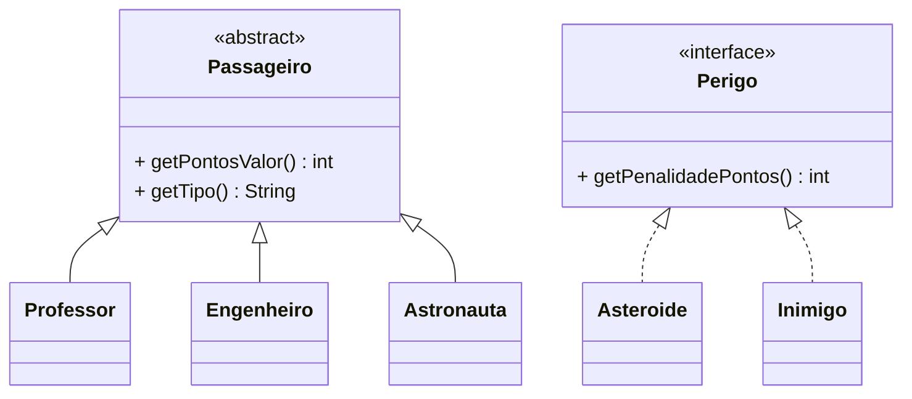
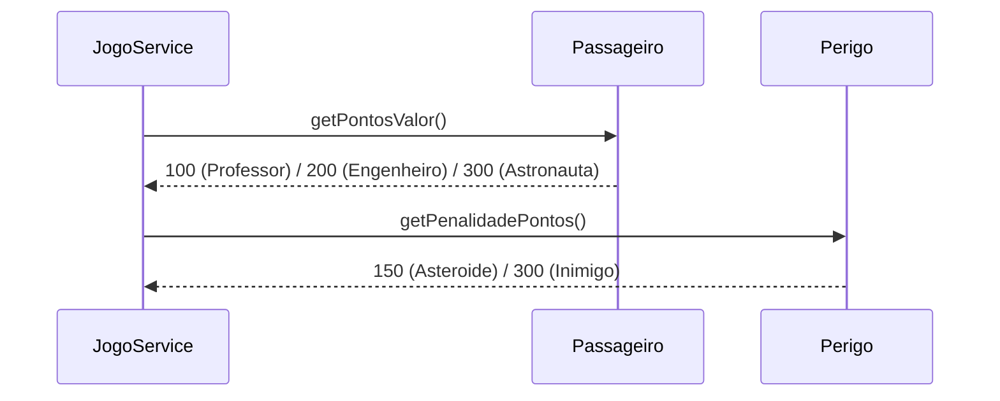
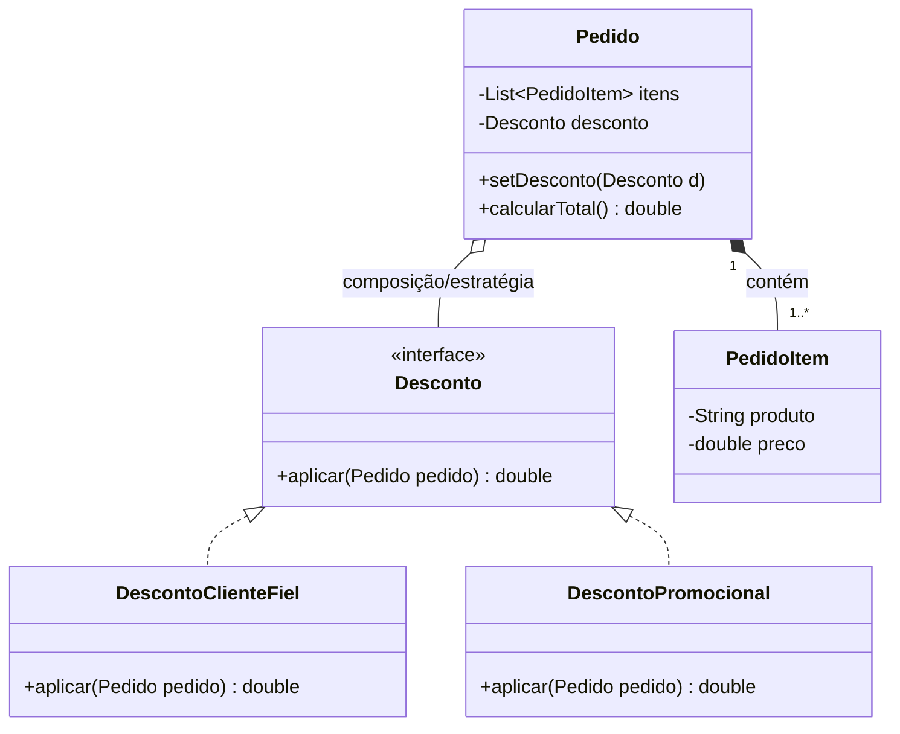
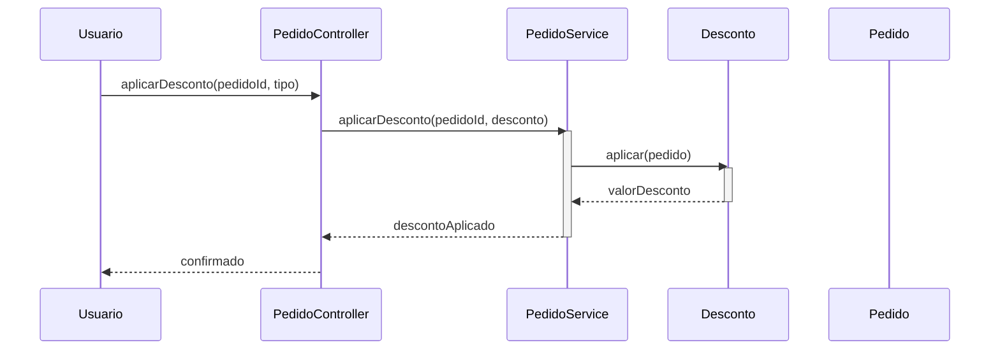

# Polymorphism

**Definição**: usar polimorfismo em vez de condicionais para variar comportamento com base no tipo de objeto.

**Problema**: Como tratar comportamentos que variam conforme o tipo sem usar ramificações explícitas (if/switch)?

**Solução**: Atribua o comportamento variável ao tipo para o qual a variação ocorre, utilizando operações polimórficas.

Quando aplicar:

- Quando o comportamento varia por tipo e você quer evitar `if/else` espalhados.

Exemplo: `Professor`, `Engenheiro` e `Astronauta` implementam `Passageiro` e cada um retorna seu próprio `getPontosValor()` sem nenhum `if` no cliente.

Relação com SOLID

- **OCP:** polimorfismo permite estender comportamentos (novos tipos de passageiro ou perigo) sem modificar o código cliente.
- **LSP:** ao usar hierarquias de tipos, garanta que substituições não quebrem contratos esperados.

## Exemplo evolutivo (Missão Marte)

Sem polimorfismo, `JogoService` usaria um `if/switch` por tipo de passageiro ao calcular pontos:

```java
// ❌ SEM POLIMORFISMO — condicional por tipo
if (p instanceof Professor) pontos += 100;
else if (p instanceof Engenheiro) pontos += 200;
else if (p instanceof Astronauta) pontos += 300;
```

Com polimorfismo, cada tipo responde pela sua própria pontuação:

```java
// ✅ COM POLIMORFISMO — delega para o objeto
pontos += passageiro.getPontosValor();
```

Trechos de código

1) `Passageiro` — abstração e implementações concretas:

```java
public abstract class Passageiro {
    public abstract int getPontosValor();
    public abstract String getTipo();
}

public class Professor extends Passageiro {
    @Override public int getPontosValor() { return 100; }
    @Override public String getTipo()     { return "Professor"; }
}

public class Engenheiro extends Passageiro {
    @Override public int getPontosValor() { return 200; }
    @Override public String getTipo()     { return "Engenheiro"; }
}

public class Astronauta extends Passageiro {
    @Override public int getPontosValor() { return 300; }
    @Override public String getTipo()     { return "Astronauta"; }
}
```

2) `Perigo` — interface polimórfica para asteroides e inimigos:

```java
public interface Perigo {
    int getPenalidadePontos();
    String getTipo();
}

public class Asteroide implements Perigo {
    @Override public int getPenalidadePontos() { return 150; }
    @Override public String getTipo()          { return "Asteroide"; }
}

public class Inimigo implements Perigo {
    @Override public int getPenalidadePontos() { return 300; }
    @Override public String getTipo()          { return "Inimigo"; }
}
```

3) `JogoService` — usa polimorfismo, sem nenhum `instanceof`:

```java
public int verificarResgates(Missao missao, Nave nave) {
    int pontos = 0;
    Iterator<Passageiro> it = missao.getPassageiros().iterator();
    while (it.hasNext()) {
        Passageiro p = it.next();
        if (nave.getX() == p.getX() && nave.getY() == p.getY()) {
            pontos += p.getPontosValor(); // polimorfismo
            it.remove();
        }
    }
    return pontos;
}
```

Diagramas (Polymorphism)

1) Diagrama de classes:



2) Diagrama de sequência — JogoService delega via polimorfismo:




Diagramas (Polymorphism)

1) Diagrama de classes — mostra a interface `Desconto` e suas implementações, além da associação com `Pedido`:



Arquivo externo para edição: `diagrams/polymorphism-class-clean.mmd`.

2) Diagrama de sequência — fluxo de aplicação de desconto via estratégia:



Arquivo externo para edição: `diagrams/polymorphism-sequence.mmd`.

