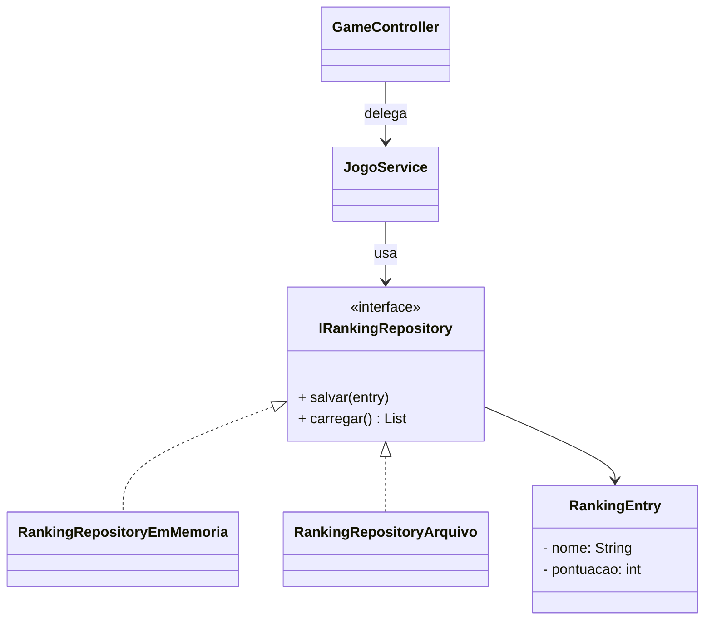
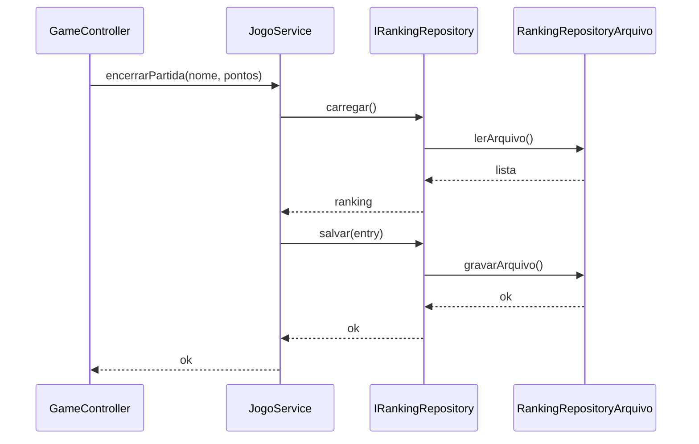

# Protected Variations

**Definição**: proteger elementos de um sistema contra variações previstas, definindo pontos de estabilidade (interfaces, abstrações).

**Problema**: Como proteger o sistema de instabilidades em elementos externos ou mutáveis?

**Solução**: Identifique pontos de variação previsíveis e envolva-os com uma interface estável, usando o Polimorfismo para as implementações.

Estratégia:

- Encapsular variações atrás de interfaces
- Usar indirection e pure fabrication para isolar mudanças

Exemplo: definir `IRankingRepository` para isolar diferentes estratégias de persistência do ranking (arquivo JSON, banco de dados, memória).

Relação com SOLID

- **DIP:** proteger variações frequentemente é feito invertendo dependências e programando para abstrações.
- **OCP:** encapsular variações atrás de interfaces permite estender comportamentos sem modificar código cliente.

## Exemplo evolutivo (Missão Marte)

Ao aplicar `Protected Variations`, definimos `IRankingRepository` para isolar o `JogoService` de saber se o ranking é salvo em arquivo, banco ou memória.

Trecho ilustrativo:

```java
public interface IRankingRepository {
    void salvar(RankingEntry entry);
    List<RankingEntry> carregar();
}
public class RankingRepositoryEmMemoria implements IRankingRepository { /* ... */ }
public class RankingRepositoryArquivo   implements IRankingRepository { /* ... */ }
```

Este padrão trabalha bem com `Indirection` e `Pure Fabrication`.

Exemplos de código

1) `IRankingRepository` — interface estável para proteger variações:

```java
public interface IRankingRepository {
    void salvar(RankingEntry entry);
    List<RankingEntry> carregar();
    void resetar();
    boolean ehTopScore(List<RankingEntry> ranking, int pontos);
}
```

2) Implementação em memória (para testes e aulas):

```java
public class RankingRepositoryEmMemoria implements IRankingRepository {
    private final List<RankingEntry> dados = new ArrayList<>();

    @Override public void salvar(RankingEntry entry) { dados.add(entry); }
    @Override public List<RankingEntry> carregar()   { return new ArrayList<>(dados); }
    @Override public void resetar()                  { dados.clear(); }
    @Override public boolean ehTopScore(List<RankingEntry> r, int pts) {
        return r.size() < 10 || r.stream().mapToInt(RankingEntry::getPontuacao).min().orElse(0) < pts;
    }
}
```

3) Uso no `GameController` — protegendo variações:

```java
// dentro de GameController
public void encerrarPartida(String nomeJogador, int pontos) {
    List<RankingEntry> ranking = rankingRepository.carregar();
    if (rankingRepository.ehTopScore(ranking, pontos)) {
        rankingRepository.salvar(new RankingEntry(nomeJogador, pontos));
    }
}
```

Diagramas

1) Diagrama de classes — `IRankingRepository` protege variações de persistência:



2) Diagrama de sequência — troca de implementação sem alterar `JogoService`:



