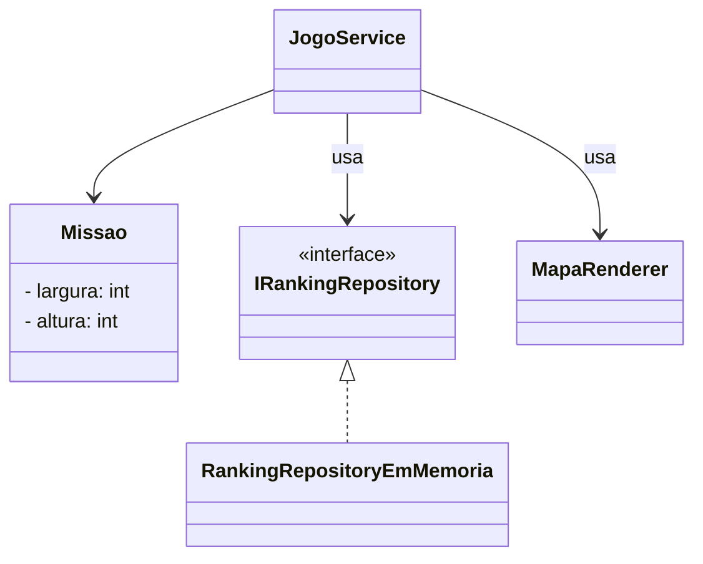
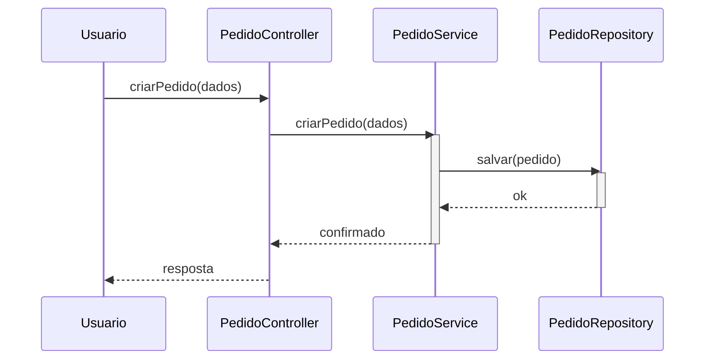

# Pure Fabrication

**Definição**: criar uma classe que não representa um conceito do domínio, mas que reduz acoplamento ou aumenta coesão (ex.: classes utilitárias, repositórios, adaptadores).

**Problema**: O que fazer quando o Especialista viola o Baixo Acoplamento ou a Alta Coesão?

**Solução**: Crie uma classe artificial, não pertencente ao domínio, para agrupar responsabilidades técnicas.

Uso:

- Quando mover responsabilidade para fora das classes de domínio reduz acoplamento ou melhora a coesão.

Exemplo: `MapaRenderer` é uma Pure Fabrication que separa a renderização do mapa (responsabilidade técnica) de `Missao` (entidade de domínio).

Relação com SOLID

- **SRP:** Pure Fabrication separa responsabilidades (renderização, persistência) fora das entidades do domínio.
- **DIP:** ao isolar persistência em uma classe fabricada, clientes podem depender de interfaces e não de implementações concretas.

## Exemplo evolutivo (Missão Marte)

`MapaRenderer` e `IRankingRepository` são exemplos de Pure Fabrication: não representam conceitos do domínio do jogo (nave, missão, passageiro), mas são necessários para organizar responsabilidades técnicas.

Exemplos de código

1) `IRankingRepository` — interface e implementação em memória (Pure Fabrication)

```java
public interface IRankingRepository {
    void salvar(RankingEntry entry);
    List<RankingEntry> carregar();
    void resetar();
}
```

```java
public class RankingRepositoryEmMemoria implements IRankingRepository {
    private final List<RankingEntry> dados = new ArrayList<>();

    @Override
    public void salvar(RankingEntry entry) { dados.add(entry); }

    @Override
    public List<RankingEntry> carregar() { return new ArrayList<>(dados); }

    @Override
    public void resetar() { dados.clear(); }
}
```

2) `MapaRenderer` — Pure Fabrication para renderização do mapa no console

```java
public class MapaRenderer {
    public void desenhar(Missao missao, Nave nave) {
        for (int y = 0; y < missao.getAltura(); y++) {
            for (int x = 0; x < missao.getLargura(); x++) {
                System.out.print(simboloEm(missao, nave, x, y));
            }
            System.out.println();
        }
    }

    private char simboloEm(Missao missao, Nave nave, int x, int y) {
        if (nave.getX() == x && nave.getY() == y)  return 'N';
        if (missao.temPassageiroEm(x, y))           return 'P';
        if (missao.temPerigoEm(x, y))               return 'X';
        return '.';
    }
}
```

3) Uso em `JogoService` — depende das pure fabrications, não do domínio

```java
public class JogoService {
    private final IRankingRepository rankingRepository;
    private final MapaRenderer mapaRenderer;

    public JogoService(IRankingRepository ranking, MapaRenderer renderer) {
        this.rankingRepository = ranking;
        this.mapaRenderer = renderer;
    }
}
```

Diagramas

1) Diagrama de classes — mostra as Pure Fabrications `MapaRenderer` e `IRankingRepository`:



```

Arquivo externo para edição: `diagrams/pure-fabrication-class.mmd`.

2) Diagrama de sequência — fluxo de persistência via `PedidoService` e `PedidoRepository`:



Arquivo externo para edição: `diagrams/pure-fabrication-sequence.mmd`.

Notas pedagógicas

- Explique que `PedidoRepository` não representa um conceito do domínio (não é "coisa" da feira), mas melhora o desenho ao isolar persistência.
- Mostre variações: repositório para JDBC, JPA ou adaptador para serviços externos — todas são Pure Fabrications que evitam poluir entidades de domínio.

