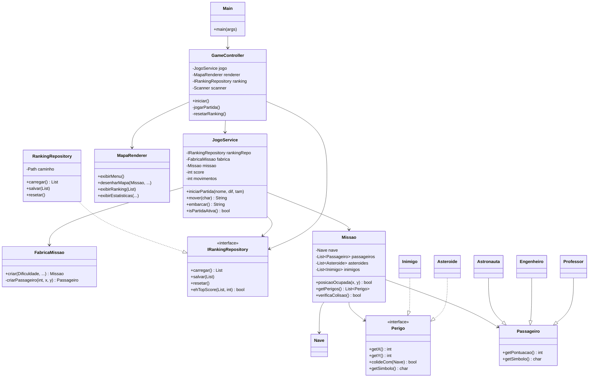
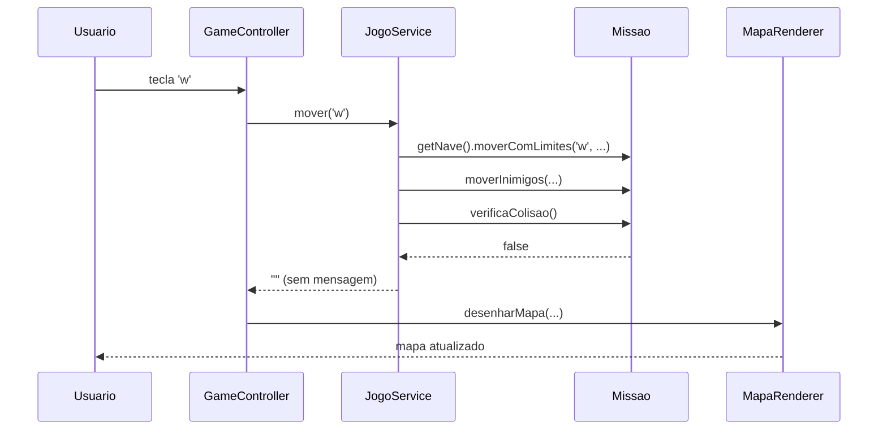

# Tutorial: Migrando o Exercício 10 para GRASP — Passo a Passo

> **Contexto:** Este tutorial parte do código **completo e funcional** do Exercício 10
> (`exercicio10/Main.java` + demais classes) e mostra, **passo a passo**, como migrá-lo
> para o pacote `graspexercicio10`, aplicando cada um dos **9 padrões GRASP**.
>
> Cada seção mostra o **código original** que está sendo substituído e o **código novo**
> que o substitui, com a explicação de qual padrão foi aplicado e por quê.

---

## Objetivos de Aprendizagem

Ao concluir este tutorial, o aluno será capaz de:

- Identificar violações de responsabilidade em código existente (a *"classe deus"*).
- Aplicar os 9 padrões GRASP: Information Expert, Creator, Controller, High Cohesion,
  Low Coupling, Polymorphism, Pure Fabrication, Indirection e Protected Variations.
- Descrever a diferença entre GRASP e SOLID.
- Ler um diagrama de classes e relacioná-lo às decisões de design.

---

## O que é GRASP?

**GRASP** é um conjunto de 9 padrões criado por **Craig Larman** (livro *Applying UML and
Patterns*, 1997). Cada padrão responde a uma pergunta fundamental sobre **onde** colocar
responsabilidades no design orientado a objetos.

> **GRASP ≠ SOLID**  
> SOLID define *princípios* de como classes devem ser estruturadas.  
> GRASP define *heurísticas* para decidir *quem* deve fazer *o quê*.  
> Os dois se complementam: aplicar GRASP geralmente satisfaz SOLID também.

| Padrão GRASP | Pergunta central |
|---|---|
| **Information Expert** | Quem tem os dados necessários para realizar esta operação? |
| **Creator** | Quem deve criar instâncias de determinada classe? |
| **Controller** | Quem deve tratar eventos de entrada do sistema? |
| **High Cohesion** | Esta classe tem responsabilidades muito diversas? |
| **Low Coupling** | Quantas outras classes esta classe conhece? |
| **Polymorphism** | Como evitar condicionais baseados em tipo? |
| **Pure Fabrication** | Quem deve fazer algo que nenhuma classe do domínio deveria? |
| **Indirection** | Como evitar acoplamento direto entre dois componentes? |
| **Protected Variations** | Como isolar partes que mudam de partes que não mudam? |

---

## Diagnóstico: O Problema do Exercício 10

O Exercício 10 funciona, mas o arquivo `Main.java` é uma **"classe deus"** (God Class):
tem ~550 linhas e é responsável por absolutamente tudo.

```
Main.java (exercício 10) — responsabilidades misturadas:
  ├── Exibir menu e ler input do usuário          → apresentação
  ├── Criar Missao, Nave, Passageiros...           → criação de objetos
  ├── Gerenciar loop de partida                   → controle de fluxo
  ├── Calcular pontuação inicial por dificuldade  → regra de negócio
  ├── Verificar posições ocupadas no mapa         → consulta ao domínio
  ├── Desenhar o mapa (com instanceof)            → renderização
  ├── Ler e gravar ranking em JSON                → persistência
  └── Exibir estatísticas                         → apresentação
```

**Consequências práticas:**
- Difícil de testar (tudo misturado).
- Qualquer mudança (ex.: novo formato de mapa) obriga alterar a mesma classe gigante.
- Alto acoplamento: Main conhece Missao, Nave, Passageiro, Asteroide, Inimigo, etc.

A migração GRASP resolve isso distribuindo cada responsabilidade para o lugar certo.

---

## Estrutura Final do Projeto GRASP

```
src/graspexercicio10/
│
├── Main.java                          ← 20 linhas (só monta dependências)
│
├── model/                             ← Domínio do jogo
│   ├── Perigo.java                    ← NOVO (Polymorphism)
│   ├── Passageiro.java                ← + getSimbolo()
│   ├── Professor.java                 ← + getSimbolo()
│   ├── Engenheiro.java                ← + getSimbolo()
│   ├── Astronauta.java                ← + getSimbolo()
│   ├── Nave.java
│   ├── Asteroide.java                 ← implementa Perigo
│   ├── Inimigo.java                   ← implementa Perigo
│   ├── Missao.java                    ← + posicaoOcupada() + getPerigos()
│   └── Dificuldade.java               ← + getPontuacaoInicial()
│
├── controller/
│   └── GameController.java            ← NOVO (Controller)
│
├── presentation/
│   └── MapaRenderer.java              ← NOVO (Pure Fabrication)
│
├── repository/
│   ├── IRankingRepository.java        ← NOVO (Protected Variations)
│   ├── RankingEntry.java              ← extraída de Main
│   └── RankingRepository.java         ← NOVO (Indirection + Pure Fabrication)
│
└── service/
    ├── FabricaMissao.java             ← NOVO (Creator + Pure Fabrication)
    └── JogoService.java               ← NOVO (High Cohesion + Low Coupling)
```

### Diagrama de Classes



---

## Parte 1 — Information Expert

### Definição

> Atribua a responsabilidade à classe que possui a informação necessária para cumpri-la.

### Problema no Exercício 10

`Main.java` calcula coisas que só existem porque outras classes têm os dados:

```java
// Em Main.java — linha ~240
private static int definirPontuacaoInicial(Dificuldade dificuldade) {
    switch (dificuldade) {
        case FACIL: return 30;
        case DIFICIL: return 15;
        default: return 20;
    }
}

// Em Main.java — linha ~300
private static boolean posicaoOcupada(Missao missao, int x, int y) {
    if (missao.getNave().getX() == x && missao.getNave().getY() == y) return true;
    for (Passageiro p : missao.getPassageiros()) { ... }
    for (Asteroide a : missao.getAsteroides())   { ... }
    for (Inimigo   i : missao.getInimigos())     { ... }
    return false;
}
```

**Diagnóstico:**
- Quem sabe qual é a pontuação de cada dificuldade? → `Dificuldade`.
- Quem tem todos os elementos do mapa para checar posições? → `Missao`.

### Solução GRASP

**`Dificuldade.java`** — o enum agora carrega sua própria regra:

```java
public enum Dificuldade {
    FACIL, MEDIO, DIFICIL;

    // Information Expert: a própria Dificuldade sabe sua pontuação inicial
    public int getPontuacaoInicial() {
        switch (this) {
            case FACIL:   return 30;
            case DIFICIL: return 15;
            default:      return 20;
        }
    }
}
```

**`Missao.java`** — a missão sabe quem ocupa cada posição:

```java
// Information Expert: Missao tem todos os dados necessários
public boolean posicaoOcupada(int x, int y) {
    if (nave.getX() == x && nave.getY() == y) return true;
    for (Passageiro p : passageiros) {
        if (p.getX() == x && p.getY() == y) return true;
    }
    for (Perigo p : getPerigos()) {
        if (p.getX() == x && p.getY() == y) return true;
    }
    return false;
}
```

**Antes vs. Depois:**

| | Antes | Depois |
|---|---|---|
| Onde fica a pontuação inicial? | `Main.definirPontuacaoInicial()` | `Dificuldade.getPontuacaoInicial()` |
| Onde fica a verificação de posição ocupada? | `Main.posicaoOcupada()` | `Missao.posicaoOcupada()` |
| Quem verifica colisão? | `Main` chamava `missao.verificaColisao()` (já estava certo) | `JogoService.mover()` chama `missao.verificaColisao()` |

---

## Parte 2 — Creator

### Definição

> Atribua a responsabilidade de criar um objeto **B** à classe **A** quando:
> - A **contém** ou **agrega** instâncias de B; ou
> - A tem os **dados de inicialização** de B; ou
> - A **usa** B de forma estreita.

### Problema no Exercício 10

`Main.criarNovaMissao()` cria `Nave`, `Missao`, `Passageiro`, `Asteroide` e `Inimigo`.
`Main` não deveria criar objetos de domínio — é papel da camada de serviço.

```java
// Em Main.java — ~50 linhas de criação de objetos
private static Missao criarNovaMissao(Random random, int minX, int maxX,
                                       int minY, int maxY, Dificuldade dificuldade) {
    Nave nave = new Nave("A-1", 5);
    Missao missao = new Missao(nave);
    // ... adiciona passageiros, asteroides, inimigos
    return missao;
}
```

### Solução GRASP

**`FabricaMissao.java`** — classe criada para concentrar toda a lógica de montagem:

```java
public class FabricaMissao {

    public Missao criar(Dificuldade dif, int minX, int maxX, int minY, int maxY, Random random) {
        Nave nave = new Nave("A-1", 5);
        Missao missao = new Missao(nave);

        int[] qtds = quantidades(dif);

        while (missao.getPassageiros().size() < qtds[0]) {
            int x = rand(random, minX, maxX);
            int y = rand(random, minY, maxY);
            if (missao.posicaoOcupada(x, y)) continue;    // Information Expert!
            missao.addPassageiro(criarPassageiro(missao.getPassageiros().size(), x, y));
        }
        // ... idem para asteroides e inimigos
        return missao;
    }
}
```

> **Observação:** `FabricaMissao` usa `Missao.posicaoOcupada()` (Information Expert)
> em vez de replicar a lógica de posição. Os padrões GRASP se complementam naturalmente.

---

## Parte 3 — Controller

### Definição

> Atribua a responsabilidade de tratar um evento de sistema a uma classe que:
> - Representa o **sistema como um todo** (*facade controller*); ou
> - Representa um **caso de uso** específico (*session controller*).

### Problema no Exercício 10

`Main.jogarPartida()` faz tudo: lê input, executa lógica e exibe resultado — tudo no
mesmo método de ~120 linhas.

```java
// Em Main.java — mistura de input + lógica + display
private static void jogarPartida(Scanner scanner, Random random, ...) {
    // lê nome, dificuldade...
    // cria missao...
    // while (partidaAtiva) {
    //     desenharMapa(...)          ← exibição
    //     String cmd = scanner...    ← input
    //     if (cmd == 'c') { ... }    ← lógica
    //     missao.moverInimigos(...)  ← lógica de domínio
    //     if (missao.verificaColisao()) { ... }  ← lógica
    // }
}
```

### Solução GRASP

**`GameController.java`** — separa a *orquestração* da *lógica* e da *exibição*:

```java
public class GameController {

    private final JogoService        jogo;      // lógica
    private final MapaRenderer       renderer;  // exibição
    private final IRankingRepository ranking;   // persistência
    private final Scanner            scanner;   // input

    public void iniciar() {
        renderer.exibirBoasVindas();
        boolean rodando = true;
        while (rodando) {
            renderer.exibirMenu();
            switch (lerLinha("Escolha uma opção: ", "1")) {
                case "1": jogarPartida(); break;
                case "2": renderer.exibirRanking(ranking.carregar()); break;
                case "3": resetarRanking(); break;
                case "4": rodando = false; break;
            }
        }
    }

    private void jogarPartida() {
        // ...configura e inicia via jogo.iniciarPartida(...)
        while (jogo.isPartidaAtiva()) {
            renderer.desenharMapa(...);                // exibição → MapaRenderer
            String resultado = jogo.mover(cmd);       // lógica → JogoService
            if (!resultado.isEmpty()) System.out.println(resultado);
        }
    }
}
```

### Diagrama de Sequência



---

## Parte 4 — High Cohesion

### Definição

> Uma classe deve ter responsabilidades **relacionadas** entre si e **limitadas** em quantidade.
> Classes com alta coesão são mais fáceis de entender, manter e reusar.

### Problema no Exercício 10

`Main.java` (~550 linhas) tem responsabilidades completamente diferentes:

| Responsabilidade | Deveria estar em... |
|---|---|
| Loop de menu e navegação | `GameController` |
| Loop de partida e comandos | `GameController` |
| Regras de vitória/derrota | `JogoService` |
| Renderização do mapa | `MapaRenderer` |
| Criação de objetos de missão | `FabricaMissao` |
| I/O de arquivo JSON | `RankingRepository` |

### Resultado da Migração

Cada classe resultante tem coesão alta:

| Classe | Linhas | Responsabilidade única |
|---|---|---|
| `Main.java` | 20 | Montar dependências e iniciar |
| `GameController` | 90 | Ler input e orquestrar fluxo |
| `JogoService` | 110 | Estado e regras da partida |
| `MapaRenderer` | 90 | Exibir tudo no console |
| `FabricaMissao` | 55 | Criar missão com seus elementos |
| `RankingRepository` | 110 | Persistir ranking em JSON |

---

## Parte 5 — Low Coupling

### Definição

> Minimize o número de dependências entre classes. Quanto menos uma classe conhece
> outras, mais independente ela é para ser alterada e testada.

### Problema no Exercício 10

`Main` conhece e usa diretamente: `Scanner`, `Random`, `Path`, `Files`, `Comparator`,
`Collectors`, `Missao`, `Nave`, `Passageiro`, `Professor`, `Engenheiro`, `Astronauta`,
`Asteroide`, `Inimigo`, `Dificuldade` e `RankingEntry` — **~16 dependências diretas**.

### Solução GRASP

Cada classe resultante tem, no máximo, 4–5 dependências:

```
Main               → GameController (1 dep.)
GameController     → JogoService, MapaRenderer, IRankingRepository, Scanner (4 dep.)
JogoService        → IRankingRepository, FabricaMissao, Missao, Dificuldade (4 dep.)
MapaRenderer       → Missao, Passageiro, Perigo, RankingEntry (4 dep.)
FabricaMissao      → Missao, Nave, Dificuldade, Passageiro subclasses (5 dep.)
RankingRepository  → Path, Files, RankingEntry, Dificuldade (4 dep.)
```

**Vantagem prática:** para trocar o formato de persistência (JSON → banco de dados),
basta criar uma nova implementação de `IRankingRepository`. Nenhuma outra classe muda.

---

## Parte 6 — Polymorphism

### Definição

> Use polimorfismo para variar comportamento baseado em tipo, em vez de usar
> condicionais (`if`/`switch` com `instanceof`).

### Problema no Exercício 10

`Main.desenharMapa()` usa `instanceof` para decidir o símbolo de cada passageiro:

```java
// Em Main.java — ANTES (com instanceof)
for (Passageiro p : missao.getPassageiros()) {
    if (p.getX() == x && p.getY() == y) {
        if (p instanceof Engenheiro) {
            symbol = 'E';
        } else if (p instanceof Astronauta) {
            symbol = 'T';
        } else {
            symbol = 'P';  // Professor (default)
        }
        break;
    }
}
```

**Problema:** se um novo tipo `Medico` for adicionado, é preciso alterar este método.

### Solução GRASP

Adicionar `getSimbolo()` em cada classe — cada objeto sabe seu próprio símbolo:

```java
// Passageiro.java
public char getSimbolo() { return 'P'; }   // default

// Engenheiro.java
@Override public char getSimbolo() { return 'E'; }

// Astronauta.java
@Override public char getSimbolo() { return 'T'; }
```

Para os perigos, criamos a interface `Perigo` com `getSimbolo()`:

```java
// Perigo.java
public interface Perigo {
    int getX();
    int getY();
    boolean colideCom(Nave nave);
    char getSimbolo();              // ← polimorfismo
}

// Asteroide.java implements Perigo
@Override public char getSimbolo() { return '#'; }

// Inimigo.java implements Perigo
@Override public char getSimbolo() { return 'X'; }
```

**`MapaRenderer.java`** — sem nenhum `instanceof`:

```java
// DEPOIS — polimorfismo puro
private char resolverSimbolo(Missao missao, Nave nave, int x, int y) {
    if (nave.getX() == x && nave.getY() == y) return '@';

    for (Passageiro p : missao.getPassageiros()) {
        if (p.getX() == x && p.getY() == y) return p.getSimbolo(); // polimorfismo!
    }
    for (Perigo p : missao.getPerigos()) {
        if (p.getX() == x && p.getY() == y) return p.getSimbolo(); // polimorfismo!
    }
    if (x == 0 && y == 0) return 'L';
    return '.';
}
```

Para adicionar um novo tipo `Medico`, basta criar a subclasse com `getSimbolo()` — nenhuma
outra classe precisa ser alterada.

---

## Parte 7 — Pure Fabrication

### Definição

> Crie uma classe que **não representa um conceito do domínio** quando for necessário
> atingir alta coesão e baixo acoplamento.
> Exemplos comuns: repositórios, renderizadores, fábricas, adaptadores.

### Problema no Exercício 10

O domínio do jogo — missão, nave, passageiros — não tem nenhuma entidade que saiba
renderizar o mapa em texto nem persistir ranking em arquivo. Mesmo assim, `Main`
carregava ambas as responsabilidades.

### Solução GRASP

Três Pure Fabrications foram criadas:

#### `MapaRenderer` — renderização

```java
/**
 * Pure Fabrication: não representa nenhum conceito do domínio do jogo.
 * Existe para isolar toda a responsabilidade de exibição no console.
 */
public class MapaRenderer {
    public void desenharMapa(Missao missao, ...) { ... }
    public void exibirMenu() { ... }
    public void exibirRanking(List<RankingEntry> ranking) { ... }
    public void exibirEstatisticas(...) { ... }
}
```

#### `RankingRepository` — persistência

```java
/**
 * Pure Fabrication: isola toda a I/O de arquivo JSON.
 * Não há nenhum "repositório" no domínio do jogo de nave espacial.
 */
public class RankingRepository implements IRankingRepository {
    public List<RankingEntry> carregar() { ... }
    public void salvar(List<RankingEntry> ranking) { ... }
    public void resetar() { ... }
}
```

#### `FabricaMissao` — criação

```java
/**
 * Pure Fabrication: encapsula a lógica de montagem de uma missão completa.
 * "Fábrica de missão" não é um conceito natural do domínio do jogo.
 */
public class FabricaMissao {
    public Missao criar(Dificuldade dif, int minX, int maxX, ...) { ... }
}
```

---

## Parte 8 — Indirection

### Definição

> Reduza o acoplamento entre dois componentes introduzindo um **intermediário** entre eles.
> O intermediário absorve o acoplamento e protege ambos os lados de mudanças no outro.

### Problema no Exercício 10

`Main` lê/grava diretamente em arquivo JSON com `Files.readAllBytes()` e `Files.write()`.
Qualquer mudança no formato de persistência requer alterar `Main`.

```
Antes:   Main ───(acesso direto)──→ Sistema de Arquivos (JSON)
```

### Solução GRASP

`RankingRepository` age como intermediário:

```
Depois:  JogoService → IRankingRepository → RankingRepository → Sistema de Arquivos
```

```java
// JogoService depende de IRankingRepository (abstração) — não de arquivos
public class JogoService {
    private final IRankingRepository rankingRepo;  // Indirection!

    private void finalizarComSucesso() {
        List<RankingEntry> ranking = rankingRepo.carregar();  // não sabe como é feito
        if (rankingRepo.ehTopScore(ranking, score)) {
            ranking.add(new RankingEntry(...));
            rankingRepo.salvar(ranking);             // não sabe onde é salvo
        }
    }
}
```

`JogoService` não importa `java.nio.file.*` — o acoplamento com o sistema de arquivos
ficou confinado em `RankingRepository`.

---

## Parte 9 — Protected Variations

### Definição

> Identifique pontos que podem variar ou ser instáveis. Crie uma **interface** ou
> **ponto de estabilidade** ao redor desses pontos para proteger o resto do sistema.

### Problema no Exercício 10

O formato do ranking (arquivo JSON) pode mudar: banco de dados, memória, API REST.
Sem proteção, cada mudança afetaria `Main` diretamente.

### Solução GRASP

A interface `IRankingRepository` é o ponto estável — o que pode variar fica atrás dela:

```java
// Protected Variations: interface estável que escuda o sistema
public interface IRankingRepository {
    List<RankingEntry> carregar();
    void salvar(List<RankingEntry> ranking);
    void resetar();
    boolean ehTopScore(List<RankingEntry> ranking, int score);
}
```

**Cenários de variação protegidos:**

| O que pode mudar | Implementação atual | Para trocar |
|---|---|---|
| Formato JSON → SQL | `RankingRepository` | Criar `SqlRankingRepository` |
| Arquivo local → API REST | `RankingRepository` | Criar `ApiRankingRepository` |
| Top 5 → Top 10 | `RankingRepository.MAX_ENTRADAS` | Só muda lá |
| Nenhuma dessas | `Main.java`, `JogoService.java`, `GameController.java` | Não muda nada |

```java
// Para trocar a persistência, só Main.java precisa mudar (1 linha)
IRankingRepository rankingRepo = new RankingRepository(Paths.get("ranking.json"));
// ou:
IRankingRepository rankingRepo = new SqlRankingRepository("jdbc:sqlite:ranking.db");
// Nenhuma outra classe precisa saber.
```

---

## Resumo: Mapeamento de Responsabilidades

A tabela abaixo mostra onde cada responsabilidade da `Main` original foi para:

| Responsabilidade (em Main original) | Padrão GRASP aplicado | Classe destino |
|---|---|---|
| Exibir menu | High Cohesion, Pure Fabrication | `MapaRenderer` |
| Loop de menu e navegação | Controller | `GameController` |
| Loop de partida e comandos | Controller | `GameController` |
| Ler input do console | Controller | `GameController` |
| Criar missão com elementos | Creator, Pure Fabrication | `FabricaMissao` |
| Pontuação inicial por dificuldade | Information Expert | `Dificuldade.getPontuacaoInicial()` |
| Verificar posição ocupada | Information Expert | `Missao.posicaoOcupada()` |
| Regras de pontuação e vitória | High Cohesion, Low Coupling | `JogoService` |
| Desenhar mapa (sem instanceof) | Polymorphism, Pure Fabrication | `MapaRenderer` |
| Símbolo de cada entidade | Polymorphism, Information Expert | `getSimbolo()` em cada classe |
| Ler/gravar arquivo JSON | Indirection, Pure Fabrication | `RankingRepository` |
| Isolar mudança no formato de rank. | Protected Variations | `IRankingRepository` |
| Montar dependências | Low Coupling | `Main` (20 linhas) |

---

## Parte 10 — Como Compilar e Executar

### Pré-requisitos

- JDK 11 ou superior instalado.
- Executar os comandos a partir da **pasta raiz** `missaoMarteUnifor/grasp/src/`.

### Compilação

```bash
# Windows (PowerShell)
$files = Get-ChildItem -Recurse -Filter "*.java" | Select-Object -ExpandProperty FullName
javac -d out $files

# Linux / macOS
find graspexercicio10 -name "*.java" | xargs javac -d out
```

### Execução

```bash
java -cp out graspexercicio10.Main
```

### Resultado esperado

```
================================================================
        MISSÃO MARTE UNIFOR — GRASP Edition
================================================================
  Pilote sua nave, salve os passageiros e desvie dos perigos!
================================================================

--- MENU PRINCIPAL ---
1. Iniciar Nova Missão
2. Visualizar Ranking Top 5
3. Resetar Histórico de Ranking
4. Sair do Jogo
----------------------
Escolha uma opção: _
```

---

## Parte 11 — GRASP × SOLID: Como se Relacionam

Aplicar GRASP neste exercício naturalmente satisfaz os princípios SOLID:

| Padrão GRASP aplicado | Princípio SOLID satisfeito |
|---|---|
| High Cohesion + Controller + Pure Fabrication | **SRP** — cada classe tem uma razão para mudar |
| Polymorphism (`getSimbolo()`) | **OCP** — adicionar novo passageiro não altera `MapaRenderer` |
| Polymorphism (herança de `Passageiro`) | **LSP** — todo `Passageiro` pode substituir outro |
| `IRankingRepository` (Protected Variations) | **ISP** — interface enxuta e específica |
| `IRankingRepository` (Indirection) | **DIP** — `JogoService` depende de abstração |

---

## Exercícios Propostos

1. **Novo tipo de passageiro:** Crie `Geologo.java` com pontuação 25 e símbolo `G`.
   Quantas classes precisam ser modificadas? (Resposta esperada: apenas `FabricaMissao`.)

2. **Novo formato de ranking:** Crie `MemoriaRankingRepository.java` que mantém o ranking
   apenas na memória (sem arquivo). Quantas classes precisam ser modificadas?

3. **Novo tipo de perigo:** Crie `BuracoNegro.java` que implementa `Perigo` com símbolo `O`
   e que, em vez de destruir a nave, reduz a pontuação em 10.
   Quais classes precisam ser modificadas?

4. **Teste unitário:** Escreva um teste (com `assert`) para `Missao.posicaoOcupada()`.
   Por que é fácil testá-lo agora, ao contrário do exercício 10 original?

5. **Análise de acoplamento:** Faça uma tabela com todas as dependências de `JogoService`.
   Compare com o número de dependências de `Main` no exercício 10.
