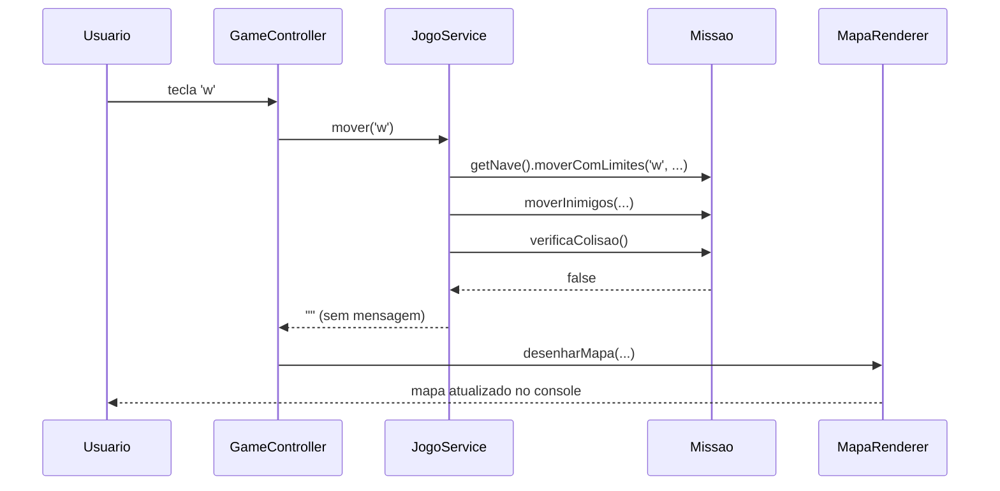
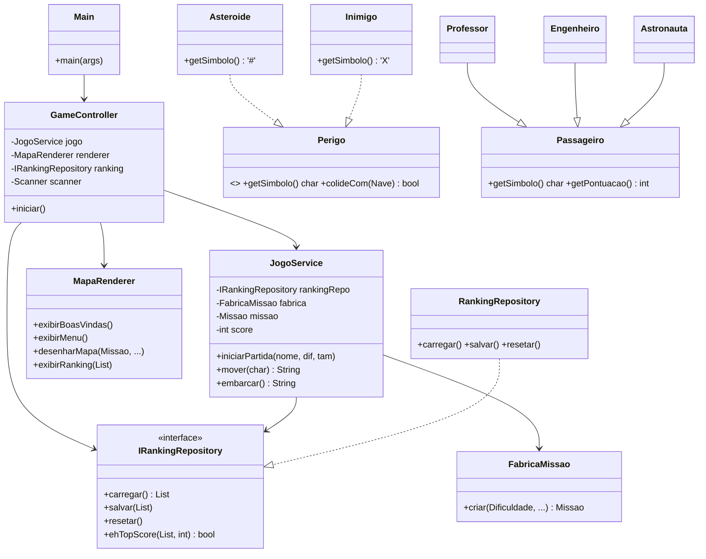

# Tutorial: Migrando o Exercício 10 para GRASP — Passo a Passo

> **Contexto:** Este tutorial parte do código **completo e funcional** do Exercício 10
> (`exercicio10/`) e mostra **passo a passo** como migrá-lo para o pacote
> `graspexercicio10/`, aplicando cada um dos **9 padrões GRASP**.
>
> Cada etapa mostra:  
> 🔴 **ANTES** — o trecho exato do exercício 10 que viola o padrão  
> 🟢 **DEPOIS** — o novo código em `graspexercicio10/`  
> 🔵 **Por que** — qual padrão GRASP foi aplicado e qual problema resolve

---

## O que é GRASP?

**GRASP** (*General Responsibility Assignment Software Patterns*) é um conjunto de
9 heurísticas criado por **Craig Larman** para responder à pergunta central do design OO:
**"Quem deve ser responsável por quê?"**

> **GRASP ≠ SOLID**  
> SOLID define *princípios* estruturais de uma classe.  
> GRASP define *onde* colocar cada responsabilidade.  
> Aplicar GRASP geralmente satisfaz SOLID automaticamente.

### Relação com a Missão Marte

No contexto do projeto da Missão Marte, a pergunta do GRASP ganha um sentido bem concreto:

- `JogoService` deve ficar em `service` porque ele orquestra a lógica da partida.
- `MapaRenderer` deve ficar em `presentation` porque ele apenas desenha o estado do jogo.
- `Missao`, `Nave`, `Passageiro` e `Dificuldade` ficam em `model` porque representam o domínio.
- `RankingRepository`/`RankingService` ficam em `repository` porque cuidam da persistência do ranking, não da regra de negócio.
- `GameController` fica em `controller` porque recebe eventos do usuário e delega o processamento.

Em outras palavras, GRASP responde: **“qual classe deve possuir esta responsabilidade?”** enquanto SOLID responde: **“como essa classe deve ser organizada para manter o sistema estável?”**.

| # | Padrão | Pergunta |
|---|---|---|
| 1 | **Information Expert** | Quem tem os dados necessários para realizar esta operação? |
| 2 | **Creator** | Quem deve ser responsável por criar instâncias de B? |
| 3 | **Controller** | Quem recebe e coordena eventos de entrada do sistema? |
| 4 | **High Cohesion** | Esta classe está fazendo coisas demais? |
| 5 | **Low Coupling** | Quantas classes externas esta classe conhece? |
| 6 | **Polymorphism** | Como evitar `instanceof` e condicionais baseados em tipo? |
| 7 | **Pure Fabrication** | Quem faz coisas que nenhuma classe de domínio deveria fazer? |
| 8 | **Indirection** | Como evitar que dois componentes dependam diretamente um do outro? |
| 9 | **Protected Variations** | Como isolar o código de pontos que variam ou mudam? |

---

## Diagnóstico: O Problema do Exercício 10

O arquivo `exercicio10/Main.java` tem **~550 linhas** e é uma **"classe deus"**:
faz absolutamente tudo em um único lugar.

```
exercicio10/
├── Main.java          ← 550 linhas — faz tudo
├── Missao.java
├── Nave.java
├── Passageiro.java
├── Professor.java
├── Engenheiro.java
├── Astronauta.java
├── Asteroide.java
├── Inimigo.java
└── Dificuldade.java
```

Mapeando cada método de `Main.java`:

| Método em Main (exercício 10) | Responsabilidade | Problema GRASP |
|---|---|---|
| `definirPontuacaoInicial()` | Regra da dificuldade | Quem tem os dados? `Dificuldade`. |
| `posicaoOcupada()` | Consulta ao mapa | Quem tem os dados? `Missao`. |
| `criarNovaMissao()` | Criação de objetos | Quem cria? Uma fábrica especializada. |
| `criarPassageiroPolimorfico()` | Criação polimórfica | Parte da fábrica. |
| `desenharMapa()` + `instanceof` | Renderização c/ condicional de tipo | Usar polimorfismo. |
| `jogarPartida()` (~120 linhas) | Tudo misturado | Separar lógica, input e exibição. |
| `loadRanking()` / `saveRanking()` | I/O direto de arquivo | Isolar em repositório. |
| `exibirMenu()`, `exibirRanking()` | Exibição no console | Pure Fabrication. |
| `main()` | Cria Scanner, Random, chama tudo | Só deve montar dependências. |

---

## Visão Geral da Migração

```
exercicio10/              →    graspexercicio10/
─────────────────────          ──────────────────────────────────────────────
Main.java (550 linhas)    →    Main.java             (20 linhas — só wiring)
                          →    controller/GameController.java
                          →    service/JogoService.java
                          →    service/FabricaMissao.java
                          →    presentation/MapaRenderer.java
                          →    repository/RankingRepository.java
                          →    repository/IRankingRepository.java
                          →    repository/RankingEntry.java  (era inner class)

Dificuldade.java          →    model/Dificuldade.java  (+ getPontuacaoInicial())
Missao.java               →    model/Missao.java       (+ posicaoOcupada(), getPerigos())
Passageiro.java           →    model/Passageiro.java   (+ getSimbolo())
Professor.java            →    model/Professor.java    (+ getSimbolo())
Engenheiro.java           →    model/Engenheiro.java   (+ getSimbolo())
Astronauta.java           →    model/Astronauta.java   (+ getSimbolo())
Asteroide.java            →    model/Asteroide.java    (implements Perigo)
Inimigo.java              →    model/Inimigo.java      (implements Perigo)
Nave.java                 →    model/Nave.java
                          →    model/Perigo.java       (NOVA — interface)
```

### Regra importante de arquitetura

A estrutura acima não é apenas estética. Ela mostra a regra de responsabilidade aplicada ao projeto:

- `service` concentra a lógica do jogo.
- `repository` concentra a persistência do ranking.
- `presentation` exibe o mapa e os menus.
- `controller` coordena a interação com o usuário.
- `model` guarda o estado e o comportamento do domínio.

> **Importante:** `RankingService` não deve ficar em `service` quando o seu papel principal é persistence/JSON. Em um desenho arquitetural coerente, ele fica em `repository`, porque implementa a infraestrutura de armazenamento, enquanto `JogoService` permanece em `service` porque coordena a regra de negócio do jogo.

Essa escolha é um bom exemplo de como GRASP e SOLID se complementam: GRASP orienta a divisão de responsabilidades; SOLID orienta a organização e o baixo acoplamento dessas responsabilidades.

---

## Etapa 0 — Estrutura de Pastas

Antes de qualquer alteração, crie a estrutura de pacotes de destino:

```
src/graspexercicio10/
    model/
    controller/
    presentation/
    repository/
    service/
```

Todos os arquivos a seguir serão criados dentro desta estrutura.

---

## Etapa 1 — Information Expert: pontuação inicial

### Onde está o problema?

**`exercicio10/Main.java` — linhas ~232–237**

```java
// ❌ ANTES: Main sabe a pontuação de cada dificuldade, mas quem tem esses dados é Dificuldade
private static int definirPontuacaoInicial(Dificuldade dificuldade) {
    switch (dificuldade) {
        case FACIL:   return 30;
        case DIFICIL: return 15;
        default:      return 20;
    }
}
```

A classe `Main` não é dona da informação sobre dificuldade — `Dificuldade` é.
**Information Expert** diz: quem tem os dados deve ter a responsabilidade.

### O que muda?

**`graspexercicio10/model/Dificuldade.java`** — o enum agora carrega sua própria regra:

```java
// ✅ DEPOIS: a própria Dificuldade sabe sua pontuação inicial
public enum Dificuldade {
    FACIL, MEDIO, DIFICIL;

    public int getPontuacaoInicial() {
        switch (this) {
            case FACIL:   return 30;
            case DIFICIL: return 15;
            default:      return 20;
        }
    }

    public static Dificuldade deString(String s) { /* igual ao original */ }
}
```

O método `definirPontuacaoInicial()` em `Main` é **removido**. O chamador passa a usar:

```java
this.score = dificuldade.getPontuacaoInicial();  // em JogoService
```

---

## Etapa 2 — Information Expert: posição ocupada no mapa

### Onde está o problema?

**`exercicio10/Main.java` — linhas ~303–315**

```java
// ❌ ANTES: Main verifica posições de objetos que só Missao conhece
private static boolean posicaoOcupada(Missao missao, int x, int y) {
    if (missao.getNave().getX() == x && missao.getNave().getY() == y) return true;
    for (Passageiro p : missao.getPassageiros()) {
        if (p.getX() == x && p.getY() == y) return true;
    }
    for (Asteroide a : missao.getAsteroides()) {
        if (a.getX() == x && a.getY() == y) return true;
    }
    for (Inimigo i : missao.getInimigos()) {
        if (i.getX() == x && i.getY() == y) return true;
    }
    return false;
}
```

`Main` precisa receber `missao` como parâmetro só para consultar dados que ela já tem.

### O que muda?

**`graspexercicio10/model/Missao.java`** — a missão verifica seu próprio mapa:

```java
// ✅ DEPOIS: Missao tem todos os dados — é o Information Expert
public boolean posicaoOcupada(int x, int y) {
    if (nave.getX() == x && nave.getY() == y) return true;
    for (Passageiro p : passageiros) {
        if (p.getX() == x && p.getY() == y) return true;
    }
    for (Perigo p : getPerigos()) {       // usa a nova lista unificada (Etapa 3)
        if (p.getX() == x && p.getY() == y) return true;
    }
    return false;
}
```

O método `posicaoOcupada(Missao, x, y)` em `Main` é **removido**.
O chamador passa a usar: `missao.posicaoOcupada(x, y)`.

---

## Etapa 3 — Polymorphism: eliminar `instanceof` no mapa

### Onde está o problema?

**`exercicio10/Main.java` — linhas ~335–370** (`desenharMapa()`)

```java
// ❌ ANTES: condicional instanceof para descobrir o símbolo de cada passageiro
for (Passageiro p : missao.getPassageiros()) {
    if (p.getX() == x && p.getY() == y) {
        if (p instanceof Engenheiro) {
            symbol = 'E';
        } else if (p instanceof Astronauta) {
            symbol = 'T';
        } else {
            symbol = 'P';   // default → Professor
        }
        break;
    }
}
// ...loops separados para Asteroide e Inimigo
for (Asteroide a : missao.getAsteroides()) { ... symbol = '#'; }
for (Inimigo   i : missao.getInimigos())   { ... symbol = 'X'; }
```

Se um novo tipo `Medico` for criado, este método precisa ser alterado.
**Polymorphism** diz: cada objeto deve saber seu próprio comportamento.

### O que muda?

#### Passo 3a — Interface `Perigo` para asteroides e inimigos

**`graspexercicio10/model/Perigo.java`** (arquivo **novo**):

```java
// ✅ Interface unifica Asteroide e Inimigo — ambos são "perigos"
public interface Perigo {
    int getX();
    int getY();
    boolean colideCom(Nave nave);
    char getSimbolo();              // ← cada perigo sabe seu símbolo
}
```

**`graspexercicio10/model/Asteroide.java`** — agora implementa `Perigo`:

```java
// ✅ DEPOIS: implements Perigo — fornece getSimbolo()
public class Asteroide implements Perigo {
    // ...campos, construtor...
    @Override public char getSimbolo() { return '#'; }
    @Override public boolean colideCom(Nave nave) {
        return nave.getX() == x && nave.getY() == y;
    }
}
```

**`graspexercicio10/model/Inimigo.java`** — igualmente:

```java
// ✅ DEPOIS: implements Perigo
public class Inimigo implements Perigo {
    @Override public char getSimbolo() { return 'X'; }
    // ...mover(), colideCom()...
}
```

**`graspexercicio10/model/Missao.java`** — novo método que unifica asteroides e inimigos:

```java
// ✅ DEPOIS: lista única de perigos — nenhum chamador precisa saber dos tipos concretos
public List<Perigo> getPerigos() {
    List<Perigo> lista = new ArrayList<>();
    lista.addAll(asteroides);
    lista.addAll(inimigos);
    return lista;
}

// verificaColisao() simplificada — sem dois loops separados
public boolean verificaColisao() {
    for (Perigo p : getPerigos()) {
        if (p.colideCom(nave)) return true;
    }
    return false;
}
```

#### Passo 3b — `getSimbolo()` nos passageiros

**`exercicio10/Passageiro.java`** — não tem `getSimbolo()`.  
**`exercicio10/Engenheiro.java`** — não tem `getSimbolo()`.

**`graspexercicio10/model/Passageiro.java`** — adiciona o método:

```java
// ✅ DEPOIS: cada passageiro sabe seu símbolo — sem instanceof no renderer
public char getSimbolo() { return 'P'; }   // default → Professor
```

**`graspexercicio10/model/Engenheiro.java`**:

```java
@Override public char getSimbolo() { return 'E'; }
```

**`graspexercicio10/model/Astronauta.java`**:

```java
@Override public char getSimbolo() { return 'T'; }
```

**Impacto:** o `desenharMapa()` (que vai para `MapaRenderer` na Etapa 6) fica assim:

```java
// ✅ DEPOIS: nenhum instanceof — cada objeto sabe seu símbolo
for (Passageiro p : missao.getPassageiros()) {
    if (p.getX() == x && p.getY() == y) return p.getSimbolo();
}
for (Perigo p : missao.getPerigos()) {
    if (p.getX() == x && p.getY() == y) return p.getSimbolo();
}
```

Para adicionar um novo tipo `Medico`, basta criar `Medico extends Passageiro` com
`getSimbolo()` retornando `'M'` — nenhuma outra classe precisa ser tocada.

---

## Etapa 4 — Protected Variations + Indirection: ranking em arquivo

### Onde está o problema?

**`exercicio10/Main.java` — linhas ~410–470** (`loadRanking()`, `saveRanking()`,
`parseRankingJson()`, `isTopScore()`)

```java
// ❌ ANTES: Main lida diretamente com Files, Path e JSON — acoplamento direto
private static List<RankingEntry> loadRanking(Path path) {
    if (!Files.exists(path)) return new ArrayList<>();
    try {
        String json = new String(Files.readAllBytes(path), StandardCharsets.UTF_8).trim();
        return parseRankingJson(json);
    } catch (IOException e) { return new ArrayList<>(); }
}

private static void saveRanking(Path path, List<RankingEntry> ranking) {
    StringBuilder builder = new StringBuilder("[");
    // ... 20+ linhas de serialização JSON manual
    Files.write(path, builder.toString().getBytes(StandardCharsets.UTF_8));
}
```

Se o formato mudar (JSON → banco de dados), é necessário alterar `Main`.  
**Protected Variations** diz: isole o ponto de variação atrás de uma interface.  
**Indirection** diz: coloque um intermediário para evitar acoplamento direto.

### O que muda?

#### Passo 4a — Interface `IRankingRepository` (Protected Variations)

**`graspexercicio10/repository/IRankingRepository.java`** (arquivo **novo**):

```java
// ✅ Interface estável — o que varia (formato, destino) fica atrás dela
public interface IRankingRepository {
    List<RankingEntry> carregar();
    void salvar(List<RankingEntry> ranking);
    void resetar();
    boolean ehTopScore(List<RankingEntry> ranking, int score);
}
```

#### Passo 4b — Extrair `RankingEntry` da inner class de Main

**`exercicio10/Main.java`** — era inner class privada:

```java
// ❌ ANTES: inner class privada — não pode ser usada fora de Main
private static class RankingEntry {
    private final String name;
    // ...
}
```

**`graspexercicio10/repository/RankingEntry.java`** (arquivo **novo**):

```java
// ✅ DEPOIS: classe pública separada — pode ser usada por qualquer camada
public class RankingEntry {
    public final String      nome;
    public final int         score;
    public final Dificuldade dificuldade;
    public final int         passageirosColetados;
    public final String      dataHora;
    public final long        tempoJogo;

    public RankingEntry(String nome, int score, Dificuldade dificuldade,
                        int passageirosColetados, String dataHora, long tempoJogo) { ... }
}
```

#### Passo 4c — `RankingRepository` (Indirection + Pure Fabrication)

**`graspexercicio10/repository/RankingRepository.java`** (arquivo **novo**):

```java
// ✅ DEPOIS: toda a I/O de arquivo JSON está isolada aqui — Indirection
public class RankingRepository implements IRankingRepository {
    private static final int MAX_ENTRADAS = 5;
    private final Path caminho;

    public RankingRepository(Path caminho) { this.caminho = caminho; }

    @Override
    public List<RankingEntry> carregar() {
        if (!Files.exists(caminho)) return new ArrayList<>();
        try {
            String json = new String(Files.readAllBytes(caminho), StandardCharsets.UTF_8).trim();
            return parseJson(json);
        } catch (IOException e) { return new ArrayList<>(); }
    }

    @Override
    public void salvar(List<RankingEntry> ranking) {
        // ... mesma lógica JSON de Main, mas encapsulada aqui
    }

    @Override
    public void resetar() {
        try { Files.deleteIfExists(caminho); } catch (IOException ignored) {}
    }

    @Override
    public boolean ehTopScore(List<RankingEntry> ranking, int score) {
        return ranking.size() < MAX_ENTRADAS || score > ranking.get(ranking.size() - 1).score;
    }
}
```

A lógica `loadRanking()`, `saveRanking()`, `parseRankingJson()` e `isTopScore()` são
**removidas de Main** e movidas para `RankingRepository`.

**Vantagem prática:** para trocar de JSON para banco de dados, basta criar uma nova
implementação `SqlRankingRepository implements IRankingRepository` — nenhuma outra
classe precisa ser alterada.

---

## Etapa 5 — Creator + Pure Fabrication: fábrica de missão

### Onde está o problema?

**`exercicio10/Main.java` — linhas ~243–300** (`criarNovaMissao()` + `criarPassageiroPolimorfico()`)

```java
// ❌ ANTES: Main cria todos os objetos de domínio — ~50 linhas de montagem
private static Missao criarNovaMissao(Random random, int minX, int maxX,
                                       int minY, int maxY, Dificuldade dificuldade) {
    Nave nave = new Nave("A-1", 5);
    Missao missao = new Missao(nave);
    int qtdPassageiros = 5; int qtdAsteroides = 2; int qtdInimigos = 2;
    if (dificuldade == Dificuldade.FACIL)   { qtdPassageiros = 4; qtdAsteroides = 1; qtdInimigos = 1; }
    else if (dificuldade == Dificuldade.DIFICIL) { qtdAsteroides = 3; qtdInimigos = 3; }

    while (missao.getPassageiros().size() < qtdPassageiros) {
        int x = random.nextInt(maxX - minX + 1) + minX;
        int y = random.nextInt(maxY - minY + 1) + minY;
        if (x == nave.getX() && y == nave.getY()) continue;
        if (posicaoOcupada(missao, x, y)) continue;    // ← chama o método estático de Main
        missao.addPassageiro(criarPassageiroPolimorfico(missao.getPassageiros().size(), x, y));
    }
    // ... loops similares para asteroides e inimigos
    return missao;
}

private static Passageiro criarPassageiroPolimorfico(int indice, int x, int y) {
    switch (indice % 5) {
        case 0: return new Professor("Dr. Silva", x, y);
        // ...
    }
}
```

**Creator** diz: a responsabilidade de criar `Missao` deve ir a uma classe que tenha
os dados de inicialização necessários. **Pure Fabrication**: como nenhuma classe de
domínio deve ser responsável por "montar" uma missão completa, criamos uma fábrica.

### O que muda?

**`graspexercicio10/service/FabricaMissao.java`** (arquivo **novo**):

```java
// ✅ DEPOIS: FabricaMissao encapsula toda a criação da missão
public class FabricaMissao {

    public Missao criar(Dificuldade dif, int minX, int maxX, int minY, int maxY, Random random) {
        Nave nave = new Nave("A-1", 5);
        Missao missao = new Missao(nave);
        int[] qtds = quantidades(dif);   // [passageiros, asteroides, inimigos]

        while (missao.getPassageiros().size() < qtds[0]) {
            int x = rand(random, minX, maxX), y = rand(random, minY, maxY);
            if (missao.posicaoOcupada(x, y)) continue;   // ← Information Expert (Etapa 2)
            missao.addPassageiro(criarPassageiro(missao.getPassageiros().size(), x, y));
        }
        while (missao.getAsteroides().size() < qtds[1]) {
            int x = rand(random, minX, maxX), y = rand(random, minY, maxY);
            if (!missao.posicaoOcupada(x, y)) missao.addAsteroide(new Asteroide(x, y));
        }
        while (missao.getInimigos().size() < qtds[2]) {
            int x = rand(random, minX, maxX), y = rand(random, minY, maxY);
            if (!missao.posicaoOcupada(x, y)) missao.addInimigo(new Inimigo(x, y));
        }
        return missao;
    }

    private Passageiro criarPassageiro(int i, int x, int y) { /* igual ao original */ }

    private int[] quantidades(Dificuldade d) {
        switch (d) {
            case FACIL:   return new int[]{4, 1, 1};
            case DIFICIL: return new int[]{5, 3, 3};
            default:      return new int[]{5, 2, 2};
        }
    }
}
```

Os métodos `criarNovaMissao()` e `criarPassageiroPolimorfico()` são **removidos de Main**.

> Note como `FabricaMissao` usa `missao.posicaoOcupada()` (Information Expert da Etapa 2)
> em vez do método estático `posicaoOcupada(missao, x, y)` de Main. Os padrões se complementam.

---

## Etapa 6 — Pure Fabrication: extrair a exibição para MapaRenderer

### Onde está o problema?

**`exercicio10/Main.java`** — métodos de exibição espalhados:

```java
// ❌ ANTES: exibição misturada com lógica de jogo em Main
private static void exibirBoasVindas() { ... }
private static void exibirMenu() { ... }
private static void desenharMapa(Missao missao, int minX, int maxX, int minY, int maxY,
                                  int score, String pilotoNome) {
    // ...20 linhas de loops com instanceof (já corrigido na Etapa 3)...
}
private static void exibirEstatisticas(int score, int movimentos, long tempoSegundos,
                                        int passageiros, List<RankingEntry> ranking) { ... }
private static void exibirRankingCompleto(List<RankingEntry> ranking) { ... }
```

Não existe nenhuma entidade de domínio (nave, missão, passageiro) que deva "saber exibir
texto no console". **Pure Fabrication**: criamos uma classe de serviço que não é conceito
de domínio, mas que concentra toda a responsabilidade de exibição.

### O que muda?

**`graspexercicio10/presentation/MapaRenderer.java`** (arquivo **novo**):

```java
// ✅ DEPOIS: toda a exibição isolada — sem instanceof, usando getSimbolo() (Etapa 3)
public class MapaRenderer {

    public void exibirBoasVindas() { /* igual ao original */ }

    public void exibirMenu() { /* igual ao original */ }

    public void desenharMapa(Missao missao, int minX, int maxX, int minY, int maxY,
                             int score, String pilotoNome) {
        // ...loops de coordenadas...
        char symbol = resolverSimbolo(missao, missao.getNave(), x, y);
        // ...
    }

    // ✅ sem instanceof — polimorfismo puro (Etapa 3)
    private char resolverSimbolo(Missao missao, Nave nave, int x, int y) {
        if (nave.getX() == x && nave.getY() == y) return '@';
        for (Passageiro p : missao.getPassageiros())
            if (p.getX() == x && p.getY() == y) return p.getSimbolo();
        for (Perigo p : missao.getPerigos())
            if (p.getX() == x && p.getY() == y) return p.getSimbolo();
        if (x == 0 && y == 0) return 'L';
        return '.';
    }

    public void exibirStatusPartida(Nave nave, Missao missao, int score, String piloto) { ... }

    public void exibirEstatisticas(int score, int movimentos, long tempoSeg,
                                   int passageiros, int recorde, String nomeRecord) { ... }

    public void exibirRanking(List<RankingEntry> ranking) { /* igual ao original */ }
}
```

Os métodos `exibirBoasVindas()`, `exibirMenu()`, `desenharMapa()`, `exibirEstatisticas()`
e `exibirRankingCompleto()` são **removidos de Main**.

---

## Etapa 7 — High Cohesion + Low Coupling: lógica de jogo em JogoService

### Onde está o problema?

**`exercicio10/Main.java` — método `jogarPartida()`** (~120 linhas):

```java
// ❌ ANTES: jogarPartida() mistura input, lógica de domínio e exibição
private static void jogarPartida(Scanner scanner, Random random, List<RankingEntry> ranking) {
    // lê nome e dificuldade (input)
    String pilotoNome = lerLinha(scanner, "...", "Piloto Anônimo");
    Dificuldade dificuldade = lerDificuldade(scanner);

    // cria a missão (deveria ser FabricaMissao)
    Missao missao = criarNovaMissao(random, minX, maxX, minY, maxY, dificuldade);
    int score = definirPontuacaoInicial(dificuldade);  // regra de negócio
    int movimentos = 0;
    boolean partidaAtiva = true;

    while (partidaAtiva) {
        desenharMapa(missao, ...);        // exibição
        String cmd = lerLinha(scanner, "Comando: ", "");  // input

        if (cmd == 'c') {
            Passageiro p = missao.passagemNaPosicao();
            // ...lógica de embarque...
        } else if ("wasd".contains(cmd)) {
            nave.moverComLimites(cmd, ...);  // lógica de domínio
            score--;
            movimentos++;
        }

        missao.moverInimigos(random, ...);     // lógica de domínio

        if (missao.verificaColisao()) {        // lógica de domínio
            nave.perderVida();
            if (nave.getVidas() <= 0) { partidaAtiva = false; }
        }
        if (score <= 0) { partidaAtiva = false; }  // lógica de domínio
        if (missao.todosEmbarcados() && nave em (0,0)) {
            // salvar ranking...                    // persistência
            partidaAtiva = false;
        }
    }
}
```

**High Cohesion**: `jogarPartida()` tem ~5 responsabilidades distintas.  
**Low Coupling**: `Main` conhece `Scanner`, `Random`, `Missao`, `Nave`, `Passageiro`,
`Dificuldade`, `Path`, `Files`, `List`, `Comparator`, `Collectors` — ~16 dependências.

### O que muda?

**`graspexercicio10/service/JogoService.java`** (arquivo **novo**):

```java
// ✅ DEPOIS: JogoService gerencia APENAS estado e regras da partida
public class JogoService {
    private final IRankingRepository rankingRepo;  // não sabe de arquivo
    private final FabricaMissao      fabrica;      // não sabe de criação
    private Missao missao;
    private int score, movimentos;
    private boolean partidaAtiva;
    // ...

    public void iniciarPartida(String pilotoNome, Dificuldade dificuldade, int tamanhoMapa) {
        this.score       = dificuldade.getPontuacaoInicial();  // Information Expert
        this.missao      = fabrica.criar(dificuldade, ...);    // Creator/FabricaMissao
        this.partidaAtiva = true;
    }

    // Recebe o comando (char), executa a lógica, retorna mensagem de feedback
    public String mover(char direcao) {
        missao.getNave().moverComLimites(direcao, minX, maxX, minY, maxY);
        score--;
        movimentos++;
        missao.moverInimigos(random, minX, maxX, minY, maxY);
        return verificarEstado();
    }

    public String embarcar() {
        Passageiro p = missao.passagemNaPosicao();
        if (p == null) return "Nenhum passageiro nesta posição.";
        if (!missao.embarcarPassageiroNaPosicao()) return "Nave cheia!";
        score += p.getPontuacao();
        return String.format("Passageiro %s embarcado! +%d pontos!", p.getNome(), p.getPontuacao());
    }

    private String verificarEstado() {
        if (missao.verificaColisao()) { /* perderVida, check game over */ }
        if (score <= 0) { partidaAtiva = false; return "Combustível esgotado!"; }
        if (missao.todosEmbarcados() && naveNaBase()) { finalizarComSucesso(); return "MISSÃO CUMPRIDA!"; }
        return "";
    }
}
```

**Comparação de dependências:**

| | Main original | JogoService |
|---|---|---|
| Nº de dependências | ~16 | 4 |
| Conhece Scanner? | Sim | **Não** |
| Conhece Files/Path? | Sim | **Não** |
| Conhece Random? | Sim | Sim (encapsulado) |
| Conhece lógica de display? | Sim | **Não** |

---

## Etapa 8 — Controller: separar input de lógica

### Onde está o problema?

Em `exercicio10/Main.java`, o método `main()` e `jogarPartida()` leem input do
`Scanner` E executam lógica de domínio no mesmo lugar — não há separação.

**Controller** diz: deve existir uma classe que receba os eventos do usuário e os
**delegue** para os objetos corretos, sem conter lógica de domínio.

### O que muda?

**`graspexercicio10/controller/GameController.java`** (arquivo **novo**):

```java
// ✅ DEPOIS: GameController só lê input e delega — sem lógica de domínio
public class GameController {
    private final JogoService        jogo;      // lógica → aqui
    private final MapaRenderer       renderer;  // exibição → aqui
    private final IRankingRepository ranking;   // ranking → aqui
    private final Scanner            scanner;   // input → aqui

    public void iniciar() {
        renderer.exibirBoasVindas();
        while (rodando) {
            renderer.exibirMenu();
            switch (lerLinha("Escolha: ", "1")) {
                case "1": jogarPartida(); break;
                case "2": renderer.exibirRanking(ranking.carregar()); break;
                case "3": resetarRanking(); break;
                case "4": rodando = false; break;
            }
        }
    }

    private void jogarPartida() {
        String nome = lerLinha("Nome do piloto: ", "Piloto Anônimo");
        Dificuldade dif = Dificuldade.deString(lerLinha("Dificuldade: ", "medio"));
        int tam = lerInteiro("Tamanho do mapa: ", 5);

        jogo.iniciarPartida(nome, dif, tam);          // delega para JogoService

        while (jogo.isPartidaAtiva()) {
            renderer.desenharMapa(jogo.getMissao(), ...);    // delega para MapaRenderer
            renderer.exibirStatusPartida(...);

            char cmd = lerLinha("Comando (w/s/a/d/c/q): ", "").charAt(0);
            String resultado;
            if      (cmd == 'c')                resultado = jogo.embarcar();
            else if ("wasd".indexOf(cmd) >= 0)  resultado = jogo.mover(cmd);
            else if (cmd == 'q')                { break; }
            // ← nenhuma lógica de domínio aqui
            if (!resultado.isEmpty()) System.out.println(resultado);
        }
    }
}
```

### Diagrama de sequência (um movimento do jogador)



---

## Etapa 9 — Low Coupling: Main simplificado

### Onde estava o problema?

**`exercicio10/Main.java` — método `main()`**:

```java
// ❌ ANTES: main() faz wiring E controla o loop principal
public static void main(String[] args) {
    Scanner scanner = new Scanner(System.in);
    Random random = new Random();
    List<RankingEntry> ranking = loadRanking(RANKING_PATH);
    exibirBoasVindas();
    boolean rodando = true;
    while (rodando) {
        exibirMenu();
        String opcao = lerLinha(scanner, "Escolha: ", "1");
        switch (opcao) {
            case "1": jogarPartida(scanner, random, ranking); break;
            case "2": exibirRankingCompleto(ranking); break;
            // ...
        }
    }
}
```

### O que muda?

**`graspexercicio10/Main.java`** — apenas monta as dependências e inicia:

```java
// ✅ DEPOIS: Main só conecta as peças — 20 linhas, zero lógica de domínio
public class Main {
    public static void main(String[] args) {
        IRankingRepository rankingRepo = new RankingRepository(Paths.get("ranking-grasp.json"));
        JogoService        jogo        = new JogoService(rankingRepo);
        MapaRenderer       renderer    = new MapaRenderer();
        Scanner            scanner     = new Scanner(System.in);

        new GameController(jogo, renderer, rankingRepo, scanner).iniciar();
        scanner.close();
    }
}
```

**Comparação:**

| | `exercicio10/Main.java` | `graspexercicio10/Main.java` |
|---|---|---|
| Linhas | ~550 | 20 |
| Dependências diretas | ~16 | 4 |
| Lógica de domínio | Sim | **Não** |
| I/O de arquivo | Sim | **Não** |
| Renderização | Sim | **Não** |

---

## Estrutura Final do Projeto

```
src/graspexercicio10/
│
├── Main.java                              ← 20 linhas (só wiring)
│
├── model/
│   ├── Perigo.java                        ← NOVO — interface (Polymorphism)
│   ├── Passageiro.java                    ← + getSimbolo() (Polymorphism)
│   ├── Professor.java                     ← + getSimbolo()
│   ├── Engenheiro.java                    ← + getSimbolo()
│   ├── Astronauta.java                    ← + getSimbolo()
│   ├── Nave.java                          ← igual ao original
│   ├── Asteroide.java                     ← implements Perigo
│   ├── Inimigo.java                       ← implements Perigo
│   ├── Missao.java                        ← + posicaoOcupada() + getPerigos()
│   └── Dificuldade.java                   ← + getPontuacaoInicial()
│
├── controller/
│   └── GameController.java                ← NOVO — Controller
│
├── presentation/
│   └── MapaRenderer.java                  ← NOVO — Pure Fabrication
│
├── repository/
│   ├── IRankingRepository.java            ← NOVO — Protected Variations
│   ├── RankingEntry.java                  ← extraída da inner class de Main
│   └── RankingRepository.java             ← NOVO — Indirection + Pure Fabrication
│
└── service/
    ├── FabricaMissao.java                 ← NOVO — Creator + Pure Fabrication
    └── JogoService.java                   ← NOVO — High Cohesion + Low Coupling
```

---

## Diagrama de Classes Final



---

## Como Compilar e Executar

Execute a partir de `missaoMarteUnifor/grasp/src/`:

```bash
# Windows (PowerShell)
$files = Get-ChildItem -Path graspexercicio10 -Recurse -Filter "*.java" | Select-Object -ExpandProperty FullName
New-Item -ItemType Directory -Force -Path out | Out-Null
javac -d out $files
java -cp out graspexercicio10.Main
```

```bash
# Linux / macOS
mkdir -p out
find graspexercicio10 -name "*.java" | xargs javac -d out
java -cp out graspexercicio10.Main
```

---

## Resumo: Todos os 9 Padrões Aplicados

| Etapa | Padrão GRASP | O que estava em Main (exercício 10) | Para onde foi |
|---|---|---|---|
| 1 | **Information Expert** | `definirPontuacaoInicial()` | `Dificuldade.getPontuacaoInicial()` |
| 2 | **Information Expert** | `posicaoOcupada(Missao, x, y)` | `Missao.posicaoOcupada(x, y)` |
| 3 | **Polymorphism** | `instanceof Engenheiro/Astronauta` em `desenharMapa()` | `getSimbolo()` em cada classe |
| 4a | **Protected Variations** | Acoplamento direto com formato JSON | Interface `IRankingRepository` |
| 4b | **Indirection** | `loadRanking()`, `saveRanking()`, `parseRankingJson()` | `RankingRepository` |
| 5 | **Creator** + **Pure Fabrication** | `criarNovaMissao()`, `criarPassageiroPolimorfico()` | `FabricaMissao.criar()` |
| 6 | **Pure Fabrication** | `desenharMapa()`, `exibirMenu()`, `exibirRanking()` | `MapaRenderer` |
| 7 | **High Cohesion** + **Low Coupling** | Loop de partida + regras em `jogarPartida()` | `JogoService` |
| 8 | **Controller** | `main()` + `jogarPartida()` recebem e processam input | `GameController` |
| 9 | **Low Coupling** | `main()` com ~16 dependências diretas | `Main` com 4 dependências |

---

## Exercícios Propostos

1. **Novo tipo de passageiro:** Crie `Geologo extends Passageiro` com pontuação 25 e
   símbolo `'G'`. Quais arquivos precisam ser modificados?
   *(Resposta esperada: apenas `FabricaMissao.criarPassageiro()`)*

2. **Persistência alternativa:** Crie `MemoriaRankingRepository implements IRankingRepository`
   que guarda o ranking apenas em memória (para testes). Quantas classes precisam mudar?
   *(Resposta esperada: apenas `Main.java` — troca a implementação concreta)*

3. **Novo tipo de perigo:** Crie `BuracoNegro implements Perigo` com símbolo `'O'` que,
   ao colidir, reduz `score` em 10 em vez de remover uma vida. O que precisaria mudar?

4. **Teste unitário:** Escreva um teste com `assert` para `Missao.posicaoOcupada()`.
   Por que é mais fácil testá-lo agora do que no exercício 10?

5. **Análise de acoplamento:** Faça uma tabela com todas as dependências de `JogoService`
   e compare com o número de imports de `Main.java` no exercício 10.
