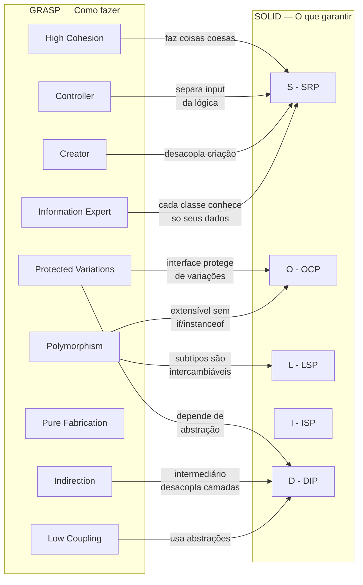

# SOLID vs GRASP — Comparação das Migrações do Exercício 10

> **Missão Marte Unifor** · T200 Projeto e Arquitetura de Sistemas · Unifor 2026.2

---

## A Grande Diferença: Princípios vs. Padrões

```
SOLID  =  "O que o código deve ser"   →  regras abstratas de qualidade
GRASP  =  "Como chegar lá"            →  heurísticas concretas de responsabilidade
```

Pense assim:

- **SOLID** é como a legislação de trânsito: define o que é permitido e o que é proibido ("não ultrapasse o semáforo vermelho"), mas não te diz qual caminho seguir.
- **GRASP** é como o GPS: te guia passo a passo até o destino correto, e ao seguir as instruções você naturalmente cumpre as leis de trânsito.

Aplicar GRASP corretamente **leva ao SOLID** — o resultado é o mesmo, mas a pergunta de partida é diferente.

---

## Os 5 Princípios SOLID


| Sigla | Nome                            | Pergunta que faz                                                  |
| ------- | --------------------------------- | ------------------------------------------------------------------- |
| **S** | Single Responsibility Principle | "Esta classe tem **apenas uma** razão para mudar?"              |
| **O** | Open/Closed Principle           | "Posso**estender** sem **modificar**?"                            |
| **L** | Liskov Substitution Principle   | "Posso trocar por uma subclasse**sem quebrar** nada?"             |
| **I** | Interface Segregation Principle | "A interface tem apenas**o que o cliente usa**?"                  |
| **D** | Dependency Inversion Principle  | "Dependo de**abstrações**, não de implementações concretas?" |

SOLID não te diz *onde* colocar o código. Ele valida o que você já fez.

---

## Os 9 Padrões GRASP


| # | Padrão                  | Pergunta que faz                                                 |
| --- | -------------------------- | ------------------------------------------------------------------ |
| 1 | **Information Expert**   | "Quem tem a informação necessária?"                           |
| 2 | **Creator**              | "Quem deve criar este objeto?"                                   |
| 3 | **Controller**           | "Quem recebe e coordena a entrada do usuário?"                  |
| 4 | **High Cohesion**        | "Esta classe faz coisas relacionadas entre si?"                  |
| 5 | **Low Coupling**         | "Esta classe depende de poucas outras?"                          |
| 6 | **Polymorphism**         | "Quem sabe o próprio comportamento?"                            |
| 7 | **Pure Fabrication**     | "Precisamos de uma classe auxiliar que não existe no domínio?" |
| 8 | **Indirection**          | "Precisamos de um intermediário para desacoplar?"               |
| 9 | **Protected Variations** | "Como proteger o sistema de mudanças futuras?"                  |

GRASP te diz *para onde* mover o código. Ele orienta durante a escrita.

---

## A Mesma Missão, Duas Lentes

Ambas as versões partem do mesmo God Class de ~550 linhas em `exercicio10/Main.java` e chegam a arquiteturas similares. Mas a justificativa de cada decisão é diferente.

### Estrutura de pacotes

```
oo-console-completo/exercicio10/      ← GOD CLASS (ponto de partida)
    Main.java  (~550 linhas)

solidexercicio10/                     ← migração guiada por SOLID
├── Main.java
├── model/
│   ├── Posicionavel.java             (interface — ISP)
│   ├── Movel.java                    (interface — ISP)
│   ├── EntidadeMapa.java             (classe abstrata — LSP/OCP)
│   ├── Nave.java, Asteroide.java...
│   └── Dificuldade.java
├── presentation/
│   └── MapaRenderer.java             (SRP)
├── repository/
│   ├── RankingRepository.java        (interface — DIP)
│   ├── RankingEntry.java
│   └── RankingService.java           (implementação concreta)
└── service/
    └── JogoService.java              (SRP)

graspexercicio10/                     ← migração guiada por GRASP
├── Main.java
├── model/
│   ├── Perigo.java                   (interface — Polymorphism)
│   ├── Nave.java, Asteroide.java...
│   ├── Missao.java                   + posicaoOcupada() (Information Expert)
│   └── Dificuldade.java              + getPontuacaoInicial() (Information Expert)
├── controller/
│   └── GameController.java           (Controller)
├── presentation/
│   └── MapaRenderer.java             (Pure Fabrication)
├── repository/
│   ├── IRankingRepository.java       (interface — Protected Variations)
│   ├── RankingEntry.java
│   └── RankingRepository.java        (Indirection + Pure Fabrication)
└── service/
    ├── FabricaMissao.java            (Creator + Pure Fabrication)
    └── JogoService.java              (High Cohesion + Low Coupling)
```

---

## Comparação Decisão a Decisão

### 1. Quem cuida da pontuação inicial?

**Problema original (God Class):**

```java
// Main.java — linha ~87
private int definirPontuacaoInicial(Dificuldade dificuldade) {
    switch (dificuldade) {
        case FACIL:  return 1500;
        case MEDIO:  return 1000;
        default:     return 500;
    }
}
```


|                   | SOLID                                            | GRASP                                                               |
| ------------------- | -------------------------------------------------- | --------------------------------------------------------------------- |
| **Onde foi?**     | Continua fora de`Dificuldade` (em `JogoService`) | `Dificuldade.getPontuacaoInicial()`                                 |
| **Justificativa** | SRP:`JogoService` coordena o jogo                | **Information Expert**: `Dificuldade` *sabe* o que cada nível vale |
| **Resultado**     | Funciona, mas`Dificuldade` é passiva            | `Dificuldade` é ativa — encapsula seu próprio conhecimento       |

```java
// GRASP — Dificuldade.java
public enum Dificuldade {
    FACIL(1500), MEDIO(1000), DIFICIL(500);

    private final int pontuacaoInicial;
    Dificuldade(int p) { this.pontuacaoInicial = p; }

    public int getPontuacaoInicial() { return pontuacaoInicial; }
}
```

> **GRASP Information Expert → SOLID SRP**: ao mover o conhecimento para quem o possui, cada classe passa a ter apenas uma razão para mudar.

---

### 2. Como identificar inimigos e asteroides no mapa?

**Problema original (God Class):**

```java
// Main.java — linha ~200  — instanceof para decidir símbolo
String simbolo;
if (entidade instanceof Asteroide) {
    simbolo = "A";
} else if (entidade instanceof Inimigo) {
    simbolo = "X";
} else { ... }
```


|                      | SOLID                                                                                            | GRASP                                                               |
| ---------------------- | -------------------------------------------------------------------------------------------------- | --------------------------------------------------------------------- |
| **Interface criada** | `EntidadeMapa` (classe abstrata) + `getSimbolo()` abstrato                                       | `Perigo` (interface) com `getSimbolo()` e `colideCom()`             |
| **Justificativa**    | **LSP**: toda `EntidadeMapa` pode substituir outra; **OCP**: novos tipos não alteram o renderer | **Polymorphism**: cada classe sabe seu próprio símbolo e colisão |
| **Diferença**       | Herança hierárquica (abstract class)                                                           | Contrato comportamental (interface)                                 |

```java
// SOLID — EntidadeMapa.java
public abstract class EntidadeMapa implements Posicionavel {
    public abstract String getSimbolo();  // subclasses obrigadas a implementar
}

// GRASP — Perigo.java (interface)
public interface Perigo {
    int getX(); int getY();
    char getSimbolo();
    boolean colideCom(Nave nave);  // GRASP: quem colide sabe se colidiu
}
```

> **SOLID OCP + LSP** e **GRASP Polymorphism** chegam à mesma estrutura polimórfica — mas GRASP também embutiu `colideCom()` na interface, porque `Perigo` tem a informação da colisão.

---

### 3. Quem lê o input do usuário?

**Problema original (God Class):**

```java
// Main.java — main() fazia tudo: menu, leitura, lógica, display
public static void main(String[] args) {
    Scanner sc = new Scanner(System.in);
    // ... 16+ dependências diretas
}
```


|                     | SOLID                                                     | GRASP                                                                              |
| --------------------- | ----------------------------------------------------------- | ------------------------------------------------------------------------------------ |
| **Quem lê input?** | `JogoService.executarLoop(Scanner scanner)`               | `GameController` (pacote dedicado)                                                 |
| **Justificativa**   | **SRP**: `JogoService` tem uma responsabilidade — o jogo | **Controller**: existe um padrão específico para quem recebe eventos do usuário |
| **Diferença**      | Leitura e lógica ainda na mesma classe                   | Leitura em`GameController`, lógica pura em `JogoService`                          |

```java
// GRASP — GameController.java
public class GameController {
    private final JogoService jogoService;
    private final Scanner scanner;

    public void executar() {
        while (true) {
            String opcao = scanner.nextLine();
            jogoService.processarOpcao(opcao);  // delega a lógica
        }
    }
}
```

> **GRASP Controller** divide ainda mais fino que **SOLID SRP** — GRASP tem um nome específico para a camada que recebe eventos, enquanto SOLID apenas diz "cada classe deve ter uma razão para mudar".

---

### 4. Quem cria a missão e os passageiros?

**Problema original (God Class):**

```java
// Main.java — linha ~130 — Main criava tudo diretamente
Missao missao = new Missao(largura, altura, dificuldade);
for (int i = 0; i < total; i++) {
    Passageiro p = criarPassageiroPolimorfico();
    // ...
}
```


|                   | SOLID                                                       | GRASP                                                            |
| ------------------- | ------------------------------------------------------------- | ------------------------------------------------------------------ |
| **Quem cria?**    | `JogoService.jogarPartida()` — criação inline            | `FabricaMissao.criar(dificuldade)` — classe dedicada            |
| **Justificativa** | SRP parcial:`JogoService` ainda mistura criação e lógica | **Creator**: quem usa os objetos ou tem os dados cria os objetos |
| **Diferença**    | Não extrai uma fábrica                                    | Extrai`FabricaMissao` (Pure Fabrication + Creator)               |

```java
// GRASP — FabricaMissao.java
public class FabricaMissao {
    public Missao criar(Dificuldade dificuldade) {
        Missao missao = new Missao(20, 10, dificuldade);
        popularPassageiros(missao, dificuldade);
        popularPerigos(missao, dificuldade);
        return missao;
    }
}
```

> **GRASP Creator/Pure Fabrication** vai além do que SOLID prescreve — SOLID diria "separe a criação da lógica" (SRP), mas não diz *como* estruturar a fábrica.

---

### 5. Como persistir o ranking?

**Problema original (God Class):**

```java
// Main.java — linhas ~380-450 — 4 métodos de ranking misturados com o jogo
private List<RankingEntry> loadRanking() { ... }
private void saveRanking(...) { ... }
private List<RankingEntry> parseRankingJson(...) { ... }
private boolean isTopScore(...) { ... }
```


|                     | SOLID                                                                           | GRASP                                                                                        |
| --------------------- | --------------------------------------------------------------------------------- | ---------------------------------------------------------------------------------------------- |
| **Interface**       | `RankingRepository` (DIP)                                                       | `IRankingRepository` (Protected Variations)                                                  |
| **Implementação** | `RankingService implements RankingRepository`                                   | `RankingRepository implements IRankingRepository`                                            |
| **Justificativa**   | **DIP**: `JogoService` depende da abstração, não da implementação concreta | **Protected Variations + Indirection**: escudar o sistema de mudanças no formato de arquivo |
| **Diferença**      | Motivação é "inverter a dependência"                                        | Motivação é "proteger de variações futuras"                                             |

```java
// SOLID — RankingRepository.java (interface)
public interface RankingRepository {
    void salvar(String nome, int pontuacao, Dificuldade dif, int pass, long tempo);
    List<RankingEntry> listar();
    void limpar();
}

// GRASP — IRankingRepository.java (interface)
public interface IRankingRepository {
    List<RankingEntry> carregar();
    void salvar(List<RankingEntry> ranking);
    void resetar();
    boolean ehTopScore(List<RankingEntry> ranking, int score);  // Information Expert
}
```

> SOLID define a interface perguntando "quem deve depender de quem?". GRASP define a interface perguntando "o que pode variar no futuro?" — mas ambos chegam à **mesma solução**: uma interface entre o serviço e a persistência.

---

### 6. Interfaces de posição — o que cada abordagem detecta

O **SOLID ISP** identificou que nem toda entidade se move:

```java
// SOLID — ISP: interfaces segregadas
public interface Posicionavel { int getX(); int getY(); }  // qualquer entidade com posição
public interface Movel { void mover(int dx, int dy); }     // só Nave se move

public class Nave extends EntidadeMapa implements Movel { ... }
public class Asteroide extends EntidadeMapa { ... }  // sem Movel — não se move
```

O **GRASP** não tem um padrão específico para isso — GRASP não prescreveu `Posicionavel`/`Movel` separados porque nenhum padrão dizia "separe as interfaces". Isso mostra que **SOLID e GRASP se complementam**: GRASP cobre responsabilidades, SOLID cobre a forma das interfaces.

---

## Mapa de Relacionamento GRASP → SOLID



---

## Tabela Completa: GRASP → SOLID


| Padrão GRASP            | Princípio SOLID satisfeito | Exemplo no Exercício 10                                                   |
| -------------------------- | ----------------------------- | ---------------------------------------------------------------------------- |
| **Information Expert**   | **S** (SRP)                 | `Dificuldade.getPontuacaoInicial()`, `Missao.posicaoOcupada()`             |
| **Creator**              | **S** (SRP)                 | `FabricaMissao` cria `Missao` e passageiros                                |
| **Controller**           | **S** (SRP)                 | `GameController` recebe input, `JogoService` executa lógica               |
| **High Cohesion**        | **S** (SRP)                 | `JogoService` faz só regras de jogo                                       |
| **Low Coupling**         | **D** (DIP)                 | `JogoService` depende de `IRankingRepository`, não de `RankingRepository` |
| **Polymorphism**         | **O** (OCP) + **L** (LSP)   | `Perigo` — `Asteroide` e `Inimigo` são intercambiáveis                  |
| **Pure Fabrication**     | **S** (SRP)                 | `MapaRenderer`, `FabricaMissao`, `RankingRepository`                       |
| **Indirection**          | **D** (DIP)                 | `IRankingRepository` entre `JogoService` e o arquivo JSON                  |
| **Protected Variations** | **O** (OCP) + **D** (DIP)   | `IRankingRepository` — trocar JSON por banco não altera `JogoService`    |
| *(não cobre)*           | **I** (ISP)                 | `Posicionavel` e `Movel` — identificados pelo SOLID, não pelo GRASP      |

---

## Resumo Visual: As Duas Perguntas

```
╔════════════════════════════════════════════════════════════╗
║                   GOD CLASS: Main.java                     ║
║          (~550 linhas fazendo tudo ao mesmo tempo)         ║
╚══════════════════════════╦═════════════════════════════════╝
                           │
           ┌───────────────┼────────────────┐
           ▼                                ▼
   ┌───────────────┐               ┌───────────────┐
   │  Lente SOLID  │               │  Lente GRASP  │
   │               │               │               │
   │ "Esta classe  │               │ "Quem TEM a   │
   │  tem 1 razão  │               │  informação?  │
   │  p/ mudar?"   │               │  Quem CRIA?   │
   │               │               │  Quem recebe  │
   │ "Posso abrir  │               │  o input?"    │
   │  p/ extensão  │               │               │
   │  sem alterar  │               │ "O que pode   │
   │  o código?"   │               │  variar?"     │
   └───────┬───────┘               └───────┬───────┘
           │                               │
           └───────────────┬───────────────┘
                           ▼
              ┌────────────────────────┐
              │   RESULTADO SIMILAR    │
              │                        │
              │  • Classes pequenas    │
              │  • Interfaces claras   │
              │  • Baixo acoplamento   │
              │  • Alta coesão         │
              └────────────────────────┘
```

---

## Quando Usar Cada Abordagem

### Use SOLID para **validar e criticar**

- "Esta classe está violando SRP?" → refatore
- "Esta interface é muito grande?" → ISP
- "Este módulo depende de detalhe concreto?" → DIP

### Use GRASP para **projetar e atribuir**

- "Onde coloco este método?" → Information Expert
- "Quem instancia este objeto?" → Creator
- "Como leio o input sem poluir a lógica?" → Controller
- "Como protejo de mudanças futuras?" → Protected Variations

### Na prática: use os dois juntos

1. **Comece com GRASP** para distribuir responsabilidades (quem faz o quê)
2. **Valide com SOLID** para garantir que a estrutura está correta (como cada parte está)

---

## Linha do Tempo das Migrações

```
exercicio10/Main.java (~550 linhas)
         │
         ├──► solid/solidexercicio10/    (migração guiada por SOLID)
         │         Pergunta: "O que viola SRP, OCP, DIP?"
         │         Resultado: interfaces ISP (Posicionavel, Movel)
         │                    herança via EntidadeMapa (LSP)
         │                    abstração RankingRepository (DIP)
         │
         └──► grasp/graspexercicio10/    (migração guiada por GRASP)
                   Pergunta: "Quem sabe? Quem cria? Quem coordena?"
                   Resultado: fábrica FabricaMissao (Creator)
                              GameController (Controller)
                              Dificuldade com lógica própria (Info Expert)
                              IRankingRepository (Protected Variations)
```

As duas chegam a um design de qualidade. **GRASP gera automaticamente código que cumpre SOLID** — porque quando cada classe é responsável *pela sua própria informação*, ela naturalmente tem *uma única razão para mudar*.

---

## Referências

- `solid/src/tutorial-exercicio10/src/solidexercicio10/` — código da migração SOLID
- `grasp/src/graspexercicio10/` — código da migração GRASP
- `grasp/tutorial-grasp-missao-marte.md` — tutorial passo a passo da migração GRASP
- Craig Larman, *Applying UML and Patterns* — fonte original dos padrões GRASP
- Robert C. Martin, *Clean Architecture* — princípios SOLID detalhados
